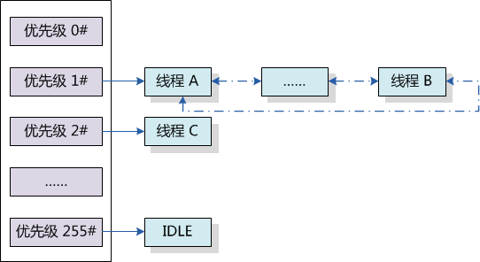
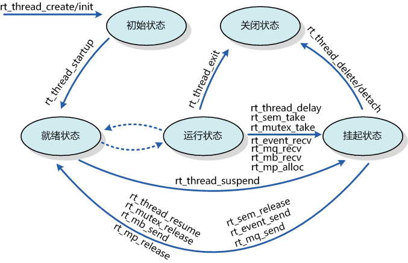

# 线程调度与管理 #

一个典型的简单程序会设计成一个串行的系统运行：按照准确的指令步骤一次一个指令的运行。但是这种方法对于复杂一些的实时应用是不可行的，因为它们通常需要在固定的时间内“同时”处理多个输入输出，实时软件应用程序应该设计成一个并行的系统。

并行设计需要开发人员把一个应用分解成一个个小的，可调度的，序列化的程序单元。当合理的划分任务，正确的并行执行时，这种设计能够让系统满足实时系统的性能及时间的要求。

## 实时系统的需求 ##

如第二章里描述的，系统的实时性指的是在固定的时间内正确地对外部事件做出响应。这个“时间内”(英文叫做deadline、有时中文也翻译成时间约束)，系统内部会做一些处理，例如输入数据的分析计算，加工处理等。而在这段时间之外，系统可能会空闲下来，做一些空余的事。

例如一个手机终端，当一个电话拨入的时候，系统应当及时发出振铃、声音提示以通知主人有来电，询问是否进行接听。而在非电话拨入的时候，人们可以用它进行一些其它工作，例如听音乐，玩游戏等。

从上面的例子我们可以看出，实时系统是一种需求倾向性的系统，对于实时的事件需要在第一时间内做出回应，而对非实时任务则可以在实时事件到达时为之让路——被抢占。所以实时系统也可以看成是一个等级系统，不同重要性的任务具有不同的优先等级：重要的事件能够优先被响应执行，非重要的事件可以适当往后推迟。

在RT-Thread实时操作系统中，任务采用了线程来实现，线程是RT-Thread中最基本的调度单位，它描述了一个任务执行的上下文关系，也描述了这个任务所处的优先等级。重要的任务能拥有相对较高的优先级，非重要的任务优先级可以放低，并且可以类似Linux一样具备分时的效果。

## 线程调度器 ##

RT-Thread中提供的线程调度器是基于优先级的全抢占式调度：在系统中除了中断处理函数、调度器上锁部分的代码和禁止中断的代码是不可抢占的之外，系统的其他部分都是可以抢占的，包括线程调度器自身。系统总共支持256个优先级(0 ～ 255，数值越小的优先级越高，0为最高优先级，255分配给空闲线程使用，一般用户不使用。在一些资源比较紧张的系统中，可以根据实际情况选择只支持8个或32个优先级的系统配置)。在系统中，当有比当前线程优先级更高的线程就绪时，当前线程将立刻被换出，高优先级线程抢占处理器运行。

如图 ***线程就绪优先级队列*** 所示，在RT-Thread调度器的实现中,包含了一个共256个优先级队列的数组(如果系统最大支持32个优先级，那么这里将是一个包含了32个优先级队列的数组)，每个数组元素中放置相同优先级链表的表头。这些相同优先级的列表形成一个双向环形链表，最低优先级线程链表一般只包含一个idle线程。

在优先级队列1#和2#中，可以看到三个线程：线程A、线程B和线程C。由于线程A、B的优先级比线程C的高，所以此时线程C得不到运行，必须要等待优先级队列1#的中所有线程（因为阻塞）都让出处理器后才能得到执行。

一个操作系统如果只是具备了高优先级任务能够“立即”获得处理器并得到执行的特点，那么它仍然不算是实时操作系统。因为这个查找最高优先级线程的过程决定了调度时间是否具有确定性，例如一个包含n个就绪任务的系统中，如果仅仅从头找到尾，那么这个时间将直接和n相关，而下一个就绪线程抉择时间的长短将会极大的影响系统的实时性。当所有就绪线程都链接在它们对应的优先级队列中时，抉择过程就将演变为在优先级数组中寻找具有最高优先级线程的非空链表。RT-Thread内核中采用了基于位图的优先级算法（时间复杂度O(1)，即与就绪线程的多少无关），通过位图的定位快速的获得优先级最高的线程。

RT-Thread内核中也允许创建相同优先级的线程。相同优先级的线程采用时间片轮转方式进行调度（也就是通常说的分时调度器），时间片轮转调度仅在当前系统中无更高优先级就绪线程存在的情况下才有效。例如在 ***线程就绪优先级队列*** 图中，我们假设线程A和线程B一次最大允许运行的时间片分别是10个时钟节拍和7个时钟节拍。那么线程B将在线程A的时间片结束（10个时钟节拍）后才能运行，但如果中途线程A被挂起了，即线程A在运行的途中，因为试图去持有不可用的资源，而导致线程状态从就绪状态更改为阻塞状态，那么线程B会因为其优先级成为系统中就绪线程中最高的而马上运行。每个线程的时间片大小都可以在初始化或创建这个线程时指定。

因为RT-Thread调度器的实现是采用优先级链表的方式，所以系统中的总线程数不受限制，只和系统所能提供的内存资源相关。为了保证系统的实时性，系统尽最大可能地保证高优先级的线程得以运行。线程调度的原则是一旦任务状态发生了改变，并且当前运行的线程优先级小于优先级队列组中线程最高优先级时，立刻进行线程切换（除非当前系统处于中断处理程序中或禁止线程切换的状态）。

## 线程控制块 ##

线程控制块是操作系统用于控制线程的一个数据结构，它会存放线程的一些信息，例如优先级，线程名称等，也包含线程与线程之间连接用的链表结构，线程等待事件集合等。

在RT-Thread实时操作系统中，线程控制块由结构体struct rt_thread表示。另外一种C表达方式rt_thread_t，表示的是线程的句柄，在C语言中的实现是指向线程控制块的指针，详细定义情况见以下代码:

线程控制块结构如下所示

~~~{.c}
/* rt_thread_t线程句柄，指向线程控制块的指针 */
typedef struct rt_thread* rt_thread_t;

/*
 * 线程控制块
 */
struct rt_thread
{
    /* RT-Thread根对象定义 */
    char name[RT_NAME_MAX];         /* 对象的名称*/
    rt_uint8_t type;                /* 对象的类型*/
    rt_uint8_t flags;               /* 对象的参数*/
#ifdef RT_USING_MODULE
    void *module_id;                /* 线程所在的模块ID*/
#endif
    rt_list_t list;                 /* 对象链表*/

    rt_list_t tlist;                /* 线程链表*/

    /* 栈指针及入口 */
    void* sp;                       /* 线程的栈指针*/
    void* entry;                    /* 线程入口*/
    void* parameter;                /* 线程入口参数*/
    void* stack_addr;               /* 线程栈地址*/
    rt_uint16_t stack_size;         /* 线程栈大小*/

    rt_err_t error;                 /* 线程错误号*/

    rt_uint8_t stat;                /* 线程状态 */

    /* 优先级相关域 */
    rt_uint8_t current_priority;    /* 当前优先级*/
    rt_uint8_t init_priority;       /* 初始线程优先级*/
#if RT_THREAD_PRIORITY_MAX > 32
    rt_uint8_t number;
    rt_uint8_t high_mask;
#endif
    rt_uint32_t number_mask;

#if defined(RT_USING_EVENT)
    /* 事件相关域 */
    rt_uint32_t event_set;
    rt_uint8_t event_info;
#endif

    rt_ubase_t init_tick;           /* 线程初始tick*/
    rt_ubase_t remaining_tick;      /* 线程当次运行剩余tick */

    struct rt_timer thread_timer;   /* 线程定时器*/

    /* 当线程退出时，需要执行的清理函数 */
    void (*cleanup)(struct rt_thread *tid);
    rt_uint32_t user_data;          /* 用户数据*/
};
~~~

其中init_priority是线程创建时指定的线程优先级，在线程运行过程当中是不会被改变的（除非用户执行线程控制函数进行手动调整线程优先级）。cleanup成员是RT-Thread 1.0.0中新引入的成员，它会在线程退出时，被idle线程回调一次以执行用户设置的清理现场等工作。最后的一个成员user_data可由用户挂接一些数据信息到线程控制块中，以提供类似线程私有数据的实现，例如lwIP线程中用于放置定时器链表的表头。

## 线程状态 ##

线程运行的过程中，一个时间内只允许一个线程在处理器中运行，从运行的过程上划分，线程有多种不同的运行状态，如运行态，非运行态等。在RT-Thread实时操作系统中，线程包含五种状态，操作系统会自动根据它运行的情况而动态调整它的状态。
RT-Thread中的五种线程状态如下所示：

+------------------------+---------------------------------------------------------+
|      状态              |   描述                                                  |
+========================+=========================================================+
|   RT_THREAD_INIT       |  线程初始状态。当线程刚开始创建还没开始运行时就处于这个 |
|                        |  状态；在这个状态下，线程不参与调度                     |
+------------------------+---------------------------------------------------------+
|   RT_THREAD_SUSPEND    |  挂起态、阻塞态。线程此时被挂起：它可能因为资源不可用而 |
|                        |  挂起等待；或线程主动延时一段时间而被挂起。在这个状态下 |
|                        |  ，线程不参与调度                                       |
+------------------------+---------------------------------------------------------+
|   RT_THREAD_READY      |  就绪态。线程正在运行；或当前线程运行完让出处理器后，操 |
|                        |  作系统寻找最高优先级的就绪态线程运行                   |
+------------------------+---------------------------------------------------------+
|   RT_THREAD_RUNNING    |  运行态。线程当前正在运行，在单核系统中，只有           |
|                        |  rt_thread_self()函数返回的线程处于这个状态；在多核系统 |
|                        |  中则不受这个限制。                                     |
+------------------------+---------------------------------------------------------+
|   RT_THREAD_CLOSE      |  线程结束态。当线程运行结束时将处于这个状态。这个状态的 |
|                        |  线程不参与线程的调度。                                 |
+------------------------+---------------------------------------------------------+

Table:五种线程状态-描述

RT-Thread实时操作系统提供一系列的操作系统调用接口，使得线程的状态在这五个状态之间来回的变换。例如一个就绪态的线程由于申请一个资源（例如使用rt_sem_take)，而可能进入挂起态。又例如因为一个外部中断发生了，系统转入中断服务例程，在中断服务例程中释放了相应的资源，导致把等待在这个资源上的高优先级线程唤醒，改变其状态为就绪态，导致当前运行线程切换等等。

几种状态间的转换关系如 ***线程转换图*** 所示：

线程通过调用函数rt_thread_create/init进入到初始状态（RT_THREAD_INIT）；再通过调用函数rt_thread_startup进入到就绪状态（RT_THREAD_READY）；当处于就绪状态的线程调用rt_thread_delay，rt_sem_take，rt_mb_recv等函数或由于获取不到资源时，将进入到挂起状态（RT_THREAD_SUSPEND）；处于挂起状态的线程，如果等待超时依然未能获得资源或由于其他线程释放了资源，那么它将返回到就绪状态。挂起状态的线程，如果调用rt_thread_delete/detach将更改为关闭状态（RT_THREAD_CLOSE）；而运行状态的线程，如果运行结束会在线程最后部分执行rt_thread_exit函数而更改为关闭状态（RT_THREAD_CLOSE）。

## 空闲线程 ##

空闲线程是系统线程中一个比较特殊的线程，它具有最低的优先级，当系统中无其他线程可运行时，调度器将调度到空闲线程。空闲线程通常是一个死循环，永远不被挂起。

RT-Thread实时操作系统为空闲线程提供了钩子函数（钩子函数：用户提供的一段代码，在系统运行的某一路径上设置一个钩子，当系统经过这个位置时，转而执行这个钩子函数，然后再返回到它的正常路径上），可以让系统在空闲的时候执行一些特定的任务，例如系统运行指示灯闪烁，电源管理等。除了调用钩子函数，RT-Thread也把线程清理（rt_thread->cleanup回调函数）函数、真正的线程删除动作放到了空闲线程中（在删除线程时，仅改变线程的状态为关闭状态不再参与系统调度）。

##调度器相关接口##

### 调度器初始化 ###

在系统启动时需要执行调度器的初始化，以初始化系统调度器用到的一些全局变量。调度器初始化可以调用下面的函数接口。

    void rt_system_scheduler_init(void);

**线程安全**

不安全

**中断例程**

不可调用

**函数参数**

无

**函数返回**

无

### 启动调度器 ###

在系统完成初始化后切换到第一个线程，可以调用下面的函数接口。

    void rt_system_scheduler_start(void);

在调用这个函数时，它会查找系统中优先级最高的就绪态线程，然后切换过去执行。另外在调用这个函数前，必须先做idle线程的初始化，即保证系统至少能够找到一个就绪状态的线程执行。此函数是永远不会返回的。

**线程安全**

不安全

**中断例程**

不可调用

**函数参数**

无

**函数返回**

无

### 执行调度 ###

让调度器执行一次线程的调度可通过下面的函数接口。

    void rt_schedule(void);

调用这个函数后，系统会计算一次系统中就绪态的线程，如果存在比当前线程更高优先级的线程时，系统将切换到高优先级的线程去。上层应用程序一般不需要调用这个函数。

**线程安全**

安全

**中断例程**

可调用

**函数参数**

无

**函数返回**

无

* 注：在中断服务例程中也可以调用这个函数，如果满足任务切换的条件，它会记录下中断前的线程及需要切换到的更高优先级线程，在中断服务例程处理完毕后执行真正的线程上下文切换（即中断中的线程上下文切换），最终切换到目标线程去。

### 设置调度器钩子 ###

在整个系统的运行时，系统都处于线程运行、中断触发-响应中断、切换到其他线程，甚至是线程间的切换过程中，或者说系统的上下文切换是系统中最普遍的事件。有时用户可能会想知道在一个时刻发生了什么样的线程切换，可以通过调用下面的函数接口设置一个相应的钩子函数。在系统线程切换时，这个钩子函数将被调用：

    void rt_scheduler_sethook(void (*hook)(struct rt_thread* from, struct rt_thread* to));

这个函数用于把用户提供的hook函数设置到系统调度器钩子中，当系统进行上下文切换时，这个hook函数将会被系统调用。

**线程安全**

安全

**中断例程**

可调用

**函数参数**

-----------------------------------------------------------------------
          参数  描述
--------------  -------------------------------------------------------
          hook  表示用户定义的钩子函数指针；
-----------------------------------------------------------------------

这个hook函数的声明如下：

    void hook(struct rt_thread* from, struct rt_thread* to);

**线程安全**

安全

**中断例程**

可调用

**函数参数**

-----------------------------------------------------------------------
          参数  描述
--------------  -------------------------------------------------------
          from  表示系统所要切换出的线程控制块指针；

            to  表示系统所要切换到的线程控制块指针。
-----------------------------------------------------------------------

**函数返回**

无

* 注：请仔细编写你的钩子函数，稍有不慎将很可能导致整个系统运行不正常（在这个钩子函数中，基本上不允许调用系统API，更不应该导致当前运行的上下文挂起）。

## 线程相关接口 ##

### 线程创建 ###

一个线程要成为可执行的对象就必须由操作系统的内核来为它创建（初始化）一个线程句柄。可以通过如下的函数接口来创建一个线程。

    rt_thread_t rt_thread_create(const char* name,
                                 void (*entry)(void* parameter), void* parameter,
                                 rt_uint32_t stack_size,
                                 rt_uint8_t priority, rt_uint32_t tick);

调用这个函数时，系统会从动态堆内存中分配一个线程句柄（即TCB，线程控制块）以及按照参数中指定的栈大小从动态堆内存中分配相应的空间。分配出来的栈空间是按照rtconfig.h中配置的RT_ALIGN_SIZE方式对齐。

**线程安全**

安全

**中断例程**

不可调用

**函数参数**

-----------------------------------------------------------------------
          参数  描述
--------------  -------------------------------------------------------
          name  线程的名称；线程名称的最大长度由rtconfig.h中定义的
                RT_NAME_MAX宏指定，多余部分会被自动截掉。

         entry  线程入口函数

     parameter  线程入口函数参数；

    stack_size  线程栈大小，单位是字节。在大多数系统中需要做栈空间地址对齐（例如ARM体系结构中需要向4字节地址对齐）。

      priority  线程的优先级。优先级范围根据系统配置情况（rtconfig.h中的RT_THREAD_PRIORITY_MAX宏定义），如果支持的是256级优先级，那么范围是从0 ～ 255，数值越小优先级越高，0代表最高优先级。

          tick  线程的时间片大小。时间片（tick）的单位是操作系统的时钟节拍。当系统中存在相同优先级线程时，这个参数指定线程一次调度能够运行的最大时间长度。这个时间片运行结束时，调度器自动选择下一个就绪态的同优先级线程进行运行。
-----------------------------------------------------------------------

**函数返回**

创建成功返回线程句柄；否则返回RT_NULL。

* 注：确定一个线程的栈空间大小，是一件令人头痛的事情。在RT-Thread中，可以先指定一个稍微大的栈空间，例如指定大小为1024或2048，然后在FinSH shell中通过list_thread()命令查看线程运行的过程中线程所使用的栈的大小，通过此命令，能够看到从线程启动运行时，到当前时刻点，线程使用的最大栈深度，从而可以确定栈空间的大小并加以修改)。

下面举例创建一个线程加以说明：

~~~{.c}
/*
 * 程序清单：动态线程
 *
 * 这个程序会初始化2个动态线程：
 * 它们拥有共同的入口函数，相同的优先级
 * 但是它们的入口参数不相同
 */
#include <rtthread.h>

#define THREAD_PRIORITY         25
#define THREAD_STACK_SIZE       512
#define THREAD_TIMESLICE        5

/* 指向线程控制块的指针 */
static rt_thread_t tid1 = RT_NULL;
static rt_thread_t tid2 = RT_NULL;
/* 线程入口 */
static void thread_entry(void* parameter)
{
    rt_uint32_t count = 0;
    rt_uint32_t no = (rt_uint32_t) parameter; /* 获得线程的入口参数 */

    while (1)
    {
        /* 打印线程计数值输出 */
        rt_kprintf("thread%d count: %d\n", no, count ++);

        /* 休眠10个OS Tick */
        rt_thread_delay(10);
    }
}

/* 用户应用入口 */
int rt_application_init()
{
    /* 创建线程1 */
    tid1 = rt_thread_create("t1",
        thread_entry, (void*)1, /* 线程入口是thread_entry, 入口参数是1 */
        THREAD_STACK_SIZE, THREAD_PRIORITY, THREAD_TIMESLICE);
    if (tid1 != RT_NULL)
        rt_thread_startup(tid1);
    else
        return -1;

    /* 创建线程2 */
    tid2 = rt_thread_create("t2",
        thread_entry, (void*)2, /* 线程入口是thread_entry, 入口参数是2 */
        THREAD_STACK_SIZE, THREAD_PRIORITY, THREAD_TIMESLICE);
    if (tid2 != RT_NULL)
        rt_thread_startup(tid2);
    else
        return -1;

    return 0;
}
~~~

### 线程删除 ###

对于一些使用rt_thread_create创建出来的线程，当不需要使用，或者运行出错时，我们可以使用下面的函数接口来从系统中把线程完全删除掉：

    rt_err_t rt_thread_delete(rt_thread_t thread);

调用该函数后，线程对象将会被移出线程队列并且从内核对象管理器中删除，线程占用的堆栈空间也会被释放，收回的空间将重新用于其他的内存分配。
实际上，用rt_thread_delete函数删除线程接口，仅仅是把相应的线程状态更改为RT_THREAD_CLOSE状态，然后放入到rt_thread_defunct队列中；而真正的删除动作（释放线程控制块和释放线程栈）需要到下一次执行idle线程时，由idle线程完成最后的线程删除动作。用rt_thread_init初始化的静态线程则不能使用此接口删除。

**线程安全**

安全

**中断例程**

可调用

**函数参数**

-----------------------------------------------------------------------
          参数  描述
--------------  -------------------------------------------------------
        thread  要删除的线程句柄；
-----------------------------------------------------------------------

**函数返回**

返回RT_EOK

* 注：在线程运行完成，自动结束的情况下，系统会自动删除线程，不需要再调用rt_thread_delete()函数接口。这个接口不应由线程本身来调用以删除线程自身，一般只能由其他线程调用或在定时器超时函数中调用。

这个函数仅在使能了系统动态堆时才有效（即RT_USING_HEAP宏定义已经定义了）。

下面举一个删除线程的例子，如下代码：

~~~{.c}
/*
 * 程序清单：删除线程
 *
 * 这个例子会创建两个线程，在一个线程中删除另外一个线程。
 */
#include <rtthread.h>

#define THREAD_PRIORITY         25
#define THREAD_STACK_SIZE       512
#define THREAD_TIMESLICE        5

/*
 * 线程删除(rt_thread_delete)函数仅适合于动态线程，为了在一个线程
 * 中访问另一个线程的控制块，所以把线程块指针声明成全局类型以供全
 * 局访问
 */
static rt_thread_t tid1 = RT_NULL, tid2 = RT_NULL;

/* 线程1的入口函数 */
static void thread1_entry(void* parameter)
{
    rt_uint32_t count = 0;

    while (1)
    {
        /* 线程1采用低优先级运行，一直打印计数值 */
        rt_kprintf("thread count: %d\n", count ++);
    }
}

/* 线程2的入口函数 */
static void thread2_entry(void* parameter)
{
    /* 线程2拥有较高的优先级，以抢占线程1而获得执行 */

    /* 线程2启动后先睡眠10个OS Tick */
    rt_thread_delay(10);

    /*
     * 线程2唤醒后直接删除线程1，删除线程1后，线程1自动脱离就绪线程
     * 队列
     */
    rt_thread_delete(tid1);
    tid1 = RT_NULL;

    /*
     * 线程2继续休眠10个OS Tick然后退出，线程2休眠后应切换到idle线程
     * idle线程将执行真正的线程1控制块和线程栈的删除
     */
    rt_thread_delay(10);

    /*
     * 线程2运行结束后也将自动被删除(线程控制块和线程栈依然在idle线
     * 程中释放)
     */
    tid2 = RT_NULL;
}

/* 应用入口 */
int rt_application_init()
{
    /* 创建线程1 */
    tid1 = rt_thread_create("t1", /* 线程1的名称是t1 */
        thread1_entry, RT_NULL,   /* 入口是thread1_entry，参数是RT_NULL */
        THREAD_STACK_SIZE, THREAD_PRIORITY, THREAD_TIMESLICE);
    if (tid1 != RT_NULL) /* 如果获得线程控制块，启动这个线程 */
        rt_thread_startup(tid1);
    else
        return -1;

    /* 创建线程1 */
    tid2 = rt_thread_create("t2", /* 线程1的名称是t2 */
        thread2_entry, RT_NULL,   /* 入口是thread2_entry，参数是RT_NULL */
        THREAD_STACK_SIZE, THREAD_PRIORITY - 1, THREAD_TIMESLICE);
    if (tid2 != RT_NULL) /* 如果获得线程控制块，启动这个线程 */
        rt_thread_startup(tid2);
    else
        return -1;

    return 0;
}
~~~

### 线程初始化 ###

线程的初始化可以使用下面的函数接口完成：

        rt_err_t rt_thread_init(struct rt_thread* thread,
                            const char* name,
                            void (*entry)(void* parameter), void* parameter,
                            void* stack_start, rt_uint32_t stack_size,
                            rt_uint8_t priority, rt_uint32_t tick);

rt_thread_init函数用来初始化静态线程对象。而线程句柄（或者说线程控制块指针），线程栈由用户提供。静态线程是指，线程控制块、线程运行栈一般都设置为全局变量，在编译时就被确定、被分配处理，内核不负责动态分配内存空间。需要注意的是，用户提供的栈首地址需做系统对齐（例如ARM上需要做4字节对齐）。

**线程安全**

安全

**中断例程**

可调用

**函数参数**

-----------------------------------------------------------------------
          参数  描述
--------------  -------------------------------------------------------
        thread  线程句柄。线程句柄由用户提供出来，并指向对应的线程控制块内存地址。

          name  线程的名称；线程名称的最大长度由rtconfig.h中定义的RT_NAME_MAX宏指定，多余部分会被自动截掉。

         entry  线程入口函数；

     parameter  线程入口函数参数；
     
   stack_start  线程栈起始地址；

    stack_size  线程栈大小，单位是字节。在大多数系统中需要做栈空间地址对齐（例如ARM体系结构中需要向4字节地址对齐）。

      priority  线程的优先级。优先级范围根据系统配置情况（rtconfig.h中的RT_THREAD_PRIORITY_MAX宏定义），如果支持的是256级优先级，那么范围是从0 ～ 255，数值越小优先级越高，0代表最高优先级。

          tick  线程的时间片大小。时间片（tick）的单位是操作系统的时钟节拍。当系统中存在相同优先级线程时，这个参数指定线程一次调度能够运行的最大时间长度。这个时间片运行结束时，调度器自动选择下一个就绪态的同优先级线程进行运行。
-----------------------------------------------------------------------

**函数返回**

返回值：返回RT_EOK；

下面给出一个线程初始化的例子，如下代码：

~~~{.c}
/*
 * 程序清单：初始化静态线程
 *
 * 这个程序会初始化2个静态线程，它们拥有共同的入口函数，但参数不相同
 */
#include <rtthread.h>

#define THREAD_PRIORITY         25
#define THREAD_STACK_SIZE       512
#define THREAD_TIMESLICE        5

/* 线程1控制块 */
static struct rt_thread thread1;
/* 线程1栈 */
ALIGN(4)
static rt_uint8_t thread1_stack[THREAD_STACK_SIZE];
/* 线程2控制块 */
static struct rt_thread thread2;
/* 线程2栈 */
ALIGN(4)
static rt_uint8_t thread2_stack[THREAD_STACK_SIZE];

/* 线程入口 */
static void thread_entry(void* parameter)
{
    rt_uint32_t count = 0;
    rt_uint32_t no = (rt_uint32_t) parameter; /* 获得正确的入口参数 */

    while (1)
    {
        /* 打印线程计数值输出 */
        rt_kprintf("thread%d count: %d\n", no, count ++);

        /* 休眠10个OS Tick */
        rt_thread_delay(10);
    }
}

/* 用户应用入口 */
int rt_application_init()
{
    rt_err_t result;

    /* 初始化线程1 */
    result = rt_thread_init(&thread1, "t1", /* 线程名：t1 */
        thread_entry, (void*)1, /* 线程的入口是thread_entry，入口参数是1 */
        &thread1_stack[0], sizeof(thread1_stack), /* 线程栈是thread1_stack */
        THREAD_PRIORITY, 10);
    if (result == RT_EOK) /* 如果返回正确，启动线程1 */
        rt_thread_startup(&thread1);
    else
        return -1;

    /* 初始化线程2 */
    result = rt_thread_init(&thread2, "t2", /* 线程名：t2 */
        thread_entry, (void*)2, /* 线程的入口是thread_entry，入口参数是2 */
        &thread2_stack[0], sizeof(thread2_stack), /* 线程栈是thread2_stack */
        THREAD_PRIORITY + 1, 10);
    if (result == RT_EOK) /* 如果返回正确，启动线程2 */
        rt_thread_startup(&thread2);
    else
        return -1;

    return 0;
}
~~~

### 线程脱离 ###

线程脱离将使线程对象在线程队列和内核对象管理器中被删除。线程脱离使用下面的函数：

    rt_err_t rt_thread_detach (rt_thread_t thread);

**线程安全**

安全

**中断例程**

可调用

**函数参数**

-----------------------------------------------------------------------
          参数  描述
--------------  -------------------------------------------------------
        thread  线程句柄，它应该是由rt_thread_init进行初始化的线程句柄。
-----------------------------------------------------------------------

**函数返回**

返回RT_EOK

* 注：这个函数接口是和rt_thread_delete()函数相对应的， rt_thread_delete()函数操作的对象是rt_thread_create()创建的句柄，而rt_thread_detach()函数操作的对象是使用rt_thread_init()函数初始化的线程控制块。同样，线程本身不应调用这个接口脱离线程本身。

线程脱离的例子如下所示：

~~~{.c}
/*
 * 程序清单：线程脱离
 *
 * 这个例子会创建两个线程(t1和t2)，在t2中会对t1进行脱离操作；
 * t1脱离后将不在运行，状态也更改为初始状态
 */
#include <rtthread.h>
#include "tc_comm.h"

/* 线程1控制块 */
static struct rt_thread thread1;
/* 线程1栈 */
static rt_uint8_t thread1_stack[THREAD_STACK_SIZE];
/* 线程2控制块 */
static struct rt_thread thread2;
/* 线程2栈 */
static rt_uint8_t thread2_stack[THREAD_STACK_SIZE];

/* 线程1入口 */
static void thread1_entry(void* parameter)
{
    rt_uint32_t count = 0;

    while (1)
    {
        /* 线程1采用低优先级运行，一直打印计数值 */
        rt_kprintf("thread count: %d\n", count ++);
    }
}

/* 线程2入口 */
static void thread2_entry(void* parameter)
{
    /* 线程2拥有较高的优先级，以抢占线程1而获得执行 */

    /* 线程2启动后先睡眠10个OS Tick */
    rt_thread_delay(10);

    /*
     * 线程2唤醒后直接执行线程1脱离，线程1将从就绪线程队列中删除
     */
    rt_thread_detach(&thread1);

    /*
     * 线程2继续休眠10个OS Tick然后退出
     */
    rt_thread_delay(10);

    /*
     * 线程2运行结束后也将自动被从就绪队列中删除，并脱离线程队列
     */
}

int rt_application_init(void)
{
    rt_err_t result;

    /* 初始化线程1 */
    result = rt_thread_init(&thread1, "t1", /* 线程名：t1 */
        thread1_entry,      /* 线程的入口是thread1_entr */
        RT_NULL,            /* 入口参数是RT_NULL*/
        &thread1_stack[0],  /* 线程栈是thread1_stack */
        sizeof(thread1_stack),
        THREAD_PRIORITY, 10);
    if (result == RT_EOK)   /* 如果返回正确，启动线程1 */
        rt_thread_startup(&thread1);

    /* 初始化线程2 */
    result = rt_thread_init(&thread2, "t2", /* 线程名：t2 */
        thread2_entry,      /* 线程的入口是thread2_entry */
        RT_NULL,            /* 入口参数是RT_NULL*/
        &thread2_stack[0],  /* 线程栈是thread2_stack */
        sizeof(thread2_stack),
        THREAD_PRIORITY - 1, 10);
    if (result == RT_EOK) /* 如果返回正确，启动线程2 */
        rt_thread_startup(&thread2);

    return 0;
}

~~~

### 线程启动 ###

创建（初始化）的线程对象的状态处于初始态，并未进入就绪线程的调度队列，我们可以调用下面的函数接口启动一个线程：

        rt_err_t rt_thread_startup(rt_thread_t thread);

当调用这个函数时，将把线程的状态更改为就绪状态，并放到相应优先级队列中等待调度。如果新启动的线程优先级比当前线程优先级高，将立刻切换到这个线程。

**线程安全**

安全

**中断例程**

可调用

**函数参数**

-----------------------------------------------------------------------
          参数  描述
--------------  -------------------------------------------------------
        thread  线程句柄。
-----------------------------------------------------------------------

**函数返回**

返回RT_EOK

### 当前线程 ###

在程序的运行过程中，相同的一段代码可能会被多个线程执行，在执行的时候可以通过下面的函数接口获得当前执行的线程句柄。

        rt_thread_t rt_thread_self(void);

**线程安全**

安全

**中断例程**

可调用

**函数参数**

-----------------------------------------------------------------------
          参数  描述
--------------  -------------------------------------------------------
        thread  线程句柄。
-----------------------------------------------------------------------

**函数返回**

返回当前运行的线程句柄。如果调度器还未启动，将返回RT_NULL。

* 注：请不要在中断服务程序中调用此函数，因为它并不能准确获得当前的执行线程。当调度器未启动时，这个接口返回RT_NULL 。

### 线程让出处理器 ###

当前线程的时间片用完或者该线程自动要求让出处理器资源时，它不再占有处理器，调度器会选择相同优先级的下一个线程执行。线程调用这个接口后，这个线程仍然在就绪队列中。线程让出处理器使用下面的函数接口：

    rt_err_t rt_thread_yield(void);

调用该函数后，当前线程首先把自己从它所在的就绪优先级线程队列中删除，然后把自己挂到这个优先级队列链表的尾部，然后激活调度器进行线程上下文切换（如果当前优先级只有这一个线程，则这个线程继续执行，不进行上下文切换动作）。

**线程安全**

安全

**中断例程**

可调用

**函数参数**

无

**函数返回**

无

线程让出处理器代码的例子如下示：

~~~{.c}
/*
 * 程序清单：线程让出处理器
 * 在这个例子中，将创建两个相同优先级的线程， 它们会通过rt_thread_yield
 * 接口把处理器相互让给对方进行执行。
 */
#include <rtthread.h>
#include "tc_comm.h"

/* 指向线程控制块的指针 */
static rt_thread_t tid1 = RT_NULL;
static rt_thread_t tid2 = RT_NULL;
/* 线程1入口 */
static void thread1_entry(void* parameter)
{
    rt_uint32_t count = 0;

    while (1)
    {
        /* 打印线程1的输出 */
        rt_kprintf("thread1: count = %d\n", count ++);

        /* 执行yield后应该切换到thread2执行 */
        rt_thread_yield();
    }
}

/* 线程2入口 */
static void thread2_entry(void* parameter)
{
    rt_uint32_t count = 0;

    while (1)
    {
        /* 打印线程2的输出 */
        rt_kprintf("thread2: count = %d\n", count ++);

        /* 执行yield后应该切换到thread1执行 */
        rt_thread_yield();
    }
}

int rt_application_init(void)
{
    /* 创建线程1 */
    tid1 = rt_thread_create("thread",
        thread1_entry,      /* 线程入口是thread1_entry */
        RT_NULL,            /* 入口参数是RT_NULL */
        THREAD_STACK_SIZE, THREAD_PRIORITY, THREAD_TIMESLICE);
    if (tid1 != RT_NULL)
        rt_thread_startup(tid1);

    /* 创建线程2 */
    tid2 = rt_thread_create("thread",
        thread2_entry,      /* 线程入口是thread2_entry */
        RT_NULL,            /* 入口参数是RT_NULL */
        THREAD_STACK_SIZE, THREAD_PRIORITY, THREAD_TIMESLICE);
    if (tid2 != RT_NULL)
        rt_thread_startup(tid2);

    return 0;
}
~~~

* 注：`rt_thread_yield()`函数和`rt_schedule()`函数比较相像，但在有相同优先级的其他就绪态线程存在时，系统的行为却完全不一样。执行`rt_thread_yield()`函数后，当前线程被换出，相同优先级的下一个就绪线程将被执行。而执行`rt_schedule()`函数后，当前线程并不一定被换出，即使被换出，也不会被放到就绪线程链表的尾部，而是在系统中选取就绪的优先级最高的线程执行（如果系统中没有比当前线程优先级更高的线程存在，那么执行完`rt_schedule()`函数后，系统将继续执行当前线程）。

### 线程睡眠 ###

在实际应用中，我们有时需要让运行的当前线程延迟一段时间，在指定的时间到达后重新运行，这就叫做“线程睡眠”。线程睡眠可使用以下两个函数接口：

        rt_err_t rt_thread_sleep(rt_tick_t tick);
        rt_err_t rt_thread_delay(rt_tick_t tick);

这两个函数接口的作用相同，调用它们可以使当前线程挂起一段指定的时间，当这个时间过后，线程会被唤醒并再次进入就绪状态。这个函数接受一个参数，该参数指定了线程的休眠时间（单位是OS Tick时钟节拍）。

**线程安全**

安全

**中断例程**

不可调用

**函数参数**

-----------------------------------------------------------------------
          参数  描述
--------------  -------------------------------------------------------
          tick  线程睡眠的时间。
-----------------------------------------------------------------------

**函数返回**

返回RT_EOK

### 线程挂起 ###

当线程调用rt_thread_delay，调用线程将主动挂起，当调用rt_sem_take，rt_mb_recv等函数时，资源不可使用也将导致调用线程挂起。处于挂起状态的线程，如果其等待的资源超时（超过其设定的等待时间），那么该线程将不再等待这些资源，并返回到就绪状态；或者，当其它线程释放掉该线程所等待的资源时，该线程也会返回到就绪状态。

线程挂起使用下面的函数接口：

        rt_err_t rt_thread_suspend (rt_thread_t thread);

**线程安全**

安全

**中断例程**

可调用

**函数参数**

-----------------------------------------------------------------------
          参数  描述
--------------  -------------------------------------------------------
        thread  线程句柄。
-----------------------------------------------------------------------

**函数返回**

如果这个线程的状态并不是就绪状态，将返回-RT_ERROR，否则返回RT_EOK

* 注：通常不应该使用这个函数来挂起线程本身，如果确实需要采用rt_thread_suspend函数挂起当前任务，需要在调用rt_thread_suspend()函数后立刻调用rt_schedule()函数进行手动的线程上下文切换。

线程挂起的例子如下：

~~~{.c}
/*
 * 程序清单：挂起线程
 *
 * 这个例子中将创建两个动态线程(t1和t2)
 * 低优先级线程t1在启动后将一直持续运行；
 * 高优先级线程t2在一定时刻后唤醒并挂起低优先级线程。
 */
#include <rtthread.h>
#include "tc_comm.h"

/* 指向线程控制块的指针 */
static rt_thread_t tid1 = RT_NULL;
static rt_thread_t tid2 = RT_NULL;
/* 线程1入口 */
static void thread1_entry(void* parameter)
{
    rt_uint32_t count = 0;

    while (1)
    {
        /* 线程1采用低优先级运行，一直打印计数值 */
        rt_kprintf("thread count: %d\n", count ++);
    }
}

/* 线程2入口 */
static void thread2_entry(void* parameter)
{
    /* 延时10个OS Tick */
    rt_thread_delay(10);

    /* 挂起线程1 */
    rt_thread_suspend(tid1);

    /* 延时10个OS Tick */
    rt_thread_delay(10);

    /* 线程2自动退出 */
}

int rt_application_init(void)
{
    /* 创建线程1 */
    tid1 = rt_thread_create("t1",
        thread1_entry,  /* 线程入口是thread1_entry */
        RT_NULL,        /* 入口参数是RT_NULL */
        THREAD_STACK_SIZE, THREAD_PRIORITY, THREAD_TIMESLICE);
    if (tid1 != RT_NULL)
        rt_thread_startup(tid1);

    /* 创建线程2 */
    tid2 = rt_thread_create("t2",
        thread2_entry,  /* 线程入口是thread2_entry */
        RT_NULL,        /* 入口参数是RT_NULL */
        THREAD_STACK_SIZE, THREAD_PRIORITY - 1, THREAD_TIMESLICE);
    if (tid2 != RT_NULL)
        rt_thread_startup(tid2);

    return 0;
}
~~~

### 线程恢复 ###

线程恢复就是让挂起的线程重新进入就绪状态，如果被恢复线程在所有就绪态线程中，位于最高优先级链表的第一位，那么系统将进行线程上下文的切换。线程恢复使用下面的函数接口：

        rt_err_t rt_thread_resume (rt_thread_t thread);

**线程安全**

安全

**中断例程**

可调用

**函数参数**

-----------------------------------------------------------------------
          参数  描述
--------------  -------------------------------------------------------
        thread  要恢复的线程句柄。
-----------------------------------------------------------------------

**函数返回**

如果恢复的线程状态并不是RT_THREAD_SUSPEND状态，将返回-RT_ERROR；否则返回RT_EOK。

线程恢复的例子如下代码所示：

~~~{.c}
/*
 * 程序清单：唤醒线程
 *
 * 这个例子中将创建两个动态线程(t1和t2)，
 * 低优先级线程t1将挂起自身
 * 高优先级线程t2将在一定时刻后唤醒低优先级线程。
 */
#include <rtthread.h>
#include "tc_comm.h"

/* 指向线程控制块的指针 */
static rt_thread_t tid1 = RT_NULL;
static rt_thread_t tid2 = RT_NULL;
/* 线程1入口 */
static void thread1_entry(void* parameter)
{
    /* 低优先级线程1开始运行 */
    rt_kprintf("thread1 startup%d\n");

    /* 挂起自身 */
    rt_kprintf("suspend thread self\n");
    rt_thread_suspend(tid1);
    /* 主动执行线程调度 */
    rt_schedule();

    /* 当线程1被唤醒时 */
    rt_kprintf("thread1 resumed\n");
}

/* 线程2入口 */
static void thread2_entry(void* parameter)
{
    /* 延时10个OS Tick */
    rt_thread_delay(10);

    /* 唤醒线程1 */
    rt_thread_resume(tid1);

    /* 延时10个OS Tick */
    rt_thread_delay(10);

    /* 线程2自动退出 */
}

int rt_application_init(void)
{
    /* 创建线程1 */
    tid1 = rt_thread_create("t1",
        thread1_entry,      /* 线程入口是thread1_entry */
        RT_NULL,            /* 入口参数是RT_NULL */
        THREAD_STACK_SIZE, THREAD_PRIORITY, THREAD_TIMESLICE);
    if (tid1 != RT_NULL)
        rt_thread_startup(tid1);

    /* 创建线程2 */
    tid2 = rt_thread_create("t2",
        thread2_entry,      /* 线程入口是thread2_entry */
        RT_NULL,            /* 入口参数是RT_NULL */
        THREAD_STACK_SIZE, THREAD_PRIORITY - 1,
        THREAD_TIMESLICE);
    if (tid2 != RT_NULL)
        rt_thread_startup(tid2);

    return 0;
}
~~~

### 线程控制 ###

当需要对线程进行一些其他控制时，例如动态更改线程的优先级，可以调用如下函数接口：

        rt_err_t rt_thread_control(rt_thread_t thread, rt_uint8_t cmd, void* arg);

**线程安全**

安全

**中断例程**

可调用

**函数参数**

-----------------------------------------------------------------------
          参数  描述
--------------  -------------------------------------------------------
        thread  线程句柄

           cmd  指示控制命令：

           arg  控制参数
-----------------------------------------------------------------------

指示控制命令cmd当前支持的命令包括

>* RT_THREAD_CTRL_CHANGE_PRIORITY - 动态更改线程的优先级；
>* RT_THREAD_CTRL_STARTUP - 开始运行一个线程，等同于rt_thread_startup() 函数调用；
>* RT_THREAD_CTRL_CLOSE - 关闭一个线程，等同于rt_thread_delete()函数调用。

**函数返回**

控制执行正确返回RT_EOK，否则返回RT_ERROR。

### 初始化空闲线程 ###

根据前面的描述，系统运行过程中必须存在一个最终可运行的线程，可以调用如下函数初始化空闲线程：

        void rt_thread_idle_init(void);

**线程安全**

不安全

**中断例程**

不可调用

**函数参数**

无

**函数返回**

无

### 设置空闲线程钩子###

可以调用如下的函数，设置空闲线程运行时执行的钩子函数。

        void rt_thread_idle_sethook(void (*hook)(void));

当空闲线程运行时会自动执行设置的钩子函数，由于空闲线程具有系统的最低优先级，所以只有在空闲的时候才会执行此钩子函数。空闲线程是一个线程状态永远为就绪态的线程，因此设置的钩子函数必须保证空闲线程在任何时刻都不会处于挂起状态，例如rt_thread_delay() ， rt_sem_take() 等可能会导致线程挂起的函数都不能使用。

**线程安全**

不安全

**中断例程**

不可调用

**函数参数**

-----------------------------------------------------------------------
          参数  描述
--------------  -------------------------------------------------------
          hook  设置的钩子函数
-----------------------------------------------------------------------

**函数返回**

无

## 线程设计 ##

### 程序的运行上下文 ###

采用RT-Thread的实时系统，程序运行状态只有几种类型，但这几种类型构成了程序运行的上下文状态，当程序员清晰的知道自己编写的程序处于何种状态时，对于程序中应该注意什么要点将非常清晰了然。

RT-Thread中程序运行的上下文包括：

* 中断服务例程;
* 普通线程;
* 空闲线程;

**空闲线程**

空闲线程是RT-Thread系统中没有其他工作进行时自动进入的系统线程。开发者可以通过idle线程钩子方式，在idle线程上钩入自己的功能函数。通常这个空闲线程钩子能够完成一些额外的特殊功能，例如系统运行状态的指示，系统省电模式等。

除了空闲线程钩子，RT-Thread系统还把idle线程用于一些其他的功能，比如当系统删除一个线程或一个动态线程运行结束时，会先行更改线程状态为非调度状态，然后挂入一个僵尸队列中，真正的系统资源回收工作在idle线程完成。所以，对于空闲线程钩子上挂接的程序，它应该：

* 不会挂起idle线程；
* 不应该陷入死循环，需要留出部分时间用于系统处理僵尸线程的系统资源回收。

**中断服务例程**

中断服务例程是一种需要特别注意的上下文环境，它运行在非线程的执行环境下（一般为芯片的一种特殊运行模式（特权模式）），在这个上下文环境中不能使用挂起当前线程的操作，因为当前线程并不存在，执行相关的操作会有类似：

    Function[abc_func] shall not used in ISR

的打印信息（其中abc_func就是你不应该在中断服务例程中调用的函数）。另外需要注意的是，中断服务程序最好保持精简短小，因为中断服务是一种高于任何线程的存在。

**普通线程**

普通线程看似没有什么限制程序执行的因素，似乎所有的操作都可以执行。但是做为一个实时系统，一个优先级明确的实时系统，如果一个线程中的程序执行了死循环操作，那么比它优先级低的线程都将不能够得到执行，当然也包括了idle线程。这个是在实时操作系统中必须注意的一点。

### 线程设计要点 ###

在实时系统的章节中提到过，实时系统多数是一种被动的系统，被动的响应外部事件，当外部事件触发后执行设定的工作内容。所以在对系统进行线程设计时，需要考虑到：

**上下文环境**

对于工作内容，首先需要思考它的执行环境是什么。工作内容与工作内容间是否有重叠的部分，是否能够合并到一起进行处理，或者单独划分开进行处理。例如对键盘事件的处理：在正常情况下，键盘可以采用中断服务例程直接产生RT-Thread/GUI所要求的键盘事件，然后在中断服务例程中把它发送给应用线程；但是在STM32 Radio中，由于硬件的限制，系统需要自行查询按键的状态，即不能够在中断服务的上下文中执行，所以应单独开辟一个key线程来处理按键。

**线程的状态跃迁**

这里说的状态跃迁指的是线程运行中状态的变化，从就绪态过渡到挂起态。实时系统一般被设计成一种优先级的系统，如果一个线程只有就绪态而无阻塞态，势必会影响到其他低优先级线程的执行。所以在进行线程设计时，就应该保证线程在不活跃的时候，必须让出处理器，即线程能够主动让出处理器资源，进入到阻塞状态。这需要设计者在设计线程的时候就明确的知道什么情况下需要让线程从就绪态跃迁到阻塞态。

**线程运行时间长度**

线程运行时间长度被定义为，在线程所关心的一种事件或多种事件触发状态下，线程由阻塞态跃迁为就绪态执行设定的工作，再从就绪态跃迁为阻塞态所需要的时间（一般还应加上这段时间内，这个线程不会被其它线程所抢占的先决条件）。线程运行时间长度将和线程的优先级设计密切相关，同时也决定着设计的系统是否能够满足预计的实时响应的指标。

例如，对于事件A对应的服务线程Ta，系统要求的实时响应指标是1ms，而Ta的最大运行时间是500us。此时，系统中还存在着以50ms为周期的另一线程Tb，它每次运行的最大时间长度是100us。在这种情况下，即使把线程Tb的优先级抬到比Ta更高的位置，对系统的实时性指标也没什么影响（因为即使在Ta的运行过程中，Tb抢占了Ta的资源，但在规定的时间内(1ms)，Ta也能够完成对事件A的响应）。
