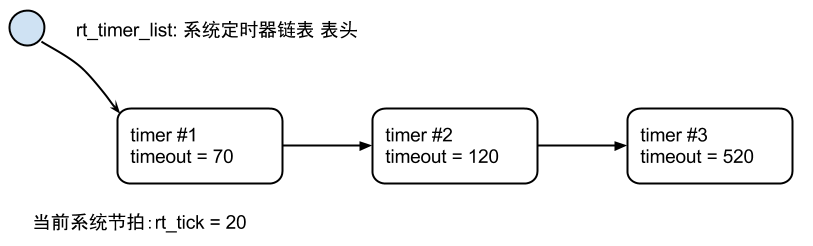
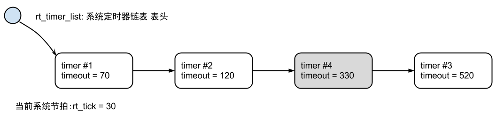

# 定时器 #

## 定时器管理 ##

定时器，是指从指定的时刻开始，经过一个指定时间，然后触发一个事件，类似定个时间提醒第二天能够按时起床。定时器有硬件定时器和软件定时器之分：

* 硬件定时器是芯片本身提供的定时功能。一般是由外部晶振提供给芯片输入时钟，芯片向软件模块提供一组配置寄存器，接受控制输入，到达设定时间值后芯片中断控制器产生时钟中断。硬件定时器的精度一般很高，可以达到纳秒级别，并且是中断触发方式。

* 软件定时器是由操作系统提供的一类系统接口（函数），它构建在硬件定时器基础之上，使系统能够提供不受数目限制的定时器服务。

在操作系统中，通常软件定时器以系统节拍（tick）为单位。节拍长度指的是周期性硬件定时器两次中断间的间隔时间长度。这个周期性硬件定时器也称之为操作系统时钟。软件定时器以这个节拍时间长度为单位，数值必须是这个节拍的整数倍，例如节拍是10ms，那么上层软件定时器只能是10ms，20ms，100ms等，而不能取值为15ms。由于节拍定义了系统中定时器能够分辨的精确度，系统可以根据实际系统CPU的处理能力和实时性需求设置合适的数值，tick值设置越小，精度越高，但是系统开销也将越大（在1秒中系统用于处理时钟中断的次数
也就越多）。RT-Thread的定时器也基于类似的系统节拍，提供了基于节拍整数倍的定时能力。

RT-Thread的定时器提供两类定时器机制：第一类是单次触发定时器，这类定时器在启动后只会触发一次定时器事件，然后定时器自动停止。第二类是周期触发定时器，这类定时器会周期性的触发定时器事件，直到用户手动的停止定时器否则将永远持续执行下去。

下面以一个实际部分代码来说明RT-Thread软件定时器的基本工作原理。在RT-Thread定时器模块中维护着两个重要的全局变量：

* 当前系统经过的tick时间rt_tick（当硬件定时器中断来临时，它将加1）；
* 定时器链表rt_timer_list。系统新创建并激活的定时器都会按照以超时时间排序的方式插
入到rt_timer_list链表中。



如上图所示，系统当前tick值为20，在当前系统中已经创建并启动了三个定时器，分别是定时时间为50个tick的Timer1、100个tick的Timer2和500个tick的Timer3，这三个定时器分别加上系统当前时间rt_tick = 20，从小到大排序链接在rt_timer_list链表中，形成如上图所示的定时器链表结构。

而rt_tick随着硬件定时器的触发一直在增长（每一次硬件定时器中断来临，rt_tick变量会加1）， 50个tick以后， rt_tick从20增长到70，与Timer1的timeout值相等， 这时会触发与Timer1定时器相关联的超时函数，同时将Timer1从rt_timer_list链表上删除。同理，100个tick和500个tick过去后，与Timer2和Timer3定时器相关联的超时函数会被触发，接着将Time2和Timer3定时器从rt_timer_list链表中删除。

如果系统当前定时器状态在10个tick以后（rt_tick = 30）有一个任务新创建了一个tick值为300的Timer4定时器，由于Timer4定时器的timeout = rt_tick + 300 =330, 因此它将被插入到Timer2和Timer3定时器中间，形成如图3-2所示链表结构：
 


## 定时器超时函数 ##

软定时器最主要的目的是在经过设定的时间后，系统能够自动执行用户设定的动作。当定时器设定的时间到了，即超时时，执行的动作函数称之为定时器的超时函数。与线程不同的是，超时函数的执行上下文环境并未用显式给出。

在RT-Thread实时操作系统中，定时器超时函数存在着两种情况：

* 超时函数在（系统时钟）中断上下文环境中执行；
* 超时函数在线程的上下文环境中执行。

如果超时函数是在中断上下文环境中执行，显然对于超时函数的要求与中断服务例程的要求相同：执行时间应该尽量短，执行时不应导致当前上下文挂起、等待。例如在中断上下文中执行的超时函数它不应该试图去申请动态内存、释放动态内存等（其中一个就包括rt_timer_delete函数调用）。

而超时函数在线程上下文中执行，则不会有这个限制，但是通常也要求超时函数执行时间应该足够短，而不应该影响到其他定时器或本次定时器的下一次周期性超时。这两种情况在RT-Thread定时器控制块中分别使用参数：RT_TIMER_FLAG_HARD_TIMER和RT_TIMER_FLAG_SOFT_TIMER指定。HARD_TIMER代表的是定时器超时函数执行上下文是在中断上下文环境中执行；SOFT_TIMER代表的是定时器函数执行的上下文是timer线程（在rtconfig.h头文件中应该定义宏RT_USING_TIMER_SOFT使timer线程能被使用）。

## 定时器管理控制块 ##

```c
struct rt_timer
{
    struct rt_object parent;

    rt_list_t row[RT_TIMER_SKIP_LIST_LEVEL];  /* 定时器列表算法用到的队列 */

    void (*timeout_func)(void *parameter);    /* 定时器超时调用的函数     */
    void      *parameter;                     /* 超时函数用到的入口参数   */

    rt_tick_t init_tick;                      /* 定时器初始超时节拍数     */
    rt_tick_t timeout_tick;                   /* 定时器实际超时时的节拍数 */
};
typedef struct rt_timer *rt_timer_t;
```

定时器控制块由struct rt_timer结构体定义，并形成定时器内核对象再链接到内核对象容器中进行管理。list成员则用于把一个激活的（已经启动的）定时器链接到rt_timer_list链表中。

## 定时器管理接口 ##

### 定时器管理系统初始化 ###

初始化定时器管理系统，可以通过下面的函数接口完成：

    void rt_system_timer_init(void);

**函数参数**

无

**函数返回** 

无

如果需要使用SOFT_TIMER，则系统初始化时，应该调用下面这个函数接口：

    void rt_system_timer_thread_init(void);

**函数参数**

无

**函数返回** 

无

### 创建定时器 ###

当动态创建一个定时器时，可使用下面的函数接口：

    rt_timer_t rt_timer_create(const char* name,
                               void (*timeout)(void* parameter), void* parameter,
                               rt_tick_t time, rt_uint8_t flag);

调用该函数接口后，内核首先从动态内存堆中分配一个定时器控制块，然后对该控制块进行基
本的初始化。

**函数参数**

----------------------------------------------------------------------------------------------
                              参数  描述
----------------------------------  ----------------------------------------------------------
                  const char* name  定时器的名称；

  void (*timeout)(void* parameter)  定时器超时函数指针（当定时器超时时，系统会调用这个函数）；

                   void* parameter  定时器超时函数的入口参数（当定时器超时时，调用超时回调函数

                                    会把这个参数做为入口参数传递给超时函数）；

                    rt_tick_t time  定时器的超时时间，单位是系统节拍；

                   rt_uint8_t flag  定时器创建时的参数，支持的值包括（可以用“或”关系取多个值）；
----------------------------------------------------------------------------------------------

include/rtdef.h中定义了一些定时器相关的宏，如下。

~~~{.c}
#define RT_TIMER_FLAG_DEACTIVATED   0x0     /* 定时器为非激活态 */
#define RT_TIMER_FLAG_ACTIVATED     0x1     /* 定时器为激活状态 */
#define RT_TIMER_FLAG_ONE_SHOT      0x0     /* 单次定时     */
#define RT_TIMER_FLAG_PERIODIC      0x2     /* 周期定时     */
#define RT_TIMER_FLAG_HARD_TIMER    0x0     /* 硬件定时器   */
#define RT_TIMER_FLAG_SOFT_TIMER    0x4     /* 软件定时器   */
~~~

当指定的flag为`RT_IMER_FLAG_HARD_TIMER`时，如果定时器超时，定时器的回调函数将在时钟中断的服务例程上下文中被调用；当指定的flag为`RT_TIMER_FLAG_SOFT_TIMER`时，如果定时器超时，定时器的回调函数将在系统时钟timer线程的上下文中被调用。

**函数返回**

如果定时器创建成功，则返回定时器的句柄；如果创建失败，会返回RT_NULL（通常会由于系
统内存不够用而返回RT_NULL）。

创建定时器的例子如下所示：

```c
/*
 * 程序清单：动态定时器例程
 *
 * 这个例程会创建两个动态定时器对象，一个是单次定时，一个是周期性的定时
 */
#include <rtthread.h>

/* 定时器的控制块 */
static rt_timer_t timer1;
static rt_timer_t timer2;

/* 定时器1超时函数 */
static void timeout1(void* parameter)
{
    rt_kprintf("periodic timer is timeout\n");
}

/* 定时器2超时函数 */
static void timeout2(void* parameter)
{
    rt_kprintf("one shot timer is timeout\n");
}

int rt_application_init(void)
{
    /* 创建定时器1 */
    timer1 = rt_timer_create("timer1",  /* 定时器名字是 timer1 */
                        timeout1, /* 超时时回调的处理函数 */
                        RT_NULL,  /* 超时函数的入口参数 */
                        10,       /* 定时长度，以OS Tick为单位，即10个OS Tick */
                        RT_TIMER_FLAG_PERIODIC); /* 周期性定时器 */
    /* 启动定时器 */
    if (timer1 != RT_NULL) rt_timer_start(timer1);

    /* 创建定时器2 */
    timer2 = rt_timer_create("timer2",   /* 定时器名字是 timer2 */
                        timeout2, /* 超时时回调的处理函数 */
                        RT_NULL,  /* 超时函数的入口参数 */
                        30,       /* 定时长度为30个OS Tick */
                        RT_TIMER_FLAG_ONE_SHOT); /* 单次定时器 */

    /* 启动定时器 */
    if (timer2 != RT_NULL) rt_timer_start(timer2);
    
    return 0;
}
```

### 删除定时器 ###

系统不再使用特定定时器时，可使用下面的函数接口：

    rt_err_t rt_timer_delete(rt_timer_t timer);

调用这个函数接口后，系统会把这个定时器从rt_timer_list链表中删除，然后释放相应的定
时器控制块占有的内存。

**函数参数**

------------------------------------------------------------------------------
                 参数  描述
---------------------  -------------------------------------------------------
     rt_timer_t timer  定时器句柄，指向要删除的定时器。
------------------------------------------------------------------------------

**函数返回**

返回RT_EOK （如果参数timer句柄是一个RT_NULL，将会导致一个ASSERT断言）

删除定时器的例子请参考例9-1中删除定时器的代码。

### 初始化定时器 ###

当选择静态创建定时器时，可利用rt_timer_init接口来初始化该定时器，函数接口如下：

    void rt_timer_init(rt_timer_t timer,
                       const char* name, void (*timeout)(void* parameter), void* parameter,
                       rt_tick_t time, rt_uint8_t flag);

使用该函数接口时会初始化相应的定时器控制块，初始化相应的定时器名称，定时器超时函数等等。

**函数参数**

----------------------------------------------------------------------------------------------
                              参数  描述
----------------------------------  ----------------------------------------------------------
                  rt_timer_t timer  定时器句柄，指向要初始化的定时器控制块；

                  const char* name  定时器的名称；

  void (*timeout)(void* parameter)  定时器超时函数指针（当定时器超时时，系统会调用这个函数）；

                   void* parameter  定时器超时函数的入口参数（当定时器超时时，调用超时回调函数
                                    会把这个参数做为入口参数传递给超时函数）；

                    rt_tick_t time  定时器的超时时间，单位是系统节拍；

                   rt_uint8_t flag  定时器创建时的参数，支持的值包括（可以用“或”关系取多个值）；
----------------------------------------------------------------------------------------------

```c
#define RT_TIMER_FLAG_ONE_SHOT      0x0     /* 单次定时     */
#define RT_TIMER_FLAG_PERIODIC      0x2     /* 周期定时     */
#define RT_TIMER_FLAG_HARD_TIMER    0x0     /* 硬件定时器   */
#define RT_TIMER_FLAG_SOFT_TIMER    0x4     /* 软件定时器   */
```

当指定的flag为RT_IMER_FLAG_HARD_TIMER时，如果定时器超时，定时器的回调函数将在时钟中断的服务例程上下文中被调用；当指定的flag为RT_TIMER_FLAG_SOFT_TIMER时，如果定时器超时，定时器的回调函数将在系统时钟timer线程的上下文中被调用。

初始化定时器的例子如下代码所示：

```c
/*
 * 程序清单：静态定时器例程
 *
 * 这个程序会初始化2个静态定时器，一个是单次定时，一个是周期性的定时
 */
#include <rtthread.h>

/* 定时器的控制块 */
static struct rt_timer timer1;
static struct rt_timer timer2;

/* 定时器1超时函数 */
static void timeout1(void* parameter)
{
    rt_kprintf("periodic timer is timeout\n");
}

/* 定时器2超时函数 */
static void timeout2(void* parameter)
{
    rt_kprintf("one shot timer is timeout\n");
}

int rt_application_init(void)
{
    /* 初始化定时器 */
    rt_timer_init(&timer1, "timer1",  /* 定时器名字是 timer1 */
                    timeout1, /* 超时时回调的处理函数 */
                    RT_NULL, /* 超时函数的入口参数 */
                    10, /* 定时长度，以OS Tick为单位，即10个OS Tick */
                    RT_TIMER_FLAG_PERIODIC); /* 周期性定时器 */
    rt_timer_init(&timer2, "timer2",   /* 定时器名字是 timer2 */
                    timeout2, /* 超时时回调的处理函数 */
                    RT_NULL, /* 超时函数的入口参数 */
                    30, /* 定时长度为30个OS Tick */
                    RT_TIMER_FLAG_ONE_SHOT); /* 单次定时器 */

    /* 启动定时器 */
    rt_timer_start(&timer1);
    rt_timer_start(&timer2);
    
    return 0;
}
```

### 脱离定时器 ###

当一个静态定时器不需要再使用时，可以使用下面的函数接口：

    rt_err_t rt_timer_detach(rt_timer_t timer);

脱离定时器时，系统会把定时器对象从系统容器的定时器链表中删除，但是定时器对象所占有的内存不会被释放。

**函数参数**

------------------------------------------------------------------------------
                 参数  描述
---------------------  -------------------------------------------------------
     rt_timer_t timer  定时器句柄，指向要脱离的定时器控制块。
------------------------------------------------------------------------------

**函数返回** 

返回RT_EOK。

脱离定时器的例子可参考9-2例程代码中的脱离部分。

### 启动定时器 ###

当定时器被创建或者初始化以后，并不会被立即启动，必须在调用启动定时器函数接口后，才开始工作，启动定时器函数接口如下：

    rt_err_t rt_timer_start(rt_timer_t timer);

调用定时器启动函数接口后，定时器的状态将更改为激活状态（RT_TIMER_FLAG_ACTIVATED），并按照超时顺序插入到rt_timer_list队列链表中。

**函数参数**

------------------------------------------------------------------------------
                 参数  描述
---------------------  -------------------------------------------------------
     rt_timer_t timer  定时器句柄，指向要启动的定时器控制块。
------------------------------------------------------------------------------

**函数返回**

如果timer已经处于激活状态，则返回-RT_ERROR；否则返回RT_EOK。

启动定时器的例子请参考9-1例程代码中的定时器代码。

### 停止定时器 ###

启动定时器以后，若想使它停止，可以使用下面的函数接口：

    rt_err_t rt_timer_stop(rt_timer_t timer);

调用定时器停止函数接口后，定时器状态将更改为停止状态，并从rt_timer_list链表中脱离出来不参与定时器超时检查。当一个（周期性）定时器超时时，也可以调用这个函数接口停止这个（周期性）定时器本身。

**函数参数**

------------------------------------------------------------------------------
                 参数  描述
---------------------  -------------------------------------------------------
     rt_timer_t timer  定时器句柄，指向要停止的定时器控制块。
------------------------------------------------------------------------------

**函数返回**

如果timer已经处于停止状态，返回-RT_ERROR；否则返回RT_EOK。

### 控制定时器 ###

除了上述提供的一些编程接口，RT_thread也额外提供了定时器控制函数接口，以获取或设置更多定时器的信息。控制定时器函数接口如下：

    rt_err_t rt_timer_control(rt_timer_t timer, rt_uint8_t cmd, void* arg);

控制定时器函数接口可根据命令类型参数，来查看或改变定时器的设置。

**函数参数**

------------------------------------------------------------------------------
                 参数  描述
---------------------  -------------------------------------------------------
     rt_timer_t timer  定时器句柄，指向要进行控制的定时器控制块;

       rt_uint8_t cmd  用于控制定时器的命令，当前支持四个命令接口，分别是设置
                       定时时间，查看定时时间，设置单次触发，设置周期触发;

            void* arg  与command相对应的控制命令参数;
------------------------------------------------------------------------------

```c
#define RT_TIMER_CTRL_SET_TIME      0x0     /* 设置定时器超时时间       */
#define RT_TIMER_CTRL_GET_TIME      0x1     /* 获得定时器超时时间       */
#define RT_TIMER_CTRL_SET_ONESHOT   0x2     /* 设置定时器为单一超时型   */
#define RT_TIMER_CTRL_SET_PERIODIC  0x3     /* 设置定时器为周期型定时器 */
```

**函数返回**

函数返回RT_EOK

使用定时器控制接口的代码如下所示:

```c
/*
 * 程序清单：定时器控制接口示例
 *
 * 这个例程会创建1个动态周期型定时器对象，然后控制它进行更改定时器的时间长度。
 */
#include <rtthread.h>

/* 定时器的控制块 */
static rt_timer_t timer1;
static rt_uint8_t count;

/* 定时器超时函数 */
static void timeout1(void* parameter)
{
    rt_kprintf("periodic timer is timeout\n");

    count ++;
    /* 当超过8次时，更改定时器的超时长度 */
    if (count >= 8)
    {
        int timeout_value = 50;
        /* 控制定时器更改定时器超时时间长度 */
        rt_timer_control(timer1, RT_TIMER_CTRL_SET_TIME, (void*)&timeout_value);
        count = 0;
    }
}

int rt_application_init(void)
{
    /* 创建定时器1 */
    timer1 = rt_timer_create("timer1",  /* 定时器名字是 timer1 */
                            timeout1, /* 超时时回调的处理函数 */
                            RT_NULL, /* 超时函数的入口参数 */
                            10, /* 定时长度，以OS Tick为单位，即10个OS Tick */
                            RT_TIMER_FLAG_PERIODIC); /* 周期性定时器 */
    /* 启动定时器 */
    if (timer1 != RT_NULL)
        rt_timer_start(timer1);
        
    return 0;
}
```

## 合理使用定时器 ##

### 定时器执行上下文 ###

RT-Thread的定时器与其他实时操作系统的定时器实现稍微有些不同（特别是RT-Thread早期版本的实现中），因为RT-Thread里定时器默认的方式是HARD_TIMER定时器，即定时器超时后，超时函数是在系统时钟中断的上下文环境中运行的。在中断上下文中的执行方式决定了定时器的超时函数不应该调用任何会让当前上下文挂起的系统函数；也不能够执行非常长的时间，否则会导致其他中断的响应时间加长或抢占了其他线程执行的时间。

另外，在第二章第三节线程控制块中，你是否有留意到每个线程控制块中都包含了一个定时器：thread_timer。这个thread_timer也是一个HARD_TIMER定时器。它被用于当线程需要执行一些带时间特性的系统调用中，例如带超时特性的试图持有信号量，接收事件、接收消息等，而当相应的条件不能够被满足时线程就将被挂起，在线程挂起前，这个内置的定时器将会被激活并启动（超时函数设定为rt_thread_timeout）。当线程定时器超时时，这个线程依然还未被唤醒， rt_thread_timeout函数仍将继续被调用，接着设置线程的error代码为-RT_ETIMEOUT，接着唤醒这个线程。所以从某个意义上说，在线程中执行rt_thread_sleep/rt_thread_delay函数，也可以算是另一种意义的超时。

回到上一段对HARD_TIMER定时器描述中来，可以看到HARD_TIMER定时器超时函数工作于中断的上下文环境中，这种在中断中执行的方式显得非常麻烦，因此开发人员需要时刻关心超时函数究竟执行了哪些操作；相反如果定时器超时函数是在线程中执行，显然会好很多，如果有更高优先级的线程就绪，依然可以抢占这个定时器执行线程从而获得优先处理权。如果是想要使用rt_thread_sleep/rt_thread_delay的方式实现定时器超时操作，那么可以使用如下图的方式： 
 


在上面的例子中，timer_thread是一个线程入口函数，在线程中执行rt_thread_delay(n)后，可以实现n个OS tick的定时，当执行rt_thread_delay时，线程的内置定时器将会被激活并启动；当线程定时器超时时，这个线程将被唤醒，并接着rt_thread_delay运行后续的代码。

上述描述的都是HARD_TIMER的特性。另外，在RT-Thread中，我们也可以在创建定时器时，把定时器指定成SOFT_TIMER的方式，这样可以使得定时器超时函数完全运行在timer系统线程上下文环境中。如果系统在初始化时需要使用SOFT_TIMER特性，需要在系统配置中打开RT_USING_TIMER_SOFT宏定义，那么调用rt_system_timer_thread_init函数就可以启动timer系统线程。这里值得注意的是，SOFT_TIMER定时器的精度由RT_TIMER_TICK_PER_SECOND定义的值所决定（每秒触发的timer tick次数是多少），这个值必须是OS tick的整数倍。

### OS tick与定时器精度 ###

系统中HARD_TIMER定时器的最小精度是由系统时钟节拍所决定的（1 OS tick = 1/RT_TICK _PER_SECOND秒，RT_TICK_PER_SECOND值在rtconfig.h文件中定义），定时器设定的时间必须是OS tick的整数倍。当需要实现更短时间长度的系统定时时，例如OS tick是10ms，而程序需要实现1ms的定时或延时，这种时候操作系统定时器将不能够满足要求，只能通过读取系统某个硬件定时器的计数器或直接使用硬件定时器的方式。

在Cortex-M3中，SysTick已经被RT-Thread用于作为OS tick使用，它被配置成1/RT_TICK_ PER_SECOND秒后触发一次中断的方式，中断处理函数使用Cortex-M3默认的SysTick_Handler名字。在Cortex-M3的CMSIS（Cortex Microcontroller Software Interface Standard）规范中规定了SystemCoreClock代表芯片的主频，所以基于SysTick以及SystemCoreClock，我们能够使用SysTick获得一个精确的延时函数，如下例所示，Cortex-M3上的基于SysTick的精确延时（需要系统在使能SysTick后使用）：

高精度延时 的例程如下所示

```c
#include <board.h>
void rt_hw_us_delay(rt_uint32_t us)
{
    rt_uint32_t delta;

    /* 获得延时经过的tick数 */
    us = us * (SysTick->LOAD/(1000000/RT_TICK_PER_SECOND));

    /* 获得当前时间 */
    delta = SysTick->VAL;

    /* 循环获得当前时间，直到达到指定的时间后退出循环 */
    while (delta - SysTick->VAL< us);
}
```

其中入口参数us指示出需要延时的微秒数目，这个函数只能支持低于1 OS tick的延时，否则SysTick会出现溢出而不能够获得指定的延时时间。
