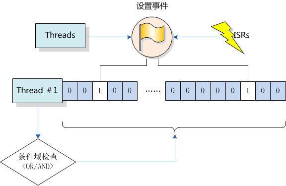
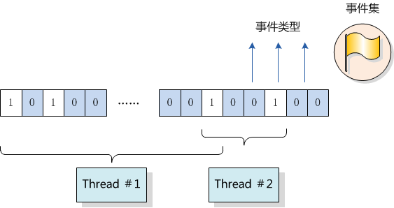
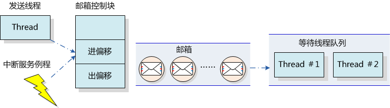

# 任务间同步及通信 #

在多任务实时系统中，一项工作的完成往往可以通过多个任务协调的方式共同来完成，例如一个任务从传感器中接收数据并且将数据写到共享内存中，同时另一个任务周期性的从共享内存中读取数据并发送去显示（如图 ***两个线程间的数据传递*** ）。

如果对共享内存的访问不是排他性的，那么各个线程间可能同时访问它。这将引起数据一致性的问题，例如，在显示线程试图显示数据之前，传感器线程还未完成数据的写入，那么显示将包含不同时间采样的数据，造成显示数据的迷惑。

将传感器数据写入到共享内存的代码是接收线程的关键代码段；将传感器数据从共享内存中读出的代码是显示线程的关键代码段；这两段代码都会访问共享内存。正常的操作序列应该是在一个线程对共享内存块操作完成后，才允许另一个线程去操作。对于操作/访问同一块区域，称之为临界区。任务的同步方式有很多种，其核心思想都是：在访问临界区的时候只允许一个(或一类)任务运行。

## 关闭中断 ##

关闭中断也叫中断锁，是禁止多任务访问临界区最简单的一种方式，即使是在分时操作系统中也是如此。当中断关闭的时候，就意味着当前任务不会被其他事件打断（因为整个系统已经不再响应那些可以触发线程重新调度的外部事件），也就是当前线程不会被抢占，除非这个任务主动放弃了处理器控制权。关闭中断/恢复中断API接口由BSP实现，根据平台的不同其实现方式也大不相同。

关闭、打开中断接口由两个函数完成：

* 关闭中断 

    rt_base_t rt_hw_interrupt_disable(void);

这个函数用于关闭中断并返回关闭中断前的中断状态。

**函数参数**

无

**函数返回**

返回调用这个函数前的中断状态。

* 恢复中断 

    void rt_hw_interrupt_enable(rt_base_t level);

这个函数“使能”中断，它采用恢复调用rt_hw_interrupt_disable()函数前的中断状态，进行“使能”中断状态，如果调用rt_hw_interrupt_disable() 函数前是关中断状态，那么调用此函数后依然是关中断状态。level参数是上一次调用rt_hw_interrupt_ disable()时的返回值。

**函数参数**

-----------------------------------------------------------------------
          参数  描述
--------------  -------------------------------------------------------
         level  前一次rt_hw_interrupt_disable返回的中断状态。
-----------------------------------------------------------------------

**函数返回**

无

使用开关中断进行线程间同步的例子代码如下例代码所示：

~~~{.c}
/* 代码清单：关闭中断进行全局变量的访问 */
#include <rtthread.h>

/* 同时访问的全局变量 */
static rt_uint32_t cnt;
void thread_entry(void* parameter)
{
    rt_uint32_t no;
    rt_uint32_t level;

    no = (rt_uint32_t) parameter;
    while(1)
    {
        /* 关闭中断 */
        level = rt_hw_interrupt_disable();
        cnt += no;
        /* 恢复中断 */
        rt_hw_interrupt_enable(level);

        rt_kprintf("thread[%d]'s counter is %d\n", no, cnt);
        rt_thread_delay(no);
    }
}

/* 用户应用程序入口 */
void rt_application_init()
{
    rt_thread_t thread;

    /* 创建t1线程 */
    thread = rt_thread_create("t1", thread_entry, (void*)10,
        512, 10, 5);
    if (thread != RT_NULL) rt_thread_startup(thread);

    /* 创建t2线程 */
    thread = rt_thread_create("t2", thread_entry, (void*)20,
        512, 20, 5);
    if (thread != RT_NULL) rt_thread_startup(thread);
}

~~~

* 警告: 
由于关闭中断会导致整个系统不能响应外部中断，所以在使用关闭中断做为互斥访问临界区的手段时，首先必须需要保证关闭中断的时间非常短，例如数条机器指令。

### 使用场合 ###

使用中断锁来操作系统的方法可以应用于任何场合，且其他几类同步方式都是依赖于中断锁而实现的，可以说中断锁是最强大的和最高效的同步方法。只是使用中断锁最主要的问题在于，在中断关闭期间系统将不再响应任何中断，也就不能响应外部的事件。所以中断锁对系统的实时性影响非常巨大，当使用不当的时候会导致系统完全无实时性可言（可能导致系统完全偏离要求的时间需求）；而使用得当，则会变成一种快速、高效的同步方式。

例如，为了保证一行代码（例如赋值）的互斥运行，最快速的方法是使用中断锁而不是信号量或互斥量：

~~~{.c}
	/* 关闭中断*/
	level = rt_hw_interrupt_disable();
	a = a + value;
	/* 恢复中断*/
	rt_hw_interrupt_enable(level);
~~~

在使用中断锁时，需要确保关闭中断的时间非常短，例如上面代码中的a = a + value; 也可换成另外一种方式，例如使用信号量：

~~~{.c}
	/* 获得信号量锁*/
	rt_sem_take(sem_lock, RT_WAITING_FOREVER);
	a = a + value;
	/* 释放信号量锁*/
	rt_sem_release(sem_lock);
~~~

这段代码在rt_sem_take 、rt_sem_release 的实现中，已经存在使用中断锁保护信号量内部变量的行为，所以对于简单如a = a + value;的操作，使用中断锁将更为简洁快速。

## 调度器锁 ##

同中断锁一样把调度器锁住也能让当前运行的任务不被换出，直到调度器解锁。但和中断锁有一点不相同的是，对调度器上锁，系统依然能响应外部中断，中断服务例程依然能进行相应的响应。所以在使用调度器上锁的方式进行任务同步时，需要考虑好任务访问的临界资源是否会被中断服务例程所修改，如果可能会被修改，那么将不适合采用此种方式进行同步。RT-Thread提供的调度锁操作API为：

    void rt_enter_critical(void); /* 进入临界区*/

**函数参数**

无

**函数返回**

无

调用这个函数后，调度器将被上锁。在锁住调度器期间，系统依然响应中断，如果中断唤醒了更高优先级的线程，调度器并不会立刻执行它，直到调用解锁调度器函数时才会尝试进行下一次调度。

	void rt_exit_critical(void); /* 退出临界区*/

**函数参数**

无

**函数返回**

无

当系统退出临界区的时候，系统会计算当前是否有更高优先级的线程就绪，如果有比当前线程更高优先级的线程就绪，将切换到这个高优先级线程中执行；如果无更高优先级线程就绪，将继续执行当前任务。

* 注：
rt_enter_critical/rt_exit_critical可以多次嵌套调用，但每调用一次rt_enter_critical就必须相对应地调用一次rt_exit_critical退出操作，嵌套的最大深度是65535。

### 使用场合 ###

调度器锁能够方便地使用于一些线程与线程间同步的场合，由于轻型，它不会对系统中断响应造成负担；但它的缺陷也很明显，就是它不能被用于中断与线程间的同步或通知，并且如果执行调度器锁的时间过长，会对系统的实时性造成影响（因为使用了调度器锁后，系统将不再具备优先级的关系，直到它脱离了调度器锁的状态）。

## 信号量 ##

信号量是一种轻型的用于解决线程间同步问题的内核对象，线程可以获取或释放它，从而达到同步或互斥的目的。信号量就像一把钥匙，把一段临界区给锁住，只允许有钥匙的线程进行访问：线程拿到了钥匙，才允许它进入临界区；而离开后把钥匙传递给排队在后面的等待线程，让后续线程依次进入临界区。

信号量工作示意图如图 ***信号量工作示意图*** 所示，每个信号量对象都有一个信号量值和一个线程等待队列，信号量的值对应了信号量对象的实例数目、资源数目，假如信号量值为5，则表示共有5个信号量实例（资源）可以被使用，当信号量实例数目为零时，再申请该信号量的线程就会被挂起在该信号量的等待队列上，等待可用的信号量实例（资源）。

### 信号量控制块 ###

~~~{.c}
struct rt_semaphore
{
   struct rt_ipc_object parent;/*继承自ipc_object类*/
   rt_uint16_t value;   /* 信号量的值  */
};
/* rt_sem_t是指向semaphore结构体的指针类型 */
typedef struct rt_semaphore* rt_sem_t;

~~~

rt_semaphore对象从rt_ipc_object中派生，由IPC容器所管理。信号量的最大值是65535。

### 信号量相关接口 ###

#### 创建信号量 ####

当创建一个信号量时，内核首先创建一个信号量控制块，然后对该控制块进行基本的初始化工作，创建信号量使用下面的函数接口：

    rt_sem_t rt_sem_create (const char* name, rt_uint32_t value, rt_uint8_t flag);

当调用这个函数时，系统将先分配一个semaphore对象，并初始化这个对象，然后初始化IPC对象以及与semaphore相关的部分。在创建信号量指定的参数中，信号量标志参数决定了当信号量不可用时，多个线程等待的排队方式。当选择FIFO方式时，那么等待线程队列将按照先进先出的方式排队，先进入的线程将先获得等待的信号量；当选择PRIO（优先级等待）方式时，等待线程队列将按照优先级进行排队，优先级高的等待线程将先获得等待的信号量。

**函数参数**

-----------------------------------------------------------------------
          参数  描述
--------------  -------------------------------------------------------
          name  信号量名称；

         value  信号量初始值；

          flag  信号量标志，取值可以使用如下类型：
-----------------------------------------------------------------------

~~~{.c}
#define RT_IPC_FLAG_FIFO 0x00 /* IPC参数采用FIFO方式*/
#define RT_IPC_FLAG_PRIO 0x01 /* IPC参数采用优先级方式*/
~~~

**函数返回**

创建成功返回创建的信号量控制块指针；否则返回RT_NULL。

创建信号量的例程如下例所示：

~~~{.c}
/*
* 程序清单：动态信号量
*
* 这个例子中将创建一个动态信号量(初始值为0)及一个动态线程，在这个动态线程中
* 将试图采用超时方式去持有信号量，应该超时返回。然后这个线程释放一次信号量，
* 并在后面继续采用永久等待方式去持有信号量， 成功获得信号量后返回。
*/
#include <rtthread.h>
#include "tc_comm.h"

/* 指向线程控制块的指针 */
static rt_thread_t tid = RT_NULL;
/* 指向信号量的指针 */
static rt_sem_t sem = RT_NULL;
/* 线程入口 */
static void thread_entry(void* parameter)
{
    rt_err_t result;
    rt_tick_t tick;

    /* 获得当前的OS Tick */
    tick = rt_tick_get();

    /* 试图持有一个信号量，如果10个OS Tick依然没拿到，则超时返回 */
    result = rt_sem_take(sem, 10);
    if (result == -RT_ETIMEOUT)
    {
        /* 判断是否刚好过去10个OS Tick */
        if (rt_tick_get() - tick != 10)
        {
            /* 如果失败，则测试失败 */
            tc_done(TC_STAT_FAILED);
            rt_sem_delete(sem);
            return;
        }
        rt_kprintf("take semaphore timeout\n");
    }
    else
    {
        /* 因为并没释放信号量，应该是超时返回，否则测试失败 */
        tc_done(TC_STAT_FAILED);
        rt_sem_delete(sem);
        return;
    }

    /* 释放一次信号量 */
    rt_sem_release(sem);

    /* 继续持有信号量，并永远等待直到持有到信号量 */
    result = rt_sem_take(sem, RT_WAITING_FOREVER);
    if (result != RT_EOK)
    {
        /* 返回不正确，测试失败 */
        tc_done(TC_STAT_FAILED);
        rt_sem_delete(sem);
        return;
    }

    /* 测试成功 */
    tc_done(TC_STAT_PASSED);
    /* 删除信号量 */
    rt_sem_delete(sem);
}

    int semaphore_dynamic_init()
    {
        /* 创建一个信号量，初始值是0 */
        sem = rt_sem_create("sem", 0, RT_IPC_FLAG_FIFO);
        if (sem == RT_NULL)
        {
            tc_stat(TC_STAT_END | TC_STAT_FAILED);
            return 0;
        }

        /* 创建线程 */
        tid = rt_thread_create("thread",
            thread_entry, RT_NULL, /* 线程入口是thread_entry, 参数RT_NULL */
            THREAD_STACK_SIZE, THREAD_PRIORITY, THREAD_TIMESLICE);
        if (tid != RT_NULL)
            rt_thread_startup(tid);
        else
            tc_stat(TC_STAT_END | TC_STAT_FAILED);

        return 0;
    }

    #ifdef RT_USING_TC
    static void _tc_cleanup()
    {
        /* 调度器上锁，上锁后，将不再切换到其他线程，仅响应中断 */
        rt_enter_critical();

        /* 删除线程 */
        if (tid != RT_NULL && tid->stat != RT_THREAD_CLOSE)
        {
            rt_thread_delete(tid);

            /* 删除信号量 */
            rt_sem_delete(sem);
        }

        /* 调度器解锁 */
        rt_exit_critical();

        /* 设置TestCase状态 */
        tc_done(TC_STAT_PASSED);
    }

    int _tc_semaphore_dynamic()
    {
        /* 设置TestCase清理回调函数 */
        tc_cleanup(_tc_cleanup);
        semaphore_dynamic_init();

        /* 返回TestCase运行的最长时间 */
        return 100;
    }
    /* 输出函数命令到finsh shell中 */
    FINSH_FUNCTION_EXPORT(_tc_semaphore_dynamic, a dynamic semaphore example);
    #else
    /* 用户应用入口 */
    int rt_application_init()
    {
        semaphore_dynamic_init();

        return 0;
    }
    #endif

~~~

#### 删除信号量 ####

系统不再使用信号量时，可通过删除信号量以释放系统资源。删除信号量使用下面的函数接口：

	rt_err_t rt_sem_delete (rt_sem_t sem);

调用这个函数时，系统将删除这个信号量。如果删除该信号量时，有线程正在等待该信号量，那么删除操作会先唤醒等待在该信号量上的线程（等待线程的返回值是-RT_ERROR），然后再释放信号量的内存资源。

-----------------------------------------------------------------------
          参数  描述
--------------  -------------------------------------------------------
           sem  rt_sem_create创建处理的信号量对象。
-----------------------------------------------------------------------

**函数返回**

RT_EOK

#### 初始化信号量 ####

对于静态信号量对象，它的内存空间在编译时期就被编译器分配出来，放在数据段或ZI段上，此时使用信号量就不再需要使用rt_sem_create接口来创建它，而只需在使用前对它进行初始化即可。初始化信号量对象可使用下面的函数接口：

	rt_err_t rt_sem_init (rt_sem_t sem, const char* name, rt_uint32_t value, rt_uint8_t flag);

当调用这个函数时，系统将对这个semaphore对象进行初始化，然后初始化IPC对象以及与semaphore相关的部分。在初始化信号量指定的参数中，信号量标志参数决定了当信号量不可用时，多个线程等待的方式。当选择FIFO方式时，那么等待线程队列将按照先进先出的方式排队，先进入的线程将先获得等待的信号量；当选择PRIO（优先级等待）方式时，等待线程队列将按照优先级进行排队，优先级高的等待线程将先获得等待的信号量。

**函数参数**

-----------------------------------------------------------------------
          参数  描述
--------------  -------------------------------------------------------
           sem  信号量对象的句柄；

          name  信号量名称；

         value  信号量初始值；

          flag  信号量标志。
-----------------------------------------------------------------------

~~~{.c}
#define RT_IPC_FLAG_FIFO 0x00 /* IPC参数采用FIFO方式*/
#define RT_IPC_FLAG_PRIO 0x01 /* IPC参数采用优先级方式*/
~~~

**函数返回**

RT_EOK

初始化信号量的例程如下例所示：

~~~{.c}
/*
* 程序清单：静态信号量
*
* 这个例子中将创建一个静态信号量（初始值为0 ）及一个静态线程，在这个静态线程中
* 将试图采用超时方式去获取信号量，应该超时返回。然后这个线程释放一次信号量，并
* 在后面继续采用永久等待方式去获取信号量， 成功获得信号量后返回。
*/
    #include <rtthread.h>
    #include "tc_comm.h"

    /* 线程控制块及栈 */
    static struct rt_thread thread;
    static rt_uint8_t thread_stack[THREAD_STACK_SIZE];
    /* 信号量控制块 */
    static struct rt_semaphore sem;

    /* 线程入口 */
    static void thread_entry(void* parameter)
    {
        rt_err_t result;
        rt_tick_t tick;

        /* 获得当前的OS Tick */
        tick = rt_tick_get();

        /* 试图持有信号量，最大等待10个OS Tick后返回 */
        result = rt_sem_take(&sem, 10);
        if (result == -RT_ETIMEOUT)
        {
            /* 超时后判断是否刚好是10个OS Tick */
            if (rt_tick_get() - tick != 10)
            {
                tc_done(TC_STAT_FAILED);
                rt_sem_detach(&sem);
                return;
            }
            rt_kprintf("take semaphore timeout\n");
        }
        else
        {
            /* 因为没有其他地方释放信号量，所以不应该成功持有信号量，否则测试失败 */
            tc_done(TC_STAT_FAILED);
            rt_sem_detach(&sem);
            return;
        }

        /* 释放一次信号量 */
        rt_sem_release(&sem);

        /* 永久等待方式持有信号量 */
        result = rt_sem_take(&sem, RT_WAITING_FOREVER);
        if (result != RT_EOK)
        {
            /* 不成功则测试失败 */
            tc_done(TC_STAT_FAILED);
            rt_sem_detach(&sem);
            return;
        }

        /* 测试通过 */
        tc_done(TC_STAT_PASSED);
        /* 脱离信号量对象 */
        rt_sem_detach(&sem);
    }

    int semaphore_static_init()
    {
        rt_err_t result;

        /* 初始化信号量，初始值是0 */
        result = rt_sem_init(&sem, "sem", 0, RT_IPC_FLAG_FIFO);
        if (result != RT_EOK)
        {
            tc_stat(TC_STAT_END | TC_STAT_FAILED);
            return 0;
        }

        /* 初始化线程1 */
        result = rt_thread_init(&thread, "thread", /* 线程名：thread */
            thread_entry, RT_NULL, /* 线程的入口是thread_entry，参数是RT_NULL*/
            &thread_stack[0], sizeof(thread_stack), /* 线程栈thread_stack */
            THREAD_PRIORITY, 10);
        if (result == RT_EOK) /* 如果返回正确，启动线程1 */
            rt_thread_startup(&thread);
        else
            tc_stat(TC_STAT_END | TC_STAT_FAILED);

        return 0;
    }

    #ifdef RT_USING_TC
    static void _tc_cleanup()
    {
        /* 调度器上锁，上锁后，将不再切换到其他线程，仅响应中断 */
        rt_enter_critical();

        /* 执行线程脱离 */
        if (thread.stat != RT_THREAD_CLOSE)
        {
            rt_thread_detach(&thread);

            /* 执行信号量对象脱离 */
            rt_sem_detach(&sem);
        }

        /* 调度器解锁 */
        rt_exit_critical();

        /* 设置TestCase状态 */
        tc_done(TC_STAT_PASSED);
    }

    int _tc_semaphore_static()
    {
        /* 设置TestCase清理回调函数 */
        tc_cleanup(_tc_cleanup);
        semaphore_static_init();

        /* 返回TestCase运行的最长时间 */
        return 100;
    }
    /* 输出函数命令到finsh shell中 */
    FINSH_FUNCTION_EXPORT(_tc_semaphore_static, a static semaphore example);
    #else
    /* 用户应用入口 */
    int rt_application_init()
    {
        thread_static_init();

        return 0;
    }
    #endif

~~~

#### 脱离信号量 ####

脱离信号量就是让信号量对象从内核对象管理器中移除掉。脱离信号量使用下面的函数接口：

	rt_err_t rt_sem_detach (rt_sem_t sem);

使用该函数后，内核先唤醒所有挂在该信号量等待队列上的线程，然后将该信号量从内核对象管理器中删除。原来挂起在信号量上的等待线程将获得-RT_ERROR 的返回值。

-----------------------------------------------------------------------
          参数  描述
--------------  -------------------------------------------------------
           sem  信号量对象的句柄。
-----------------------------------------------------------------------

**函数返回**

RT_EOK

#### 获取信号量 ####

线程通过获取信号量来获得信号量资源实例，当信号量值大于零时，线程将获得信号量，并且相应的信号量值都会减1，获取信号量使用下面的函数接口：

	rt_err_t rt_sem_take (rt_sem_t sem, rt_int32_t time);

在调用这个函数时，如果信号量的值等于零，那么说明当前信号量资源实例不可用，申请该信号量的线程将根据time参数的情况选择直接返回、或挂起等待一段时间、或永久等待，直到其他线程或中断释放该信号量。如果在参数time指定的时间内依然得不到信号量，线程将超时返回，返回值是-RT_ETIMEOUT。

**函数参数**

-----------------------------------------------------------------------
          参数  描述
--------------  -------------------------------------------------------
           sem  信号量对象的句柄；

          time  指定的等待时间，单位是操作系统时钟节拍（OS　Tick）。
-----------------------------------------------------------------------

**函数返回**

成功获得信号量返回RT_EOK；超时依然未获得信号量返回-RT_ETIMEOUT；其他错误返回-RT_ERROR。

#### 无等待获取信号量 ####

当用户不想在申请的信号量上挂起线程进行等待时，可以使用无等待方式获取信号量，无等待获取信号量使用下面的函数接口：

	rt_err_t rt_sem_trytake(rt_sem_t sem);

这个函数与rt_sem_take(sem, 0) 的作用相同，即当线程申请的信号量资源实例不可用的时候，它不会等待在该信号量上，而是直接返回-RT_ETIMEOUT。

**函数参数**

-----------------------------------------------------------------------
          参数  描述
--------------  -------------------------------------------------------
           sem  信号量对象的句柄。
-----------------------------------------------------------------------

**函数返回**

成功获取信号量返回RT_EOK；否则返回RT_ETIMEOUT。

#### 释放信号量 ####

当线程完成资源的访问后，应尽快释放它持有的信号量，使得其他线程能获得该信号量。释放信号量使用下面的函数接口：

	rt_err_t rt_sem_release(rt_sem_t sem);

当信号量的值等于零时，并且有线程等待这个信号量时，将唤醒等待在该信号量线程队列中的第一个线程，由它获取信号量。否则将把信号量的值加一。

**函数参数**

-----------------------------------------------------------------------
          参数  描述
--------------  -------------------------------------------------------
           sem  信号量对象的句柄。
-----------------------------------------------------------------------

**函数返回**

RT_EOK

下面是一个使用信号量的例程，如下例所示：

~~~{.c}
/*
* 程序清单：生产者消费者例子
*
* 这个例子中将创建两个线程用于实现生产者消费者问题
*/
#include <rtthread.h>
#include "tc_comm.h"

/* 定义最大5个元素能够被产生 */
#define MAXSEM     5

/* 用于放置生产的整数数组 */
rt_uint32_t array[MAXSEM];
/* 指向生产者、消费者在array数组中的读写位置 */
static rt_uint32_t set, get;

/* 指向线程控制块的指针 */
static rt_thread_t producer_tid = RT_NULL;
static rt_thread_t consumer_tid = RT_NULL;

struct rt_semaphore sem_lock;
struct rt_semaphore sem_empty, sem_full;

/* 生产者线程入口 */
void producer_thread_entry(void* parameter)
{
    rt_int32_t cnt = 0;

    /* 运行100次 */
    while( cnt < 100)
    {
        /* 获取一个空位 */
        rt_sem_take(&sem_empty, RT_WAITING_FOREVER);

        /* 修改array内容，上锁 */
        rt_sem_take(&sem_lock, RT_WAITING_FOREVER);
        array[set%MAXSEM] = cnt + 1;
        rt_kprintf("the producer generates a number: %d\n", 
            array[set%MAXSEM]);
        set++;
        rt_sem_release(&sem_lock);

        /* 发布一个满位 */
        rt_sem_release(&sem_full);
        cnt++;

        /* 暂停一段时间 */
        rt_thread_delay(50);
    }

    rt_kprintf("the producer exit!\n");
}

/* 消费者线程入口 */
void consumer_thread_entry(void* parameter)
{
    rt_uint32_t no;
    rt_uint32_t sum = 0;

    /* 第n个线程，由入口参数传进来 */
    no = (rt_uint32_t)parameter;

    while(1)
    {
        /* 获取一个满位 */
        rt_sem_take(&sem_full, RT_WAITING_FOREVER);

        /* 临界区，上锁进行操作 */
        rt_sem_take(&sem_lock, RT_WAITING_FOREVER);
        sum += array[get%MAXSEM];
        rt_kprintf("the consumer[%d] get a number:%d\n", 
no, array[get%MAXSEM]);
        get++;
        rt_sem_release(&sem_lock);

        /* 释放一个空位 */
        rt_sem_release(&sem_empty);

        /* 生产者生产到100个数目，停止，消费者线程相应停止 */
        if (get == 100) break;

        /* 暂停一小会时间 */
        rt_thread_delay(10);
    }

    rt_kprintf("the consumer[%d] sum is %d \n ", no, sum);
    rt_kprintf("the consumer[%d] exit!\n");
}

int semaphore_producer_consumer_init()
{
    /* 初始化3个信号量 */
    rt_sem_init(&sem_lock , "lock",   1,    RT_IPC_FLAG_FIFO);
    rt_sem_init(&sem_empty,"empty", MAXSEM, RT_IPC_FLAG_FIFO);
    rt_sem_init(&sem_full , "full",   0,   RT_IPC_FLAG_FIFO);

    /* 创建线程1 */
    producer_tid = rt_thread_create("producer",
        producer_thread_entry, /* 线程入口是producer_thread_entry */
        RT_NULL, /* 入口参数是RT_NULL */
        THREAD_STACK_SIZE, THREAD_PRIORITY - 1, THREAD_TIMESLICE);
    if (producer_tid != RT_NULL)
        rt_thread_startup(producer_tid);
    else
        tc_stat(TC_STAT_END | TC_STAT_FAILED);

    /* 创建线程2 */
    consumer_tid = rt_thread_create("consumer",
       consumer_thread_entry,/* 线程入口是consumer_thread_entry */
        RT_NULL, /* 入口参数是RT_NULL */
        THREAD_STACK_SIZE, THREAD_PRIORITY + 1, THREAD_TIMESLICE);
    if (consumer_tid != RT_NULL)
        rt_thread_startup(consumer_tid);
    else
        tc_stat(TC_STAT_END | TC_STAT_FAILED);

    return 0;
}

#ifdef RT_USING_TC
static void _tc_cleanup()
{
    /* 调度器上锁，上锁后，将不再切换到其他线程，仅响应中断 */
    rt_enter_critical();

    /* 删除线程 */
    if (producer_tid != RT_NULL && producer_tid->stat != RT_THREAD_CLOSE)
        rt_thread_delete(producer_tid);
    if (consumer_tid != RT_NULL && consumer_tid->stat != RT_THREAD_CLOSE)
        rt_thread_delete(consumer_tid);

    /* 调度器解锁 */
    rt_exit_critical();

    /* 设置TestCase状态 */
    tc_done(TC_STAT_PASSED);
}

int _tc_semaphore_producer_consumer()
{
    /* 设置TestCase清理回调函数 */
    tc_cleanup(_tc_cleanup);
    semaphore_producer_consumer_init();

    /* 返回TestCase运行的最长时间 */
    return 100;
}
/* 输出函数命令到finsh shell中 */
FINSH_FUNCTION_EXPORT(_tc_semaphore_producer_consumer, producer and consumer example);
#else
/* 用户应用入口 */
int rt_application_init()
{
    semaphore_producer_consumer_init();

    return 0;
}
#endif

~~~

在这个例子中，semaphore是作为一种锁的形式存在，当要访问临界资源：ring buffer时，通过持有semaphore 的形式阻止其他线程进入（如果其他线程也打算进入，将在这里被挂起）。

### 使用场合 ###

信号量是一种非常灵活的同步方式，可以运用在多种场合中。形成锁，同步，资源计数等关系，也能方便的用于线程与线程，中断与线程的同步中。

#### 线程同步 ####

线程同步是信号量最简单的一类应用。例如，两个线程用来进行任务间的执行控制转移，信号量的值初始化成具备0个信号量资源实例，而等待线程先直接在这个信号量上进行等待。

当信号线程完成它处理的工作时，释放这个信号量，以把等待在这个信号量上的线程唤醒，让它执行下一部分工作。这类场合也可以看成把信号量用于工作完成标志：信号线程完成它自己的工作，然后通知等待线程继续下一部分工作。

#### 锁 ####

锁，单一的锁常应用于多个线程间对同一临界区的访问。信号量在作为锁来使用时，通常应将信号量资源实例初始化成1，代表系统默认有一个资源可用。当线程需要访问临界资源时，它需要先获得这个资源锁。当这个线程成功获得资源锁时，其他打算访问临界区的线程将被挂起在该信号量上，这是因为其他线程在试图获取这个锁时，这个锁已经被锁上（信号量值是0）。当获得信号量的线程处理完毕，退出临界区时，它将会释放信号量并把锁解开，而挂起在锁上的第一个等待线程将被唤醒从而获得临界区的访问权。

因为信号量的值始终在1和0之间变动，所以这类锁也叫做二值信号量，如图 ***锁*** 所示：

 
#### 中断与线程的同步 ####

信号量也能够方便的应用于中断与线程间的同步，例如一个中断触发，中断服务例程需要通知线程进行相应的数据处理。这个时候可以设置信号量的初始值是0，线程在试图持有这个信号量时，由于信号量的初始值是0，线程直接在这个信号量上挂起直到信号量被释放。
当中断触发时，先进行与硬件相关的动作，例如从硬件的I/O口中读取相应的数据，并确认中断以清除中断源，而后释放一个信号量来唤醒相应的线程以做后续的数据处理。例如finsh shell线程的处理方式，如图 ***finsh shell的中断、线程间同步*** 所示：

 
semaphore先初始为0，而后shell线程试图取得信号量，因为信号量值是0，所以它会被挂起。当console设备有数据输入时，将产生中断而进入中断服务例程。在中断服务例程中，它会读取console设备的数据，并把读得的数据放入uart buffer中进行缓冲，而后释放信号量，释放信号量的操作将唤醒shell线程。在中断服务例程运行完毕后，如果系统中没有比shell线程优先级更高的就绪线程存在时，shell线程将持有信号量并运行，从uart buffer缓冲区中获取输入的数据。

* 警告：
中断与线程间的互斥不能采用信号量（锁）的方式，而应采用中断锁。

#### 资源计数 ####

资源计数适合于线程间速度不匹配的场合，这个时候信号量可以做为前一线程工作完成的计数，而当调度到后一线程时，它可以以一种连续的方式一次处理数个事件。例如，生产者与消费者问题中，生产者可以对信号进行多次释放，而后消费者被调度到时能够一次处理多个资源。

* 注：
一般资源计数类型多是混合方式的线程间同步，因为对于单个的资源处理依然存在线程的多重访问，这就需要对一个单独的资源进行访问、处理，并进行锁方式的互斥操作。

## 互斥量 ##

互斥量又叫相互排斥的信号量，是一种特殊的二值性信号量。它和信号量不同的是，它支持互斥量所有权、递归访问以及防止优先级翻转的特性。互斥量工作如 ***互斥量的工作示意图*** 所示。

 
互斥量的状态只有两种，开锁或闭锁（两种状态值）。当有线程持有它时，互斥量处于闭锁状态，由这个线程获得它的所有权。相反，当这个线程释放它时，将对互斥量进行开锁，失去它的所有权。当一个线程持有互斥量时，其他线程将不能够对它进行开锁或持有它，持有该互斥量的线程也能够再次获得这个锁而不被挂起。这个特性与一般的二值信号量有很大的不同，在信号量中，因为已经不存在实例，线程递归持有会发生主动挂起（最终形成死锁）。

使用信号量会导致的另一个潜在问题是线程优先级翻转。所谓优先级翻转问题即当一个高优先级线程试图通过信号量机制访问共享资源时，如果该信号量已被一低优先级线程持有，而这个低优先级线程在运行过程中可能又被其它一些中等优先级的线程抢占，因此造成高优先级线程被许多具有较低优先级的线程阻塞，实时性难以得到保证。例如：有优先级为A、B和C的三个线程，优先级A> B > C。线程A，B处于挂起状态，等待某一事件触发，线程C正在运行，此时线程C开始使用某一共享资源M。在使用过程中，线程A等待的事件到来，线程A转为就绪态，因为它比线程C优先级高，所以立即执行。但是当线程A要使用共享资源M时，由于其正在被线程C使用，因此线程A被挂起切换到线程C运行。如果此时线程B等待的事件到来，则线程B转为就绪态。由于线程B的优先级比线程C高，因此线程B开始运行，直到其运行完毕，线程C才开始运行。只有当线程C释放共享资源M后，线程A才得以执行。在这种情况下，优先级发生了翻转，线程B先于线程A运行。这样便不能保证高优先级线程的响应时间。

在RT-Thread操作系统中实现的是优先级继承算法。优先级继承是通过在线程A被阻塞的期间内，将线程C的优先级提升到线程A的优先级别，从而解决优先级翻转引起的问题。这样能够防止C（间接地防止A）被B抢占。优先级继承协议是指，提高某个占有某种资源的低优先级线程的优先级，使之与所有等待该资源的线程中优先级最高的那个线程的优先级相等，然后执行，而当这个低优先级线程释放该资源时，优先级重新回到初始设定。因此，继承优先级的线程避免了系统资源被任何中间优先级的线程抢占。

* 警告：
在获得互斥量后，请尽快释放互斥量，并且在持有互斥量的过程中，不得再行更改持有互斥量线程的优先级。

### 互斥量控制块 ###

互斥量控制块的数据结构

~~~{.c}
    struct rt_mutex
    {
        struct rt_ipc_object parent;            	/* 继承自ipc_object类 */

        rt_uint16_t          value;               	/* 互斥量的值 */
        rt_uint8_t           original_priority; 	/* 持有线程的原始优先级 */
        rt_uint8_t           hold;                 	/* 持有线程的持有次数   */
        struct rt_thread    *owner;             	/* 当前拥有互斥量的线程 */
    };
    /* rt_mutext_t为指向互斥量结构体的指针 */
    typedef struct rt_mutex* rt_mutex_t;
~~~

rt_mutex对象从rt_ipc_object中派生，由IPC容器管理。

### 互斥量相关接口 ###

#### 创建互斥量 ####

创建一个互斥量时，内核首先创建一个互斥量控制块，然后完成对该控制块的初始化工作。创建互斥量使用下面的函数接口：

	rt_mutex_t rt_mutex_create (const char* name, rt_uint8_t flag);

可以调用rt_mutex_create函数创建一个互斥量，它的名字有name所指定。创建的互斥量由于指定的flag不同，而有不同的意义：
使用PRIO优先级flag创建的IPC对象，在多个线程等待资源时，将由优先级高的线程优先获得资源。而使用FIFO先进先出flag创建的IPC对象，在多个线程等待资源时，将按照先来先得的顺序获得资源。

**函数参数**

-----------------------------------------------------------------------
          参数  描述
--------------  -------------------------------------------------------
          name  互斥量的名称；

          flag  互斥量标志，可以取如下类型的数值：
-----------------------------------------------------------------------

~~~{.c}
#define RT_IPC_FLAG_FIFO 0x00 /* IPC参数采用FIFO先进先出方式*/
#define RT_IPC_FLAG_PRIO 0x01 /* IPC参数采用优先级方式*/
~~~

**函数返回**

创建成功返回指向互斥量的互斥量句柄；否则返回RT_NULL。

#### 删除互斥量 ####

系统不再使用互斥量时，通过删除互斥量以释放系统资源。删除互斥量使用下面的函数接口：

	rt_err_t rt_mutex_delete (rt_mutex_t mutex);

当删除一个互斥量时，所有等待此互斥量的线程都将被唤醒，等待线程获得的返回值是-RT_ERROR。然后系统将该互斥量从内核对象管理器链表中删除并释放互斥量占用的内存空间。

**函数参数**

-----------------------------------------------------------------------
          参数  描述
--------------  -------------------------------------------------------
         mutex  互斥量对象的句柄；
-----------------------------------------------------------------------

**函数返回**

RT_EOK

#### 初始化互斥量 ####

静态互斥量对象的内存是在系统编译时由编译器分配的，一般放于数据段或ZI段中。在使用这类静态互斥量对象前，需要先进行初始化。初始化互斥量使用下面的函数接口：

	rt_err_t rt_mutex_init (rt_mutex_t mutex, const char* name, rt_uint8_t flag);

   使用该函数接口时，需指定互斥量对象的句柄（即指向互斥量控制块的指针），互斥量名称以及互斥量标志。互斥量标志可用上面创建互斥量函数里提到的标志。

**函数参数**

-----------------------------------------------------------------------
          参数  描述
--------------  -------------------------------------------------------
         mutex  互斥量对象的句柄，它由用户提供，并指向互斥量对象的内存块；

          name  互斥量名称；

          flag  互斥量标志，可以取如下类型的数值：
-----------------------------------------------------------------------

~~~{.c}
#define RT_IPC_FLAG_FIFO 0x00 /* IPC参数采用FIFO先进先出方式*/
#define RT_IPC_FLAG_PRIO 0x01 /* IPC参数采用优先级方式*/
~~~

**函数返回**

RT_EOK

#### 脱离互斥量 ####

脱离互斥量将把互斥量对象从内核对象管理器中删除。脱离互斥量使用下面的函数接口：

	rt_err_t rt_mutex_detach (rt_mutex_t mutex);

使用该函数接口后，内核先唤醒所有挂在该互斥量上的线程（线程的返回值是-RT_ERROR），然后系统将该互斥量从内核对象管理器链表中删除。

**函数参数**

-----------------------------------------------------------------------
          参数  描述
--------------  -------------------------------------------------------
         mutex  互斥量对象的句柄；
-----------------------------------------------------------------------

**函数返回**

RT_EOK

#### 获取互斥量 ####

线程通过互斥量申请服务获取互斥量的所有权。线程对互斥量的所有权是独占的，某一个时刻一个互斥量只能被一个线程持有。获取互斥量使用下面的函数接口：

	rt_err_t rt_mutex_take (rt_mutex_t mutex, rt_int32_t time);

如果互斥量没有被其他线程控制，那么申请该互斥量的线程将成功获得该互斥量。如果互斥量已经被当前线程线程控制，则该互斥量的持有计数加1，当前线程也不会挂起等待。如果互斥量已经被其他线程占有，则当前线程在该互斥量上挂起等待，直到其他线程释放它或者等待时间超过指定的超时时间。

**函数参数**

-----------------------------------------------------------------------
          参数  描述
--------------  -------------------------------------------------------
         mutex  互斥量对象的句柄；

          time  指定等待的时间。
-----------------------------------------------------------------------

**函数返回**

成功获得互斥量返回RT_EOK；超时返回-RT_ETIMEOUT；其他返回-RT_ERROR。

#### 释放互斥量 ####

当线程完成互斥资源的访问后，应尽快释放它占据的互斥量，使得其他线程能及时获取该互斥量。释放互斥量使用下面的函数接口：

	rt_err_t rt_mutex_release(rt_mutex_t mutex);

使用该函数接口时，只有已经拥有互斥量控制权的线程才能释放它，每释放一次该互斥量，它的持有计数就减1。当该互斥量的持有计数为零时（即持有线程已经释放所有的持有操作），它变为可用，等待在该信号量上的线程将被唤醒。如果线程的运行优先级被互斥量提升，那么当互斥量被释放后，线程恢复为持有互斥量前的优先级。

**函数参数**

-----------------------------------------------------------------------
          参数  描述
--------------  -------------------------------------------------------
         mutex  互斥量对象的句柄；
-----------------------------------------------------------------------

**函数返回**

RT_EOK

使用互斥量的例程如下例所示：

~~~{.c}
/*
 * 程序清单：互斥量使用例程
 *
 * 这个例子将创建3个动态线程以检查持有互斥量时，持有的线程优先级是否
 * 被调整到等待线程优先级中的最高优先级。
 *
 * 线程1，2，3的优先级从高到低分别被创建，
 * 线程3先持有互斥量，而后线程2试图持有互斥量，此时线程3的优先级应该
 * 被提升为和线程2的优先级相同。线程1用于检查线程3的优先级是否被提升
 * 为与线程2的优先级相同。
 */
#include <rtthread.h>
#include "tc_comm.h"

/* 指向线程控制块的指针 */
static rt_thread_t tid1 = RT_NULL;
static rt_thread_t tid2 = RT_NULL;
static rt_thread_t tid3 = RT_NULL;
static rt_mutex_t mutex = RT_NULL;

/* 线程1入口 */
static void thread1_entry(void* parameter)
{
    /* 先让低优先级线程运行 */
    rt_thread_delay(10);

    /* 此时thread3持有mutex，并且thread2等待持有mutex */

    /* 检查thread2与thread3的优先级情况 */
    if (tid2->current_priority != tid3->current_priority)
    {
        /* 优先级不相同，测试失败 */
        tc_stat(TC_STAT_END | TC_STAT_FAILED);
        return;
    }
}

/* 线程2入口 */
static void thread2_entry(void* parameter)
{
    rt_err_t result;

    /* 先让低优先级线程运行 */
    rt_thread_delay(5);

    while (1)
    {
        /*
         * 试图持有互斥锁，此时thread3持有，应把thread3的优先级提升
         * 到thread2相同的优先级
         */
        result = rt_mutex_take(mutex, RT_WAITING_FOREVER);

        if (result == RT_EOK)
        {
            /* 释放互斥锁 */
            rt_mutex_release(mutex);
        }
    }
}

/* 线程3入口 */
static void thread3_entry(void* parameter)
{
    rt_tick_t tick;
    rt_err_t result;

    while (1)
    {
        result = rt_mutex_take(mutex, RT_WAITING_FOREVER);
        result = rt_mutex_take(mutex, RT_WAITING_FOREVER);
        if (result != RT_EOK)
        {
            tc_stat(TC_STAT_END | TC_STAT_FAILED);
        }

        /* 做一个长时间的循环，总共50个OS Tick */
        tick = rt_tick_get();
        while (rt_tick_get() - tick < 50) ;

        rt_mutex_release(mutex);
        rt_mutex_release(mutex);
    }
}

int mutex_simple_init()
{
    /* 创建互斥锁 */
    mutex = rt_mutex_create("mutex", RT_IPC_FLAG_FIFO);
    if (mutex == RT_NULL)
    {
        tc_stat(TC_STAT_END | TC_STAT_FAILED);
        return 0;
    }

    /* 创建线程1 */
    tid1 = rt_thread_create("t1",
        thread1_entry, /* 线程入口是thread1_entry */
        RT_NULL, /* 入口参数是RT_NULL */
        THREAD_STACK_SIZE, THREAD_PRIORITY - 1, THREAD_TIMESLICE);
    if (tid1 != RT_NULL)
        rt_thread_startup(tid1);
    else
        tc_stat(TC_STAT_END | TC_STAT_FAILED);

    /* 创建线程2 */
    tid2 = rt_thread_create("t2",
        thread2_entry, /* 线程入口是thread2_entry */
        RT_NULL, /* 入口参数是RT_NULL */
        THREAD_STACK_SIZE, THREAD_PRIORITY, THREAD_TIMESLICE);
    if (tid2 != RT_NULL)
        rt_thread_startup(tid2);
    else
        tc_stat(TC_STAT_END | TC_STAT_FAILED);

    /* 创建线程3 */
    tid3 = rt_thread_create("t3",
        thread3_entry, /* 线程入口是thread3_entry */
        RT_NULL, /* 入口参数是RT_NULL */
        THREAD_STACK_SIZE, THREAD_PRIORITY + 1, THREAD_TIMESLICE);
    if (tid3 != RT_NULL)
        rt_thread_startup(tid3);
    else
        tc_stat(TC_STAT_END | TC_STAT_FAILED);

    return 0;
}

#ifdef RT_USING_TC
static void _tc_cleanup()
{
    /* 调度器上锁，上锁后，将不再切换到其他线程，仅响应中断 */
    rt_enter_critical();

    /* 删除线程 */
    if (tid1 != RT_NULL && tid1->stat != RT_THREAD_CLOSE)
        rt_thread_delete(tid1);
    if (tid2 != RT_NULL && tid2->stat != RT_THREAD_CLOSE)
        rt_thread_delete(tid2);
    if (tid3 != RT_NULL && tid3->stat != RT_THREAD_CLOSE)
        rt_thread_delete(tid3);

    if (mutex != RT_NULL)
    {
        rt_mutex_delete(mutex);
    }

    /* 调度器解锁 */
    rt_exit_critical();

    /* 设置TestCase状态 */
    tc_done(TC_STAT_PASSED);
}

int _tc_mutex_simple()
{
    /* 设置TestCase清理回调函数 */
    tc_cleanup(_tc_cleanup);
    mutex_simple_init();

    /* 返回TestCase运行的最长时间 */
    return 100;
}
/* 输出函数命令到finsh shell中 */
FINSH_FUNCTION_EXPORT(_tc_mutex_simple, sime mutex example);
#else
/* 用户应用入口 */
int rt_application_init()
{
    mutex_simple_init();

    return 0;
}
#endif

~~~

### 使用场合 ###

互斥量的使用比较单一，因为它是信号量的一种，并且它是以锁的形式存在。在初始化的时候，互斥量永远都处于开锁的状态，而被线程持有的时候则立刻转为闭锁的状态。互斥量更适合于：

* 线程多次持有互斥量的情况下。这样可以避免同一线程多次递归持有而造成死锁的问题；
* 可能会由于多线程同步而造成优先级翻转的情况；

另外需要切记的是互斥量不能在中断服务例程中使用。

## 事件 ##

事件主要用于线程间的同步，与信号量不同，它的特点是可以实现一对多，多对多的同步。即一个线程可等待多个事件的触发：可以是其中任意一个事件唤醒线程进行事件处理的操作；也可以是几个事件都到达后才唤醒线程进行后续的处理；同样，事件也可以是多个线程同步多个事件，这种多个事件的集合可以用一个32位无符号整型变量来表示，变量的每一位代表一个事件，线程通过“逻辑与”或“逻辑或”与一个或多个事件建立关联，形成一个事件集。事件的“逻辑或”也称为是独立型同步，指的是线程与任何事件之一发生同步；事件“逻辑与”也称为是关联型同步，指的是线程与若干事件都发生同步。

RT-Thread定义的事件有以下特点：

* 事件只与线程相关，事件间相互独立：每个线程拥有32个事件标志，采用一个32 bit无符号整型数进行记录，每一个bit代表一个事件。若干个事件构成一个事件集；
* 事件仅用于同步，不提供数据传输功能；
* 事件无排队性，即多次向线程发送同一事件(如果线程还未来得及读走)，其效果等同于只发送一次。

在RT-Thread实现中，每个线程都拥有一个事件信息标记，它有三个属性，分别是RT_EVENT_FLAG_AND(逻辑与)，RT_EVENT_FLAG_OR(逻辑或）以及RT_EVENT_FLAG_CLEAR (清除标记）。当线程等待事件同步时，可以通过32个事件标志和这个事件信息标记来判断当前接收的事件是否满足同步条件。

 
如图 ***事件工作示意图*** 所示，线程#1的事件标志中第2位和第29位被置位，如果事件信息标记位设为逻辑与，则表示线程#1只有在事件1和事件29都发生以后才会被触发唤醒，如果事件信息标记位设为逻辑或，则事件1或事件29中的任意一个发生都会触发唤醒线程#1。如果信息标记同时设置了清除标记位，则当线程#1唤醒后将主动把事件1和事件29清为零，否则事件标志将依然存在（即置1）。

### 事件控制块 ###

~~~{.c}
struct rt_event
{
    struct rt_ipc_object parent; /* 继承自ipc_object类 */
    rt_uint32_t set;                /* 事件集合           */
};
/* rt_event_t是指向事件结构体的指针 */
typedef struct rt_event* rt_event_t;
~~~

rt_event对象从rt_ipc_object 中派生，由IPC容器管理。

### 事件相关接口 ###

#### 创建事件 ####

当创建一个事件时，内核首先创建一个事件控制块，然后对该事件控制块进行基本的初始化，创建事件使用下面的函数接口：

	rt_event_t rt_event_create (const char* name, rt_uint8_t flag);

调用该函数接口时，系统会从动态内存堆中分配事件对象，然后进行对象的初始化，IPC对象初始化，并把set设置成0。

**函数参数**

-----------------------------------------------------------------------
          参数  描述
--------------  -------------------------------------------------------
          name  事件的名称；

          flag  事件的标志，可以使用如下的数值：
-----------------------------------------------------------------------

~~~{.c}
#define RT_IPC_FLAG_FIFO 0x00 /* IPC参数采用FIFO方式*/
#define RT_IPC_FLAG_PRIO 0x01 /* IPC参数采用优先级方式*/
~~~

**函数返回**

创建成功返回事件对象的句柄；创建失败返回RT_NULL。

#### 删除事件 ####

系统不再使用事件对象时，通过删除事件对象控制块来释放系统资源。删除事件可以使用下面的函数接口：

	rt_err_t rt_event_delete (rt_event_t event);

在调用rt_event_delete函数删除一个事件对象时，应该确保该事件不再被使用。在删除前会唤醒所有挂起在该事件上的线程（线程的返回值是-RT_ERROR），然后释放事件对象占用的内存块。

**函数参数**

-----------------------------------------------------------------------
          参数  描述
--------------  -------------------------------------------------------
         event  事件对象的句柄。
-----------------------------------------------------------------------

**函数返回**

RT_EOK

#### 初始化事件 ####

静态事件对象的内存是在系统编译时由编译器分配的，一般放于数据段或ZI段中。在使用静态事件对象前，需要先行对它进行初始化操作。初始化事件使用下面的函数接口：

    rt_err_t rt_event_init(rt_event_t event, const char* name, rt_uint8_t flag);

调用该接口时，需指定静态事件对象的句柄（即指向事件控制块的指针），然后系统会初始化事件对象，并加入到系统对象容器中进行管理。

**函数参数**

-----------------------------------------------------------------------
          参数  描述
--------------  -------------------------------------------------------
         event  事件对象的句柄。

          name  事件名称；

          flag  事件的标志，可以使用如下的数值：
-----------------------------------------------------------------------

~~~{.c}
#define RT_IPC_FLAG_FIFO 0x00 /* IPC参数采用FIFO方式*/
#define RT_IPC_FLAG_PRIO 0x01 /* IPC参数采用优先级方式*/
~~~

**函数返回**

RT_EOK

#### 脱离事件 ####

脱离事件是将事件对象从内核对象管理器中删除。脱离事件使用下面的函数接口：

	rt_err_t rt_event_detach(rt_event_t event);

用户调用这个函数时，系统首先唤醒所有挂在该事件等待队列上的线程（线程的返回值是- RT_ERROR ），然后将该事件从内核对象管理器中删除。

**函数参数**

-----------------------------------------------------------------------
          参数  描述
--------------  -------------------------------------------------------
         event  事件对象的句柄。
-----------------------------------------------------------------------

**函数返回**

RT_EOK

#### 接收事件 ####

内核使用32位的无符号整型数来标识事件，它的每一位代表一个事件，因此一个事件对象可同时等待接收32个事件，内核可以通过指定选择参数“逻辑与”或“逻辑或”来选择如何激活线程，使用“逻辑与”参数表示只有当所有等待的事件都发生时才激活线程，而使用“逻辑或”参数则表示只要有一个等待的事件发生就激活线程。接收事件使用下面的函数接口：

    rt_err_t rt_event_recv(rt_event_t event, rt_uint32_t set, rt_uint8_t option,
                           rt_int32_t timeout, rt_uint32_t* recved);

当用户调用这个接口时，系统首先根据set参数和接收选项来判断它要接收的事件是否发生，如果已经发生，则根据参数option上是否设置有RT_EVENT_FLAG_CLEAR来决定是否重置事件的相应标志位，然后返回（其中recved参数返回收到的事件）；
如果没有发生，则把等待的set和option参数填入线程本身的结构中，然后把线程挂起在此事件对象上，直到其等待的事件满足条件或等待时间超过指定的超时时间。如果超时时间设置为零，则表示当线程要接受的事件没有满足其要求时就不等待，而直接返回-RT_TIMEOUT。

**函数参数**

-----------------------------------------------------------------------
          参数  描述
--------------  -------------------------------------------------------
         event  事件对象的句柄。

           set  接收线程感兴趣的事件；

        option  接收选项；

       timeout  指定超时时间；

        recved  指向收到的事件；
-----------------------------------------------------------------------

**函数返回**

正确接收返回RT_EOK，超时返回-RT_TIMEOUT，其他返回-RT_ERROR。

#### 发送事件 ####

通过发送事件服务，可以发送一个或多个事件。发送事件可以使用下面的函数接口：

	rt_err_t rt_event_send(rt_event_t event, rt_uint32_t set);

使用该函数接口时，通过参数set指定的事件标志来设定event对象的事件标志值，然后遍历等待在event事件对象上的等待线程链表，判断是否有线程的事件激活要求与当前event对象事件标志值匹配，如果有，则唤醒该线程。

**函数参数**

-----------------------------------------------------------------------
          参数  描述
--------------  -------------------------------------------------------
         event  事件对象的句柄。

           set  发送的事件集；
-----------------------------------------------------------------------

**函数返回**

RT_EOK

使用事件的例程如下例所示：

~~~{.c}
/*
 * 程序清单：事件例程
 *
 * 这个程序会创建3个动态线程及初始化一个静态事件对象
 * 一个线程等待在事件对象上以接收事件；
 * 一个线程定时发送事件 (事件3)
 * 一个线程定时发送事件 (事件5)
 */
#include <rtthread.h>
#include "tc_comm.h"

/* 指向线程控制块的指针 */
static rt_thread_t tid1 = RT_NULL;
static rt_thread_t tid2 = RT_NULL;
static rt_thread_t tid3 = RT_NULL;

/* 事件控制块 */
static struct rt_event event;

/* 线程1入口函数 */
static void thread1_entry(void *param)
{
    rt_uint32_t e;

    while (1)
    {
        /* 以逻辑与的方式接收事件 */
        if (rt_event_recv(&event, ((1 << 3) | (1 << 5)),
            RT_EVENT_FLAG_AND | RT_EVENT_FLAG_CLEAR,
            RT_WAITING_FOREVER, &e) == RT_EOK)
        {
            rt_kprintf("thread1: AND recv event 0x%x\n", e);
        }

        rt_kprintf("thread1: delay 1s to prepare second event\n");
        rt_thread_delay(10);

        /* 以逻辑或的方式接收事件 */
        if (rt_event_recv(&event, ((1 << 3) | (1 << 5)),
            RT_EVENT_FLAG_OR | RT_EVENT_FLAG_CLEAR,
            RT_WAITING_FOREVER, &e) == RT_EOK)
        {
            rt_kprintf("thread1: OR recv event 0x%x\n", e);
        }

        rt_thread_delay(5);
    }
}

/* 线程2入口函数 */
static void thread2_entry(void *param)
{
    /* 线程2持续地发送事件#3 */
    while (1)
    {
        rt_kprintf("thread2: send event1\n");
        rt_event_send(&event, (1 << 3));

        rt_thread_delay(10);
    }
}

/* 线程3入口函数 */
static void thread3_entry(void *param)
{
    /* 线程3持续地发送事件#5 */
    while (1)
    {
        rt_kprintf("thread3: send event2\n");
        rt_event_send(&event, (1 << 5));

        rt_thread_delay(20);
    }
}

int event_simple_init()
{
    /* 初始化事件对象 */
    rt_event_init(&event, "event", RT_IPC_FLAG_FIFO);

    /* 创建线程1 */
    tid1 = rt_thread_create("t1",
        thread1_entry, /* 线程入口是thread1_entry */
        RT_NULL, /* 入口参数是RT_NULL */
        THREAD_STACK_SIZE, THREAD_PRIORITY, THREAD_TIMESLICE);
    if (tid1 != RT_NULL)
        rt_thread_startup(tid1);
    else
        tc_stat(TC_STAT_END | TC_STAT_FAILED);

    /* 创建线程2 */
    tid2 = rt_thread_create("t2",
        thread2_entry, /* 线程入口是thread2_entry */
        RT_NULL, /* 入口参数是RT_NULL */
        THREAD_STACK_SIZE, THREAD_PRIORITY, THREAD_TIMESLICE);
    if (tid2 != RT_NULL)
        rt_thread_startup(tid2);
    else
        tc_stat(TC_STAT_END | TC_STAT_FAILED);

    /* 创建线程3 */
    tid3 = rt_thread_create("t3",
        thread3_entry, /* 线程入口是thread3_entry */
        RT_NULL, /* 入口参数是RT_NULL */
        THREAD_STACK_SIZE, THREAD_PRIORITY, THREAD_TIMESLICE);
    if (tid3 != RT_NULL)
        rt_thread_startup(tid3);
    else
        tc_stat(TC_STAT_END | TC_STAT_FAILED);

    return 0;
}

#ifdef RT_USING_TC
static void _tc_cleanup()
{
    /* 调度器上锁，上锁后，将不再切换到其他线程，仅响应中断 */
    rt_enter_critical();

    /* 删除线程 */
    if (tid1 != RT_NULL && tid1->stat != RT_THREAD_CLOSE)
        rt_thread_delete(tid1);
    if (tid2 != RT_NULL && tid2->stat != RT_THREAD_CLOSE)
        rt_thread_delete(tid2);
    if (tid3 != RT_NULL && tid3->stat != RT_THREAD_CLOSE)
        rt_thread_delete(tid3);

    /* 执行事件对象脱离 */
    rt_event_detach(&event);

    /* 调度器解锁 */
    rt_exit_critical();

    /* 设置TestCase状态 */
    tc_done(TC_STAT_PASSED);
}

int _tc_event_simple()
{
    /* 设置TestCase清理回调函数 */
    tc_cleanup(_tc_cleanup);
    event_simple_init();

    /* 返回TestCase运行的最长时间 */
    return 100;
}
/* 输出函数命令到finsh shell中 */
FINSH_FUNCTION_EXPORT(_tc_event_simple, a simple event example);
#else
/* 用户应用入口 */
int rt_application_init()
{
    event_simple_init();

    return 0;
}
#endif

~~~

### 使用场合 ###

事件可使用于多种场合，它能够在一定程度上替代信号量，用于线程间同步。一个线程或中断服务例程发送一个事件给事件对象，而后等待的线程被唤醒并对相应的事件进行处理。但是它与信号量不同的是，事件的发送操作在事件未清除前，是不可累计的，而信号量的释放动作是累计的。
事件另外一个特性是，接收线程可等待多种事件，即多个事件对应一个线程或多个线程。同时按照线程等待的参数，可选择是“逻辑或”触发还是“逻辑与”触发。这个特性也是信号量等所不具备的，信号量只能识别单一的释放动作，而不能同时等待多种类型的释放。
如图 ***多事件接收*** 所示：

各个事件类型可分别发送或一起发送给事件对象，而事件对象可以等待多个线程，它们仅对它们感兴趣的事件进行关注。当有它们感兴趣的事件发生时，线程就将被唤醒并进行后续的处理动作。

## 邮箱 ##

邮箱服务是实时操作系统中一种典型的任务间通信方法，特点是开销比较低，效率较高。邮箱中的每一封邮件只能容纳固定的4字节内容（针对32位处理系统，指针的大小即为4个字节，所以一封邮件恰好能够容纳一个指针）。典型的邮箱也称作交换消息，如图6-8所示，线程或中断服务例程把一封4字节长度的邮件发送到邮箱中。而一个或多个线程可以从邮箱中接收这些邮件进行处理。

 
RT-Thread操作系统采用的邮箱通信机制有点类似于传统意义上的管道，用于线程间通讯。非阻塞方式的邮件发送过程能够安全的应用于中断服务中，是线程，中断服务，定时器向线程发送消息的有效手段。通常来说，邮件收取过程可能是阻塞的，这取决于邮箱中是否有邮件，以及收取邮件时设置的超时时间。当邮箱中不存在邮件且超时时间不为0时，邮件收取过程将变成阻塞方式。所以在这类情况下，只能由线程进行邮件的收取。

RT-Thread操作系统的邮箱中可存放固定条数的邮件，邮箱容量在创建/初始化邮箱时设定，每个邮件大小为4字节。当需要在线程间传递比较大的消息时，可以把指向一个缓冲区的指针作为邮件发送到邮箱中。

在一个线程向邮箱发送邮件时，如果邮箱没满，将把邮件复制到邮箱中。如果邮箱已经满了，发送线程可以设置超时时间，选择是否等待挂起或直接返回-RT_EFULL。如果发送线程选择挂起等待，那么当邮箱中的邮件被收取而空出空间来时，等待挂起的发送线程将被唤醒继续发送的过程。

在一个线程从邮箱中接收邮件时，如果邮箱是空的，接收线程可以选择是否等待挂起直到收到新的邮件而唤醒，或设置超时时间。当达到设置的超时时间，邮箱依然未收到邮件时，这个选择超时等待的线程将被唤醒并返回-RT_ETIMEOUT。如果邮箱中存在邮件，那么接收线程将复制邮箱中的4个字节邮件到接收线程中。

### 邮箱控制块 ###

~~~{.c}
struct rt_mailbox
{
    struct rt_ipc_object parent;

    rt_uint32_t* msg_pool;             	/* 邮箱缓冲区的开始地址 */
    rt_uint16_t size;                  	/* 邮箱缓冲区的大小     */

    rt_uint16_t entry;                 	/* 邮箱中邮件的数目     */
    rt_uint16_t in_offset, out_offset;	/* 邮箱缓冲的进出指针   */
    rt_list_t suspend_sender_thread;  	/* 发送线程的挂起等待队列 */
};
typedef struct rt_mailbox* rt_mailbox_t;
~~~

rt_mailbox对象从rt_ipc_object中派生，由IPC容器管理。

### 邮箱相关接口 ###

#### 创建邮箱 ####

创建邮箱对象可以调用如下的函数接口：

	rt_mailbox_t rt_mb_create (const char* name, rt_size_t size, rt_uint8_t flag);

创建邮箱对象时会先创建一个邮箱对象控制块，然后给邮箱分配一块内存空间用来存放邮件，这块内存的大小等于邮件大小（4字节）与邮箱容量的乘积，接着初始化接收邮件和发送邮件在邮箱中的偏移量。

**函数参数**

-----------------------------------------------------------------------
          参数  描述
--------------  -------------------------------------------------------
          name  邮箱名称；

          size  邮箱容量；

          flag  邮箱标志，它可以取如下数值：
-----------------------------------------------------------------------

~~~{.c}
#define RT_IPC_FLAG_FIFO 0x00 /* IPC参数采用FIFO方式*/
#define RT_IPC_FLAG_PRIO 0x01 /* IPC参数采用优先级方式*/
~~~

**函数返回**

创建成功返回邮箱对象的句柄；否则返回-RT_NULL。

#### 删除邮箱 ####

当邮箱不再被使用时，应该删除它来释放相应的系统资源，一旦操作完成，邮箱将被永久性的删除。删除邮箱的函数接口如下：

    rt_err_t rt_mb_delete (rt_mailbox_t mb);

删除邮箱时，如果有线程被挂起在该邮箱对象上，内核先唤醒挂起在该邮箱上的所有线程（线程获得返回值是-RT_ERROR），然后再释放邮箱使用的内存，最后删除邮箱对象。

**函数参数**

-----------------------------------------------------------------------
          参数  描述
--------------  -------------------------------------------------------
            mb  邮箱对象的句柄。
-----------------------------------------------------------------------

**函数返回**

RT_EOK

#### 初始化邮箱 ####

初始化邮箱跟创建邮箱类似，只是初始化邮箱用于静态邮箱对象的初始化。其他与创建邮箱不同的是，此处静态邮箱对象所使用的内存空间是由用户线程指定的一个缓冲区空间，用户把缓冲区的指针传递给邮箱对象控制块，其余的初始化工作与创建邮箱时相同。函数接口如下：

	rt_err_t rt_mb_init(rt_mailbox_t mb, const char* name, void* msgpool,
		rt_size_t size, rt_uint8_t flag)

初始化邮箱时，该函数接口需要获得用户已经申请获得的邮箱对象控制块，缓冲区的指针，以及邮箱名称和邮箱容量。

**函数参数**

-----------------------------------------------------------------------
          参数  描述
--------------  -------------------------------------------------------
            mb  邮箱对象的句柄；

          name  邮箱名称；

       msgpool  缓冲区指针；

          size  邮箱容量；

          flag  邮箱标志，它可以取如下数值：
-----------------------------------------------------------------------

~~~{.c}
#define RT_IPC_FLAG_FIFO 0x00 /* IPC参数采用FIFO方式*/
#define RT_IPC_FLAG_PRIO 0x01 /* IPC参数采用优先级方式*/
~~~

**函数返回**

RT_EOK

* 注：
这里的size参数指定的是邮箱的容量，即如果msgpool的字节数是N，那么邮箱容量应该是N/4。

#### 脱离邮箱 ####

脱离邮箱将把邮箱对象从内核对象管理器中删除。脱离邮箱使用下面的接口：

	rt_err_t rt_mb_detach(rt_mailbox_t mb);

使用该函数接口后，内核先唤醒所有挂在该邮箱上的线程（线程获得返回值是- RT_ERROR ），然后将该邮箱对象从内核对象管理器中删除。

**函数参数**

-----------------------------------------------------------------------
          参数  描述
--------------  -------------------------------------------------------
            mb  邮箱对象的句柄。
-----------------------------------------------------------------------

**函数返回**

RT_EOK

#### 发送邮件 ####

线程或者中断服务程序可以通过邮箱给其他线程发送邮件，发送邮件函数接口如下：

	rt_err_t rt_mb_send (rt_mailbox_t mb, rt_uint32_t value);

发送的邮件可以是32位任意格式的数据，一个整型值或者一个指向缓冲区的指针。当邮箱中的邮件已经满时，发送邮件的线程或者中断程序会收到-RT_EFULL 的返回值。

**函数参数**

-----------------------------------------------------------------------
          参数  描述
--------------  -------------------------------------------------------
            mb  邮箱对象的句柄；

         value  邮件内容。
-----------------------------------------------------------------------

**函数返回**

发送成功返回RT_EOK；如果邮箱已经满了，返回-RT_EFULL。

#### 等待方式发送邮件 ####

用户也可以通过如下的函数接口向指定邮箱发送邮件：

	rt_err_t rt_mb_send_wait (rt_mailbox_t mb, rt_uint32_t value, rt_int32_t timeout);

rt_mb_send_wait与rt_mb_send的区别在于，如果邮箱已经满了，那么发送线程将根据设定的timeout参数等待邮箱中因为收取邮件而空出空间。如果设置的超时时间到达依然没有空出空间，这时发送线程将被唤醒返回错误码。

**函数参数**

-----------------------------------------------------------------------
          参数  描述
--------------  -------------------------------------------------------
            mb  邮箱对象的句柄；

         value  邮件内容；

       timeout  超时时间。
-----------------------------------------------------------------------

**函数返回**

发送成功返回RT_EOK；如果设置的时间超时依然未发送成功，返回-RT_ETIMEOUT，其他情况返回-RT_ERROR。

#### 接收邮件 ####

只有当接收者接收的邮箱中有邮件时，接收者才能立即取到邮件并返回RT_EOK的返回值，否则接收线程会根据超时时间设置，或挂起在邮箱的等待线程队列上，或直接返回。接收邮件函数接口如下：

	rt_err_t rt_mb_recv (rt_mailbox_t mb, rt_uint32_t* value, rt_int32_t timeout);

接收邮件时，接收者需指定接收邮件的邮箱句柄，并指定接收到的邮件存放位置以及最多能够等待的超时时间。如果接收时设定了超时，当指定的时间内依然未收到邮件时，将返回-RT_ETIMEOUT。

**函数参数**

-----------------------------------------------------------------------
          参数  描述
--------------  -------------------------------------------------------
            mb  邮箱对象的句柄；

         value  邮件内容；

       timeout  超时时间。
-----------------------------------------------------------------------

**函数返回**

成功收到返回RT_EOK，超时返回-RT_ETIMEOUT，其他返回-RT_ERROR。

使用邮箱的例程如下例所示：

~~~{.c}
/*
 * 程序清单：邮箱例程
 *
 * 这个程序会创建2个动态线程，一个静态的邮箱对象，其中一个线程往邮箱中发送邮件，
 * 一个线程从邮箱中收取邮件。
 */
#include <rtthread.h>
#include "tc_comm.h"

/* 指向线程控制块的指针 */
static rt_thread_t tid1 = RT_NULL;
static rt_thread_t tid2 = RT_NULL;

/* 邮箱控制块 */
static struct rt_mailbox mb;
/* 用于放邮件的内存池 */
static char mb_pool[128];

static char mb_str1[] = "I'm a mail!";
static char mb_str2[] = "this is another mail!";

/* 线程1入口 */
static void thread1_entry(void* parameter)
{
    unsigned char* str;

    while (1)
    {
        rt_kprintf("thread1: try to recv a mail\n");

        /* 从邮箱中收取邮件 */
        if (rt_mb_recv(&mb, (rt_uint32_t*)&str, RT_WAITING_FOREVER)
                == RT_EOK)
        {
            /* 显示邮箱内容 */
            rt_kprintf("thread1: get a mail, the content:%s\n", str);

            /* 延时10个OS Tick */
            rt_thread_delay(10);
        }
    }
}

/* 线程2入口 */
static void thread2_entry(void* parameter)
{
    rt_uint8_t count;

    count = 0;
    while (1)
    {
        count ++;
        if (count & 0x1)
        {
            /* 发送mb_str1地址到邮箱中 */
            rt_mb_send(&mb, (rt_uint32_t)&mb_str1[0]);
        }
        else
        {
            /* 发送mb_str2地址到邮箱中 */
            rt_mb_send(&mb, (rt_uint32_t)&mb_str2[0]);
        }

        /* 延时20个OS Tick */
        rt_thread_delay(20);
    }
}

int mbox_simple_init()
{
    /* 初始化一个mailbox */
    rt_mb_init(&mb,
        "mbt",             /* 名称是mbt */
        &mb_pool[0],       /* 邮箱用到的内存池是mb_pool */
        sizeof(mb_pool)/4, /* 大小是mb_pool/4，因为每封邮件的大小是4字节 */
        RT_IPC_FLAG_FIFO); /* 采用FIFO方式进行线程等待 */

    /* 创建线程1 */
    tid1 = rt_thread_create("t1",
        thread1_entry,    /* 线程入口是thread1_entry */
        RT_NULL,         /* 入口参数是RT_NULL */
        THREAD_STACK_SIZE, THREAD_PRIORITY, THREAD_TIMESLICE);
    if (tid1 != RT_NULL)
        rt_thread_startup(tid1);
    else
        tc_stat(TC_STAT_END | TC_STAT_FAILED);

    /* 创建线程2 */
    tid2 = rt_thread_create("t2",
        thread2_entry,     /* 线程入口是thread2_entry */
        RT_NULL,         /* 入口参数是RT_NULL */
        THREAD_STACK_SIZE, THREAD_PRIORITY, THREAD_TIMESLICE);
    if (tid2 != RT_NULL)
        rt_thread_startup(tid2);
    else
        tc_stat(TC_STAT_END | TC_STAT_FAILED);

    return 0;
}

#ifdef RT_USING_TC
static void _tc_cleanup()
{
    /* 调度器上锁，上锁后，将不再切换到其他线程，仅响应中断 */
    rt_enter_critical();

    /* 删除线程 */
    if (tid1 != RT_NULL && tid1->stat != RT_THREAD_CLOSE)
        rt_thread_delete(tid1);
    if (tid2 != RT_NULL && tid2->stat != RT_THREAD_CLOSE)
        rt_thread_delete(tid2);

    /* 执行邮箱对象脱离 */
    rt_mb_detach(&mb);

    /* 调度器解锁 */
    rt_exit_critical();

    /* 设置TestCase状态 */
    tc_done(TC_STAT_PASSED);
}

int _tc_mbox_simple()
{
    /* 设置TestCase清理回调函数 */
    tc_cleanup(_tc_cleanup);
    mbox_simple_init();

    /* 返回TestCase运行的最长时间 */
    return 100;
}
/* 输出函数命令到finsh shell中 */
FINSH_FUNCTION_EXPORT(_tc_mbox_simple, a simple mailbox example);
#else
/* 用户应用入口 */
int rt_application_init()
{
    mbox_simple_init();

    return 0;
}
#endif

~~~

### 使用场合 ###

邮箱是一种简单的线程间消息传递方式，在RT-Thread操作系统的实现中能够一次传递4字节邮件，并且邮箱具备一定的存储功能，能够缓存一定数量的邮件数(邮件数由创建、初始化邮箱时指定的容量决定)。邮箱中一封邮件的最大长度是4字节，所以邮箱能够用于不超过4字节的消息传递，当传送的消息长度大于这个数目时就不能再采用邮箱的方式。
最重要的是，在32位系统上4字节的内容恰好适合放置一个指针，所以邮箱也适合那种仅传递指针的情况，例如：

~~~{.c}
struct msg
{
	rt_uint8_t *data_ptr;
	rt_uint32_t data_size;
};
~~~

对于这样一个消息结构体，其中包含了指向数据的指针data_ptr和数据块长度的变量data_size。当一个线程需要把这个消息发送给另外一个线程时，可以采用如下的操作：

~~~{.c}
struct msg* msg_ptr;

msg_ptr = (struct msg*)rt_malloc(sizeof(struct msg));
msg_ptr->data_ptr = ...; /* 指向相应的数据块地址*/
msg_ptr->data_size = len; /* 数据块的长度*/
/* 发送这个消息指针给mb邮箱*/
rt_mb_send(mb, (rt_uint32_t)msg_ptr);
~~~

而在接收线程中，因为收取过来的是指针，而msg_ptr是一个新分配出来的内存块，所以在接收线程处理完毕后，需要释放相应的内存块：

~~~{.c}
struct msg* msg_ptr;
if (rt_mb_recv(mb, (rt_uint32_t*)&msg_ptr) == RT_EOK)
{
	/* 在接收线程处理完毕后，需要释放相应的内存块*/
	rt_free(msg_ptr);
}
~~~

## 消息队列 ##

消息队列是另一种常用的线程间通讯方式，它能够接收来自线程或中断服务例程中不固定长度的消息，并把消息缓存在自己的内存空间中。其他线程也能够从消息队列中读取相应的消息，而当消息队列是空的时候，可以挂起读取线程。当有新的消息到达时，挂起的线程将被唤醒以接收并处理消息。消息队列是一种异步的通信方式。

如图 ***消息队列的工作示意图*** 所示，通过消息队列服务，线程或中断服务例程可以将一条或多条消息放入消息队列中。同样，一个或多个线程可以从消息队列中获得消息。当有多个消息发送到消息队列时，通常应将先进入消息队列的消息先传给线程，也就是说，线程先得到的是最先进入消息队列的消息，即先进先出原则(FIFO)。
 

RT-Thread操作系统的消息队列对象由多个元素组成，当消息队列被创建时，它就被分配了消息队列控制块：消息队列名称、内存缓冲区、消息大小以及队列长度等。同时每个消息队列对象中包含着多个消息框，每个消息框可以存放一条消息；消息队列中的第一个和最后一个消息框被分别称为消息链表头和消息链表尾，对应于消息队列控制块中的msg_queue_head和msg_queue_tail；有些消息框可能是空的，它们通过msg_queue_free形成一个空闲消息框链表。所有消息队列中的消息框总数即是消息队列的长度，这个长度可在消息队列创建时指定。

### 消息队列控制块 ###

~~~{.c}
struct rt_messagequeue
{
    struct rt_ipc_object parent;

    void* msg_pool;			/* 存放消息的消息池开始地址 */

    rt_uint16_t msg_size;	/* 每个消息的长度*/
    rt_uint16_t max_msgs;	/* 最大能够容纳的消息数*/

    rt_uint16_t entry;		/* 队列中已有的消息数*/

    void* msg_queue_head;	/* 消息链表头*/
    void* msg_queue_tail;	/* 消息链表尾*/
    void* msg_queue_free;	/* 空闲消息链表*/
};
typedef struct rt_messagequeue* rt_mq_t;
~~~

rt_messagequeue对象从rt_ipc_object中派生，由IPC容器管理。

### 消息队列相关接口 ###

#### 创建消息队列 ####

消息队列在使用前，应该被创建出来，或对已有的静态消息队列对象进行初始化，创建消息队列的函数接口如下所示：

	rt_mq_t rt_mq_create(const char* name, rt_size_t msg_size, rt_size_t max_msgs, rt_uint8_t flag);

创建消息队列时先创建一个消息队列对象控制块，然后给消息队列分配一块内存空间，组织成空闲消息链表，这块内存的大小等于[消息大小+消息头（用于链表连接）]与消息队列容量的乘积，接着再初始化消息队列，此时消息队列为空。

**函数参数**

-----------------------------------------------------------------------
          参数  描述
--------------  -------------------------------------------------------
          name  消息队列的名称；

      msg_size  消息队列中一条消息的最大长度；

      max_msgs  消息队列的最大容量；

          flag  消息队列采用的等待方式，可以取值：
-----------------------------------------------------------------------

~~~{.c}
#define RT_IPC_FLAG_FIFO 0x00 /* IPC参数采用FIFO方式*/
#define RT_IPC_FLAG_PRIO 0x01 /* IPC参数采用优先级方式*/
~~~

**函数返回**

成功创建返回消息队列对象的句柄；否则返回-RT_ERROR。

#### 删除消息队列 ####

当消息队列不再被使用时，应该删除它以释放系统资源，一旦操作完成，消息队列将被永久性的删除。删除消息队列的函数接口如下：

	rt_err_t rt_mq_delete(rt_mq_t mq);

删除消息队列时，如果有线程被挂起在该消息队列等待队列上，则内核先唤醒挂起在该消息等待队列上的所有线程（返回值是 -RT_ERROR），然后再释放消息队列使用的内存，最后删除消息队列对象。

**函数参数**

-----------------------------------------------------------------------
          参数  描述
--------------  -------------------------------------------------------
            mq  消息队列对象的句柄；
-----------------------------------------------------------------------

**函数返回**

RT_EOK

#### 初始化消息队列 ####

初始化静态消息队列对象跟创建消息队列对象类似，只是静态消息队列对象的内存是在系统编译时由编译器分配的，一般放于数据段或ZI段中。在使用这类静态消息队列对象前，需要进行初始化。初始化消息队列对象的函数接口如下：

	rt_err_t rt_mq_init(rt_mq_t mq, const char* name, void *msgpool, rt_size_t msg_size, rt_size_t pool_size,
                        rt_uint8_t flag);

初始化消息队列时，该接口需要获得消息队列对象的句柄（即指向消息队列对象控制块的指针）、消息队列名、消息缓冲区指针、消息大小以及消息队列容量。如图 ***消息队列的工作示意图*** 所示，消息队列初始化后所有消息都挂在空闲消息链表上，消息队列为空。

**函数参数**

-----------------------------------------------------------------------
          参数  描述
--------------  -------------------------------------------------------
            mq  指向静态消息队列对象的句柄；

          name  消息队列的名称；

       msgpool  用于存放消息的缓冲区；

      msg_size  消息队列中一条消息的最大长度；

     pool_size  存放消息的缓冲区大小；

          flag  消息队列采用的等待方式，可以取值：
-----------------------------------------------------------------------

~~~{.c}
#define RT_IPC_FLAG_FIFO 0x00 /* IPC参数采用FIFO方式*/
#define RT_IPC_FLAG_PRIO 0x01 /* IPC参数采用优先级方式*/
~~~

**函数返回**

RT_EOK

#### 脱离消息队列 ####

脱离消息队列将使消息队列对象被从内核对象管理器中删除。脱离消息队列使用下面的接口：

	rt_err_t rt_mq_detach(rt_mq_t mq);

使用该函数接口后，内核先唤醒所有挂在该消息等待队列对象上的线程（返回值是- RT_ERROR ），然后将该消息队列对象从内核对象管理器中删除。

**函数参数**

-----------------------------------------------------------------------
          参数  描述
--------------  -------------------------------------------------------
            mq  指向静态消息队列对象的句柄；
-----------------------------------------------------------------------

**函数返回**

RT_EOK

### 发送消息 ###

线程或者中断服务程序都可以给消息队列发送消息。当发送消息时，消息队列对象先从空闲消息链表上取下一个空闲消息块，把线程或者中断服务程序发送的消息内容复制到消息块上，然后把该消息块挂到消息队列的尾部。当且仅当空闲消息链表上有可用的空闲消息块时，发送者才能成功发送消息；当空闲消息链表上无可用消息块，说明消息队列已满，此时，发送消息的的线程或者中断程序会收到一个错误码（-RT_EFULL）。发送消息的函数接口如下：

	rt_err_t rt_mq_send (rt_mq_t mq, void* buffer, rt_size_t size);

发送消息时，发送者需指定发送到的消息队列的对象句柄（即指向消息队列控制块的指针），并且指定发送的消息内容以及消息大小。如图 ***消息队列的工作示意图*** 所示，在发送一个普通消息之后，空闲消息链表上的队首消息被转移到了消息队列尾。

**函数参数**

-----------------------------------------------------------------------
          参数  描述
--------------  -------------------------------------------------------
            mq  消息队列对象的句柄；

        buffer  消息内容；

          size  消息大小。
-----------------------------------------------------------------------

**函数返回**

发送成功返回RT_EOK，如果消息队列已满返回-RT_EFULL。

#### 发送紧急消息 ####

发送紧急消息的过程与发送消息几乎一样，唯一的不同是，当发送紧急消息时，从空闲消息链表上取下来的消息块不是挂到消息队列的队尾，而是挂到队首，这样，接收者就能够优先接收到紧急消息，从而及时进行消息处理。发送紧急消息的函数接口如下：

	rt_err_t rt_mq_urgent(rt_mq_t mq, void* buffer, rt_size_t size);

参数：

**函数参数**

-----------------------------------------------------------------------
          参数  描述
--------------  -------------------------------------------------------
            mq  消息队列对象的句柄；

        buffer  消息内容；

          size  消息大小。
-----------------------------------------------------------------------

**函数返回**

发送成功返回RT_EOK，如果消息队列已满返回-RT_EFULL。

#### 接收消息 ####

当消息队列中有消息时，接收者才能接收消息，否则接收者会根据超时时间设置或挂起在消息队列的等待线程队列上，或直接返回。接收消息函数接口如下：

	rt_err_t rt_mq_recv (rt_mq_t mq, void* buffer, rt_size_t size, rt_int32_t timeout);

接收消息时，接收者需指定存储消息的消息队列对象句柄，并且指定一个内存缓冲区，接收到的消息内容将被复制到该缓冲区里。此外，还需指定未能及时取到消息时的超时时间。如图 ***消息队列的工作示意图*** 所示，接收一个消息后消息队列上的队首消息被转移到了空闲消息链表的尾部。

**函数参数**

-----------------------------------------------------------------------
          参数  描述
--------------  -------------------------------------------------------
            mq  消息队列对象的句柄；

        buffer  用于接收消息的数据块；

          size  消息大小；

       timeout  指定的超时时间。
-----------------------------------------------------------------------

**函数返回**

成功收到返回RT_EOK，超时返回-RT_ETIMEOUT，其他返回-RT_ERROR。

使用消息队列的例程如下例所示：

~~~{.c}
/*
 * 程序清单：消息队列例程
 *
 * 这个程序会创建3个动态线程：
 * 一个线程会从消息队列中收取消息；
 * 一个线程会定时给消息队列发送消息；
 * 一个线程会定时给消息队列发送紧急消息。
 */
#include <rtthread.h>
#include "tc_comm.h"

/* 指向线程控制块的指针 */
static rt_thread_t tid1 = RT_NULL;
static rt_thread_t tid2 = RT_NULL;
static rt_thread_t tid3 = RT_NULL;

/* 消息队列控制块 */
static struct rt_messagequeue mq;
/* 消息队列中用到的放置消息的内存池 */
static char msg_pool[2048];

/* 线程1入口函数 */
static void thread1_entry(void* parameter)
{
    char buf[128];

    while (1)
    {
        rt_memset(&buf[0], 0, sizeof(buf));

        /* 从消息队列中接收消息 */
        if (rt_mq_recv(&mq, &buf[0], sizeof(buf), RT_WAITING_FOREVER)
                == RT_EOK)
        {
            /* 输出内容 */
            rt_kprintf("thread1: recv a msg, the content:%s\n", buf);
        }

        /* 延迟10个OS Tick */
        rt_thread_delay(10);
    }
}

/* 线程2入口函数 */
static void thread2_entry(void* parameter)
{
    int i, result;
    char buf[] = "this is message No.x";

    while (1)
    {
        for (i = 0; i < 10; i++)
        {
            buf[sizeof(buf) - 2] = '0' + i;

            rt_kprintf("thread2: send message - %s\n", buf);
            /* 发送消息到消息队列中 */
            result = rt_mq_send(&mq, &buf[0], sizeof(buf));
            if ( result == -RT_EFULL)
            {
                /* 消息队列满， 延迟1s时间 */
                rt_kprintf("message queue full, delay 1s\n");
                rt_thread_delay(100);
            }
        }

        /* 延时10个OS Tick */
        rt_thread_delay(10);
    }
}

/* 线程3入口函数 */
static void thread3_entry(void* parameter)
{
    char buf[] = "this is an urgent message!";

    while (1)
    {
        rt_kprintf("thread3: send an urgent message\n");

        /* 发送紧急消息到消息队列中 */
        rt_mq_urgent(&mq, &buf[0], sizeof(buf));

        /* 延时25个OS Tick */
        rt_thread_delay(25);
    }
}

int messageq_simple_init()
{
    /* 初始化消息队列 */
    rt_mq_init(&mq, "mqt", 
        &msg_pool[0], /* 内存池指向msg_pool */
        128 - sizeof(void*), /* 每个消息的大小是 128 - void* */
        sizeof(msg_pool),  /* 内存池的大小是msg_pool的大小 */
        RT_IPC_FLAG_FIFO); /* 如果有多个线程等待，按照FIFO的方法分配消息 */

    /* 创建线程1 */
    tid1 = rt_thread_create("t1",
        thread1_entry, /* 线程入口是thread1_entry */
        RT_NULL,       /* 入口参数是RT_NULL */
        THREAD_STACK_SIZE, THREAD_PRIORITY, THREAD_TIMESLICE);
    if (tid1 != RT_NULL)
        rt_thread_startup(tid1);
    else
        tc_stat(TC_STAT_END | TC_STAT_FAILED);

    /* 创建线程2 */
    tid2 = rt_thread_create("t2",
        thread2_entry, /* 线程入口是thread2_entry */
        RT_NULL,       /* 入口参数是RT_NULL */
        THREAD_STACK_SIZE, THREAD_PRIORITY, THREAD_TIMESLICE);
    if (tid2 != RT_NULL)
        rt_thread_startup(tid2);
    else
        tc_stat(TC_STAT_END | TC_STAT_FAILED);

    /* 创建线程3 */
    tid3 = rt_thread_create("t3",
        thread3_entry, /* 线程入口是thread3_entry */
        RT_NULL,       /* 入口参数是RT_NULL */
        THREAD_STACK_SIZE, THREAD_PRIORITY, THREAD_TIMESLICE);
    if (tid3 != RT_NULL)
        rt_thread_startup(tid3);
    else
        tc_stat(TC_STAT_END | TC_STAT_FAILED);

    return 0;
}

#ifdef RT_USING_TC
static void _tc_cleanup()
{
    /* 调度器上锁，上锁后，将不再切换到其他线程，仅响应中断 */
    rt_enter_critical();

    /* 删除线程 */
    if (tid1 != RT_NULL && tid1->stat != RT_THREAD_CLOSE)
        rt_thread_delete(tid1);
    if (tid2 != RT_NULL && tid2->stat != RT_THREAD_CLOSE)
        rt_thread_delete(tid2);
    if (tid3 != RT_NULL && tid3->stat != RT_THREAD_CLOSE)
        rt_thread_delete(tid3);

    /* 执行消息队列对象脱离 */
    rt_mq_detach(&mq);

    /* 调度器解锁 */
    rt_exit_critical();

    /* 设置TestCase状态 */
    tc_done(TC_STAT_PASSED);
}

int _tc_messageq_simple()
{
    /* 设置TestCase清理回调函数 */
    tc_cleanup(_tc_cleanup);
    messageq_simple_init();

    /* 返回TestCase运行的最长时间 */
    return 100;
}
/* 输出函数命令到finsh shell中 */
FINSH_FUNCTION_EXPORT(_tc_messageq_simple, a message queue example);
#else
/* 用户应用入口 */
int rt_application_init()
{
    messageq_simple_init();

    return 0;
}
#endif

~~~

### 使用场合 ###

消息队列可以应用于发送不定长消息的场合，包括线程与线程间的消息交换，以及中断服务例程中发送给线程的消息（中断服务例程不可能接收消息）。

#### 典型使用 ####

消息队列和邮箱的明显不同是消息的长度并不限定在4个字节以内，另外消息队列也包括了一个发送紧急消息的函数接口。但是当创建的是一个所有消息的最大长度是4字节的消息队列时，消息队列对象将蜕化成邮箱。
这个不限定长度的消息，也及时的反应到了代码编写的场合上，同样是类似邮箱的代码：

~~~{.c}
struct msg
{
    rt_uint8_t *data_ptr;	/* 数据块首地址 */
    rt_uint32_t data_size;	/* 数据块大小      */
};
~~~

和邮箱例子相同的消息结构定义，假设依然需要发送这么一个消息给接收线程。在邮箱例子中，这个结构只能够发送指向这个结构的指针（在函数指针被发送过去后，接收线程能够正确的访问指向这个地址的内容，通常这块数据需要留给接收线程来释放）。而使用消息队列的方式则大不相同：

~~~{.c}
void send_op(void *data, rt_size_t length)
{
    struct msg msg_ptr;

    msg_ptr.data_ptr = data;  /* 指向相应的数据块地址 */
    msg_ptr.data_size = length; /* 数据块的长度 */

    /* 发送这个消息指针给mq消息队列 */
    rt_mq_send(mq, (void*)&msg_ptr, sizeof(struct msg));
}
~~~

注意，上面的代码中，是把一个局部变量的数据内容发送到了消息队列中。在接收线程中，同样也采用局部变量进行消息接收的结构体：

~~~{.c}
void message_handler()
{
    struct msg msg_ptr; /* 用于放置消息的局部变量 */

    /* 从消息队列中接收消息到msg_ptr中 */
    if (rt_mq_recv(mq, (void*)&msg_ptr, sizeof(struct msg)) == RT_EOK)
    {
        /* 成功接收到消息，进行相应的数据处理 */
    }
}
~~~

因为消息队列是直接的数据内容复制，所以在上面的例子中，都采用了局部变量的方式保存消息结构体，这样也就免去动态内存分配的烦恼了（也就不用担心，接收线程在接收到消息时，消息内存空间已经被释放）。

#### 同步消息 ####

在一般的系统设计中会经常遇到要发送同步消息的问题，这个时候就可以根据当时的状态选择相应的实现：两个线程间可以采用**[消息队列+信号量或邮箱]**的形式实现。
发送线程通过消息发送的形式发送相应的消息给消息队列，发送完毕后希望获得接收线程的收到确认，工作示意图如图 ***同步消息发送*** 所示：

根据消息确认的不同，可以把消息结构体定义成：

~~~{.c}
struct msg
{
    /* 消息结构其他成员 */
    struct rt_mailbox ack;
};
/* 或者 */
struct msg
{
    /* 消息结构其他成员 */
    struct rt_semaphore ack;
};
~~~

第一种类型的消息使用了邮箱来作为确认标志，而第二种类型的消息采用了信号量来作为确认标志。邮箱做为确认标志，代表着接收线程能够通知一些状态值给发送线程；而信号量作为确认标志只能够单一的通知发送线程，消息已经确认接收。

