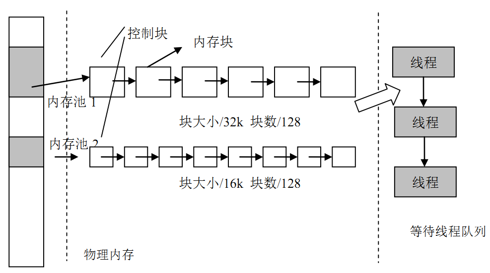
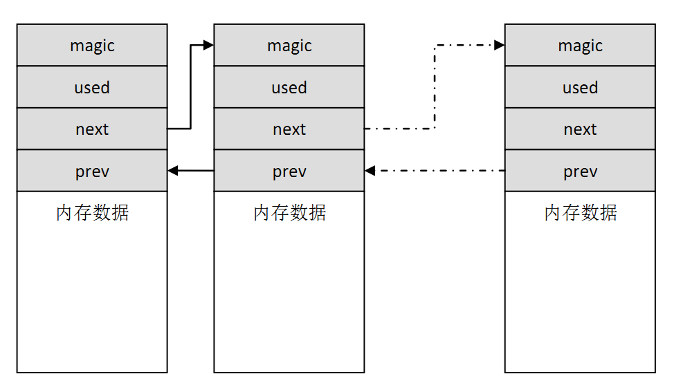
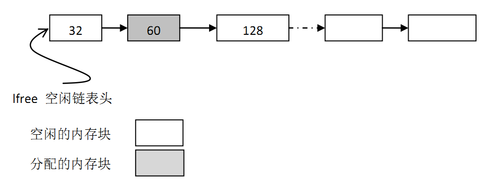
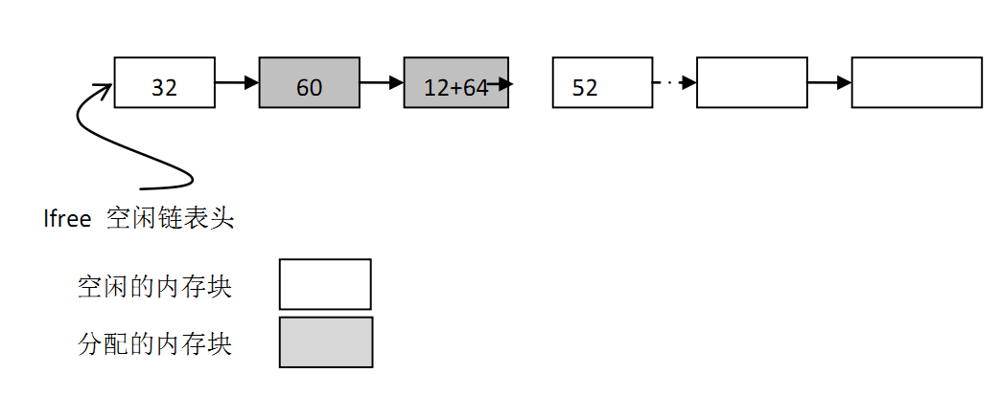
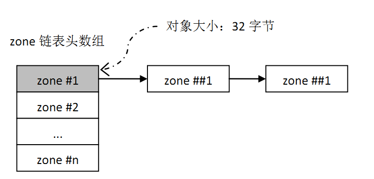

# 内存管理 #

在计算系统中，变量、中间数据一般存放在系统存储空间中，只有在实际使用时才将它们从存储空间调入到中央处理器内部进行运算。通常存储空间可以分为两种：内部存储空间和外部存储空间。内部存储空间访问速度比较快，能够按照变量地址随机地访问，也就是我们通常所说的RAM（随机存储器），或电脑的内存；而外部存储空间内所保存的内容相对来说比较固定，即使掉电后数据也不会丢失，这就是通常所讲的ROM（只读存储器），也可以把它理解为电脑的硬盘。在这一章中我们主要讨论内部存储空间的管理。

由于实时系统中对时间要求的严格性，内存分配往往要比通用操作系统要求苛刻得多。

* 首先，分配内存的时间必须是确定的。一般内存管理算法是根据需要存储的数据的长度在内存中去寻找一个与这段数据相适应的空闲内存块，然后将数据存储在里面。而寻找这样一个空闲内存块所耗费的时间是不确定的，因此对于实时系统来说，这就是不可接受的，实时系统必须要保证内存块的分配过程在可预测的确定时间内完成，否则实时任务对外部事件的响应也将变得不可确定。
* 其次，随着内存不断被分配和释放，整个内存区域会产生越来越多的碎片（因为在使用过程中，申请了一些内存，其中一些释放了，导致内存空间中存在一些小的内存块，它们地址不连续，不能够作为一整块的大内存分配出去），系统中还有足够的空闲内存，但因为它们地址并非连续，不能组成一块连续的完整内存块，会使得程序不能申请到大的内存。对于通用系统而言，这种不恰当的内存分配算法可以通过重新启动系统来解决(每个月或者数个月进行一次)，但是对于那些需要常年不间断地工作于野外的嵌入式系统来说，就变得让人无法接受了。
* 最后，嵌入式系统的资源环境也是不尽相同，有些系统的资源比较紧张，只有数十KB的内存可供分配，而有些系统则存在数MB的内存，如何为这些不同的系统，选择适合它们的高效率的内存分配算法，就将变得复杂化。

RT-Thread操作系统在内存管理上，根据上层应用及系统资源的不同，有针对性的提供了不同的内存分配管理算法。总体上可分为两类：静态分区内存管理与动态内存管理，而动态内存管理又根据可用内存的多少划分为两种情况：一种是针对小内存块的分配管理（小内存管理算法），另一种是针对大内存块的分配管理（SLAB管理算法）。

## 静态内存池管理 ##

### 静态内存池工作原理 ###

 ***内存池管理结构示意图*** 是内存池管理结构示意图。内存池（Memory Pool）是一种用于分配大量大小相同的小对象的技术。它可以极大加快内存分配/释放的速度。

内存池在创建时先向系统申请一大块内存，然后分成同样大小的多个小内存块，小内存块直接通过链表连接起来（此链表也称为空闲链表）。每次分配的时候，从空闲链表中取出链头上第一个内存块，提供给申请者。从图中可以看到，物理内存中允许存在多个大小不同的内存池，每一个内存池又由多个空闲内存块组成，内核用它们来进行内存管理。当一个内存池对象被创建时，内存池对象就被分配给了一个内存池控制块，内存控制块的参数包括内存池名，内存缓冲区，内存块大小，块数以及一个等待线程队列。

内核负责给内存池分配内存池对象控制块，它同时也接收用户线程的分配内存块申请，当获得这些信息后，内核就可以从内存池中为内存池分配内存。内存池一旦初始化完成，内部的内存块大小将不能再做调整。

#### 静态内存池控制块 ####

~~~{.c}
struct rt_mempool
{
	struct rt_object parent;

	void		*start_address;/* 内存池数据区域开始地址	*/
	rt_size_t 	size;		/* 内存池数据区域大小	*/

	rt_size_t 	block_size;	/* 内存块大小		*/
	rt_uint8_t	*block_list;	/* 内存块列表		*/

	/* 内存池数据区域中能够容纳的最大内存块数 	*/
	rt_size_t 	block_total_count;
	/* 内存池中空闲的内存块数 		*/
	rt_size_t 	block_free_count;
	/* 因为内存块不可用而挂起的线程列表	*/
	rt_list_t 	suspend_thread;
	/* 因为内存块不可用而挂起的线程数		*/
	rt_size_t 	suspend_thread_count;
};
typedef struct rt_mempool* rt_mp_t;
~~~

每一个内存池对象由上述结构组成，其中suspend_thread形成了一个申请线程等待列表，即当内存池中无可用内存块，并且申请线程允许等待时，申请线程将挂起在suspend_thread链表上。

### 静态内存池接口 ###

#### 创建内存池 ####

创建内存池操作将会创建一个内存池对象并从堆上分配一个内存池。创建内存池是从对应内存池中分配和释放内存块的先决条件，创建内存池后，线程便可以从内存池中执行申请、释放等操作。创建内存池使用下面的函数接口，该函数返回一个已创建的内存池对象。

    rt_mp_t rt_mp_create(const char* name, rt_size_t block_count, rt_size_t block_size);

使用该函数接口可以创建一个与需求的内存块大小、数目相匹配的内存池，前提当然是在系统资源允许的情况下（最主要的是动态堆内存资源）才能创建成功。创建内存池时，需要给内存池指定一个名称。然后内核从系统中申请一个内存池对象，然后从内存堆中分配一块由块数目和块大小计算得来的内存缓冲区，接着初始化内存池对象，并将申请成功的内存缓冲区组织成可用于分配的空闲块链表。

**函数参数**

---------------------------------------------------------------------------
              参数  描述
------------------  -------------------------------------------------------
              name  内存池名；

       block_count  内存块数量；

        block_size  内存块容量。
---------------------------------------------------------------------------

**函数返回**

创建内存池对象成功，将返回内存池的句柄；否则返回RT_NULL。

#### 删除内存池 ####

删除内存池将删除内存池对象并释放申请的内存。使用下面的函数接口：

    rt_err_t rt_mp_delete(rt_mp_t mp);

删除内存池时，会首先唤醒等待在该内存池对象上的所有线程（返回-RT_ERROR），然后再释放已从内存堆上分配的内存池数据存放区域，然后删除内存池对象。

**函数参数**

-----------------------------------------------------------------------
          参数  描述
--------------  -------------------------------------------------------
            mp  rt_mp_create返回的内存池对象句柄。
-----------------------------------------------------------------------

**函数返回**

返回RT_EOK

#### 初始化内存池 ####

初始化内存池跟创建内存池类似，只是初始化内存池用于静态内存管理模式，内存池控制块来源于用户在系统中申请的静态对象。另外与创建内存池不同的是，此处内存池对象所使用的内存空间是由用户指定的一个缓冲区空间，用户把缓冲区的指针传递给内存池对象控制块，其余的初始化工作与创建内存池相同。函数接口如下：

    rt_err_t rt_mp_init(rt_mp_t mp, const char* name, void *start, rt_size_t size, rt_size_t block size);

初始化内存池时，把需要进行初始化的内存池对象传递给内核，同时需要传递的还有内存池用到的内存空间，以及内存池管理的内存块数目和块大小，并且给内存池指定一个名称。这样，内核就可以对该内存池进行初始化，将内存池用到的内存空间组织成可用于分配的空闲块链表。

**函数参数**

-----------------------------------------------------------------------
          参数  描述
--------------  -------------------------------------------------------
            mp  内存池对象；

          name  内存池名；

         start  内存池的起始位置；

          size  内存池数据区域大小；

    block_size  内存块容量。
-----------------------------------------------------------------------

**函数返回**

初始化成功返回RT_OK；否则返回-RT_ERROR。

#### 脱离内存池 ####

脱离内存池将把内存池对象从内核对象管理器中删除。脱离内存池使用下面的函数接口：

    rt_err_t rt_mp_detach(rt_mp_t mp);

使用该函数接口后，内核先唤醒所有等待在该内存池对象上的线程，然后将内存池对象从内核对象管理器中删除。

**函数参数**

-----------------------------------------------------------------------
          参数  描述
--------------  -------------------------------------------------------
            mp  内存池对象。
-----------------------------------------------------------------------

**函数返回**

返回RT_EOK。

#### 分配内存块 ####

从指定的内存池中分配一个内存块，使用如下接口：

    void *rt_mp_alloc (rt_mp_t mp, rt_int32_t time);

如果内存池中有可用的内存块，则从内存池的空闲块链表上取下一个内存块，减少空闲块数目并返回这个内存块；如果内存池中已经没有空闲内存块，则判断超时时间设置：若超时时间设置为零，则立刻返回空内存块；若等待时间大于零，则把当前线程挂起在该内存池对象上，直到内存池中有可用的自由内存块，或等待时间到达。

**函数参数**

-----------------------------------------------------------------------
          参数  描述
--------------  -------------------------------------------------------
            mp  内存池对象；

          time  超时时间。
-----------------------------------------------------------------------

**函数返回**

成功时返回分配的内存块地址，失败时返回RT_NULL。

#### 释放内存块 ####

任何内存块使用完后都必须被释放，否则会造成内存泄露，释放内存块使用如下接口：

    void rt_mp_free (void *block);

使用该函数接口时，首先通过需要被释放的内存块指针计算出该内存块所在的（或所属于的）内存池对象，然后增加内存池对象的可用内存块数目，并把该被释放的内存块加入空闲内存块链表上。接着判断该内存池对象上是否有挂起的线程，如果有，则唤醒挂起线程链表上的首线程。

**函数参数**

-----------------------------------------------------------------------
          参数  描述
--------------  -------------------------------------------------------
         block  内存块指针。
-----------------------------------------------------------------------

**函数返回**

无

内存池使用的例程如下所示：

~~~{.c}
/*
* 程序清单：内存池例程
*
* 这个程序会创建一个静态的内存池对象，2 个动态线程。
* 两个线程会试图分别从内存池中获得内存块
*/
#include <rtthread.h>
#include "tc_comm.h"
static rt_uint8_t *ptr[48];
static rt_uint8_t mempool[4096];
static struct rt_mempool mp; /* 静态内存池对象 */
/* 指向线程控制块的指针 */
static rt_thread_t tid1 = RT_NULL;
static rt_thread_t tid2 = RT_NULL;
/* 线程 1 入口 */
static void thread1_entry(void* parameter)
{
    int i;
    char *block;
    while(1)
    {
        for (i = 0; i < 48; i++)
        {
            /* 申请内存块 */
            rt_kprintf("allocate No.%d\n", i);
            if (ptr[i] == RT_NULL)
            {
                ptr[i] = rt_mp_alloc(&mp, RT_WAITING_FOREVER);
            }
        }

        /* 继续申请一个内存块，因为已经没有内存块，线程应该被挂起 */
        block = rt_mp_alloc(&mp, RT_WAITING_FOREVER);
        rt_kprintf("allocate the block mem\n");
        /* 释放这个内存块 */
        rt_mp_free(block);
        block = RT_NULL;
    }
}

/* 线程 2 入口，线程 2 的优先级比线程 1 低，应该线程 1 先获得执行。*/
static void thread2_entry(void *parameter)
{
    int i;
    while(1)
    {
        rt_kprintf("try to release block\n");
        for (i = 0 ; i < 48; i ++)
        {
            /* 释放所有分配成功的内存块 */
            if (ptr[i] != RT_NULL)
	    {
            rt_kprintf("release block %d\n", i);
            rt_mp_free(ptr[i]);
            ptr[i] = RT_NULL;
            }
        }
        
        /* 休眠 10 个 OS Tick */
        rt_thread_delay(10);
    }
}

int mempool_simple_init()
{
    int i;
    for (i = 0; i < 48; i ++) ptr[i] = RT_NULL;
    /* 初始化内存池对象 */
    rt_mp_init(&mp, "mp1", &mempool[0], sizeof(mempool), 80);
    
    /* 创建线程 1 */
    tid1 = rt_thread_create("t1",
                            thread1_entry, /* 线程入口是 thread1_entry */
                            RT_NULL, /* 入口参数是 RT_NULL */
                            THREAD_STACK_SIZE, THREAD_PRIORITY, 
                            THREAD_TIMESLICE);
    if (tid1 != RT_NULL)
        rt_thread_startup(tid1);
    else
        tc_stat(TC_STAT_END | TC_STAT_FAILED);
    
    /* 创建线程 2 */
    tid2 = rt_thread_create("t2",
                            thread2_entry, /* 线程入口是 thread2_entry */
                            RT_NULL, /* 入口参数是 RT_NULL */
                            THREAD_STACK_SIZE, THREAD_PRIORITY + 1, 
                            THREAD_TIMESLICE);
    if (tid2 != RT_NULL)
        rt_thread_startup(tid2);
    else
        tc_stat(TC_STAT_END | TC_STAT_FAILED);
    return 0;
}
#ifdef RT_USING_TC
static void _tc_cleanup()
{
    /* 调度器上锁，上锁后，将不再切换到其他线程，仅响应中断 */
    rt_enter_critical();
    /* 删除线程 */
    if (tid1 != RT_NULL && tid1->stat != RT_THREAD_CLOSE)
        rt_thread_delete(tid1);
    if (tid2 != RT_NULL && tid2->stat != RT_THREAD_CLOSE)
        rt_thread_delete(tid2);
    /* 执行内存池脱离 */
    rt_mp_detach(&mp);
    /* 调度器解锁 */
    rt_exit_critical();
    /* 设置 TestCase 状态 */
    tc_done(TC_STAT_PASSED);
}
int _tc_mempool_simple()
{
    /* 设置 TestCase 清理回调函数 */
    tc_cleanup(_tc_cleanup);
    mempool_simple_init();
    /* 返回 TestCase 运行的最长时间 */
    return 100;
}
/* 输出函数命令到 finsh shell 中 */
FINSH_FUNCTION_EXPORT(_tc_mempool_simple, a memory pool 
example);
#else
/* 用户应用入口 */
int rt_application_init()
{
    mempool_simple_init();
    return 0;
}
#endif
~~~

## 动态内存管理 ##

动态内存管理是一个真实的堆（Heap）内存管理模块，可以在当前资源满足的情况下，根据用户的需求分配任意大小的内存块。而当用户不需要再使用这些内存块时，又可以释放回堆中供其他应用分配使用。RT-Thread系统为了满足不同的需求，提供了两套不同的动态内存管理算法，分别是小堆内存管理算法和SLAB内存管理算法。

小堆内存管理模块主要针对系统资源比较少，一般用于小于2M内存空间的系统；而SLAB内存管理模块则主要是在系统资源比较丰富时，提供了一种近似多内存池管理算法的快速算法。两种内存管理模块在系统运行时只能选择其中之一或者完全不使用动态堆内存管理器。这两种管理模块提供的API接口完全相同。

* 警告：因为动态内存管理器要满足多线程情况下的安全分配，会考虑多线程间的互斥问题，所以请不要在中断服务例程中分配或释放动态内存块。因为它可能会引起当前上下文被挂起等待。

### 小内存管理模块 ###

小内存管理算法是一个简单的内存分配算法。初始时，它是一块大的内存。当需要分配内存块时，将从这个大的内存块上分割出相匹配的内存块，然后把分割出来的空闲内存块还回给堆管理系统中。每个内存块都包含一个管理用的数据头，通过这个头把使用块与空闲块用双向链表的方式链接起来，如 ***内存块链表*** 图所示：

每个内存块（不管是已分配的内存块还是空闲的内存块）都包含一个数据头，其中包括：

magic – 变数（或称为幻数），它会被初始化成0x1ea0（即英文单词heap），用于标记这个内存块是一个内存管理用的内存数据块；

used 	- 指示出当前内存块是否已经分配。

magic变数不仅仅用于标识这个数据块是一个内存管理用的内存数据块，实质也是一个内存保护字：如果这个区域被改写，那么也就意味着这块内存块被非法改写（正常情况下只有内存管理器才会去碰这块内存）。

内存管理的在表现主要体现在内存的分配与释放上，小型内存管理算法可以用以下例子体现出来。

如 ***小内存管理算法链表结构示意图*** 所示的内存分配情况，空闲链表指针lfree初始指向32字节的内存块。当用户线程要再分配一个64字节的内存块时，但此lfree指针指向的内存块只有32字节并不能满足要求，内存管理器会继续寻找下一内存块，当找到再下一块内存块，128字节时，它满足分配的要求。因为这个内存块比较大，分配器将把此内存块进行拆分，余下的内存块（52字节）继续留在lfree链表中，如下 ***分配64 字节后的链表结构*** 所示。

另外，在每次分配内存块前，都会留出12字节数据头用于magic，used信息及链表节点使用。返回给应用的地址实际上是这块内存块12字节以后的地址，前面的12字节数据头是用户永远不应该碰的部分。（注：12字节数据头长度会与系统对齐差异而有所不同）

释放时则是相反的过程，但分配器会查看前后相邻的内存块是否空闲，如果空闲则合并成一个大的空闲内存块。

### SLAB内存管理模块 ###

RT-Thread的SLAB分配器是在DragonFly BSD创始人Matthew Dillon实现的SLAB分配器基础上，针对嵌入式系统优化的内存分配算法。最原始的SLAB算法是Jeff Bonwick为Solaris 操作系统而引入的一种高效内核内存分配算法。

RT-Thread的SLAB分配器实现主要是去掉了其中的对象构造及析构过程，只保留了纯粹的缓冲型的内存池算法。SLAB分配器会根据对象的类型（主要是大小）分成多个区（zone），也可以看成每类对象有一个内存池，如 ***SLAB 内存分配器结构*** 所示：

一个zone的大小在32k ～ 128k字节之间，分配器会在堆初始化时根据堆的大小自动调整。系统中最多包括72种对象的zone，最大能够分配16k的内存空间，如果超出了16k那么直接从页分配器中分配。每个zone上分配的内存块大小是固定的，能够分配相同大小内存块的zone会链接在一个链表中，而72种对象的zone链表则放在一个数组（zone arry）中统一管理。

下面是动态内存分配器主要的两种操作：

* 内存分配： 假设分配一个32字节的内存，SLAB内存分配器会先按照32字节的值，从zone array链表表头数组中找到相应的zone链表。如果这个链表是空的，则向页分配器分配一个新的zone，然后从zone中返回第一个空闲内存块。如果链表非空，则这个zone链表中的第一个zone节点必然有空闲块存在（否则它就不应该放在这个链表中），那么就取相应的空闲块。如果分配完成后，zone中所有空闲内存块都使用完毕，那么分配器需要把这个zone节点从链表中删除。
* 内存释放：分配器需要找到内存块所在的zone节点，然后把内存块链接到zone的空闲内存块链表中。如果此时zone的空闲链表指示出zone的所有内存块都已经释放，即zone是完全空闲的，那么当zone链表中全空闲zone达到一定数目后，系统就会把这个全空闲的zone释放到页面分配器中去。

### 动态内存接口 ###

#### 初始化系统堆空间 ####

在使用堆内存时，必须要在系统初始化的时候进行堆内存的初始化，可以通过下面的函数接口完成：

    void rt_system_heap_init(void* begin_addr, void* end_addr);

这个函数会把参数begin_addr，end_addr区域的内存空间作为内存堆来使用。

**函数参数**

-----------------------------------------------------------------------
          参数  描述
--------------  -------------------------------------------------------
    begin_addr  堆内存区域起始地址；

      end_addr  堆内存区域结束地址。
-----------------------------------------------------------------------

**函数返回**

无

#### 分配内存块 ####

从内存堆上分配用户指定大小的内存块，函数接口如下：

    void* rt_malloc(rt_size_t nbytes);

rt_malloc函数会从系统堆空间中找到合适大小的内存块，然后把内存块可用地址返回给用户。

**函数参数**

-----------------------------------------------------------------------
          参数  描述
--------------  -------------------------------------------------------
        nbytes  申请的内存大小。
-----------------------------------------------------------------------

**函数返回**

成功时返回分配的内存块地址，失败时返回RT_NULL。

#### 重分配内存块 ####

在已分配内存块的基础上重新分配内存块的大小（增加或缩小），可以通过下面的函数接口完成：

    void *rt_realloc(void *rmem, rt_size_t newsize);

在进行重新分配内存块时，原来的内存块数据保持不变（缩小的情况下，后面的数据被自动截断）。

**函数参数**

-----------------------------------------------------------------------
          参数  描述
--------------  -------------------------------------------------------
          rmem  指向已分配的内存块；

       newsize  重新分配的内存大小。
-----------------------------------------------------------------------

**函数返回**

返回重新分配的内存块地址；

#### 分配多内存块 ####

从内存堆中分配连续内存地址的多个内存块，可以通过下面的函数接口完成：

    void *rt_calloc(rt_size_t count, rt_size_t size);

**函数参数**

-----------------------------------------------------------------------
          参数  描述
--------------  -------------------------------------------------------
         count  内存块数量；

          size  内存块容量。
-----------------------------------------------------------------------

**函数返回**

返回的指针指向第一个内存块的地址，并且所有分配的内存块都被初始化成零。

#### 释放内存块 ####

用户线程使用完从内存分配器中申请的内存后，必须及时释放，否则会造成内存泄漏，释放内存块的函数接口如下：

    void rt_free (void *ptr);

rt_free函数会把待释放的内存还回给堆管理器中。在调用这个函数时用户需传递待释放的内存块指针，如果是空指针直接返回。

**函数参数**

-----------------------------------------------------------------------
          参数  描述
--------------  -------------------------------------------------------
           ptr  待释放的内存块指针。
-----------------------------------------------------------------------

**函数返回**

无

#### 设置分配钩子函数 ####

在分配内存块过程中，用户可设置一个钩子函数，调用的函数接口如下：

    void rt_malloc_sethook(void (*hook)(void *ptr, rt_size_t size));

设置的钩子函数会在内存分配完成后进行回调。回调时，会把分配到的内存块地址和大小做为入口参数传递进去。

**函数参数**

-----------------------------------------------------------------------
          参数  描述
--------------  -------------------------------------------------------
          hook  钩子函数指针。
-----------------------------------------------------------------------

**函数返回**

无

其中hook函数接口如下：

    void hook(void *ptr, rt_size_t size)；

**函数参数**

-----------------------------------------------------------------------
          参数  描述
--------------  -------------------------------------------------------
           ptr  分配到的内存块指针；

          size  分配到的内存块的大小。
-----------------------------------------------------------------------

**函数返回**

无

#### 设置内存释放钩子函数 ####

在释放内存时，用户可设置一个钩子函数，调用的函数接口如下：

    void rt_free_sethook(void (*hook)(void *ptr));

设置的钩子函数会在调用内存释放完成前进行回调。回调时，释放的内存块地址会做为入口参数传递进去（此时内存块并没有被释放）。

**函数参数**

-----------------------------------------------------------------------
          参数  描述
--------------  -------------------------------------------------------
          hook  钩子函数指针。        
-----------------------------------------------------------------------

**函数返回**

无

其中hook函数接口如下：

    void hook(void *ptr)；

**函数参数**

-----------------------------------------------------------------------
          参数  描述
--------------  -------------------------------------------------------
           ptr  待释放的内存块指针。
-----------------------------------------------------------------------

**函数返回**

无

动态内存堆使用 的例程如下所示：

~~~{.c}
/* 线程TCB和栈*/
struct rt_thread_t thread1;
char thread1_stack[512];

/* 线程入口*/
void thread1_entry(void* parameter)
{
	int i;
	char *ptr[20]; /* 用于放置20个分配内存块的指针*/

	/* 对指针清零*/
	for (i = 0; i < 20; i ++) ptr[i] = RT_NULL;

	while(1)
	{
		for (i = 0; i < 20; i++)
		{
			/* 每次分配(1 << i)大小字节数的内存空间*/
			ptr[i] = rt_malloc(1 << i);

			/* 如果分配成功*/
			if (ptr[i] != RT_NULL)
			{
				rt_kprintf("get memory: 0x%x\n", ptr[i]);
				/* 释放内存块*/
				rt_free(ptr[i]);
				ptr[i] = RT_NULL;
			}
		}
	}
}

int rt_application_init()
{
	rt_err_t result;

	/* 初始化线程对象*/
	result = rt_thread_init(&thread1,
		"thread1",
		thread1_entry, RT_NULL,
		&thread1_stack[0], sizeof(thread1_stack),
		200, 100);

	if (result == RT_EOK)
		rt_thread_startup(&thread1);

	return 0;
}
~~~

## 更改情况 ##

* RT-Thread 1.2.0中引入RT_USING_MEMHEAP_AS_HEAP选项，可以把多个memheap（地址可不连续）粘合起来用于系统的heap分配；
* RT-Thread 1.2.0中引入rt_memheap_realloc函数，用于在memheap中进行memory重新分配；

