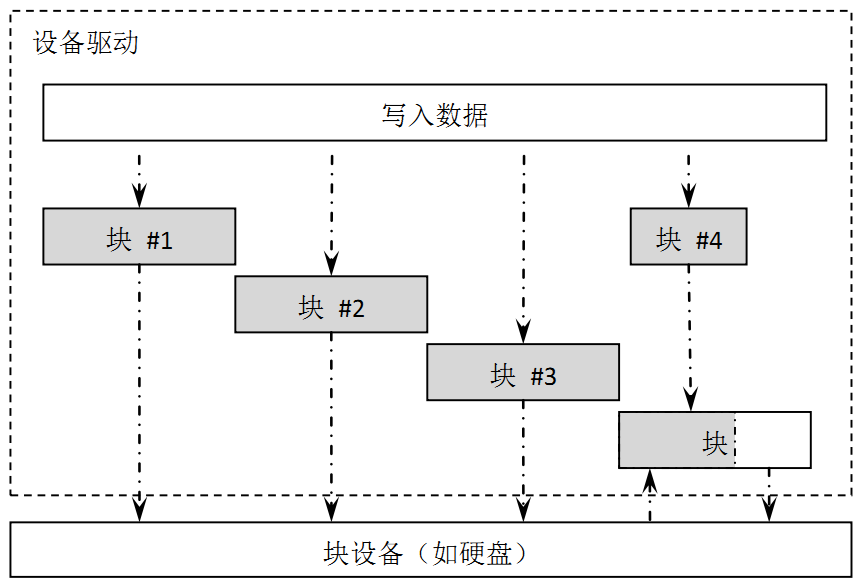

# I/O设备管理 #

绝大部分的嵌入式系统都包括一些输入输出(I/O)设备，例如仪器上的数据显示，工业设备上的串口通信，数据采集设备上用于保存数据的flash或SD卡，以及网络设备的以太网接口都是嵌入式系统中容易找到的I/O设备例子。嵌入式系统通常都是针对具有专有特殊需求的设备而设计的，例如移动电话、MP3播放器就是典型地为处理I/O设备而建造的嵌入式系统例子。

在RT-Thread实时操作系统中，RT-Thread提供了一套简单的I/O设备管理框架，如图 ***RT-Thread I/O 设备结构*** 所示，它把I/O设备分成了三层进行处理：

应用程序通过RT-Thread的设备操作接口获得正确的设备驱动，然后通过这个设备驱动与底层I/O硬件设备进行数据（或控制）交互。RT-Thread提供给上层应用的是一个抽象的设备接口，给下层设备提供的是底层驱动框架。从系统整体位置来说I/O设备模块相当于设备驱动程序和上层应用之间的一个中间层。

I/O设备模块实现了对设备驱动程序的封装。应用程序通过I/O设备模块提供的标准接口访问底层设备，设备驱动程序的升级、更替不会对上层应用产生影响。这种方式使得设备的硬件操作相关的代码能够独立于应用程序而存在，双方只需关注各自的功能实现，从而降低了代码的耦合性、复杂性，提高了系统的可靠性。

RT-Thread的设备模型是建立在内核对象模型基础之上的。在第4章中我们已经介绍过RT-Thread的内核对象管理器，读者若对这部分还不太了解，可以再回顾下这一章节。在RT-Thread中，设备也被认为是一类对象，被纳入对象管理器的范畴。每个设备对象都是由基对象派生而来，每个具体设备都可以继承其父类对象的属性，并派生出其私有属性。 ***设备继承关系图*** 是设备对象的继承和派生关系示意图。

## 块设备 ##

在传统操作系统中一般将I/O设备分成字符设备、块设备和网络接口，分类的依据是设备数据与系统之间的传输处理方式。

字符模式设备允许非结构的数据传输，即通常数据传输采用串行的形式，每次一个字节。字符设备通常是一些简单设备，如串口、按键。

块设备每次传输一个数据块，例如每次传输512个字节数据。这个数据块是硬件强制性的，数据块可能使用某类数据接口或某些强制性的传输协议，否则就可能发生错误。因此，有时块设备驱动程序对读或写操作必须执行附加的工作，如图 ***块设备*** 所示。

当系统服务于一个具有大量数据的写操作时，设备驱动程序必须首先将数据划分为多个包，每个包采用设备指定的数据尺寸。而在实际过程中，最后一部分数据尺寸有可能小于正常的设备块尺寸。如图 ***块设备*** 中每个块使用单独的写请求写入到设备中，头3个直接进行写操作。但最后一个数据块尺寸小于设备块尺寸，设备驱动程序必须使用不同于前3个块的方式处理最后的数据块。通常情况下，设备驱动程序需要首先执行相对应的设备块的读操作，然后把写入数据覆盖到读出数据上，然后再把这个“合成”的数据块做为一整个块写回到设备中。例如图 ***块设备*** 中的块4，驱动程序需要先把块4所对应的设备块读出来，然后将需要写入的数据覆盖至从设备块读出的数据上，使其合并成一个新的块，最后再写回到块设备中。

## I/O设备控制块 ##

~~~{.c}
struct rt_device
{
    struct rt_object parent;

    /* 设备类型 */
    enum rt_device_class_type type;
    /* 设备参数及打开参数 */
    rt_uint16_t flag, open_flag;

    /* 提供给上层应用的回调函数 */
    rt_err_t (*rx_indicate)(rt_device_t dev, rt_size_t size);
    rt_err_t (*tx_complete)(rt_device_t dev, void* buffer);

    /* 公共的设备接口(由驱动程序提供) */
    rt_err_t  (*init) (rt_device_t dev);
    rt_err_t  (*open) (rt_device_t dev, rt_uint16_t oflag);
    rt_err_t  (*close)(rt_device_t dev);
    rt_size_t (*read) (rt_device_t dev, rt_off_t pos, void* buffer, rt_size_t size);
    rt_size_t (*write)(rt_device_t dev, rt_off_t pos, const void* buffer, rt_size_t size);
    rt_err_t  (*control)(rt_device_t dev, rt_uint8_t cmd, void *args);

    /* 设备的私有数据 */
    void* user_data;
};
typedef struct rt_device* rt_device_t;
~~~

当前RT-Thread支持的设备类型包括：

~~~{.c}
enum rt_device_class_type
{
    RT_Device_Class_Char = 0,         /* 字符设备       */
    RT_Device_Class_Block,            /* 块设备         */
    RT_Device_Class_NetIf,            /* 网络接口设备   */
    RT_Device_Class_MTD,              /* 内存设备       */
    RT_Device_Class_CAN,              /* CAN设备        */
    RT_Device_Class_RTC,              /* RTC设备        */
    RT_Device_Class_Sound,            /* 声音设备       */
    RT_Device_Class_Graphic,          /* 图形设备       */
    RT_Device_Class_I2CBUS,           /* I2C总线        */
    RT_Device_Class_USBDevice,        /* USB device设备 */
    RT_Device_Class_USBHost,          /* USB host设备   */
    RT_Device_Class_SPIBUS,           /* SPI总线        */
    RT_Device_Class_SPIDevice,        /* SPI设备        */
    RT_Device_Class_SDIO,             /* SDIO设备       */
    RT_Device_Class_PM,               /* 电源管理设备   */
    RT_Device_Class_Pipe,             /* 管道设备       */
    RT_Device_Class_Portal,           /* 双向管道设备   */
    RT_Device_Class_Timer,
    RT_Device_Class_Miscellaneous,    /* 杂类设备       */
    RT_Device_Class_Unknown           /* 未知设备       */
};
~~~

从设备控制块，我们可以看到，每个设备对象都会在内核中维护一个设备控制块结构，这种结构使设备对象继承rt_object基类，然后形成rt_device设备类型。

## I/O设备管理接口 ##

### 注册设备 ###

一个设备能够被上层应用访问前，需要先把这个设备注册到系统中，并添加一些相应的一些属性。这些注册的设备均可以通过设备名，采用“查找设备接口”的方式从系统中查找到，从而获得该设备控制块（或设备句柄）。注册设备的函数接口如下：

    rt_err_t rt_device_register(rt_device_t dev, const char* name, rt_uint8_t flags);
	
**函数参数**

-----------------------------------------------------------------------
          参数  描述
--------------  -------------------------------------------------------
           dev  设备句柄；

          name  设备名称；

         flags  设备模式标志：
-----------------------------------------------------------------------

flags参数支持下列参数(可以采用或的方式支持多种参数)：

~~~{.c}
#define RT_DEVICE_FLAG_DEACTIVATE   0x000    /* 未初始化设备        */
#define RT_DEVICE_FLAG_RDONLY       0x001    /* 只读设备            */
#define RT_DEVICE_FLAG_WRONLY       0x002    /* 只写设备            */
#define RT_DEVICE_FLAG_RDWR         0x003    /* 读写设备            */
#define RT_DEVICE_FLAG_REMOVABLE    0x004    /* 可移除设备          */
#define RT_DEVICE_FLAG_STANDALONE   0x008    /* 独立设备            */
#define RT_DEVICE_FLAG_ACTIVATED    0x010    /* 已激活设备          */
#define RT_DEVICE_FLAG_SUSPENDED    0x020    /* 挂起设备            */
#define RT_DEVICE_FLAG_STREAM       0x040    /* 设备处于流模式      */
#define RT_DEVICE_FLAG_INT_RX       0x100    /* 设备处于中断接收模式*/
#define RT_DEVICE_FLAG_DMA_RX       0x200    /* 设备处于DMA接收模式 */
#define RT_DEVICE_FLAG_INT_TX       0x400    /* 设备处于中断发送模式*/
#define RT_DEVICE_FLAG_DMA_TX       0x800    /* 设备处于DMA发送模式 */
~~~

设备流模式RT_DEVICE_FLAG_STREAM参数用于向串口终端输出字符串：当输出的字符是"\\n"时，自动在前面补一个"\\r"做分行。

**函数返回**

返回RT_EOK

* 警告：应当避免重复注册已经注册的设备，以及注册相同名字的设备。

### 移除设备 ###

将设备从设备系统中移除，被卸载的设备将不能再通过“查找设备接口”被查找到。卸载设备的函数接口如下所示：

    rt_err_t rt_device_unregister(rt_device_t dev)

**函数参数**

-----------------------------------------------------------------------
          参数  描述
--------------  -------------------------------------------------------
           dev  设备句柄。
-----------------------------------------------------------------------

**函数返回**

返回RT_EOK

* 注：卸载设备并不会释放设备控制块所占用的内存。

### 初始化所有设备 ###

初始化所有注册到设备对象管理器中的未初始化的设备，可以通过如下函数接口完成：

    rt_err_t rt_device_init_all(void)

**函数参数**

无

**函数返回**

返回RT_EOK

* 注：此函数将逐渐废弃，不推荐在应用程序中调用。当一个设备初始化完成后它的flags域中的RT_DEVICE_FLAG_ACTIVATED应该被置位。如果设备的flags域已经是RT_DEVICE_FLAG_ACTIVATED，调用这个接口将不再重复做初始化。

### 查找设备 ###

根据指定的设备名称查找设备，可以通过如下接口完成：

    rt_device_t rt_device_find(const char* name)

使用这个函数接口时，系统会在设备对象类型所对应的对象容器中遍历寻找设备对象，然后返回该设备的句柄，如果没有找到相应的设备对象，则返回RT_NULL。

**函数参数**

-----------------------------------------------------------------------
          参数  描述
--------------  -------------------------------------------------------
          name  设备名称。
-----------------------------------------------------------------------

**函数返回**

查找到对应设备将返回相应的设备句柄；否则返回RT_NULL

### 初始化设备 ###

初始化指定设备，可以通过如下函数接口完成：

    rt_err_t rt_device_init(rt_device_t dev)

**函数参数**

-----------------------------------------------------------------------
          参数  描述
--------------  -------------------------------------------------------
           dev  设备句柄；
-----------------------------------------------------------------------

**函数返回**

返回驱动的init函数返回值

### 打开设备 ###

根据设备控制块来打开设备，可以通过如下函数接口完成：

    rt_err_t rt_device_open (rt_device_t dev, rt_uint16_t oflags)

**函数参数**

-----------------------------------------------------------------------
          参数  描述
--------------  -------------------------------------------------------
           dev  设备句柄；

        oflags  访问模式。
-----------------------------------------------------------------------

其中oflags支持以下列表中的参数：

~~~{.c}
#define RT_DEVICE_OFLAG_CLOSE   0x000   /* 设备已经关闭（内部使用）*/
#define RT_DEVICE_OFLAG_RDONLY  0x001   /* 以只读方式打开设备      */
#define RT_DEVICE_OFLAG_WRONLY  0x002   /* 以只写方式打开设备      */
#define RT_DEVICE_OFLAG_RDWR    0x003   /* 以读写方式打开设备      */
#define RT_DEVICE_OFLAG_OPEN    0x008   /* 设备已经打开（内部使用）*/

#define RT_DEVICE_FLAG_STREAM   0x040   /* 设备以流模式打开        */
#define RT_DEVICE_FLAG_INT_RX   0x100   /* 设备以中断接收模式打开  */
#define RT_DEVICE_FLAG_DMA_RX   0x200   /* 设备以DMA接收模式打开   */
#define RT_DEVICE_FLAG_INT_TX   0x400   /* 设备以中断发送模式打开  */
#define RT_DEVICE_FLAG_DMA_TX   0x800   /* 设备以DMA发送模式打开   */
~~~

**函数返回**

返回驱动的open函数返回值

* 注：如果设备注册时指定的参数中包括RT_DEVICE_FLAG_STANDALONE参数，此设备将不允许重复打开，返回`-RT_EBUSY`。

* 注：如果上层应用程序需要设置设备的接收回调函数，则必须以INT_RX或者DMA_RX的方式打开设备，否则不会回调函数。

### 关闭设备 ###

根据设备控制块来关闭设备，可以通过如下函数接口完成：

	rt_err_t rt_device_close(rt_device_t dev)

**函数参数**

-----------------------------------------------------------------------
          参数  描述
--------------  -------------------------------------------------------
           dev  设备句柄。
-----------------------------------------------------------------------

**函数返回**

返回驱动的close函数返回值

### 读设备 ###

从设备中读取，或获得数据，可以通过如下函数接口完成：

    rt_size_t rt_device_read (rt_device_t dev, rt_off_t pos, void* buffer, rt_size_t size)

调用这个函数，会从设备dev中获得数据，并存放在buffer缓冲区中。这个缓冲区的最大长度是size。pos根据不同的设备类别存在不同的意义。

**函数参数**

-----------------------------------------------------------------------
          参数  描述
--------------  -------------------------------------------------------
           dev  设备句柄；

           pos  读取数据偏移量；

        buffer  内存缓冲区指针，读取的数据将会被保存在缓冲区中；

          size  读取数据的大小。
-----------------------------------------------------------------------

**函数返回**

返回读到数据的实际大小（如果是字符设备，返回大小以字节为单位；如果是块设备，返回的大小以块为单位）；如果返回0，则需要读取当前线程的errno来判断错误状态。

### 写设备 ###

向设备中写入数据，可以通过如下函数接口完成：

    rt_size_t rt_device_write(rt_device_t dev, rt_off_t pos, const void* buffer, rt_size_t size)

调用这个函数，会把缓冲区buffer中的数据写入到设备dev中。写入数据的最大长度是size。pos根据不同的设备类别存在不同的意义。

**函数参数**

-----------------------------------------------------------------------
          参数  描述
--------------  -------------------------------------------------------
           dev  设备句柄；

           pos  写入数据偏移量；

        buffer  内存缓冲区指针，放置要写入的数据；

          size  写入数据的大小。
-----------------------------------------------------------------------

**函数返回**

返回写入数据的实际大小(如果是字符设备，返回大小以字节为单位；如果是块设备，返回的大小以块为单位)；如果返回0，则需要读取当前线程的errno来判断错误状态

* 注：在RT-Thread的块设备中，从1.0.0版本开始，`rt_device_read()/rt_device_write()`接口的pos、size参数以块为单位。0.3.x以前的版本则以字节为单位。

### 控制设备 ###

根据设备控制块来控制设备，可以通过下面的函数接口完成：

    rt_err_t rt_device_control(rt_device_t dev, rt_uint8_t cmd, void* arg)

**函数参数**

-----------------------------------------------------------------------
          参数  描述
--------------  -------------------------------------------------------
           dev  设备句柄；

           cmd  命令控制字，这个参数通常与设备驱动程序相关；

           arg  控制的参数。
-----------------------------------------------------------------------

**函数返回**

返回驱动控制接口的返回值

### 设置数据接收指示 ###

设置一个回调函数，当硬件设备收到数据时回调以通知用程序有数据到达。可以通过如下函数接口完成设置接收指示：

    rt_err_t rt_device_set_rx_indicate(rt_device_t dev, rt_err_t (*rx_ind )(rt_device_t dev,rt_size_t size))

在调用这个函数时，回调函数rx_ind由调用者提供。当硬件设备接收到数据时，会回调这个函数并把收到的数据长度放在size参数中传递给上层应用。上层应用线程应在收到指示后，立刻从设备中读取数据。

**函数参数**

-----------------------------------------------------------------------
          参数  描述
--------------  -------------------------------------------------------
           dev  设备句柄；

        rx_ind  接收回调函数。
-----------------------------------------------------------------------

**函数返回**

返回RT_EOK

### 设置发送完成指示 ###

在上层应用调用rt_device_write写入数据时，如果底层硬件能够支持自动发送，那么上层应用可以设置一个回调函数。这个回调函数会在底层硬件给出的发送完成后(例如DMA传送完成或FIFO已经写入完毕产生完成中断时)被调用。可以通过如下函数接口设置设备发送完成指示：

    rt_err_t rt_device_set_tx_complete(rt_device_t dev, rt_err_t (*tx_done)(rt_device_t dev,void *buffer))

调用这个函数时，回调函数tx_done参数由调用者提供，当硬件设备发送完数据时，由驱动程序回调这个函数并把发送完成的数据块地址buffer做为参数传递给上层应用。上层应用（线程）在收到指示时应根据发送buffer的情况，释放buffer内存块或将其做为下一个写数据的缓存。

**函数参数**

-----------------------------------------------------------------------
          参数  描述
--------------  -------------------------------------------------------
           dev  设备句柄；

       tx_done  发送回调函数。
-----------------------------------------------------------------------

**函数返回**

返回RT_EOK

## 设备驱动 ##

上一节说到了如何使用RT-Thread的设备接口，但对于底层来说，如何编写一个设备驱动程序可能会更为重要，这节将详细描述如何编写一个设备驱动程序，并以STM32上的一个串口设备为例子进行说明。

### 设备驱动必须实现的接口 ###

在6.1节中提及了RT-Thread设备接口类，我们着重看看其中包含的一套公共设备接口(类似上节说的设备访问接口，但面向的层次已经不一样，这里是面向底层驱动)：

~~~{.c}
/* 公共的设备接口(由驱动程序提供) */
rt_err_t  (*init) (rt_device_t dev);
rt_err_t  (*open) (rt_device_t dev, rt_uint16_t oflag);
rt_err_t  (*close)(rt_device_t dev);
rt_size_t (*read) (rt_device_t dev, rt_off_t pos, void* buffer, rt_size_t size);
rt_size_t (*write)(rt_device_t dev, rt_off_t pos, const void* buffer, rt_size_t size);
rt_err_t  (*control)(rt_device_t dev, rt_uint8_t cmd, void *args);
~~~

这些接口也是上层应用通过RT-Thread设备接口进行访问的实际底层接口（如 ***设备操作接口与设备驱动程序接口的映射*** ）：

即这些驱动实现的底层接口是上层应用最终访问的落脚点，例如上层应用调用rt_device_read接口进行设备读取数据操作，上层应先调用rt_device_find获得相对应的设备句柄，而在调用rt_device_read时，就是使用这个设备句柄所对应驱动的driver_read。上述的接口是一一对应关系。

I/O设备模块提供的这六个接口（rt_device_init/open/read/write/control），对应到设备驱动程序的六个接口（driver_init/open/read/write/control等），可以认为是底层设备驱动必须提供的接口：

+--------------+-------------------------------------------------------+
|   方法名称   |        方法描述                                       |
+==============+=======================================================+
|     init     |设备的初始化。设备初始化完成后，设备控制块的flag会被置 |
|              |成已激活状态(RT_DEVICE_FLAG_ACTIVATED)。如果设备控制块 |
|              |中的flag标志已经设置成激活状态，那么再运行初始化接口时 |
|              |，会立刻返回，而不会重新进行初始化。                   |
+--------------+-------------------------------------------------------+
|     open     |打开设备。有些设备并不是系统一启动就已经打开开始运行； |
|              |或者设备需要进行数据接收，但如果上层应用还未准备好，设 |
|              |备也不应默认已经使能并开始接收数据。所以建议在写底层驱 |
|              |动程序时，在调用open接口时才使能设备。                 |
+--------------+-------------------------------------------------------+
|    close     |关闭设备。建议在打开设备时，设备驱动自行维护一个打开计 |
|              |数，在打开设备时进行+1操作，在关闭设备时进行-1操作，   |
|              |当计数器变为0时，进行真正的关闭操作。                  |
+--------------+-------------------------------------------------------+
|     read     |从设备中读取数据。参数pos指出读取数据的偏移量，但是有些|
|              |设备并不一定需要指定偏移量，例如串口设备，设备驱动应忽 |
|              |略这个参数。而对于块设备来说，pos以及size都是以块设备的|
|              |数据块大小做为单位的。例如块设备的数据块大小是512，而参|
|              |数中pos = 10, size = 2，那么驱动应该返回设备中第10个块 |
|              |（从第0个块做为起始），共计2个块的数据。这个接口返回的 |
|              |类型是rt_size_t，即读到的字节数或块数目。正常情况下应  |
|              |该会返回参数中size的数值，如果返回零请设置对应的errno值|
+--------------+-------------------------------------------------------+
|    write     |向设备中写入数据。参数pos指出写入数据的偏移量。与读操作|
|              |类似，对于块设备来说，pos以及size都是以块设备的数据块  |
|              |大小做为单位的。这个接口返回的类型是rt_size_t，即真实写|
|              |入数据的字节数或块数目。正常情况下应该会返回参数中size |
|              |的数值，如果返回零请设置对应的errno值。                |
+--------------+-------------------------------------------------------+
|   control    |根据不同的cmd命令控制设备。命令往往是由底层各类设备驱  |
|              |动自定义实现。例如参数RT_DEVICE_CTRL_BLK_GETGEOME，意思|
|              |是获取块设备的大小信息。                               |
+--------------+-------------------------------------------------------+

### 设备驱动实现的步骤 ###

在实现一个RT-Thread设备时，可以按照如下的步骤进行（对于一些复杂的设备驱动，例如以太网接口驱动、图形设备驱动，请参看网络组件、GUI部分章节）：

* 按照RT-Thread的对象模型，扩展一个对象有两种方式：
    * 定义自己的私有数据结构，然后赋值到RT-Thread设备控制块的user_data指针上；
    * 从struct rt_device结构中进行派生。
* 实现RT-Thread I/O设备模块中定义的6个公共设备接口，开始可以是空函数(返回类型是rt_err_t的可默认返回RT_EOK)；
* 根据自己的设备类型定义自己的私有数据域。特别是在可能有多个相类似设备的情况下（例如串口1、2），设备接口可以共用同一套接口，不同的只是各自的数据域(例如寄存器基地址)；
* 根据设备的类型，注册到RT-Thread设备框架中。

### STM32F103的串口驱动 ###

以下例子详细分析了STM32F103的串口驱动，也包括上层应该如何使用这个设备的代码。STM32F103串口驱动代码，详细的中文注释已经放在其中了。

~~~{.c}
/*
 * 程序清单：串口设备驱动头文件
 */
#ifndef __RT_HW_SERIAL_H__
#define __RT_HW_SERIAL_H__

#include <rthw.h>
#include <rtthread.h>

/* STM32F10x library definitions */
#include <stm32f10x.h>

/* 定义接收ringbuffer缓冲区大小 */
#define UART_RX_BUFFER_SIZE		64

/* 中断接收时的ringbuffer缓冲区定义 */
struct stm32_serial_int_rx
{
	rt_uint8_t  rx_buffer[UART_RX_BUFFER_SIZE];
	rt_uint32_t read_index, save_index;
};

/* 串口设备类 */
struct stm32_serial_device
{
	USART_TypeDef* uart_device;

	/* 接收结构体 */
	struct stm32_serial_int_rx* int_rx;
	/* 打开计数 */
	rt_uint32_t ref_count;
};

/* 注册一个串口设备 */
rt_err_t rt_hw_serial_register(rt_device_t device, const char* name,
		rt_uint32_t flag, struct stm32_serial_device *serial);
void rt_hw_serial_isr(rt_device_t device);

#endif

/*
 * 程序清单：串口驱动实现文件
 */
#include "serial.h"

/* RT-Thread设备驱动公共接口 */
static rt_err_t rt_serial_init (rt_device_t dev)
{
	struct stm32_serial_device* uart;

	/* 获得真实的UART设备对象 */
	uart = (struct stm32_serial_device*) dev->user_data;

	/* 判断设备是否已经激活了 */
	if (!(dev->flag & RT_DEVICE_FLAG_ACTIVATED))
	{
		if (dev->flag & RT_DEVICE_FLAG_INT_RX)
		{
			/* 如果是中断接收模式，初始化接收的缓冲区 */
			rt_memset(uart->int_rx->rx_buffer, 0,
				sizeof(uart->int_rx->rx_buffer));
			uart->int_rx->read_index = 0;
			uart->int_rx->save_index = 0;
		}

		/* 使能USART */
		USART_Cmd(uart->uart_device, ENABLE);
		/* 设置设备为激活状态 */
		dev->flag |= RT_DEVICE_FLAG_ACTIVATED;
	}

	return RT_EOK;
}

/* 打开设备 */
static rt_err_t rt_serial_open(rt_device_t dev, rt_uint16_t oflag)
{
	if (dev->flag & RT_DEVICE_FLAG_INT_RX)
	{
		/* 中断接收模式，使能中断 */
	}
	return RT_EOK;
}

/* 关闭设备 */
static rt_err_t rt_serial_close(rt_device_t dev)
{
	if (dev->flag & RT_DEVICE_FLAG_INT_RX)
	{
		/* 中断接收模式，关闭中断 */
	}
	return RT_EOK;
}

/* 从设备中读取数据 */
static rt_size_t rt_serial_read (rt_device_t dev, rt_off_t pos,
		void* buffer, rt_size_t size)
{
	rt_base_t level;
	rt_uint8_t* ptr;
	rt_err_t err_code;
	struct stm32_serial_device* uart;
	struct stm32_serial_int_rx* int_rx;

	/* 初始化变量 */
	ptr = buffer;
	err_code = RT_EOK;
	uart = (struct stm32_serial_device*)dev->user_data;
	int_rx = uart->int_rx;

	if (dev->flag & RT_DEVICE_FLAG_INT_RX)
	{
		/*
		 * 中断模式接收，中断模式接收在中断服务例程中已预先收取到缓冲区中，
		 * 所以这里只需要从缓冲区中复制出数据
		 */
		while (size)
		{
			/* 涉及到与中断服务例程共享缓冲区操作，需要关闭中断 */
			level = rt_hw_interrupt_disable();

			/* 先判断缓冲区是否是空的 */
			if (int_rx->read_index != int_rx->save_index)
			{
				/* 缓冲区非空，读取一个字符 */
				*ptr++ = int_rx->rx_buffer[int_rx->read_index];
				size--;

				/* 移动读索引到下一个位置，如果到达末尾，进行复位到0 */
				int_rx->read_index ++;
				if (int_rx->read_index >= UART_RX_BUFFER_SIZE)
					int_rx->read_index = 0;
			}
			else
			{
				/* 缓冲区空，设置错误号 */
				err_code = -RT_EEMPTY;

				/* 使能中断 */
				rt_hw_interrupt_enable(level);
				break;
			}

			/* 使能中断 */
			rt_hw_interrupt_enable(level);
		}
	}
	else
	{
		/* 轮询模式，直接从串口设备中读取数据  */
		while ((rt_uint32_t)ptr - (rt_uint32_t)buffer < size)
		{
			while (uart->uart_device->SR & USART_FLAG_RXNE)
			{
				*ptr = uart->uart_device->DR & 0xff;
				ptr ++;
			}
		}
	}

	/* 设置错误号 */
	rt_set_errno(err_code);
	/* 返回独到的字节数 */
	return (rt_uint32_t)ptr - (rt_uint32_t)buffer;
}

/* 向设备中写入数据 */
static rt_size_t rt_serial_write (rt_device_t dev, rt_off_t pos,
		const void* buffer, rt_size_t size)
{
	rt_uint8_t* ptr;
	rt_err_t err_code;
	struct stm32_serial_device* uart;

	err_code = RT_EOK;
	ptr = (rt_uint8_t*)buffer;
	uart = (struct stm32_serial_device*)dev->private;

	if ((dev->flag & RT_DEVICE_FLAG_INT_TX) ||
		(dev->flag & RT_DEVICE_FLAG_DMA_TX))
	{
		/* 不支持中断发送和DMA发送 */
		RT_ASSERT(0);
	}
	else
	{
		/* 轮询模式 */
		if (dev->flag & RT_DEVICE_FLAG_STREAM)
		{
			/* 流模式 */
			while (size)
			{
				if (*ptr == '\n')
				{
					while (!(uart->uart_device->SR & USART_FLAG_TXE));
					uart->uart_device->DR = '\r';
				}

				/* 写入发送字符 */
				while (!(uart->uart_device->SR & USART_FLAG_TXE));
				uart->uart_device->DR = (*ptr & 0x1FF);

				++ptr; --size;
			}
		}
		else
		{
			/* 直接写入数据 */
			while (size)
			{
				/* 写入发送字符 */
				while (!(uart->uart_device->SR & USART_FLAG_TXE));
				uart->uart_device->DR = (*ptr & 0x1FF);

				++ptr; --size;
			}
		}
	}

	/* 设置错误号 */
	rt_set_errno(err_code);

	/* 返回写入成功的字节数 */
	return (rt_uint32_t)ptr - (rt_uint32_t)buffer;
}

/* 设备控制操作 */
static rt_err_t rt_serial_control (rt_device_t dev,
		rt_uint8_t cmd, void *args)
{
	struct stm32_serial_device* uart;

	RT_ASSERT(dev != RT_NULL);

	/* 获得真正的串口对象 */
	uart = (struct stm32_serial_device*)dev->user_data;
	switch (cmd)
	{
	case RT_DEVICE_CTRL_SUSPEND:
		/* 挂起设备 */
		dev->flag |= RT_DEVICE_FLAG_SUSPENDED;
		USART_Cmd(uart->uart_device, DISABLE);
		break;

	case RT_DEVICE_CTRL_RESUME:
		/* 唤醒设备 */
		dev->flag &= ~RT_DEVICE_FLAG_SUSPENDED;
		USART_Cmd(uart->uart_device, ENABLE);
		break;
	}

	return RT_EOK;
}

/*
 * 向系统中注册串口设备
 */
rt_err_t rt_hw_serial_register(rt_device_t device, const char* name,
		rt_uint32_t flag, struct stm32_serial_device *serial)
{
	RT_ASSERT(device != RT_NULL);

	/* 当前不支持DMA接收和中断发送 */
	if ((flag & RT_DEVICE_FLAG_DMA_RX) ||
		(flag & RT_DEVICE_FLAG_INT_TX))
	{
		RT_ASSERT(0);
	}

	/* 设置设备驱动类型 */
	device->type 		= RT_Device_Class_Char;
	device->rx_indicate = RT_NULL;
	device->tx_complete = RT_NULL;
	/* 设置设备驱动公共接口函数 */
	device->init 		= rt_serial_init;
	device->open		= rt_serial_open;
	device->close		= rt_serial_close;
	device->read 		= rt_serial_read;
	device->write 		= rt_serial_write;
	device->control 	= rt_serial_control;
	device->user_data	= serial;

	/* 注册一个字符设备 */
	return rt_device_register(device, name, RT_DEVICE_FLAG_RDWR | flag);
}

/* ISR for serial interrupt */
void rt_hw_serial_isr(rt_device_t device)
{
	rt_base_t level;
	struct stm32_serial_device* uart;
	struct stm32_serial_int_rx* int_rx;

	uart = (struct stm32_serial_device*) device->user_data;
	int_rx = uart->int_rx;

	if(USART_GetITStatus(uart->uart_device, USART_IT_RXNE) != RESET)
	{
		/* 中断模式接收 */
		RT_ASSERT(device->flag & RT_DEVICE_FLAG_INT_RX);

		/* 保存在接收缓冲区中 */
		while (uart->uart_device->SR & USART_FLAG_RXNE)
		{
			/* 先关闭中断(由于是与线程做同步，此处也可以不关闭中断) */
			level = rt_hw_interrupt_disable();

			/* 保存一个字符 */
			int_rx->rx_buffer[int_rx->save_index] =
					uart->uart_device->DR & 0xff;
			/* 移动保存索引到下一个位置，如果已经到缓冲区的末端，复位到0 */
			int_rx->save_index ++;
			if (int_rx->save_index >= UART_RX_BUFFER_SIZE)
				int_rx->save_index = 0;

			/* 如果下一个位置已经达到读索引位置，丢弃读索引位置的字符 */
			if (int_rx->save_index == int_rx->read_index)
			{
				int_rx->read_index ++;
				if (int_rx->read_index >= UART_RX_BUFFER_SIZE)
					int_rx->read_index = 0;
			}

			/* 使能中断 */
			rt_hw_interrupt_enable(level);
		}

		/* 清除中断 */
		USART_ClearITPendingBit(uart->uart_device, USART_IT_RXNE);

		/* 调用接收指示回调函数 */
		if (device->rx_indicate != RT_NULL)
		{
			rt_size_t rx_length;

			/* 获得已接收的长度 */
			rx_length = int_rx->read_index > int_rx->save_index ?
				UART_RX_BUFFER_SIZE - int_rx->read_index +
				int_rx->save_index :
				int_rx->save_index - int_rx->read_index;
			/* 执行回调函数 */
			device->rx_indicate(device, rx_length);
		}
	}

	if (USART_GetITStatus(uart->uart_device, USART_IT_TC) != RESET)
	{
		/* 清除中断 */
		USART_ClearITPendingBit(uart->uart_device, USART_IT_TC);
	}
}
~~~

对于包含中断发送、接收的情况的驱动程序，以下例子给出了具体的使用代码。在这个例子中，用户线程将从两个设备上(uart1, uart2)读取数据，然后再写到uart1设备中。

~~~{.c}
/*
 * 程序清单：串口设备操作例程
 *
 * 在这个例程中，将启动一个devt线程，然后打开串口1和2
 * 当串口1和2有输入时，将读取其中的输入数据然后写入到
 * 串口1设备中。
 *
 */
#include <rtthread.h>

/* UART接收消息结构*/
struct rx_msg
{
	rt_device_t dev;
	rt_size_t size;
};
/* 用于接收消息的消息队列*/
static rt_mq_t rx_mq;
/* 接收线程的接收缓冲区*/
static char uart_rx_buffer[64];

/* 数据到达回调函数*/
rt_err_t uart_input(rt_device_t dev, rt_size_t size)
{
	struct rx_msg msg;
	msg.dev = dev;
	msg.size = size;

	/* 发送消息到消息队列中*/
	rt_mq_send(rx_mq, &msg, sizeof(struct rx_msg));

	return RT_EOK;
}

void device_thread_entry(void* parameter)
{
	struct rx_msg msg;
	int count = 0;
	rt_device_t device, write_device;
	rt_err_t result = RT_EOK;

	/* 查找系统中的串口1设备 */
	device = rt_device_find("uart1");
	if (device!= RT_NULL)
	{
		/* 设置回调函数及打开设备*/
		rt_device_set_rx_indicate(device, uart_input);
		rt_device_open(device, RT_DEVICE_OFLAG_RDWR|RT_DEVICE_FLAG_INT_RX);
	}
	/* 设置写设备为uart1设备 */
	write_device = device;

	/* 查找系统中的串口2设备 */
	device= rt_device_find("uart2");
	if (device_!= RT_NULL)
	{
		/* 设置回调函数及打开设备*/
		rt_device_set_rx_indicate(device, uart_input);
		rt_device_open(device, RT_DEVICE_OFLAG_RDWR);
	}

	while (1)
	{
		/* 从消息队列中读取消息*/
		result = rt_mq_recv(rx_mq, &msg, sizeof(struct rx_msg), 50);
		if (result == -RT_ETIMEOUT)
		{
			/* 接收超时*/
			rt_kprintf("timeout count:%d\n", ++count);
		}

		/* 成功收到消息*/
		if (result == RT_EOK)
		{
			rt_uint32_t rx_length;
			rx_length = (sizeof(uart_rx_buffer) - 1) > msg.size ?
					msg.size : sizeof(uart_rx_buffer) - 1;

			/* 读取消息*/
			rx_length = rt_device_read(msg.dev, 0, &uart_rx_buffer[0],
					rx_length);
			uart_rx_buffer[rx_length] = '\0';

			/* 写到写设备中*/
			if (write_device != RT_NULL)
				rt_device_write(write_device, 0, &uart_rx_buffer[0],
						rx_length);
		}
	}
}

int rt_application_init()
{
	/* 创建devt线程*/
	rt_thread_t thread = rt_thread_create("devt",
		device_thread_entry, RT_NULL,
		1024, 25, 7);
	/* 创建成功则启动线程*/
	if (thread_!= RT_NULL)
		rt_thread_startup(&thread);
}
~~~

线程devt启动后，系统将先查找是否存在uart1, uart2这两个设备，如果存在则设置数据接收回调函数。在数据接收回调函数中，系统将对应的设备句柄、接收到的数据长度填充到一个消息结构体（struct rx_msg）上，然后发送到消息队列rx_mq中。devt线程在打开设备后，将在消息队列中等待消息的到来。如果消息队列是空的，devt线程将被阻塞，直到达到唤醒条件被唤醒，被唤醒的条件是devt线程收到消息或0.5秒(50 OS tick, 在RT_TICK_PER_SECOND设置为100时)内都没收到消息。可以根据rt_mq_recv函数返回值的不同，区分出devt线程是因为什么原因而被唤醒。如果devt线程是因为接收到消息而被唤醒（rt_mq_recv函数的返回值是RT_EOK），那么它将主动调用rt_device_read去读取消息，然后写入uart1设备中。

