# 移植 #

想要让RT-Thread在某款芯片上运行起来，必须先要把RT-Thread在这款芯片上移植好。本章讲述RT-Thread移植相关事项，同时以ARM Cortex-M3为例给出如何移植RT-Thread到一个新的芯片上。

## 使用移植还是自己移植 ##

通常大多数人还没分清楚是使用一个移植还是自己进行移植，以为要把RT-Thread跑在自己的板子上都需要进行移植。例如RT-Thread官方已经提供了STM32F103ZET6的移植，而自己的目标板使用的是STM32F103C8T6的芯片，所以觉得自己应该把RT-Thread“移植”到自己的板子上。

孰不知，STM32F103ZET6和STM32F103C8T6对操作系统的内核差别仅在于SRAM的容量大小。如果使用了系统动态内存堆（即上层应用需要使用rt_malloc函数），仅仅是这个系统动态内存堆的结束地址不一样。其他部分，例如ARM Cortex-M3部分是完全一样的。还有不一样，需要自己仔细检查的地方包括：

* 主晶振使用的震荡频率是多少；
* 外设的pin引脚是否相同；

明白这些之后就知道，要想把已经支持STM32F103ZET6的RT-Thread，在STM32F103C8T6上运行起来，只需要修改这些相关的地方即可。和传统意义的移植相差甚远，可以重用STM32F103ZET6的大部分移植代码。

所以在想移植RT-Thread到一款新型号的芯片之前，应该了解下，RT-Thread是否已经支持类似的处理器，如果已经支持了，那么仅需要把不同的地方修改即可。

## 移植前的准备 ##

在移植之前，应该对RT-Thread的目录结构有一定的了解：

    RT-Thread
    +---bsp					/* 板级支持包,所有支持的芯片可以在这里面找到 */
    |   \--- stm32f40x
	|   \--- simulator
	|   \--- stm32f0x
	|   \--- stm32f107
    +---components			/* RT-Thread支持的组件文件夹 */
    +---include
    +---libcpu				/* CPU内核的代码 */
    |   \---arm
    |       \---cortex-m4
    |       \---cortex-m3
    +---src					/* RT-Thread内核代码 */
    +---tools				/* 工具脚本文件夹 */

其中，include和src目录用于放置RT-Thread的实时核心代码文件；components目录用于放置各类组件；tools是用于放置RT-Thread的构建环境scons的一些扩展脚本；bsp和libcpu则是移植相关的部分。

**注**

通常来说，对于一个移植除了bsp、libcpu目录以外，其他的目录和文件不应该被修改,而且对于一种已知完成移植的内核(比如Cortex-M3,Cortex-M4等),其libcpu部分也已经存在,完全没有重写的必要,只要完成相关bsp移植部分即可。

只有在你需要支持一种新的编译器时，才可能修改到include\\rtdef.h和finsh等相关的代码。当要支持一种新的编译器，同时希望包括在开发分支内时，请联系内核的维护人以解决相关的问题，或给与适当的指导。

在了解了RT-Thread的目录，以及知道自己应该修改哪里的代码后，应该了解RT-Thread移植的两种模式：

* 使用RT-Thread中的libcpu目录：这个时候，和CPU相关的移植放在libcpu目录下的相对应的子目录中，自己的移植通过scons的SConscript脚本或工程文件使用这个目录下的libcpu文件；
* 不使用RT-Thread中的libcpu目录：例如希望使用自己的CPU移植，或这份CPU移植不会放到开发分支上。

对于第二种情况，可以按照如下的方式组织自己的移植：

    your_board
    +---applications
    +---components
    +---cpu
    +---drivers
    +---documents
    +---Libraries
    \---rt-thread
        +---tools
        +---include
        +---components
        \---src

从这个目录结构可以看到，rt-thread的相关目录被做为一个相对独立的目录放在工程目录下面。同时在自己的工程目录中，包含：

* applications，用于放置用户应用的目录；
* components，用于放置用户自己的组件；
* cpu，替代原来的libcpu目录，放置芯片移植相关的代码、驱动；
* driver，用户自行编写的驱动；
* documents，用户文档；
* Libraries，一些相对固定的库文件；

需要注意的一点是，按照这样的使用方式，需要在SConstruct文件中加入`has_libcpu = True`的选项：

    # prepare building environment
    objs = PrepareBuilding(env, RTT_ROOT, has_libcpu=True)

这样后续不管是使用scons进行编译或者使用scons生成工程文件去编译，都将不会使用在rt-thread\\libcpu中芯片相关的这部分代码。

## RT-Thread在ARM Cortex M3上的移植 ##

下面将以RT-Thread在STM32F103ZE为例,介绍纯手工,利用现有框架在Keil MDK上移植RT-Thread的过程,当然,如果觉得许多配置等麻烦,可以参考 ` RT-Thread在ARM Cortex M4上的移植 ` 里面介绍了基于模板的自动配置工程方法.

### 建立RealView MDK工程 ###

在bsp目录下新建project目录。在RealView MDK中新建立一个工程文件（用菜单创建），名称为project，保存在bsp\\your_board目录下。创建工程时一次的选项如 ***MDK CPU 选择示意图***： CPU选择STMicroelectronics的STM32F103ZE：

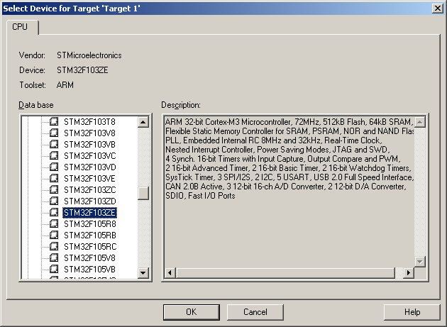
 
提问复制STM32的启动代码到工程目录，选择No，我们需要使用库中的启动文件

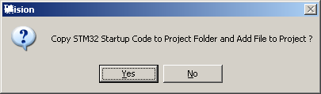

然后选择工程的属性，如 ***MDK工程Target设置图***

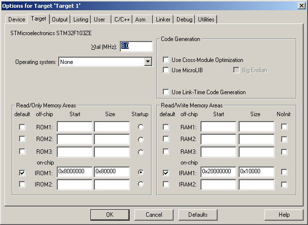

Select Folder for Objects目录选择到bsp\\your_board\\build，Name of Executable为rtthread-stm32

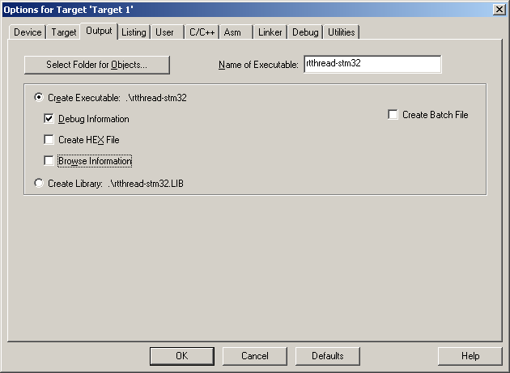
 
同样Select Folder for Listings选择bsp\\your_board\\objs目录，如 ***MDK工程Listing设置图*** 所示：

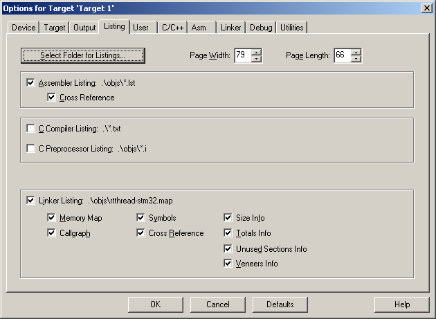

如 ***MDK工程编译设置图*** 所示：
 
C/C++编译选项标签页中，因为在项目中使用了ST的STM32固件库，需要在Define中添加如下2个定义

* STM32F10X_HD
* USE_STDPERIPH_DRIVER

在Include Paths（头文件搜索路径）中添加上ST固件库中需要Include的目录:

* Libraries\\STM32F10x_StdPeriph_Driver\\inc;
* Libraries\\CMSIS\\CM3\\CoreSupport;
* Libraries\\CMSIS\\CM3\\DeviceSupport\\ST\\STM32F10x

以及RT-Thread的头文件路径和STM32移植目录的路径：

* ..\\..\\include;
* ..\\..\\libcpu\\arm\\cortex-m3，

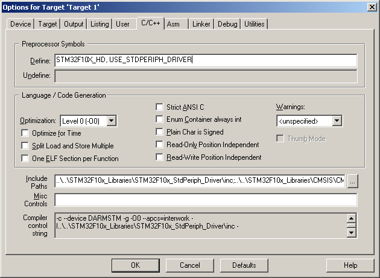

Asm，Linker，Debug和Utilities选项使用初始配置即可。

### 添加源文件 ###

* 添加STM32固件库源文件,新添加Group：STM32_StdPeriph，然后把以下2个目录中的所有C源文件都添加到Group中

1.bsp\\your_board\\Libraries\\CMSIS
2.bsp\\your_board\\Libraries\\STM32F10x_StdPeriph_Driver\\src
3.bsp\\your_board\\Libraries\\CMSIS\\CM3\\DeviceSupport\\ST\\STM32F10x\\startup\\arm\\startup_stm32f10x_hd.s

* 添加RT-Thread相关源文件

对工程中初始添加的Source Group1改名为Applications，并添加Kernel，Cortex-M3，Drivers的Group

在Cortex-M3分组中,加入libcpu\\arm\\cortex-m3里的context_rvds.S和cpuport.c文件,以及libcpu\\arm\\common中的backtrace.c，div0.c，showmem.c

Kernel Group中添加所有\\src下的C源文件； 

Applications Group中添加startup.c文件（放于bsp\\your_board\\applications目录中）；
Drivers Group中添加board.c文件（放于bsp\\your_board\\drivers目录中）；

* 添加RT-Thread配置头文件

在bsp\\your_board目录中添加rtconfig.h文件，内容如下：

~~~{.c}
/* RT-Thread配置文件 */
#ifndef __RTTHREAD_CFG_H__
#define __RTTHREAD_CFG_H__

/* 内核对象名称最大长度 */
#define RT_NAME_MAX             8
/* 数据对齐长度 */
#define RT_ALIGN_SIZE           4
/* 最大支持的优先级：32 */
#define RT_THREAD_PRIORITY_MAX  32
/* 每秒的节拍数 */
#define RT_TICK_PER_SECOND      100

/* SECTION: 调试选项 */
/* 打开RT-Thread的ASSERT选项 */
#define RT_DEBUG
/* 打开RT-Thread的线程栈溢出检查 */
#define RT_USING_OVERFLOW_CHECK
/* 使用钩子函数 */
#define RT_USING_HOOK

/* SECTION: 线程间通信选项  */
/* 支持信号量 */
#define RT_USING_SEMAPHORE
/* 支持互斥锁 */
#define RT_USING_MUTEX
/* 支持事件标志 */
#define RT_USING_EVENT
/* 支持邮箱 */
#define RT_USING_MAILBOX
/* 支持消息队列 */
#define RT_USING_MESSAGEQUEUE

/* SECTION: 内存管理  */
/* 支持静态内存池 */
#define RT_USING_MEMPOOL
/* 支持动态内存堆管理 */
#define RT_USING_HEAP
/* 使用小型内存管理算法 */
#define RT_USING_SMALL_MEM

/* SECTION: 设备模块选项 */
/* 支持设备模块 */
#define RT_USING_DEVICE
/* 支持串口1设备 */
#define RT_USING_UART1
/* SECTION: 控制台选项  */
#define RT_USING_CONSOLE
/* 控制台缓冲区大小 */
#define RT_CONSOLEBUF_SIZE  128

#endif
~~~

* 启动代码

在Keil MDK自动生成的启动代码中，由于STM32的中断处理方式是以中断向量表的方式进行，所以将不再使用中断统一入口的方式进行，启动代码可以大部分使用这份启动代码。主要修改在：

对于大多数已知的CPU,尤其是内核相同的CPU,他们的启动代码非常相似,可以直接使用标准启动代码。比如说STM32F103ZET6是Cortex-M3内核的,那就可以直接使用已有的启动代码。好处是,这些启动代码都是官方给出的,而且,对于同一种内核来说,基本上都是相同的。比如说异常的入口地址,一般的异常Handler名称等。RT-Thread默认这些Handler都是固定(一般来说都是这样)在内核中，已经有相关的Handler处理函数,可以被异常直接调用,省去了修改的麻烦。

一般来说,在移植过程中需要用确认几个异常入口以及变量是否正确:

1. 栈尺寸

如果中断服务例程使用的栈尺寸需要不高，可以使用默认值。
Stack_Size      EQU     0x00000200

2. PenSV异常

PendSV_Handler在context_rvds.S中实现,完成上下文切换。

3. HardFault_Handler异常

HardFault异常直接保留代码也没关系，只是当系统出现了fault异常时，并不容易看到。为完善代码起见，在context_rvds.S中有相关Fault信息输出代码,入口名称为HardFault_Handler异常。

4. 时钟中断

OS时钟在Cortex-M3中使用了统一的中断方式：SysTick_Handler。需要在bsp的drivers的board.c中调用rt_tick_increase();

相应的启动代码如下：

~~~{.c}
; Vector Table Mapped to Address 0 at Reset
                AREA    RESET, DATA, READONLY
                EXPORT  __Vectors
                EXPORT  __Vectors_End
                EXPORT  __Vectors_Size

__Vectors       DCD     __initial_sp               ; Top of Stack
                DCD     Reset_Handler              ; Reset Handler
                DCD     NMI_Handler                ; NMI Handler
                DCD     HardFault_Handler          ; Hard Fault Handler
                DCD     MemManage_Handler          ; MPU Fault Handler
                DCD     BusFault_Handler           ; Bus Fault Handler
                DCD     UsageFault_Handler         ; Usage Fault Handler
                DCD     0                          ; Reserved
                DCD     0                          ; Reserved
                DCD     0                          ; Reserved
                DCD     0                          ; Reserved
                DCD     SVC_Handler                ; SVCall Handler
                DCD     DebugMon_Handler           ; Debug Monitor Handler
                DCD     0                          ; Reserved
                DCD     PendSV_Handler             ; PendSV Handler
                DCD     SysTick_Handler            ; SysTick Handler

~~~

* 栈初始化代码

栈的初始化代码用于创建线程或初始化线程，“手工”的构造一份线程运行栈，相当于在线程栈上保留了一份线程从初始位置运行的上下文信息。在Cortex-M3体系结构中，当系统进入异常时，CPU Core会自动进行R0 – R3以及R12、psr、pc、lr等压栈，所以手工构造这个初始化栈时，也相应的把这些寄存器初始值放置到正确的位置。

libcpu\\arm\\cortex-m3\\cpuport.c程序清单：

~~~{.c}
#include <rtthread.h>

/*
 * 这个函数用于初始化线程栈
 *
 * @param tentry 线程的入口函数
 * @param parameter 线程入口函数的参数
 * @param stack_addr 栈的初始化地址
 * @param texit 当线程退出时的处理函数
 *
 * @return 返回准备好的栈初始指针
 */
rt_uint8_t *rt_hw_stack_init(void *tentry, void *parameter,
    rt_uint8_t *stack_addr, void *texit)
{
    struct stack_frame *stack_frame;
    rt_uint8_t         *stk;
    unsigned long       i;

    stk  = stack_addr + sizeof(rt_uint32_t);
    stk  = (rt_uint8_t *)RT_ALIGN_DOWN((rt_uint32_t)stk, 8);
    stk -= sizeof(struct stack_frame);

    stack_frame = (struct stack_frame *)stk;

    /* init all register */
    for (i = 0; i < sizeof(struct stack_frame) / sizeof(rt_uint32_t); i ++)
    {
        ((rt_uint32_t *)stack_frame)[i] = 0xdeadbeef;
    }

    stack_frame->exception_stack_frame.r0  = (unsigned long)parameter; /* r0 : argument */
    stack_frame->exception_stack_frame.r1  = 0;                        /* r1 */
    stack_frame->exception_stack_frame.r2  = 0;                        /* r2 */
    stack_frame->exception_stack_frame.r3  = 0;                        /* r3 */
    stack_frame->exception_stack_frame.r12 = 0;                        /* r12 */
    stack_frame->exception_stack_frame.lr  = (unsigned long)texit;     /* lr */
    stack_frame->exception_stack_frame.pc  = (unsigned long)tentry;    /* entry point, pc */
    stack_frame->exception_stack_frame.psr = 0x01000000L;              /* PSR */

    /* return task's current stack address */
    return stk;
}

/*@}*/
~~~

最终形成的线程栈情况如 ***堆栈压入情况图*** ：

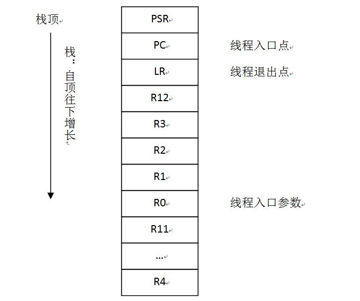

* 上下文切换代码

代码清单libcpu\\arm\\cortex-m3\\context_rvds.S：
在RT-Thread中，中断锁是完全由芯片移植来实现的，参见 线程间同步与通信章节。以下是Cortex-M3上的开关中断实现，它是使用CPSID指令来实现的。

~~~{.c}
; rt_base_t rt_hw_interrupt_disable();
; 关闭中断
rt_hw_interrupt_disable    PROC
        EXPORT  rt_hw_interrupt_disable
        MRS     r0, PRIMASK                     ; 读出PRIMASK值，即返回值
        CPSID   I                               ; 关闭中断
        BX      LR
        ENDP

; void rt_hw_interrupt_enable(rt_base_t level);
; 恢复中断
rt_hw_interrupt_enable    PROC
        EXPORT  rt_hw_interrupt_enable
        MSR     PRIMASK, r0                     ; 恢复R0寄存器的值到PRIMASK中
        BX      LR
        ENDP
~~~

在Cortex M3微处理器中，当系统进入异常时，CPU Core会自动进行R0 – R3以及R12、PSR、PC、LR等压栈，所以CM3的线程上下文切换正可以利用硬件压栈的特点，让机器自动帮助完成部分工作：在线程正常的上下文切换时，触发一个PenSV中断，从而进入到PenSV处理程序中。

~~~{.c}
; void rt_hw_context_switch(rt_uint32 from, rt_uint32 to);
; void rt_hw_context_switch_interrupt(rt_uint32 from, rt_uint32 to);
; r0 --> from
; r1 --> to
; 在Cortex M3移植中，这两个函数的内容都是相同的，
; 因为正常模式的切换也采取了触发PenSV异常的方式进行
rt_hw_context_switch_interrupt
        EXPORT rt_hw_context_switch_interrupt
rt_hw_context_switch    PROC
        EXPORT rt_hw_context_switch

        ; 设置参数rt_thread_switch_interrput_flag为1，
        ; 代表将要发起线程上下文切换
        LDR     r2, =rt_thread_switch_interrput_flag
        LDR     r3, [r2]
        CMP     r3, #1                          ; 参数已经置1，说明线程切换已经触发
        BEQ     _reswitch
        MOV     r3, #1
        STR     r3, [r2]

        LDR     r2, =rt_interrupt_from_thread   ; 保存切换出线程栈指针
        STR     r0, [r2]                        ; （切换过程中需要更新到当前位置）

_reswitch
        LDR     r2, =rt_interrupt_to_thread     ; 保存切换到线程栈指针
        STR     r1, [r2]

        LDR     r0, =NVIC_INT_CTRL
        LDR     r1, =NVIC_PENDSVSET
        STR     r1, [r0]                        ; 触发PendSV异常
        BX      LR
        ENDP

; PendSV异常处理
; r0 --> swith from thread stack
; r1 --> swith to thread stack
; psr, pc, lr, r12, r3, r2, r1, r0 等寄存器已经被自动压栈
; 到切换出线程栈中
rt_hw_pend_sv   PROC
        EXPORT rt_hw_pend_sv

        ; 为了保护线程切换，先关闭中断
        MRS     r2, PRIMASK
        CPSID   I

        ; 获得rt_thread_switch_interrupt_flag参数，
        ; 以判断pendsv是否已经处理过
        LDR     r0, =rt_thread_switch_interrput_flag
        LDR     r1, [r0]
        CBZ     r1, pendsv_exit             ; pendsv已经被处理，直接退出

        ; 清除参数：rt_thread_switch_interrput_flag为0
        MOV     r1, #0x00
        STR     r1, [r0]

        LDR     r0, =rt_interrupt_from_thread
        LDR     r1, [r0]
        CBZ     r1, swtich_to_thread        ; 如果切换出线程为0，这是第一次上下文切换

        MRS     r1, psp                     ; 获得切换出线程栈指针
        STMFD   r1!, {r4 - r11}             ; 对剩余的R4 – R11寄存器压栈
        LDR     r0, [r0]
        STR     r1, [r0]                    ; 更新切换出线程栈指针

    swtich_to_thread
        LDR     r1, =rt_interrupt_to_thread
        LDR     r1, [r1]
        LDR     r1, [r1]                    ; 载入切换到线程的栈指针到R1寄存器

        LDMFD   r1!, {r4 - r11}             ; 恢复R4 – R11寄存器
        MSR     psp, r1                     ; 更新程序栈指针寄存器

    pendsv_exit
        ; 恢复中断
        MSR     PRIMASK, r2

        ORR     lr, lr, #0x04               ; 构造LR以返回到Thread模式
        BX      lr                          ; 从PendSV异常中返回
        ENDP

; void rt_hw_context_switch_to(rt_uint32 to);
; r0 --> to
; 切换到函数，仅在第一次调度时调用
rt_hw_context_switch_to    PROC
        EXPORT rt_hw_context_switch_to
rt_hw_context_switch_to    PROC
        EXPORT rt_hw_context_switch_to
        LDR     r1, =rt_interrupt_to_thread     ; 设置切换到线程
        STR     r0, [r1]

        LDR     r1, =rt_interrupt_from_thread   ; 设置切换出线程栈为0
        MOV     r0, #0x0
        STR     r0, [r1]

      ; set interrupt flag to 1
        LDR     r1, =rt_thread_switch_interrupt_flag
        MOV     r0, #1
        STR     r0, [r1]
		
        ; set the PendSV exception priority
        LDR     r0, =NVIC_SYSPRI2
        LDR     r1, =NVIC_PENDSV_PRI
        LDR.W   r2, [r0,#0x00]       ; read
        ORR     r1,r1,r2             ; modify
        STR     r1, [r0]             ; write-back

        LDR     r0, =NVIC_INT_CTRL
        LDR     r1, =NVIC_PENDSVSET
        STR     r1, [r0]                        ; 触发PendSV异常

        ; restore MSP
        LDR     r0, =SCB_VTOR
        LDR     r0, [r0]
        LDR     r0, [r0]
        MSR     msp, r0

        CPSIE   I                               ; 使能中断以使PendSV能够正常处理
        ENDP
~~~

正常模式下的线程上下文切换的过程可以用下 ***正常模式上下文切换图*** 示：

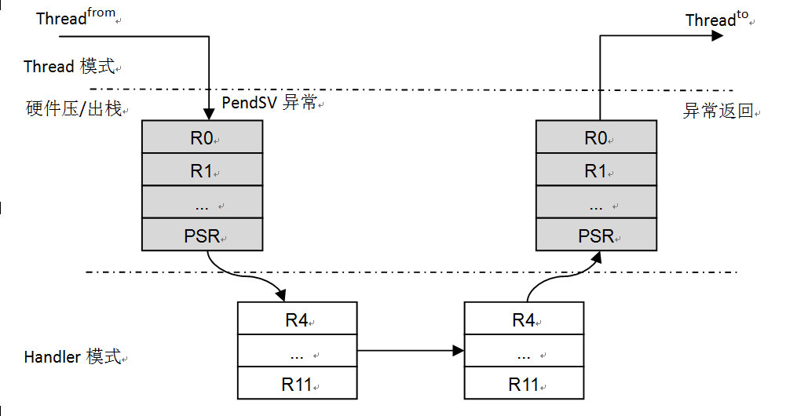
 
当要进行切换时（假设从Thread from 切换到Thread to），通过rt_hw_context_switch()函数触发一个PenSV异常。异常产生时，Cortex M3会把PSR，PC，LR，R0 – R3，R12自动压入当前线程的栈中，然后切换到PenSV异常处理。到PenSV异常后，Cortex M3工作模式（从Thread模式）切换到Handler模式，由函数rt_hw_pend_sv进行处理。rt_hw_pend_sv函数会载入切换出线程（Thread from）和切换到线程（Thread to）的栈指针，如果切换出线程的栈指针是0那么表示这是系统启动时的第一次线程上下文切换，不需要对切换出线程做压栈动作。如果切换出线程栈指针非零，则把剩余未压栈的R4 – R11寄存器依次压栈；然后从切换到线程栈中恢复R4 – R11寄存器。当从PendSV异常返回时，PSR，PC，LR，R0 – R3，R12等寄存器由Cortex M3自动恢复。

因为中断而导致的线程切换可用 ***中断模式上下文切换图*** 表示：

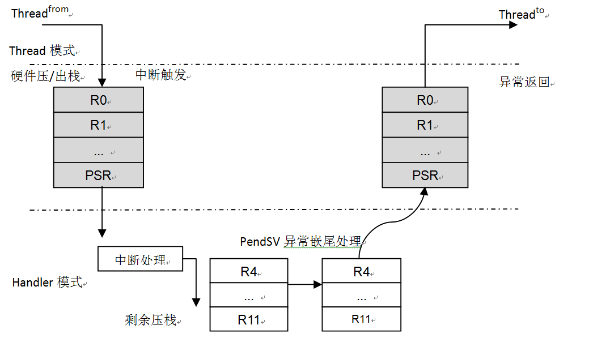

当中断达到时，当前线程会被中断并把PC，PSR，R0 – R3，R12等压到当前线程栈中，工作模式（从Thread模式）切换到Handler模式。

在运行中断服务例程期间，如果发生了线程切换（调用rt_schedule()），会先判断当前工作模式是否是Handler模式（依赖于全局变量rt_interrupt_nest），如果是则调用rt_hw _context_switch_interrupt函数进行伪切换：
在rt_hw_context_switch_interrupt函数中，将把当前线程栈指针赋值到rt_interrupt_from_thread变量上，把要切换过去的线程栈指针赋值到rt_interrupt_ to_thread变量上，并设置中断中线程切换标志rt_thread_switch_interrput_flag为1。
在最后一个中断服务例程结束时，Cortex M3将去处理PendSV异常，因为PendSV异常的优先级是最低的，所以只要触发过PendSV异常，它将总是在最后得到处理。
Fault处理代码
Fault处理代码并不是必须的，为了系统的完整性，实现fault处理代码无疑对系统出错时定位问题提供非常有利的帮助。
libcpu\\arm\\cortex-m3\\context_rvds.S程序清单：

~~~{.c}

    IMPORT rt_hw_hard_fault_exception
    EXPORT HardFault_Handler
HardFault_Handler    PROC

    ; get current context
    TST     lr, #0x04               ; if(!EXC_RETURN[2])
    MRSNE   r0, msp                 ; get fault context from handler.
    MRSEQ   r0, psp                 ; get fault context from thread.

    STMFD   r0!, {r4 - r11}         ; push r4 - r11 register
    STMFD   r0!, {lr}               ; push exec_return register

    MSRNE   msp, r0                 ; update stack pointer to MSP.
    MSREQ   psp, r0                 ; update stack pointer to PSP.

    PUSH    {lr}
    BL      rt_hw_hard_fault_exception
    POP     {lr}

    ORR     lr, lr, #0x04               ; 从fault中返回
    BX      lr
    ENDP

    END
~~~

libcpu\\arm\\cortex-m3\\cpuport.c程序清单：

~~~{.c}
#include <rtthread.h>

/* CM3硬件压栈时的寄存器结构 */
struct exception_stack_frame
{
    rt_uint32_t r0;
    rt_uint32_t r1;
    rt_uint32_t r2;
    rt_uint32_t r3;
    rt_uint32_t r12;
    rt_uint32_t lr;
    rt_uint32_t pc;
    rt_uint32_t psr;
};

void rt_hw_hard_fault_exception(struct exception_info * exception_info)
{
    extern long list_thread(void);
    struct stack_frame* context = &exception_info->stack_frame;

    if (rt_exception_hook != RT_NULL)
    {
        rt_err_t result;

        result = rt_exception_hook(exception_info);
        if (result == RT_EOK)
            return;
    }

    rt_kprintf("psr: 0x%08x\n", context->exception_stack_frame.psr);

    rt_kprintf("r00: 0x%08x\n", context->exception_stack_frame.r0);
    rt_kprintf("r01: 0x%08x\n", context->exception_stack_frame.r1);
    rt_kprintf("r02: 0x%08x\n", context->exception_stack_frame.r2);
    rt_kprintf("r03: 0x%08x\n", context->exception_stack_frame.r3);
    rt_kprintf("r04: 0x%08x\n", context->r4);
    rt_kprintf("r05: 0x%08x\n", context->r5);
    rt_kprintf("r06: 0x%08x\n", context->r6);
    rt_kprintf("r07: 0x%08x\n", context->r7);
    rt_kprintf("r08: 0x%08x\n", context->r8);
    rt_kprintf("r09: 0x%08x\n", context->r9);
    rt_kprintf("r10: 0x%08x\n", context->r10);
    rt_kprintf("r11: 0x%08x\n", context->r11);
    rt_kprintf("r12: 0x%08x\n", context->exception_stack_frame.r12);
    rt_kprintf(" lr: 0x%08x\n", context->exception_stack_frame.lr);
    rt_kprintf(" pc: 0x%08x\n", context->exception_stack_frame.pc);

    if(exception_info->exc_return & (1 << 2) )
    {
        rt_kprintf("hard fault on thread: %s\r\n\r\n", rt_thread_self()->name);

#ifdef RT_USING_FINSH
        list_thread();
#endif /* RT_USING_FINSH */
    }
    else
    {
        rt_kprintf("hard fault on handler\r\n\r\n");
    }

#ifdef RT_USING_FINSH
    hard_fault_track();
#endif /* RT_USING_FINSH */

    while (1);
}
~~~

## RT-Thread/STM32其他部分说明 ##

RT-Thread/STM32移植是基于RealView MDK开发环境进行移植的（GNU GCC编译器和IAR ARM编译亦支持），和STM32相关的代码大多采用RealView MDK中的代码，例如start_rvds.s是从RealView MDK自动添加的启动代码中修改而来。
和RT-Thread以往的ARM移植不一样的是，系统底层提供的rt_hw 系列函数相对要少些，建议可以考虑使用成熟的库（例如针对STM32芯片，可以采用ST官方的固件库）。RT-Thread/STM32工程中已经包含了STM32f10x系列3.1.x的库代码，可以配套使用。
和中断相关的rt_hw函数（异常与中断章节中的大多数函数）本移植中并不具备，所以可以跳过OS层直接操作硬件。在编写中断服务例程时，推荐使用如下的模板：

~~~{.c}
void rt_hw_interrupt_xx_handler(void)
{
    /* 通知RT-Thread进入中断模式 */
    rt_interrupt_enter();
    
    /* ... 中断处理 */
    
    /* 通知RT-Thread离开中断模式 */
    rt_interrupt_leave();
}
~~~

rt_interrupt_enter()函数会通知OS进入到中断处理模式（相应的线程切换行为会有些变化）；rt_interrupt_leave()函数会通知OS离开了中断处理模式。

## RT-Thread在ARM Cortex M4上的移植 ##

RT-thread支持scons工具,可以简单的创建工程文件，编译，下面将以移植MK60开发板为目标讲解。

scons创建MDK工程是以给定的Keil工程的模板为基础，通过scons把一些配置信息，文件，包含目录等加入到最后生成的工程中。

必要的，首先需要创建一个模板工程，就像创建普通MDK工程那样，但是一定要命名为 `template.uvproj`，作为基础模板

### 生成MDK工程模板 ###

同移植Cortex-M3的一些基本步骤，同样创建MDK工程，CPU选择 `freescale Semiconductor`  中的 `MK60FN1M0xxx12`，询问是否添加启动代码 `startup_MK60F12.s` 时选择No，因为所有文件的加入，头文件的Include这些都是根据scons来加入的，不用MDK模板操心，所以，启动文件也应该由我们自己掌控。

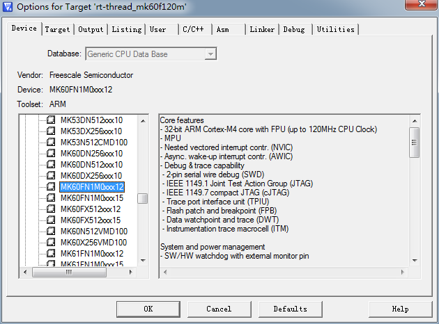

在 `Output` 选项卡中，选择工程的属性,Select Folder for Objects目录选择到 `bsp\your_board\build`，`Name of Executable` 为rtthread-mk60f120m

在 `Output` 选项卡中，可以勾选 `Browse Information` 这样可以支持右键函数，宏定义跳转。

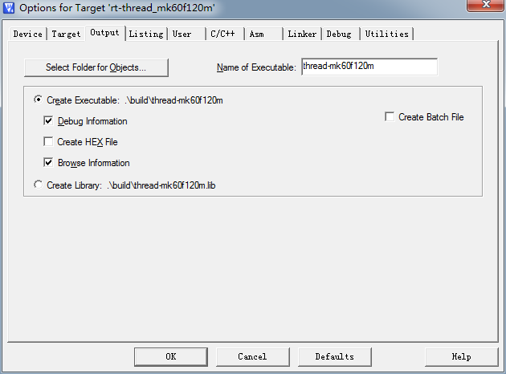

在 `Listing` 选项卡中，同样 `Select Folder for Listings` 选择 `bsp\your_board\build` 目录。

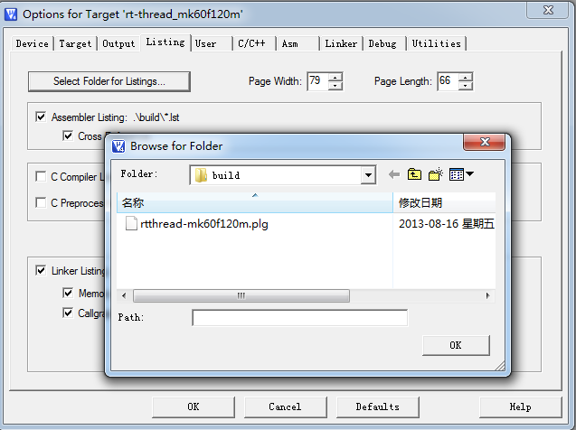

在 `Debug` 和 `Utilities` 选项卡中选择K60相应的 `pemicro_OSJtag` 

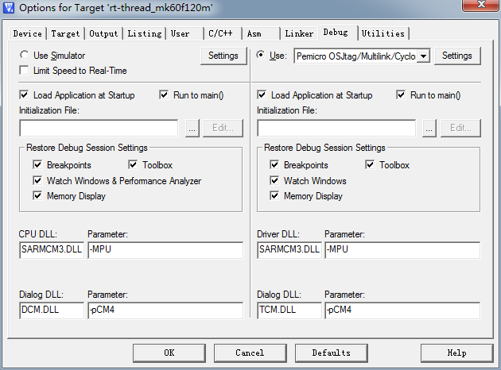

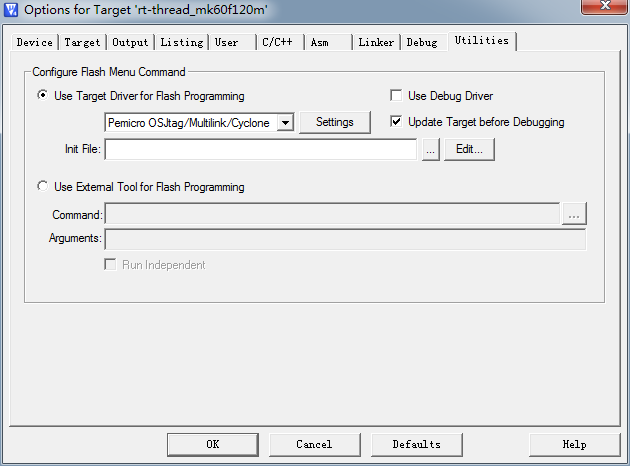

Asm，Linker,选项使用初始配置即可。

删除project目录下所有文件与文件夹，保证所有的文件结构增加由scons管理，保存此模板,确认名称为`template.uvproj`

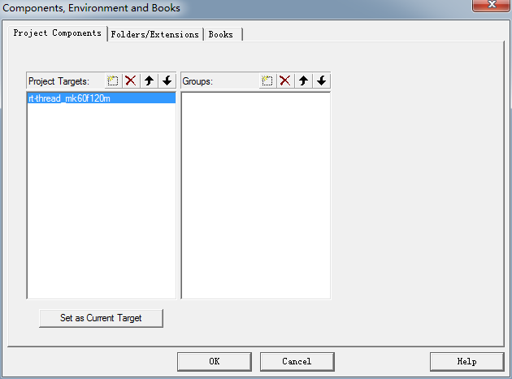

### 仿照并修改scons相关文件 ###

有了MDK的模板,那生成MDK工程文件的基石就有了，接下来需要scons的相关脚本文件来完成工程的生成。

由于是Cortex-M4内核,所以可以直接从相同内核的bsp中拷贝以下这几个文件来使的scons能够生成MDK工程,比如,从 `bsp\stm32f40x` 中拷贝:

- rtconfig.py
- SConscript
- SConstruct

相关文件的具体意义和作用可以参考[这篇文章](http://www.rt-thread.org/dokuwiki/doku.php?id=rt-thread%E4%B8%AD%E7%9A%84scons%E4%BD%BF%E7%94%A8%E8%AF%A6%E8%A7%A3 "RT-Thread中的SCons使用详解")

直接修改 `rtconfig.py` 中相关段落，本次移植主要关注MDK上的移植，可以忽略gcc和iar部分，与MDK相关的重点如下：

- 确认如下字段

~~~{.c}
# toolchains options
ARCH='arm'
CPU='cortex-m4'
CROSS_TOOL='keil'	/* 使用keil */	
~~~

- 设置Keil路径

~~~{.c}
elif CROSS_TOOL == 'keil':
	PLATFORM 	= 'armcc'
	EXEC_PATH 	= 'C:/Keil'
~~~

- 修改map文件名

~~~{.c}
LFLAGS = DEVICE + ' --info sizes --info totals --info unused --info veneers 
		--list rtthread-k60.map --scatter k60_rom.sct'
~~~

其中,CPU类型告诉RT-Thread会去采用哪种CPU类型去加入libcpu中的文件，CROSS_TOOL则指定了编译工具链

### 添加其他相关文件 ###

添加rtconfig.h到bsp目录下，scons会根据rtconfig.h中的宏定义来加载相关 `.h` 和 `.c` 文件，具体可以参考 `RT-Thread在ARM Cortex M3上的移植` 中的 `添加RT-Thread配置头文件` 部分的注释，只是使用的话可以直接参考类似架构的CPU，进行小部分修改即可，比如，与MK60同是Cortex-M4内核的STM32F4等bsp的文件，然后根据自己的需要进行更改。

在工程目录下增加启动文件(K60的启动文件 `startup_MK60F12.s` 可以在 `Keil\ARM\Startup\Freescale\Kinetis` 中找到)

在工程文件夹下新建drivers文件夹，用于存放bsp的相关驱动，并且在drivers目录下新建SConscript脚本，使得SCONS能够自动加载drivers中的文件到MDK工程中，同样可以参考stm32f40x/drivers中的SConscript:

~~~{.python}
Import('RTT_ROOT')
Import('rtconfig')
from building import *
		
cwd = os.path.join(str(Dir('#')), 'drivers')
src = Glob('*.c')   # 将.c文件加入工程
src += Glob('*.s')	# 将.s文件加入工程,启动脚本也放在了drivers中
CPPPATH = [cwd]

# 在MDK工程中加入Drivers文件夹
group = DefineGroup('Drivers', src, depend = [''], CPPPATH = CPPPATH)

Return('group')
~~~

在drivers目录下，新建 `board.h` 和 `board.c` 文件，`board.h` 里需要有bsp的相关定义和相关特性定义；而 `board.c` 中需要提供系统时钟，NVIC等bsp基本硬件初始化，一般还会提供 `rt_hw_board_init()` 完成所有板级基本硬件初始化，和 `SysTick_Handler()` 系统tick时钟ISR(板级相关)

在工程文件夹下新建applications文件夹，拷贝SConscript脚本，创建 `startup.c` ，其中应该有main(startup汇编文件中定义的入口)，这部分可以参考其他bsp步骤来完成(包括application.c的实现)

**注意:**

- 板级相关的宏定义等应该在 `board.h` 中,而不是 `rtconfig.h` 中, `rtconfig.h` 中的宏定义是OS层使用的,所以所有的bsp相关定义应当与 `rtconfig.h` 去相关。

- 由于属于通用Cortex-M4,所以内核部分可以不用过多的关心,对于任何一款Cortex-M4/M3的CPU,只需要处理系统时钟初始化(主要是systick初始化),NVIC基础配置,并且完成systick中断的ISR即可,相关部分的[代码](https://github.com/RT-Thread/rt-thread/tree/master/libcpu/arm/cortex-m4 "Cortex-M4内核部分代码分析")会在下节中分析.在Cortex-M3移植中谈到的 `PendSV_Handler()`  `PenSV()`  `HardFault_Handler()` 已经被 `\libcpu\arm\cortex-m4\context_rvds.S` 中 `PendSV_Handler   PROC` 所接管(只要在startup文件中相关ISR名字正确)

- 对于 `systick` 中断,RT-Thread已经有相关的中断处理函数,对于不同的bsp,只需要在bsp中相关 `SysTick_Handler()` 调用即可,相对是很固定的模式,就像9.4 RT-Thread/STM32其他部分说明中的模板那样:

~~~{.c}
void SysTick_Handler(void)
{
    /* enter interrupt */
    rt_interrupt_enter();
		
    rt_tick_increase();
		
    /* leave interrupt */
    rt_interrupt_leave();
}
~~~

- 对于Systick Timer和NVIC的配置,可以使用ARM标准CMSIS库中的函数进行配置,相关函数和帮助可以参考 `Keil\ARM\CMSIS\index.html` 

- 需要根据不同的CPU检查堆栈的配置,在 `rt_system_heap_init(...);` 时给出正确的地址RAM段范围。

这样，基本的模板就已经实现了，可以在命令行中执行 `scons --target=mdk4 -S` ，得到项目文件。

### Cortex-M4中的内核相关代码分析 ###

下面将以MDK环境为主,分析RT-Thread与Cortex-M4相关的主要的代码(context_rvds.S)

context_rvds.S中主要包括了一下几个部分：

- 中断控制系列(中断开关)
- 上下文切换系列

    void rt_hw_context_switch(rt_uint32 from, rt_uint32 to);
    void rt_hw_context_switch_to(rt_uint32 to);

- Handler系列( `PendSV_Handler` , `HardFault_Handler` )

与Cortex-M3一样,Cortex-M4的开关中断同样是使用CPSID指令来实现的,参考本文Cortex-M3分析部分

与Cortex-M3不同，上下文切换部分和pendSV部分的代码多了诸如 `IF {FPU} != "SoftVFP"` 这样的代码段，这是在MDK编译选项中使用不同FPU类型产生的。

打开Target Options-Target选项卡,其中Code Generation中有Floating Point Hardware选项,如 ***MDK中FPU设置图*** 所示

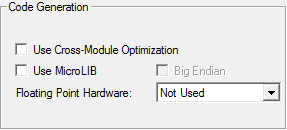

有如下2个选项：Not Used和Use FPU选项

- Not Used 会在C/C++选项卡,编译控制中产生--cpu Cortex-M4,即使用Cortex-M4编译
- Use FPU在C/C++选项卡,编译控制中产生--cpu Cortex-M4.fp

FPU是Cortex-M4浮点运算的可选单元。它是一个专用于浮点任务的单元。这个单元通过硬件提升性能，能处理单精度浮点运算，并与IEEE 754标准 兼容。当选择了Not Used时，即不使用硬件FPU,编译时FPU就等于SoftVFP；而选择USE FPU时，cpu变为了Cortex-M4.fp，此时，会默认按照 `--fpu=vfpv4-spvfpv4_sp_d16` 来进行编译，即使用了硬件FPU，此时，FPU!="SoftVFP"，于是IF语句块成立.

	关于更多fpu编译的信息可以参考MDK的帮助文件:
	
	ARM Compiler toolchain v5.02 for µVision Using the Compiler

	Home > Compiler Coding Practices > Processors and their implicit Floating-Point Units (FPUs) 

PendSV_Handler中增量代码分析:

~~~{.c}
IF      {FPU} != "SoftVFP"
TST     lr, #0x10               ; 判断EXC_RETURN[4]是否置位
VSTMFDEQ  r1!, {d8 - d15}       ; EXC_RETURN[4]置位则push{d8~d15},!表示自增,STMFD=STMDB
ENDIF
~~~

当系统产生异常(中断)时，首先会自动进行硬件入栈行为，对于Cortex-M3,会入栈xPSR、PC、LR、R12、R3~R0，这些寄存器被称为basic frame(参考ARMv7-M Architecture Reference Manual第648页)，对于Cortex-M4，在入栈basic frame之前，还会入栈extended frame，即把d0~d8入栈，然后入栈xPSR、PC、LR、R12、R3~R0。所以，如果要完整的保护上下文切换的状态，还需要入栈d8~d15，如 ***启用FPU后自动入栈顺序图*** 所示

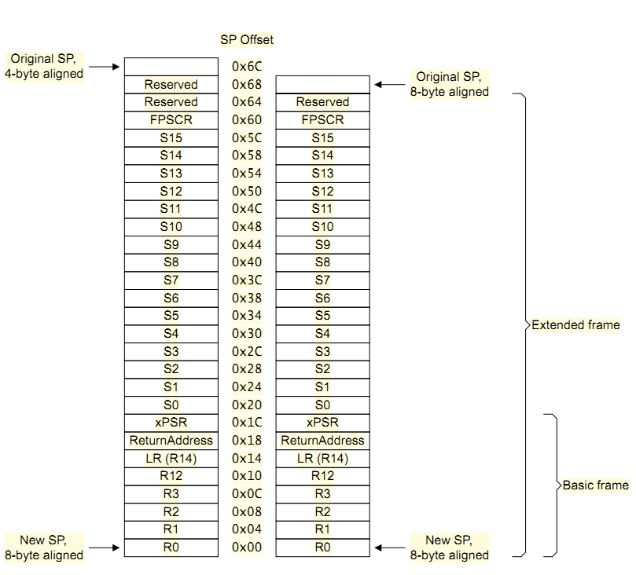

并且对于FPU需要使用V指令(参考 `ARM Cortex-M4 Processor Technical Reference Manual` 第69页7.2.3 FPU instruction set)

~~~{.c}
;以下代码为了保存CONTROL.FPCA
IF      {FPU} != "SoftVFP"
MOV     r4, #0x00               ; 先r4清零
	
TST     lr, #0x10               ; if(!EXC_RETURN[4])
MOVEQ   r4, #0x01               ; CONTROL.FPCA=1的话,r4=1
	
STMFD   r1!, {r4}               ; push CONTROL.FPCA
ENDIF
~~~

有了保存现场,那么当切回时应该还原:

~~~{.c}
;还原CONTROL.FPCA
IF      {FPU} != "SoftVFP"
LDMFD   r1!, {r3}               ; pop flag
ENDIF
~~~

其他部分代码与Cortex-M3几乎一样，请参考Cortex-M3移植分析部分。

至此RT-Thread在MK60上的内核移植完成。
