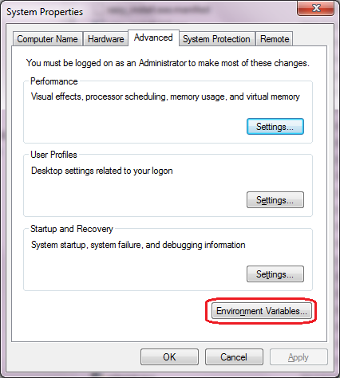
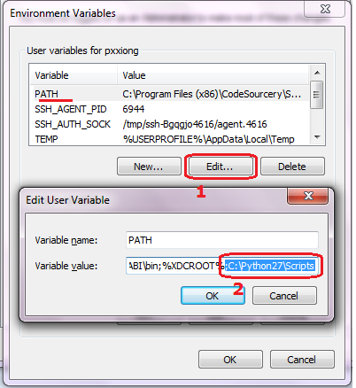
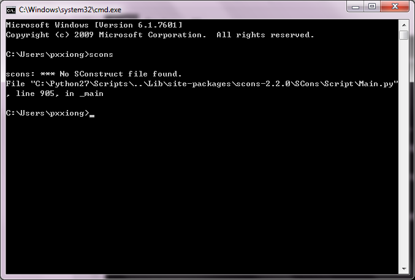

# SCons构建系统 #

SCons是一套由Python语言编写的开源构建系统，类似于GNU Make。它采用不同于通常Makefile文件的方式，而使用SConstruct和SConscript文件来替代。这些文件也是Python脚本，能够使用标准的Python语法来编写。所以在SConstruct、SConscript文件中可以调用Python标准库进行各类复杂的处理，而不局限于Makefile设定的规则。

在[SCons](http://www.scons.org/doc/production/HTML/scons-user/index.html)的网站上可以找到详细的SCons用户手册，本章节讲述SCons的基本用法，以及如何在RT-Thread中用好SCons工具。

## 什么是构建工具(software construction tool) ##

构建工具是一种软件，它可以根据一定的规则或指令，将源代码编译成可执行的二进制程序。这是构建工具最基本也是最重要的功能。实际上，构建工具的功能不止于此，通常这些规则有一定的语法，并组织成文件。这些文件用于来控制构建工具的行为，在完成软件构建之外，也可以做其他事情。

目前最流行的构建工具是GNU Make。很多知名开源软件，如Linux内核就采用Make构建。Make通过读取Makefile文件来检测文件的组织结构和依赖关系，并完成Makefile中所指定的命令。

由于历史原因，Makefile的语法比较混乱,不利于初学者学习。此外，在Windows平台上使用Make也不方便，需要安装Cygwin环境。为了克服Make的种种缺点，人们开发了其他构建工具，如CMake和SCons等。

## RT-Thread构建 ##

RT-Thread早期使用Make/Makefile构建。从0.3.x开始，RT-Thread开发团队逐渐引入了SCons构建系统，引入SCons唯一的目是：使大家从复杂的Makefile配置、IDE配置中脱离出来，把精力集中在RT-Thread功能开发上。

有些读者可能会有些疑惑，这里介绍的构建工具与IDE有什么不同。

通常IDE有自己的管理源码的方式，一些IDE使用XML来组织文件，并解决依赖关系。大部分IDE会根据用户所添加的源码生成类似Makefile或SConscript的脚本文件，在底层调用类似Make与SCons的工具来构建源码。IDE通过图形化的操作来完成构建。

## 安装SCons环境 ##

在使用SCons系统前需要在PC主机中安装它，因为它是Python语言编写的，所以在使用SCons之前需要安装Python运行环境。需要注意的是，由于目前SCons还不支持Python 3.x，所以需要安装Python 2.x环境，可以选择Python 2.x的最新版本进行安装。

### Linux、BSD环境 ###

在Linux、BSD环境中Python应该是已经默认安装了，一般也是2.x版本系列的Python环境。这时只需要安装SCons即可，例如在Ubuntu中可以使用如下命令：

    sudo apt-get install scons

### Windows环境 ###

请到[Python网站](http://www.python.org/getit/)下载Python 2.x系列安装包，当前推荐使用Python 2.7.x系列的Python版本。

请到[SCons网站](http://www.scons.org/)下载SCons安装包，从RT-Thread使用经验来看，SCons的各个版本（1.0.0 - 2.3.x）都可以在RT-Thread上正常使用。

在Windows下安装完成Python 和 SCons后，需要把scons命令添加到系统的PATH环境变量中，假设Python默认安装在

    C:\Python27

目录下，可以把```C:\Python27\Scripts```目录加入到PATH环境变量中。在Windows的我的电脑中，单击右键把系统属性设置窗口点出来，如下图所示：



点击其中的高级设置



选择PATH项，然后点击编辑按钮，然后把C:\\Python27\\Scripts目录添加到PATH最后的位置。添加完成后，可以按Win键+R，然后输入cmd回车打开Windows命令行窗口，在其中输入：

    scons

如果能够见到下面的输出，说明Python和SCons安装正确。



## SCons基本使用 ##

初次使用SCons编译某个bsp之前，需要先为bsp指定编译器。这需要修改该bsp目录下的rtconfig.py文件。

### 配置编译器 ###

rtconfig.py是一个RT-Thread标准的编译器配置文件，主要用于完成以下工作：

- 指定编译器（从支持的多个编译器中选择一个你现在使用的编译器）
- 指定编译器参数，如编译选项、链接选项等

首先确保你的系统上已经安装了编译器。RT-Thread构建系统支持多种编译器。目前支持的编译器包括arm gcc，MDK，IAR，VisualStudio，Visual DSP。主流的ARM Cortex M0、M3、M4平台，基本上ARM GCC、MDK、IAR都是支持的。有一些bsp可能仅支持一种，读者可以阅读该bsp目录下的rtconfig.py查看当前支持的编译器。

这里以bsp/stm32f10x 为例，其rtconfig.py如下所示

~~~{.python}
ARCH='arm'
CPU='cortex-m3'
CROSS_TOOL='keil'
 
if  CROSS_TOOL == 'gcc':
    PLATFORM    = 'gcc'
    EXEC_PATH   = r'D:\SourceryGCC\bin'
elif CROSS_TOOL == 'keil':
    PLATFORM    = 'armcc'
    EXEC_PATH   = r'C:\Keil'
elif CROSS_TOOL == 'iar':
    PLATFORM    = 'iar'
    IAR_PATH    = r'E:/Program Files/IAR Systems/Embedded Workbench 6.0'
 .....
~~~

一般来说，我们只需要修改```CROSS_TOOL```和下面的```EXEC_PATH```两个选项。

- CROSS_TOOL 

指定编译器，可选的值为```'keil'```, ```'gcc'```,```'iar'```。大致浏览rtconfig.py可以查看当前bsp所支持的编译器。

- EXEC_PATH

编译器的安装路径。

如果您的机器上安装了MDK，那么将```CROSS_TOOL```修改为```'keil'```，并修改```EXEC_PATH = r'C:/Keil'```为您的MDK的安装路径。

这里有两点需要注意：

1. 安装编译器时（如MDK，GNU GCC，IAR等），不要安装到带有中文或者空格的路径中。否则，某些解析路径时会出现错误。有些程序默认会安装到```C:\Program Files```目录下，中间带有空格。建议安装时选择其他路径，养成良好的开发习惯。
2. 修改```EXEC_PATH```时，需要注意路径的格式。在windows平台上，默认的路径分割符号是反斜杠```\```,而这个符号在C语言以及Python中都是用于转义字符的。所以修改路径时，可以将```\```改为```/```，或者在前面加r（python特有的语法，表示原始数据）。

假如某编译器安装位置为```D:\Dir1\Dir2```下。下面几种是正确的写法:

    EXEC_PATH = r'D:\Dir1\Dir2'  注意，字符串前带有r，则可正常使用“\”
    EXEC_PATH = 'D:/Dir1/Dir2'   注意，改用“/”，前面没有r
    EXEC_PATH = 'D:\\Dir1\\Dir2' 注意，这里使用“\”的转义性来转义“\”自己。

下面是错误的写法：

    EXEC_PATH = 'D:\Dir1\Dir2'

编译器配置完成之后，我们就可以使用SCons来编译RT-Thread的bsp了。

在当前目录打开命令行窗口，执行scons，就会启动编译过程。

小技巧：

在WIN7上，在当前目录按下SHIFT+鼠标右键，弹出的菜单中，会有“在此处打开命令窗口”的菜单项。点击可以快速打开CMD窗口。

### SCons基本命令 ###

本节介绍RT-Thread中常用的SCons命令。SCons不仅完成基本的编译，还可以生成MDK/IAR/VS工程。

#### scons ####

    scons 

这个命令用于直接编译目标。如果执行过scons后修改一些文件，再次执行scons时，则SCons会进行增量编译，仅编译修改过的文件并链接。

注：

如果在Windows上执行scons输出以下的警告信息， 

    scons: warning: No version of Visual Studio compiler found - C/C++ compilers most likely not set correctly

说明scons并没在你的机器上找到Visual Studio编译器，但实际上我们主要是针对设备开发，和Windows本地没什么关系。请直接忽略掉它。

#### scons -jN ####

多线程编译目标，在多核计算机上可以加快编译速度。一般来说，一颗cpu核心可以支持2个线程。双核机器上使用-j4即可。

    scons -j4

*** 注：如果你只是想看看编译错误或警告，最好是不使用-j参数，这样错误信息不会因为多个文件并行编译而导致出错信息夹杂在一起 ****

#### scons -c ####

清除编译目标。这个命令会清除执行scons时生成的临时文件和目标文件。

#### scons --target=XXX -s ####

    scons --target=mdk4 -s

可以在当前目录生成一个新的名为project.uvproj文件。双击它打开，就可以使用MDK来编译、调试。不习惯SCons的同学可以使用这种方式。

当修改了rtconfig.h打开或者关闭某些组件时，也需要使用这个命令重新生成对应的定制化的工程。 

注意：

要生成Keil MDK的工程文件，前提条件是当前目录存在一个工程模版文件，然后scons才会根据这份模版文件加入相关的源码，头文件搜索路径，编译参数，链接参数等。而至于这个工程是针对哪颗芯片的，则直接由这份工程模版文件指定。所以大多数情况下，这个模版文件是一份空的工程文件，用于辅助SCons生成project.uvproj。

如果打开project.uvproj失败，请删除project.uvopt后，重新生成工程。

    scons --target=iar -s

自动生成IAR工程；

    scons --target=vs2012 -s
    Scons --target=vs2005 -s

在bsp/simulator下，可以使用这个命令生成vs2012的工程或vs2005的工程。

#### scons --verbose ####

默认情况下，scons编译的输出不会显示编译参数，如下所示：

    F:\Project\git\rt-thread\bsp\stm32f10x>scons
    scons: Reading SConscript files ...
    scons: done reading SConscript files.
    scons: Building targets ...
    scons: building associated VariantDir targets: build
    CC build\applications\application.o
    CC build\applications\startup.o
    CC build\components\drivers\serial\serial.o
    ...

使用scons --verbose的效果

    armcc -o build\src\mempool.o -c --device DARMSTM --apcs=interwork -ID:/Keil/ARM/
    RV31/INC -g -O0 -DUSE_STDPERIPH_DRIVER -DSTM32F10X_HD -Iapplications -IF:\Projec
    t\git\rt-thread\applications -I. -IF:\Project\git\rt-thread -Idrivers -IF:\Proje
    ct\git\rt-thread\drivers -ILibraries\STM32F10x_StdPeriph_Driver\inc -IF:\Project
    \git\rt-thread\Libraries\STM32F10x_StdPeriph_Driver\inc -ILibraries\STM32_USB-FS
    -Device_Driver\inc -IF:\Project\git\rt-thread\Libraries\STM32_USB-FS-Device_Driv
    er\inc -ILibraries\CMSIS\CM3\DeviceSupport\ST\STM32F10x -IF:\Project\git\rt-thre
    ad\Libraries\CMSIS\CM3\DeviceSupport\ST\STM32F10x -IF:\Project\git\rt-thread\com
    ponents\CMSIS\Include -Iusb -IF:\Project\git\rt-thread\usb -I. -IF:\Project\git\
    rt-thread -IF:\Project\git\rt-thread\include -IF:\Project\git\rt-thread\libcpu\a
    rm\cortex-m3 -IF:\Project\git\rt-thread\libcpu\arm\common -IF:\Project\git\rt-th
    read\components\drivers\include -IF:\Project\git\rt-thread\components\drivers\in
    clude -IF:\Project\git\rt-thread\components\finsh -IF:\Project\git\rt-thread\com
    ponents\init F:\Project\git\rt-thread\src\mempool.c
    ...

## SCons进阶 ##

SCons使用SConscript和SConstruct文件来组织源码结构，通常来说一个项目只有一个SConstruct，但是会有多个SConscript。一般情况下，每个存放有源代码的子目录下都会放置一个SConscript，这些SCons的脚本文件组成如下所示的等级结构。

[图片待补充]

为了使RT-Thread更好的支持多种编译器，以及方便的调整编译参数，RT-Thread为每个bsp单独创建了一个名为rtconfig.py的文件。因此每一个RT-Thread bsp目录下都会存在下面三个文件，它们具体控制BSP的编译。

    rtconfig.py
    SConstruct
    SConscript

大部分组件源码文件夹下存在SConscript文件，这些文件会被BSP目录下的SConscript文件“找到”从而将rtconfig.h中定义的组件加入编译器来。一个BSP中只有一个SConstruct文件，但是却会有多个SConscript文件，可以说SConscript文件是组织源码的主力军。

### 修改编译器选项 ###

在rtconfig.py中控制了大部分编译选项。下面以stm32f10x/rtconfig.py为例（部分）

	elif PLATFORM == 'armcc':
	    # toolchains
	    CC = 'armcc'
	    AS = 'armasm'
	    AR = 'armar'
	    LINK = 'armlink'
	    TARGET_EXT = 'axf'
	 
	    DEVICE = ' --device DARMSTM'
	    CFLAGS = DEVICE + ' --apcs=interwork'
	    AFLAGS = DEVICE
	    LFLAGS = DEVICE + ' --info sizes --info totals --info unused --info veneers --list rtthread-stm32.map --scatter stm32_rom.sct'
	 
	    CFLAGS += ' -I' + EXEC_PATH + '/ARM/RV31/INC'
	    LFLAGS += ' --libpath ' + EXEC_PATH + '/ARM/RV31/LIB'
	 
	    EXEC_PATH += '/arm/bin40/'
	 
	    if BUILD == 'debug':
	        CFLAGS += ' -g -O0'
	        AFLAGS += ' -g'
	    else:
	        CFLAGS += ' -O2'
	 
	    POST_ACTION = 'fromelf --bin $TARGET --output rtthread.bin \nfromelf -z $TARGET'

其中**CFLAGS**存储C文件的编译选项，**AFLAGS** 则是汇编文件的编译选项，**LFLAGS** 是链接选项。**BUILD** 变量控制代码优化的级别。默认 **BUILD** 变量取值为`'debug'`，即使用debug方式编译，优化级别0。如果将这个变量修改为其他值，就会使用优化级别2编译。下面几种都是可行的写法（总之只要不是`'debug'`就可以了)。

    BUILD = ''
    BUILD = 'release'
    BUILD = 'hello, world'

建议在开发阶段都使用debug方式编译，不开优化，等产品稳定之后再考虑优化。

关于这些选项的具体含义需要参考编译器手册，如上面使用的armcc是MDK的底层编译器。其编译选项的含义在MDK help中有详细说明。

### 内置函数 ###

如果想要将自己的一些源代码加入到SCons编译环境中，一般可以创建或修改已有SConscript文件。SConscript文件可以控制源码文件的加入，并且可以指定文件的Group（与MDK/IAR等IDE中的Group的概念类似）。

SCons提供了很多内置函数可以帮助我们快速添加源码程序。简单介绍一些常用函数。

	GetCurrentDir()

获取当前路径

	Glob('*.c')

获取当前目录下的所有C文件。修改参数的值为其他后缀就可以匹配当前目录下的所有某类型的文件。

	GetDepend(macro)

在tools/目录下的脚本文件中定义，它会从rtconfig.h文件读取组件配置信息，其参数为rtconfig.h中的宏名。如果rtconfig.h打开了某个宏，则这个方法（函数）返回真，否则返回假。

	Split(str)

将字符串str分割成一个list

	DefineGroup(name, src, depend, **parameters)

这是RT-Thread基于SCons扩展的一个方法（函数）。
DefineGroup用于定义一个组件。组件可以是一个目录（下的文件或子目录），也是后续一些IDE工程文件中的一个Group或文件夹。

- name来定义这个group的名字
- src用于定义这个Group中包含的文件，一般指的是C/C++源文件。方便起见，也能够通过Glob函数采用通配符的方式列出SConscript文件所在目录中匹配的文件。
- depend 用于定义这个Group编译时所依赖的选项（例如finsh组件依赖于RT_USING_FINSH宏定义）。编译选项一般指rtconfig.h中定义的RT_USING_xxx宏。当在rtconfig.h配置文件中定义了相应宏时，那么这个Group才会被加入到编译环境中进行编译。如果依赖的宏并没在rtconfig.h中被定义，那么这个Group将不会被加入编译。相类似的，在使用scons生成为IDE工程文件时，如果依赖的宏未被定义，相应的Group也不会在工程文件中出现。
- parameters则可以输入一组字符串，后面还可以加入的参数包括：
    + CCFLAGS – C源文件编译参数；
    + CPPPATH – 头文件路径；
    + CPPDEFINES – 添加预定义宏；
    + LINKFLAGS – 链接时参数。
    + LIBRARY – 包含此参数，则会将组件生成的目标文件打包成库文件

可见DefineGroup的功能十分强大，实际使用时不需要配置所有参数。

	SConscript(dirs, variant_dir, duplicate)

SCons内置函数。其参数包括三个：

- dirs指明SConscript文件路径，
- variant_dir指定生成的目标文件的存放路径，
- duiplicate的作用是设定是否拷贝或链接源文件到variant_dir

利用这些函数，再配合一些简单的Python语句我们就能随心所欲向项目中添加或者删除源码了。下一节我们将介绍几个典型的SConscript示例文件来学习，并达到举一反三的目的。

### SConscript示例1 ###

bsp/stm32f10x/application/SConcript

~~~~ {#SConscript .python .numberLines startFrom="1"}

Import('RTT_ROOT')
Import('rtconfig')
from building import *
	
src = Glob('*.c')
cwd = GetCurrentDir()
include_path = [cwd]
	
group = DefineGroup('Applications', src, depend = [''], CPPPATH = include_path)

Return('group')

~~~~~~~~~~~~~~~~~~~~~~~~~~~~~~~~~~~~~~~~~~~~~~~~~

上面这个脚本完成如下功能：

`src = Glob('*.c')`得到当前目录下所有的C文件，`cwd = GetCurrentDir()`将当前路径赋值给cwd，注意cwd是一个字符串；
`include_path = [cwd]`将当前头文件路径保存为一个list变量。最后一行使用DefineGroup创建一个组。组名为Applications。depend为空，表示该组不依赖任何rtconfig.h的任何宏。`CPPPATH = include_path`表示将当前目录添加到系统的头文件路径中。

总结：这个源程序会将当前目录下的所有c程序加入到组Applications中，并将这个目录添加到系统头文件搜索路径中。因此，如果在这个目录下增加或者删除文件，就可以将文件加入工程或者从工程中删除。

它适用于批量添加源码文件。

### SConscript示例2 ###

component/finsh/SConscript

~~~~ {#SConscript .python .numberLines startFrom="1"}

Import('rtconfig')
from building import *
	
cwd     = GetCurrentDir()
src     = Glob('*.c')
CPPPATH = [cwd]
if rtconfig.CROSS_TOOL == 'keil':
    LINKFLAGS = ' --keep __fsym_* --keep __vsym_* '
else:
    LINKFLAGS = '' 

group = DefineGroup('finsh', src, depend = ['RT_USING_FINSH'], CPPPATH = CPPPATH, 
	LINKFLAGS = LINKFLAGS)
	
Return('group')

~~~~~~~~~~~~~~~~~~~~~~~~~~~~~~~~~~~~~~~~~~~~~~~~~

从第7行开始，与示例1有些区别。

	if rtconfig.CROSS_TOOL == 'keil':
	    LINKFLAGS = ' --keep __fsym_* --keep __vsym_* '
	else:
	    LINKFLAGS = '' 

这是Python的条件判断语句，如果编译工具是keil，则变量`LINKFLAGS =  --keep __fsym_* --keep __vsym_* `，否则置空。

DefinGroup同样将finsh目录下的所有文件创建为finsh组。

`depend = ['RT_USING_FINSH']`表示这个组依赖rtconfig.h中的`RT_USING_FINSH`。即，当rtconfig.h中打开宏`RT_USING_FINSH`时，finsh组内的源码才会被实际编译，否则SCons不会编译。

`CPPPATH = CPPPATH`，左边的CPPPATH是DefineGroup中内置参数，右边的CPPPATH是本文件第6行定义的，意思是将finsh目录加入到系统头文件目录中。这样我们就可以在其他源码中引用finsh目录下的头文件了，如finsh.h。

`LINKFLAGS = LINKFLAGS`的含义与`CPPPATH = CPPPATH`类似。左边的LINKFLAGS表示链接参数，右边的LINKFLAGS则是前面if else语句所设定的值。

### SConscript示例3 ###

bsp/stm32f10x/SConscript

~~~~ {#SConscript .python .numberLines startFrom="1"}

# for module compiling
import os
Import('RTT_ROOT')

cwd = str(Dir('#'))
objs = []
list = os.listdir(cwd)
	
for d in list:
    path = os.path.join(cwd, d)
    if os.path.isfile(os.path.join(path, 'SConscript')):
        objs = objs + SConscript(os.path.join(d, 'SConscript'))
	
Return('objs')

~~~~~~~~~~~~~~~~~~~~~~~~~~~~~~~~~~~~~~~~~~~~~~~~~

`cwd = str(Dir('#')` 获取工程的顶级目录，也就是工程的SConstruct所在的目录，在这里它的效果与 `cwd = GetCurrentDir()`相同。随后定义了一个空的list型变量objs。第6行`list = os.listdir(cwd)`得到当前目录下的所有子目录，并保存到变量list中。
随后是一个python的for循环，其含义是取出一个当前目录的子目录，利用os.path.join(cwd,d)拼接成一个完整路径，然后判断这个子目录是否存在一个名为SConscript的文件，若存在，则执行

	objs = objs + SConscript(os.path.join(d, 'SConscript'))

上面这一句中使用了SCons提供的一个内置函数`SConscript`，它可以读入一个新的SConscript文件，并将SConscript文件中所指明的源码加入编译列表中来。

### SConscript示例4 ###

stm32f10x/drivers/SConscript

~~~~ {#SConscript .python .numberLines startFrom="1"}

Import('RTT_ROOT')
Import('rtconfig')
from building import *
	
cwd  = GetCurrentDir()
	
# add the general drvers.
src = Split('''
board.c
stm32f10x_it.c
led.c
usart.c
''')
	
# add Ethernet drvers.
if GetDepend('RT_USING_LWIP'):
    src += ['dm9000a.c']
	
# add Ethernet drvers.
if GetDepend('RT_USING_DFS'):
    src += ['sdcard.c']
	
# add Ethernet drvers.
if GetDepend('RT_USING_RTC'):
    src += ['rtc.c']

# add Ethernet drvers.
if GetDepend('RT_USING_RTGUI'):
    src += ['touch.c']
    if rtconfig.RT_USING_LCD_TYPE == 'ILI932X':
        src += ['ili_lcd_general.c']
    elif rtconfig.RT_USING_LCD_TYPE == 'SSD1289':
        src += ['ssd1289.c']
	    
CPPPATH = [cwd]

group = DefineGroup('Drivers', src, depend = [''], CPPPATH = CPPPATH)

Return('group')

~~~~~~~~~~~~~~~~~~~~~~~~~~~~~~~~~~~~~~~~~~~~~~~~~

第8行使用Split方法来将一个文件字符串分割成成一个list，其效果等价于

	src = ['board.c', 'stm32f10x_it.c', 'led.c', 'usart.c']

第15行到第33行使用了GetDepend方法检查rtconfig.h中的某个宏是否打开，如果打开，则使用`src += [src_name]`来添加源码。最后使用DefineGroup创建组。

### 添加库 ###

在进行编译时添加一个额外的库，需要注意不同的工具链对二进制库的命名。例如GCC工具链，它识别的是libabc.a这样的库名称，在指定库时是指定abc，而不是libabc。所以在链接额外库时需要在SConscript文件中特别注意。另外，在指定额外库时，也最好指定相应的库搜索路径，以下是一个示例：

~~~~ {#SConscript .python .numberLines startFrom="1"}
# RT-Thread building script for component

Import('rtconfig')
from building import *

cwd = GetCurrentDir()
src = Split('''
''')

LIBPATH = [cwd + '/libs']
LIBS = ['abc']

group = DefineGroup('ABC', src, depend = [''], LIBS = LIBS, LIBPATH=LIBPATH)

~~~~~~~~~~~~~~~~~~~~~~~~~~~~~~~~~~~~~~~~~~~~~~~~~

如果工具链是GCC，则库的名称应该是libabc.a；如果工具链是armcc，则库的名称应该是abc.lib。库的搜索路径是当前目录下的'libs'目录。

### 增加一个SCons命令 ###

### RT-Thread building脚本 ###

在RT-Thread tools目录下存放有RT-Thread自己定义的一些辅助building的脚本，例如用于自动生成RT-Thread针对一些IDE集成开发环境的工程文件。其中最主要的是building.py脚本。

## 简单的SContruct ##

例如针对一个hello world的简单程序，假设它的源文件是：

~~~{.c}
/* file: hello.c */
#include <stdio.h>

int main(int argc, char** argv)
{
    printf("Hello, world!\n");
}
~~~

只需要在这个文件目录下添加一个如下内容的SConstruct文件：

    Program('hello.c')

然后在这个目录下执行命令：

    % scons
    scons: Reading SConscript files ...
    scons: done reading SConscript files.
    scons: Building targets ...
    cc -o hello.o -c hello.c
    cc -o hello hello.o
    scons: done building targets.

将会在当前目录下生成hello的应用程序。所以相比于Makefile，一个简单的hello.c到hello的转换，只需要一句话。如果hello是由两个文件编译而成，也只需要把SConstruct文件修改成：

    Program(['hello.c', 'file1.c'])

同时也可以指定编译出的目标文件名称：

    Program('program', ['hello.c', 'file1.c'])

有的时候也可以偷偷懒，例如把当面目录下的所有C文件都作为源文件来编译：

    Program('program', Glob('*.c'))

Glob函数就是用于使用当前目录下的所有C文件。除了Glob函数以外，也有Split函数。Split函数写的脚本具备更好的可读性以及更精确的可定制性：

    src = Split('''
        hello.c
        file1.c
        ''')
    Program('program', src)

它的效果与 ``` Program('program', ['hello.c', 'file1.c']) ``` 是一致的，但具有更清晰的可读性。

## SConstruct与SConscript ##

对于复杂、大型的系统，显然不仅仅是一个目录下的几个文件就可以搞定的，很可能是由数个文件夹一级级组合而成。

在 SCons中，可以编写SConscript脚本文件来编译这些相对独立目录中的文件，同时也可以使用SCons中的Export和Import函数在SConstruct与SConscript文件之间共享数据（也就是Python中的一个对象数据）。
