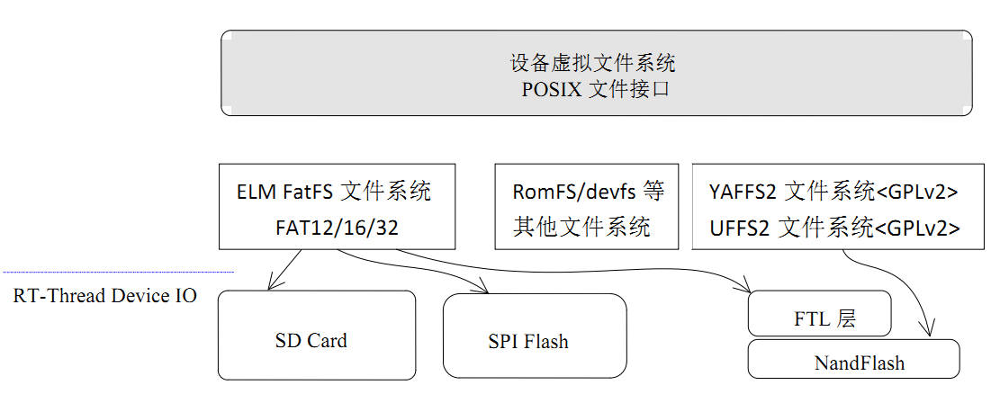
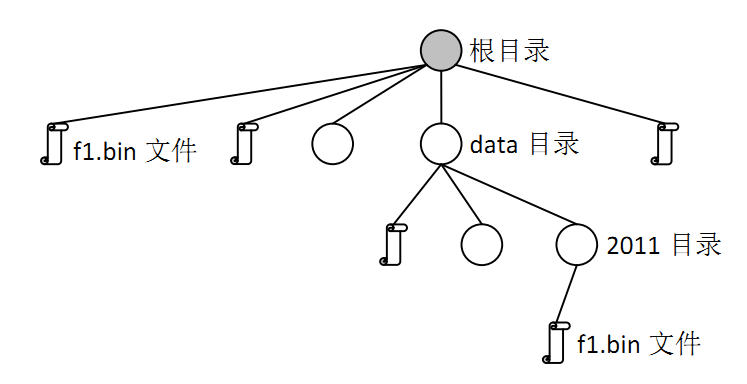

# 文件系统 #

## 简介 ##

RT-Thread 的文件系统采用了三层的结构，如图 ***文件系统结构图*** 所示：



最顶层的是一套面向嵌入式系统，专门优化过的虚拟文件系统（接口）。通过它，RT-thread 操作系统能够适配下层不同的文件系统格式，例如个人电脑上常使用的FAT 文件系统，或者是嵌入式设备中常见的flash 文件系统（YAFFS2、JFFS2 等）。

接下来中间的一层是各种文件系统的实现，例如支持FAT文件系统的DFS-ELM、支持NandFlash 的YAFFS2，只读文件系统ROMFS 等。（RT-Thread 1.0.0版本中包含了ELM FatFS，ROMFS以及网络文件系统NFS v3实现，YAFFS2等flash 文件系统则包含在了RT-Thread 1.1.0 版本中）

最底层的是各类存储驱动，例如SD 卡驱动，IDE 硬盘驱动等。RT-Thread 
1.1.0 版本也将在NandFlash 上构建一层转换层(FTL)，以使得NandFlash
能够支持Flash 文件系统。 

RT-Thread 的文件系统对上层提供的接口主要以POSIX 标准接口为主，这样也能够保证程序可以在PC 上编写、调试，然后再移植到RT-Thread 操作系统上。 


##文件系统、文件与文件夹##

文件系统是一套实现了数据的存储、分级组织、访问和获取等操作的抽象数据类型(Abstract data type)，是一种用于向用户提供底层数据访问的机制。文件系统通常存储的基本单位是文件，即数据是按照一个个文件的方式进行组织。当文件比较多时，将导致文件繁多，不易分类、重名的问题。而文件夹作为一个容纳多个文件的容器而存在。

在 RT-Thread 中，文件系统名称使用上类似UNIX 文件、文件夹的风格，例如如图 ***目录结构*** 的目录结构：



在RT-Thread 操作系统中，文件系统有统一的根目录，使用’/’来表示。而在根目录下的f1.bin 文件则使用’/f1.bin’来表示，2011 目录下的f1.bin目录则使用’/data/2011/f1.bin’来表示。即目录的分割符号是’/’，这与UNIX/Linux 完全相同的，与Windows 则不相同（Windows 操作系统上使用’\’来作为目录的分割符）。 

默认情况下，RT-Thread 操作系统为了获得较小的内存占用，宏定义DFS_USING_WORKDIR 并不会被定义。当它不定义时，那么在使用文件、目录
接口进行操作时应该使用绝对目录进行（因为此时系统中不存在当前工作的目录）。如果需要使用当前工作目录以及相对目录，可以在rtconfig.h头文件中定义DFS_USING_WORKDIR 宏。

##文件系统接口##

###打开文件###

打开或创建一个文件可以调用下面的open 函数接口：

	int open(const char *pathname, int oflag, int mode);

参数： 

+ pathname  - 打开或创建的文件名；

+ oflag   - 指定打开文件的方式，当前支持的打开方式有：


+--------------+--------------------------------------------+
|      参数    |        描述                                |
+==============+============================================+
|   O_RDONLY   |  只读方式打开文件                          |
+--------------+--------------------------------------------+
|   O_WRONLY   |  只写方式打开文件                          |
+--------------+--------------------------------------------+
|   O_RDWR     |  以读写方式打开文件                        |
+--------------+--------------------------------------------+
|   O_CREAT    |  如果要打开的文件不存在，则建立该文件。    |
+--------------+--------------------------------------------+
|   O_APPEND   |  当读写文件时会从文件尾开始移动，也就是所  |
|              |  写入的数据会以附加的方式添加到文件的尾部。|
+--------------+--------------------------------------------+

+ mode    - 与POSIX 标准接口像兼容的参数（目前没有意义，传入0即可）。

+ 返回值：

打开成功时返回打开文件的描述符序号，否则返回负数。可以参考 @@以下@@ 代码，看看如何去打开一个文件。

~~~{.c}
#include <rtthread.h> 
#include <dfs_posix.h> /* 当需要使用文件操作时，需要包含这个头文件 */ 
 
/* 假设文件操作是在一个线程中完成*/ 
void file_thread() 
{ 
    int fd, size; 
    char s[] = "RT-Thread Programmer!\n", buffer[80]; 

    /* 打开/text.txt 作写入，如果该文件不存在则建立该文件*/ 
    fd = open("/text.txt", O_WRONLY | O_CREAT); 
    if (fd >= 0) 
    { 
        write(fd, s, sizeof(s)); 
        close(fd); 
    } 
    
    /* 打开/text.txt 准备作读取动作*/ 
    fd = open("/text.txt", O_RDONLY); 
    if (fd >= 0) 
    { 
        size=read(fd, buffer, sizeof(buffer)); 
        close(fd); 
    } 
    
    rt_kprintf("%s", buffer); 
}
~~~

###关闭文件###

当使用完文件后若不再需要使用则可使用close()函数接口关闭该文件，而close()会让数据写回磁盘，并释放该文件所占用的资源。关闭文件的函数接口如下：

	int close(int fd); 

+ 参数： 

    fd - open()函数所返回的文件描述字。 

+ 返回值：
无

###读取数据###

读取数据可使用下面的函数接口：

    ssize_t read(int fd, void *buf, size_t count);

+ 参数： 

    fd    - 文件描述词； 
    buf  - 内存指针； 
    count - 预读取文件的字节数。

+ 返回值： 

实际读取到的字节数。read()函数接口会把参数fd 所指的文件的count 个字节传送到buf 指针所指的内存中。返回值为实际读取到的字节数，有两种情况会返回0 值，一是读取数据已到达文件结尾，二是无可读取的数据（例如设定count为0），此外，文件的读写位置会随读取到的字节移动。

###写入数据###

写入数据可使用下面的函数接口：

	size_t write(int fd, const void *buf, size_t count); 

+ 参数： 

    fd    - 文件描述词； 
    buf   - 内存指针； 
    count  - 预写入文件的字节数。 

+ 返回值： 
    实际写入的字节数。 

write()函数接口会把buf 指针所指向的内存中count 个字节写入到参数fd 所指的文件内。返回值为实际写入文件的字节数，返回值为0 时表示写入出错，错误代码存入当前线程的errno中，此外，文件的读写位置会写入的字节移动。

可以参考 @@以下@@ 代码，看看一个完整的文件读写流程：

~~~{.c}
/* 
 * 代码清单：文件读写例子 
 * 这个例子演示了如何读写一个文件，特别是写的时候应该如何操作。 
 */ 
 
#include <rtthread.h> 
#include <dfs_posix.h> /* 当需要使用文件操作时，需要包含这个头文件 */ 
 
#define TEST_FN    "/test.dat" 
 
/* 测试用的数据和缓冲 */ 
static char test_data[120], buffer[120]; 
 
/* 文件读写测试 */ 
void readwrite(const char* filename) 
{ 
    int fd; 
    int index, length; 
    
    /* 只写 & 创建 打开 */ 
    fd = open(TEST_FN, O_WRONLY | O_CREAT | O_TRUNC, 0); 
    if (fd < 0) 
    { 
        rt_kprintf("open file for write failed\n"); 
        return; 
    } 
    
    /* 准备写入数据 */ 
    for (index = 0; index < sizeof(test_data); index ++) 
    { 
        test_data[index] = index + 27; 
    } 
    
    /* 写入数据 */ 
    length = write(fd, test_data, sizeof(test_data)); 
    if (length != sizeof(test_data)) 
    { 
        rt_kprintf("write data failed\n"); 
        close(fd); 
        return; 
    } 
    
    /* 关闭文件 */ 
    close(fd); 
    
    /* 只写并在末尾添加打开 */ 
    fd = open(TEST_FN, O_WRONLY | O_CREAT | O_APPEND, 0); 
    if (fd < 0) 
    { 
        rt_kprintf("open file for append write failed\n"); 
        return; 
    } 
    
    length = write(fd, test_data, sizeof(test_data)); 
    if (length != sizeof(test_data)) 
    { 
        rt_kprintf("append write data failed\n"); 
        close(fd); 
        return; 
    } 
    /* 关闭文件 */ 
    close(fd); 
    
    /* 只读打开进行数据校验 */ 
    fd = open(TEST_FN, O_RDONLY, 0); 
    if (fd < 0) 
    { 
        rt_kprintf("check: open file for read failed\n"); 
        return; 
    } 
    
    /* 读取数据(应该为第一次写入的数据) */ 
    length = read(fd, buffer, sizeof(buffer)); 
    if (length != sizeof(buffer)) 
    { 
        rt_kprintf("check: read file failed\n"); 
        close(fd); 
        return;
    } 
    
    /* 检查数据是否正确 */ 
    for (index = 0; index < sizeof(test_data); index ++) 
    { 
        if (test_data[index] != buffer[index]) 
        { 
            rt_kprintf("check: check data failed at %d\n", index); 
            close(fd); 
            return; 
        } 
    } 
    
    /* 读取数据(应该为第二次写入的数据) */ 
    length = read(fd, buffer, sizeof(buffer)); 
    if (length != sizeof(buffer)) 
    { 
        rt_kprintf("check: read file failed\n"); 
        close(fd); 
        return;
    }
    
    /* 检查数据是否正确 */ 
    for (index = 0; index < sizeof(test_data); index ++) 
    { 
        if (test_data[index] != buffer[index]) 
        { 
            rt_kprintf("check: check data failed at %d\n", index); 
            close(fd); 
            return; 
        } 
    } 
    
    /* 检查数据完毕，关闭文件 */ 
    close(fd); 
    /* 打印结果 */ 
    rt_kprintf("read/write done.\n"); 
}

#ifdef RT_USING_FINSH 
#include <finsh.h> 
/* 输出函数到finsh shell 命令行中 */ 
FINSH_FUNCTION_EXPORT(readwrite, perform file read and write test); 
#endif 
~~~

###更改名称###

更改文件的名称可使用下面的函数接口：

	int rename(const char *oldpath, const char *newpath); 

+ 参数： 
    oldpath   - 需更改的文件名； 
    newpath   - 更改成的文件名。 

+ 返回值：
    无 

rename()会将参数oldpath 所指定的文件名称改为参数newpath 所指的文件名称。若newpath 所指定的文件已经存在，则该文件将会被覆盖。可以参考 @@以下@@ 代码，如何进行文件名改名。

~~~{.c}
#include <dfs_posix.h> 

void file_thread(void* parameter) 
{
    rt_kprintf("%s => %s ", "/text1.txt", "/text2.txt"); 

    if(rename("/text1.txt", "/text2.txt") <0 ) 
        rt_kprintf("[error!]\n"); 
    else 
        rt_kprintf("[ok!]\n"); 
}
~~~

这个示例函数会把文件’/text1.txt’改名成’/text2.txt’。

###取得状态###

获取文件状态可使用下面的stat 函数接口：

	int stat(const char *file_name, struct stat *buf); 

stat()函数用来将参数file_name 所指向的文件状态，复制到buf 指针所指的结构中(struct stat)。 

+ 参数： 
    file_name  - 文件名； 
    buf     - 结构指针，指向获取文件状态的结构。 

返回值：
  无 
可以参考 @@以下@@ 代码了解如何使用stat 函数。

~~~{.c}
void file_thread(void* parameter) 
{ 
    struct stat buf; 
    stat("/text.txt", &buf); 
    rt_kprintf("text.txt file size = %d\n", buf.st_size); 
}
~~~

##目录操作接口##

###创建目录###

创建目录可使用下面的函数接口： 

	int mkdir(const char *path, mode_t mode); 

mkdir()函数用来创建一个目录，参数path 为目录名，参数mode 在当前版本未启用，输入0x777 即可。 

+ 参数： 
    path  - 目录名； 
    mode  - 创建模式。 
+ 返回值： 
    创建成功返回0，创建失败返回-1。 

可以参考 @@以下@@ 代码了解如何使用mkdir 函数：

~~~{.c}
void file_thread(void* parameter) 
{ 
    int ret; 
    
    /* 创建目录*/ 
    ret = mkdir("/web", 0x777); 
    if(ret < 0) 
    { 
        /* 创建目录失败*/ 
        rt_kprintf("mkdir error!\n"); 
    } 
    else 
    {  
        /* 创建目录成功*/ 
        rt_kprintf("mkdir ok!\n"); 
    } 
}
~~~


###打开目录###

打开目录可使用下面的函数接口： 

	DIR* opendir(const char* name); 

opendir()函数用来打开一个目录，参数name 为目录路径名。若读取目录成功，返回该目录结构，若读取目录失败，返回RT_NULL。 

+ 参数： 
    name  - 目录路径名。 

+ 返回值： 
    打开文件成功，返回指向目录的DIR 结构指针，否则返回RT_NULL。 

    可以参考 @@以下@@ 代码了解如何使用opendir()函数：
    
~~~{.c}
#include <dfs_posix.h> 
 
void dir_operation(void* parameter) 
{
    int result; 
    DIR *dirp; 
    
    /* 打开/web 目录*/ 
    dirp = opendir("/web"); 
    if(dirp == RT_NULL) 
    { 
        rt_kprintf("open directory error!\n"); 
    } 
    else 
    {
        /* 在这儿进行读取目录相关操作*/ 
        /* ...... */ 
            
        /* 关闭目录 */ 
          closedir(dirp); 
    } 
}
~~~ 

###读取目录###
读取目录可使用下面的函数接口： 

	struct dirent* readdir(DIR *d); 

readdir()函数用来读取目录，参数d 为目录路径名。返回值为读到的目录项结构，如果返回值为RT_NULL，则表示已经读到目录尾；此外，每读取一次目录，目录流的指针位置将自动往后递推1 个位置。 

+ 参数： 

    d  - 目录路径名。 

+ 返回值： 

    读取成功返回指向目录entry 的结构指针，否则返回RT_NULL。 

可以参考 @@以下@@ 代码了解如何使用readdir 函数： 

~~~{.c}
void dir_operation(void* parameter) 
{ 
    int result; 
    DIR *dirp; 
    struct dirent *d; 

    /* 打开/web 目录*/ 
    dirp = opendir("/web"); 
    if(dirp == RT_NULL) 
    { 
        rt_kprintf("open directory error!\n"); 
    } 
    else 
    { 
        /* 读取目录*/ 
        while ((d = readdir(dirp)) != RT_NULL) 
        { 
            rt_kprintf("found %s\n", d->d_name); 
        } 

        /* 关闭目录 */ 
        closedir(dirp); 
    } 
} 
~~~

###取得目录流的读取位置###

获取目录流的读取位置可使用下面的函数接口：

	off_t telldir(DIR *d); 

+ 参数： 

    d  - 目录路径名。 
+ 返回值： 

    无 

###设置下次读取目录的位置###

设置下次读取目录的位置可使用下面的函数接口： 

	void seekdir(DIR *d, off_t offset); 

+ 参数： 

    d    - 目录路径名； 
    offset  - 偏移值，距离本次目录的位移。 
+ 返回值： 

    无 
可以参考 @@以下@@代码了解如何使用seekdir 函数：

~~~{.c}
void dir_operation(void* parameter) 
{ 
    DIR * dirp; 
    int save3 = 0; 
    int cur; 
    int i = 0; 
    struct dirent *dp; 
    
    /* 打开根目录 */ 
    dirp = opendir ("/"); 
    for (dp = readdir (dirp); dp != RT_NULL; dp = readdir (dirp)) 
    { 
        /* 保存第三个目录项的目录指针*/ 
        if (i++ == 3) 
            save3 = telldir (dirp); 
        
        rt_kprintf ("%s\n", dp->d_name); 
    } 
    
    /* 回到刚才保存的第三个目录项的目录指针*/ 
    seekdir (dirp, save3); 
    
    /* 检查当前目录指针是否等于保存过的第三个目录项的指针. */ 
    cur = telldir (dirp); 
    if (cur != save3) 
    { 
        rt_kprintf ("seekdir (d, %ld); telldir (d) == %ld\n", save3, cur); 
    } 
    
    /* 从第三个目录项开始打印*/ 
    for (dp = readdir(dirp); dp != NULL; dp = readdir (dirp)) 
        rt_kprintf ("%s\n", dp->d_name); 
    
    /* 关闭目录*/ 
    closedir (dirp); 
}
~~~

###重设读取目录的位置为开头位置###

重设读取目录为开头位置可使用下面的函数接口： 

	void rewinddir(DIR *d); 

+ 参数： 

    d  - 目录路径名； 
+ 返回值： 

    无 

###关闭目录###
关闭目录可使用下面的函数接口： 

	int closedir(DIR* d); 

closedir()函数用来关闭一个目录。该函数必须和opendir()函数成对出现。 

+ 参数： 

    d  - 目录路径名； 
+ 返回值： 

    关闭成功返回0，否则返回-1； 


###删除目录###
删除目录可使用下面的函数接口： 

	int rmdir(const char *pathname); 

+ 参数： 

    d  - 目录路径名； 

+ 返回值： 

    删除目录成功返回0，否则返回-1。


### 格式化文件系统 ###

	int mkfs(const char * fs_name, const char * device)

+ 参数： 

    fs_name  - 文件系统名； 
    device  - 设备名； 

+ 返回值： 

    格式化成功返回0，否则返回-1。

RT-Thread中目前支持的文件系统参见本章最后一节。

##底层驱动接口##

RT-Thread DFS 文件系统针对下层媒介使用的是RT-Thread 的设备IO系统，其中主要包括设备读写等操作。但是有些文件系统并不依赖于RT-Thread 的设备系统，例如1.0.x分支引入的只读文件系统、网络文件系统等。对于常使用的FAT 文件系统，下层驱动必须用块设备的形式来实现。

###文件系统初始化###

在使用文件系统接口前，需要对文件系统进行初始化，代码如下：

~~~{.c}
#ifdef RT_USING_DFS 
/* 包含DFS 的头文件 */ 
#include <dfs_fs.h> 
#include <dfs_elm.h> 
#endif 
 
/* 初始化线程 */ 
void rt_init_thread_entry(void *parameter) 
{ 
    /* 文件系统初始化 */ 
    #ifdef RT_USING_DFS 
    { 
    /* 初始化设备文件系统 */ 
    dfs_init(); 
    #ifdef RT_USING_DFS ELMFAT 
    /* 如果使用的是ELM 的FAT 文件系统，需要对它进行初始化 */ 
    elm_init(); 

    /* 调用dfs_mount 函数对设备进行装载 */ 
    if (dfs_mount("sd0", "/", "elm", 0, 0) == 0) 
        rt_kprintf("File System initialized!\n"); 
    else 
        rt_kprintf("File System init failed!\n"); 
    #endif 
    } 
    #endif 
}
~~~

其主要包括的函数接口为： 

	int dfs_mount(const char* device_name, const char* path, const char* filesystemtype, 
	rt_uint32_t rwflag, const void* data); 

dfs_mount 函数用于把以device_name 为名称的设备挂接到path 路径中。filesystemtype 指定了设备上的文件系统的类型（如上面代码所述的elm、rom、nfs 等文件系统）。data参数对某些文件系统是有意义的，如nfs，对elm 类型系统则没有意义。 

+ 参数：

    device_name   - 设备名； 
    path      - 挂接路径； 
    filesystemtype  - 文件系统的类型； 
    rwflag      - 文件系统的标志； 
    data      - 文件系统的数据。 

+ 返回值：

    装载成功将返回0，否则返回-1。具体的错误需要查看errno。


## FatFs ##

FatFs是专为小型嵌入式设备开发的一个兼容微软fat的文件系统，采用ANSI C编写，采用抽象的硬件I/O层以及提供持续的维护，因此具有良好的硬件无
关性以及可移植性。

    FatFs官方网址  http://elm-chan.org/fsw/ff/00index_e.html

RT-Thread将FatFs整合为一个RT-Thread组件，并置于DFS层之下。因此可以
非常方便的在RT-Thread中使用FatFs。

### FatFs 相关宏 ###

在RT-Thread中使用Elm FatFs，需要在rtconfig.h打开此宏。

	/* DFS: ELM FATFS options */
	#define RT_USING_DFS_ELMFAT

FAT文件系统扇区大小

	/* Maximum sector size to be handled. */
	#define RT_DFS_ELM_MAX_SECTOR_SIZE  512

这个宏用于指定FatFs的内部扇区大小，注意，这个宏需要大于等于实际硬件驱动的扇区大小。例如，某spi flash芯片扇区为4096字节，则上述宏需要修改为4096，否则FatFs从驱动读入数据时就会发生数组越界而导致系统崩溃（新版本在系统执行时给出警告信息）。

	/* Number of volumes (logical drives) to be used. */
	#define RT_DFS_ELM_DRIVES                        2

FatFs支持多分区，默认支持一个分区，如果想要在多个设备上挂载FatFs，可以修改上述宏定义。

	/* Reentrancy (thread safe) of the FatFs module.  */
	#define RT_DFS_ELM_REENTRANT

Elm FatFs充分考虑了多线程安全读写安全的情况，当在多线程中读写FafFs时，为了避免重入带来的问题，需要打开上述宏。如果系统仅有一个线程操作文件系统，不会出现重入问题，则可以关闭上述宏以节省资源。

	#define RT_DFS_ELM_USE_LFN                       3
	#define RT_DFS_ELM_MAX_LFN                     255
	#define RT_DFS_ELM_CODE_PAGE                   437

默认情况下，FatFs使用8.3方式的文件命名规则，这种方式具有如下缺点：

- 文件名（不含后缀）最长不超过8个字符，后缀最长不超过3个字符。文件名和后缀超过限制后将会被截断。
- 文件名不支持大小写（显示为大写）

如果需要支持长文件名，则需要打开上述宏。注意，Elm FatFs支持三种方式的长文件名

- 1 采用静态缓冲区支持长文件名，多线程操作文件名时将会带来重入问题。
- 2 采用栈内临时缓冲区支持长文件名。对栈空间需求较大。
- 3 使用heap（malloc申请）缓冲区存放长文件名。最安全。

在RT-Thread中，如果对需要使用长文件名，建议使用长文件名模式3，即按照如下方式定义

	#define RT_DFS_ELM_USE_LFN                       3

当打开长文件名支持时，FatFs内部会使用Unicode编码文件名，而完整Unicode字库较大，不利于嵌入式设备上使用，FatFs可以单独配置文件名编码，在rtconfig.h指定宏`RT_DFS_ELM_CODE_PAGE`的值可以配置FatFs的编码。如果需要存储中文文件名，可以使用936编码（GBK编码），如下所示

	#define RT_DFS_ELM_CODE_PAGE 936

当打开长文件名宏`RT_DFS_ELM_USE_LFN`时，RT-Thread/FatFs默认使用936编码。936编码需要一个大约180KB的字库。如果仅使用英文字符作为文件，则可以设置宏为437（美国英语），这样就可以节省这180KB的Flash空间。

FatFs所支持的文件编码如下所示。

	/* The _CODE_PAGE specifies the OEM code page to be used on the target system.
	/  Incorrect setting of the code page can cause a file open failure.
	/
	/   932  - Japanese Shift-JIS (DBCS, OEM, Windows)
	/   936  - Simplified Chinese GBK (DBCS, OEM, Windows)
	/   949  - Korean (DBCS, OEM, Windows)
	/   950  - Traditional Chinese Big5 (DBCS, OEM, Windows)
	/   1250 - Central Europe (Windows)
	/   1251 - Cyrillic (Windows)
	/   1252 - Latin 1 (Windows)
	/   1253 - Greek (Windows)
	/   1254 - Turkish (Windows)
	/   1255 - Hebrew (Windows)
	/   1256 - Arabic (Windows)
	/   1257 - Baltic (Windows)
	/   1258 - Vietnam (OEM, Windows)
	/   437  - U.S. (OEM)
	/   720  - Arabic (OEM)
	/   737  - Greek (OEM)
	/   775  - Baltic (OEM)
	/   850  - Multilingual Latin 1 (OEM)
	/   858  - Multilingual Latin 1 + Euro (OEM)
	/   852  - Latin 2 (OEM)
	/   855  - Cyrillic (OEM)
	/   866  - Russian (OEM)
	/   857  - Turkish (OEM)
	/   862  - Hebrew (OEM)
	/   874  - Thai (OEM, Windows)

## NFS ##

NFS是Network File System（网络文件系统）的简称。NFS允许一个系统在网络上与他人共享目录和文件。通过NFS，用户和程序可以像访问本地文件一样访问远端系统上的文件。NFS可以加速程序的开发调试，在嵌入式系统中应用十分广泛。

NFS主要由部分组成：一台服务器和一台或多台客户机。客户机远程访问存放在服务器上的资源。

PC上运行NFS server程序，运行RT-Thread的嵌入式系统做NFS Client，可以将PC上的目录通过以太网络挂载到RT-Thread中。

### RT-Thread中使用NFS ###

NFS通过以太网实现数据传输，因此要想在RT-Thread中使用NFS，需要一些基本条件：

- 开发板硬件带有以太网支持
- 以太网驱动测试通过，可以在RT-Thread中正确运行Lwip

当具备这两个条件，我们就可以在RT-Thread上使用NFS了。

#### 主机配置  ####

Windows上可以使用FreeNFS搭建一个简单的NFS Server。[下载FreeNFS](http://www.rt-thread.org/dokuwiki/lib/exe/fetch.php?media=freenfs.7z "下载FreeNFS")。

双击即可运行。运行以后，程序会在系统托盘中，右击选择setting，可以主机的目录（如下）

    C:\Users\Administrator\Documents\FreeNFS

被作为共享目录，读者可以根据需要修改此路径。

#### 开发板配置 ####

需要在rtconfig.h中开DFS以及LWIP，并根据开发板的网络环境修改网络配置，并确保PC机与开发板可以正常ping通。

	#define RT_USING_LWIP

    #define RT_LWIP_IPADDR0	192
    #define RT_LWIP_IPADDR1	168
    #define RT_LWIP_IPADDR2	1
    #define RT_LWIP_IPADDR3	30
 
    /* gateway address of target*/
    #define RT_LWIP_GWADDR0	192
    #define RT_LWIP_GWADDR1	168
    #define RT_LWIP_GWADDR2	1
    #define RT_LWIP_GWADDR3	1
 
    /* mask address of target*/
    #define RT_LWIP_MSKADDR0	255
    #define RT_LWIP_MSKADDR1	255
    #define RT_LWIP_MSKADDR2	255
    #define RT_LWIP_MSKADDR3	0
    #define RT_USING_DFS_NFS

NFS属于DFS组件，因此同样需要打开DFS宏，以及DFS_NFS宏，并配置`RT_NFS_HOST_EXPORT`宏。

    #define RT_USING_DFS
    #define RT_USING_DFS_NFS 
    #define RT_NFS_HOST_EXPORT	"192.168.1.2:/"

`RT_NFS_HOST_EXPORT`宏用于指定NFS Server的ip地址以及共享目录路径。

如果读者使用的bsp中的rtconfig.h中没有上述宏，则需要自己添加上。

NFS相关的启动代码，如下所示（以stmf10x作为参考平台）。

~~~{.c}
/* LwIP Initialization */
#ifdef RT_USING_LWIP
	{
		extern void lwip_sys_init(void);
 
		/* register ethernetif device */
		eth_system_device_init();
 
#ifdef STM32F10X_CL
		rt_hw_stm32_eth_init();
#else
	/* STM32F103 */
	#if STM32_ETH_IF == 0
			rt_hw_enc28j60_init();
	#elif STM32_ETH_IF == 1
			rt_hw_dm9000_init();
	#endif
#endif
 
		/* re-init device driver */
		rt_device_init_all();
 
		/* init lwip system */
		lwip_sys_init();
		rt_kprintf("TCP/IP initialized!\n");
	}
#endif
 
#if defined(RT_USING_DFS) && defined(RT_USING_LWIP) && defined(RT_USING_DFS_NFS)
	{
		/* NFSv3 Initialization */
		rt_kprintf("begin init NFSv3 File System ...\n");
		nfs_init();
 
		if (dfs_mount(RT_NULL, "/", "nfs", 0, RT_NFS_HOST_EXPORT) == 0)
			rt_kprintf("NFSv3 File System initialized!\n");
		else
			rt_kprintf("NFSv3 File System initialzation failed!\n");
	}
#endif
~~~

上述代码可以分为两部分，第一部分是初始化lwip组件。第二部分包括NFS初始化，以及挂在NFS Server上的共享目录。示例代码中将NFS挂载到了系统根目录下，	读者也可以选择其他文件系统挂在根目录，并将NFS挂载到其他子路径下。

编译烧录程序后，就可以在finsh中使用`ls`、`mkdir`、`cat`等命令操作NFS共享的目录中的文件了。

## UFFS ##

UFFS是Ultra-low-cost Flash File System（超低功耗的闪存文件系统）的简称。它是国人开发的、专为嵌入式设备等小内存环境中使用Nand Flash的开源文件系统。与嵌入式中常使用的yaffas文件系统相比具有资源占用少、启动速度快、免费等优势。

    UFFS官方代码仓库  http://sourceforge.net/projects/uffs/

### UFFS配置 ###

首先来介绍rtconfig.h中的UFFS中的相关宏。

	#define RT_USING_MTD_NAND
	#define RT_USING_DFS
	#define RT_USING_DFS_UFFS

在RT-Thread中的UFFS使用了MTD NAND的接口，因此需要打开`RT_USING_MTD_NAND`。此外，要想正确使用UFFS还必须提供NAND的驱动程序，它需要符合RT-Thread的MTD NAND接口规范。该驱动程序的实现将在后面的章节介绍。后面两个宏必须打开。

更多配置参考dfs_uffs.h与uffs_config.h

UFFS配置相关宏。在nand flash芯片上通常使用ECC进行数据校验（ECC是一种数据校验与纠错机制）。UFFS支持多种校验方式，包括如下几种：

1. UFFS_ECC_SOFT
2. UFFS_ECC_HW_AUTO
3. UFFS_ECC_NONE

方式一为软件校验方式，主要用于一些不支持硬件ECC的的情况下，ECC校验由UFFS完成。由于ECC数据校验比较耗时，因此这种方式会导致读写速度降低，不推荐使用。

方式二为硬件自动方式。这种方式下，ECC校验由NAND驱动程序完成，UFFS不做任何ECC校验工作。这种方式比较灵活，驱动程序可以自行决定ECC数据的存放位置。

方式三为无ECC校验方式。在这种方式下，UFFS不使用ECC校验，由于NAND芯片可能出现数据写入错误，并且ECC可以识别并纠正一定bit的错误（一般ECC可以纠正一个bit的错误，可以识别2个bit的错误但是无法纠正，但这并不绝对，ECC bits越多其纠错能力越强）。在NAND设备上通常会有一定的安全风险。

综上，当在NAND设备上使用UFFS时推荐使用方式二`UFFS_ECC_HW_AUTO`。

注意：UFFS不仅可以使用在NAND设备上，也可以使用NOR FLASH、SPI FLASH设备等。不过目前RT-Thread中的UFFS仅支持在NAND上使用，未来可能会考虑增加对NOR FLASH以及SPI FLASH的支持。

	#define RT_CONFIG_UFFS_ECC_MODE  UFFS_ECC_HW_AUTO

rtconfig.h中定义，用于配置UFFS的校验方式。

    #define RT_UFFS_USE_CHECK_MARK_FUNCITON

rtconfig.h中定义。NAND容易产生坏块，一般NAND文件系统(如yaffs）都需要提供检测坏块和标记坏块的功能。为了简化UFFS驱动编写，UFFS提供了上面这个宏。当打开这个宏时，NAND驱动需要提供坏块检测与坏块标记这两个函数。如果关闭这个宏，UFFS将会借助NAND驱动提供的页读写函数实现坏块检查与标记。

### UFFS 内存精简 ###

UFFS本身支持非常多的配置选项，配置非常灵活。在下面文件中有大量的配置选项。可以修改这个文件来定制UFFS实现精简内存占用。

	components/dfs/filesystems/uffs/uffs_config.h

此文件配置选项中多，内存占用较大的几个宏如下所示。

	/**
	 * \def MAX_CACHED_BLOCK_INFO
	 * \note uffs cache the block info for opened directories and files,
	 *       a practical value is 5 ~ MAX_OBJECT_HANDLE
	 */
	#define MAX_CACHED_BLOCK_INFO	6//50
	
	/** 
	 * \def MAX_PAGE_BUFFERS
	 * \note the bigger value will bring better read/write performance.
	 *       but few writing performance will be improved when this 
	 *       value is become larger than 'max pages per block'
	 */
	#define MAX_PAGE_BUFFERS		10//40

	/**
	 * \def MAX_DIRTY_PAGES_IN_A_BLOCK 
	 * \note this value should be between '2' and the lesser of
	 *		 'max pages per block' and (MAX_PAGE_BUFFERS - CLONE_BUFFERS_THRESHOLD - 1).
	 *
	 *       the smaller the value the frequently the buffer will be flushed.
	 */
	#define MAX_DIRTY_PAGES_IN_A_BLOCK 7//32	

	/** 
	 * \def MAX_OBJECT_HANDLE
	 * maximum number of object handle 
	 */
	#define MAX_OBJECT_HANDLE	8//50

按照上面修改后，可以显著降低内存占用。注意，这样可能会降低UFFS的读写性能。究竟该配置什么样的参数，还需要读者根据自己板子的实际情况配置并测试，合理配置参数才能找到最理想的配置方案。

### MTD NAND驱动 ###

TOADD：NAND结构简介

在RT-Thread上使用UFFS，还需要提供NAND驱动。RT-Thread针对NAND芯片设计了一层简单的MTD NAND接口层。MTD NAND接口对NAND芯片做了简单的抽象和封装，为一个NAND芯片编写符合MTD接口的程序后就可以在NAND上使用RT-Thread支持的NAND组件，如UFFS、Yaffs以及NFTL等。

NFTL即Nand Flash Translate Layer，利用它就在NAND上安全的使用FatFs文件系统。这个组件目前仅面向商业客户提供。关于NFTL的相关信息，请参考RT-Thread商业支持网站 `http://www.rt-thread.com/`

MTD NAND接口源码位于`components/drivers/mtd`目录下，其中最重要的数据结构包括两个。

1. struct rt_mtd_nand_device 

```
	struct rt_mtd_nand_device
	{
		struct rt_device parent;
	
		rt_uint16_t page_size;	/* The Page size in the flash */
		rt_uint16_t oob_size;	/* Out of bank size */	
		rt_uint16_t oob_free;   /* the free area in oob that flash driver not use */
		rt_uint16_t plane_num; 	/* the number of plane in the NAND Flash */
	
		rt_uint32_t pages_per_block; /* The number of page a block */
	    rt_uint16_t block_total;
	
		rt_uint32_t block_start;/* The start of available block*/
		rt_uint32_t block_end;	/* The end of available block */
	
		/* operations interface */
		const struct rt_mtd_nand_driver_ops* ops;
	};
```

-  page_size 页大小，指页数据区字节数目
-  oob_size  页spare区（或称为oob区）字节大小
-  oob_free  表示页spare区中可能空间大小，MTD驱动通常会将ECC数据校验以及坏块标志放在Spare区，oob_free指除这些数据之外的spare区的剩余空间大小。
-  plane_num NAND flash的plane数目
-  pages_per_block 每个NAND FLASH块的页数目。
-  block_total 块数目
-  block_start 起始块号
-  block_end   结束块号
-  ops 用来填充MTD NAND的操作函数名

2. struct rt_mtd_nand_driver_ops

```
	struct rt_mtd_nand_driver_ops
	{
		rt_err_t (*read_id) (struct rt_mtd_nand_device* device);
	
		rt_err_t (*read_page)(struct rt_mtd_nand_device* device,
	                          rt_off_t page,
	                          rt_uint8_t* data, rt_uint32_t data_len,
	                          rt_uint8_t * spare, rt_uint32_t spare_len);
	
		rt_err_t (*write_page)(struct rt_mtd_nand_device * device,
	                           rt_off_t page,
	                           const rt_uint8_t * data, rt_uint32_t data_len,
	                           const rt_uint8_t * spare, rt_uint32_t spare_len);
		rt_err_t (*move_page) (struct rt_mtd_nand_device *device, rt_off_t src_page, rt_off_t dst_page);						   
	
		rt_err_t (*erase_block)(struct rt_mtd_nand_device* device, rt_uint32_t block);
		rt_err_t (*check_block)(struct rt_mtd_nand_device* device, rt_uint32_t block);
		rt_err_t (*mark_badblock)(struct rt_mtd_nand_device* device, rt_uint32_t block);
	};
```

这是MTD NAND定义的一组用于操作NAND FLASH的方法。接下来分别介绍各个函数的作用。

readid用于返回MTD NAND设备的id。

#### 读写页 ####

	rt_err_t (*read_page)(struct rt_mtd_nand_device* device,
                          rt_off_t page,
                          rt_uint8_t* data, rt_uint32_t data_len,
                          rt_uint8_t * spare, rt_uint32_t spare_len);
	rt_err_t (*write_page)(struct rt_mtd_nand_device * device,
                           rt_off_t page,
                           const rt_uint8_t * data, rt_uint32_t data_len,
                           const rt_uint8_t * spare, rt_uint32_t spare_len);

+ 参数：

    -   device   - 设备指针；
    -   page     - 页号，此页号为块内页号，即某页在其块内的页号
    -   data     - 页数据缓冲区地址，如果不读/写data区则设置为NULL
    -   data_len - 页数据长度；
    -   spare    - 页SPARE（OOB）缓冲区地址，若不读/写SPARE区则设置为NULL
    -   spare_len- 页SPARE缓冲区长度；

+ 返回值：

    -   RT_EOK            - 读写成功
    -   -RT_MTD_EECC      - ECC错误
    -   -RT_EIO           - 参数错误

#### 擦除块 ####

	rt_err_t (*erase_block)(struct rt_mtd_nand_device* device, rt_uint32_t block);

+ 参数：

    -   device   - 设备指针；
    -   block    - 块号

+ 返回值：

    -   RT_EOK   - 擦除成功

#### 块状态检查 ####

	rt_err_t (*check_block)(struct rt_mtd_nand_device* device, rt_uint32_t block);

用于检查一个块是否为坏块。当使用UFFS并打开宏`RT_UFFS_USE_CHECK_MARK_FUNCITON`时，必须实现这个函数。

+ 参数：

    -   device   - 设备指针；
    -   block    - 块号

+ 返回值：

    -   RT_EOK   - 好块
    -   -1       - 坏块

#### 标记坏块 ####
 
	rt_err_t (*mark_badblock)(struct rt_mtd_nand_device* device, rt_uint32_t block);

用于标记一个块为坏块。当使用UFFS并打开宏`RT_UFFS_USE_CHECK_MARK_FUNCITON`时，必须实现这个函数。

+ 参数：

    -   device   - 设备指针；
    -   block    - 块号

+ 返回值：

    -   RT_EOK   - 标记成功
    -   非0值     - 标记失败 

#### 移动页 ####

	rt_err_t (*move_page) (struct rt_mtd_nand_device *device, rt_off_t src_page, rt_off_t dst_page);	
将NAND FLASH中的一个页移动到另一个页中。NAND FLASH控制器通常硬件命令实现此功能。
注意：此函数UFFS与YAFFS并不需要。NFTL需要实现。

+ 参数：

    -   device   - 设备指针；
    -   src_page - 块内源页号
	-   dst_page - 块内目的页号

+ 返回值：

    -   RT_EOK   - 操作成功
    -   -RT_EIO  - 参数错误或其硬件错误等

#### 注册MTD NAND设备 ####

	rt_err_t rt_mtd_nand_register_device(const char* name, struct rt_mtd_nand_device* device);

调用此函数向RT-Thread系统注册MTD NAND设备，在UFFS文件系统中就可以使用这个设备挂载文件系统。

### UFFS示例驱动 ###

目前RT-Thread中使用UFFS还是比较容易的，stm32f10x，stm32f40x上实现了k9f1g08 NAND的支持，并且在bsp/simulator恶意是用文件来模拟NAND，并支持UFFS模拟。

读者可以参考这些学习MTD NAND驱动的写法。

1. stm32f40x的k9f2g08.c驱动

   [ https://github.com/RT-Thread/realtouch-stm32f4/blob/master/software/examples/drivers/k9f2g08u0b.c]( https://github.com/RT-Thread/realtouch-stm32f4/blob/master/software/examples/drivers/k9f2g08u0b.c)

2. stm32f10x的k9f1g08.c驱动

   [https://github.com/prife/stm32f10x_demo/blob/master/wdrivers/k9f_nand.c](https://github.com/prife/stm32f10x_demo/blob/master/wdrivers/k9f_nand.c)

## jffs2 ##

## yaffs ##
