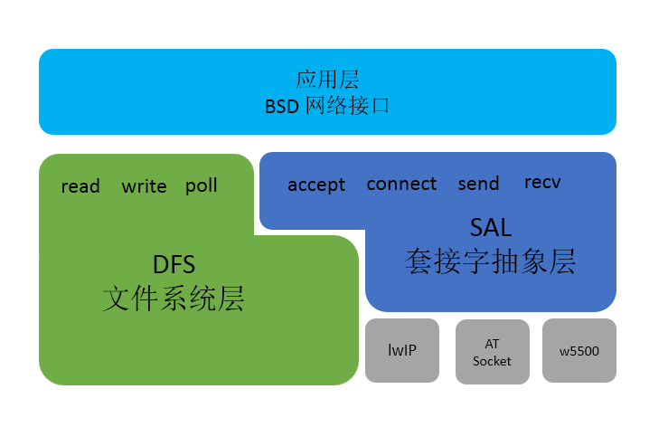

# SAL - 套接字抽象层 #

## 简介 ##

为了适配更多的网络协议栈类型，避免系统对单一网络协议栈的依赖，RT-Thread 系统提供了一套 SAL（套接字抽象层）组件，该组件完成对不同网络协议栈或网络实现接口的抽象并对上层提供一组标准的 BSD Socket API，这样开发者只需要关心和使用网络应用层提供的网络接口，而无需关心底层具体网络协议栈类型和实现，极大的提高了系统的兼容性，方便开发者完成协议栈的适配和网络相关的开发。

主要功能特点：

- 抽象、统一多种网络协议栈接口；
- 支持标准 BSD Socket API；
- 自定义协议栈或网络实现的注册方式；
- 统一的 FD 管理，便于使用 read/write  poll/select 来操作网络功能；

## 网络框架 ##

RT-Thread 的网络框架主要采用如下结构形式， 如图 **SAL 网络框架图**所示：



最顶层是网络应用层，提供一套标准 BSD Socket API ，如 socket、connect 等函数，用于系统中大部分网络开发应用。

第二部分为文件系统层，在 RT-Thread 系统中，通过 DFS 文件系统程序可以使用标准的接口函数实现不同的文件系统操作。网络套接字接口也是支持文件系统结构，使用网络套接字接口时创建的网络套接字描述符由文件系统统一管理，所以网络套接字描述符也可使用标准文件操作接口，文件系统层为上层应用层提供的接口有：read、write、close、poll/select 等。

第三部分为套接字抽象层，通过它 RT-Thread 系统能够适配下层不同的网络协议栈，并提供给上层统一的网络编程接口，方便不同协议栈的接入。套接字抽象层为上层应用层提供接口有：accept、connect、send、recv 等。

第四部分为协议栈层，该层包括几种常用的 TCP/IP 协议栈，例如嵌入式开发中常用的轻型 TCP/IP 协议栈 lwIP 以及 RT-Thread 自主研发的 AT Socket 网络功能实现等。这些协议栈或网络功能实现直接和硬件接触，完成数据从网络层到传输层的转化。

RT-Thread 的网络应用层提供的接口主要以标准 BSD Socket API 为主，这样能确保程序可以在 PC 上编写、调试，然后再移植到 RT-Thread 操作系统上。

## 工作原理 ###

SAL 组件主要实现的两个功能：支持多个协议栈接入和统一抽象接口函数。对于不同的协议栈或网络功能实现，网络接口的名称可能各不相同，以 connect 连接函数为例，lwIP 协议栈中接口名称为 lwip_connect ，而 AT Socket 网络实现中接口名称为 at_connect。SAL 组件提供对不同协议栈或网络实现接口的抽象和统一，组件在 socket 创建时通过**判断传入的协议簇（domain）类型来判断使用的协议栈或网络功能**，完成 RT-Thread 系统中多协议的接入与使用。

 ```c
    int socket(int domain, int type, int protocol);
 ```

上述为标准 BSD Socket API 中 socket 创建函数的定义，其中 `domain` 表示协议域又称为协议簇（family），用于判断使用哪种协议栈或网络实现，AT Socket 网络实现的协议簇类型为 `AF_AT`，lwIP 协议栈使用协议簇类型有 `AF_INET`、`AF_INET6` 等。开启 lwIP 协议栈支持后，使用 AF_INET 创建网络套接字，则此套接字底层使用 lwIP 协议栈函数实现。

> AT Socket 是 RT-Thread 自主研发的基于 AT 组件的网络功能实现，其设备的连接和数据的通讯都是通过 AT 命令完成，支持标准 BSD Socket API 。

目前 RT-Thread 系统中网络软件包或网络功能的 socket 创建函数中协议簇类型固定，若要支持不同的协议栈或网络实现需要修改传入的协议簇类型。为了适配不同协议栈或网络实现，SAL 组件中对于每个协议栈或者网络实现提供两种协议簇类型匹配方式：**主协议簇类型和次协议簇类型**。socket 创建时先判断传入协议簇类型是否存在已经支持的主协议类型，如果是则使用对应协议栈或网络实现，如果不是判断次协议簇类型是否支持。目前系统支持协议簇类型如下：

 ```c
    lwIP 协议栈： family = AF_INET、sec_family = AF_INET

    AT Socket 网络实现： family = AF_AT、sec_family = AF_INET
 ```

 对于 SAL 组件中协议簇的支持，组件中每个协议簇类型存在一个协议簇结构体，由协议簇结构体列表统一管理，协议簇结构体中定义了该协议栈的执行函数，如 lwIP 协议栈中的 lwip_socket()、lwip_connect() 等。 SAL 组件中创建的每个 socket 也存在结构体定义，由 socket 结构体列表统一管理，socket 结构体中存放当前 socket 的执行函数和基本信息，在 socket 创建时通过判断传入协议簇类型，注册对应协议簇执行函数到 socket 结构体执行函数中。之后，使用该 socket 进行函数操作时，主要是获取 socket 结构体中的协议簇执行函数，完成函数操作。如下为 SAL 组件中 connect 函数抽象实现示例：

 ```c
 /* SAL 组件为应用层提供的标准 BSD Socket API */
int connect(int s, const struct sockaddr *name, socklen_t namelen)
{
    /* 获取 SAL 套接字描述符 */
    int socket = dfs_net_getsocket(s);

    /* 通过 SAL 套接字描述符执行 sal_connect 函数 */
    return sal_connect(socket, name, namelen);
}

 /* SAL 组件抽象函数接口实现 */
int sal_connect(int socket, const struct sockaddr *name, socklen_t namelen)
{
    struct socket *sock;

    /* 通过 SAL 套接字描述符获取 socket 结构体 */
    sock = sal_get_socket(socket);
    if (!sock)
    {
        return -1;
    }

    if (sock->ops->connect == RT_NULL)
    {
        return -RT_ENOSYS;
    }

    /* 调用获取结构体中对应的协议簇执行函数 */
    return sock->ops->connect((int) sock->user_data, name, namelen);
}

/* 协议簇执行函数调用底层 lwIP 协议栈函数实现 */
int lwip_connect(int socket, const struct sockaddr *name, socklen_t namelen)
{
    ...
}
 ```

## 配置选项 ##

当我们使用 SAL 组件时需要在 rtconfig.h 中定义如下配置：

```c
#define RT_USING_SAL
#define SAL_USING_LWIP
#define SAL_USING_AT
#define SAL_USING_POSIX
#define SAL_PROTO_FAMILIES_NUM 4
```

- `RT_USING_SAL`： 用于开启 SAL 功能；
- `SAL_USING_LWIP`： 用于开启 lwIP 协议栈支持； 
- `SAL_USING_AT`：用于开启 AT Socket 协议栈支持；

> 目前 SAL 抽象层只支持 lwIP 协 议栈和 AT Socket 协议栈，系统中开启 SAL 需要至少开启一种协议栈支持。

- `SAL_USING_POSIX`： 用于开启 POSIX 文件系统相关函数支持，如 read、write、select/poll 等；
- `SAL_PROTO_FAMILIES_NUM`: 支持最大的同时开启的协议栈或网络实现数量；

上面配置选项可以直接在 `rtconfig.h` 文件中添加使用，也可以通过组件包管理工具 ENV 配置选项加入，ENV 工具中具体配置路径如下：

```C
RT-Thread Components  ---> 
     Network stack  --->
        Socket abstraction layer  --->  
        [*] Enable socket abstraction layer
               protocol family type  --->
        [*]    Enable BSD socket operated by file system API
        (4)    the number of protocol family 
```

配置完成可以通过 scons 命令重新生成功能，完成 SAL 组件的添加。

## 初始化 ##

配置开启 SAL 选项之后，需要在启动时对它进行初始化，开启 SAL 功能，如果程序中已经使用了组件自动初始化，则不再需要额外进行单独的初始化，否则需要在初始化任务中调用如下函数：

    int sal_init(void);

该初始化函数主要是对 SAL 组件进行初始，支持组件重复初始化判断，完成对组件中使用的互斥锁等资源的初始化。 SAL 组件中没有创建新的线程，这也意味着 SAL 组件资源占用极小，目前 SAL 组件资源占用为 ROM 2.8K 和 RAM 0.6K。

除了 SAL 组件的初始化，我们在使用 SAL 组件之前还需要对其支持的协议栈或网络实现完成注册过程。对于 SAL 组件中协议栈或网络实现的注册，主要是完成以下初始化及协议簇注册过程，确保 socket 创建时能找到对应的协议簇类型。

### lwIP 协议栈注册 ###

如果开启 lwIP 支持，需要在 SAL 组件中对 lwIP 协议栈的进行注册初始化，主要是在 `sal_socket/proto/lwip/af_inet_lwip.c` 文件中完成，如果文件中已经完成自动初始化则可忽略，如果没有则需要调用如下初始化函数：

    int lwip_inet_init(void)；

### AT Socket网络功能注册 ###

如果开启 AT Socket 支持，需要在 SAL 组件中对于 AT Socket 协议栈的进行注册初始化，主要是在 `sal_socket/proto/at/src/af_inet_at.c` 文件中完成，如果文件中已经完成自动初始化则可忽略，如果没有则需要调用如下初始化函数：

    int at_inet_init(void)；

初始化完成之后就可以正常使用 SAL 组件，使用抽象的标准 BSD Socket API 编程。

## API 接口介绍 ##

SAL 组件抽象出标准 BSD Socket API 接口，如下是对常用网络接口的介绍：

### 创建套接字（socket） ###

`int socket(int domain, int type, int protocol);`

用于根据指定的地址族、数据类型和协议来分配一个套接字描述符及其所用的资源。

| 参数              | 描述                                |
|:------------------|:------------------------------------|
|domain             | 协议族类型                            |
|type               | 协议类型                              |
|protocol           | 实际使用的运输层协议                   |
| **返回**          | **描述**                              |
|0                  | 成功，返回一个代表套接字描述符的整数     |
|-1                 | 失败                                  |

**domain**

 协议族

- PF_INET： IPv4 
- PF_INET6： IPv6.

**type** 

协议类型

- SOCK_STREAM： 可靠的面向连接的服务或者 Stream Sockets
- SOCK_DGRAM： 数据包服务或者 Datagram Sockets
- SOCK_RAW： 网络层的原始协议

### 绑定套接字（bind） ###

`int bind(int s, const struct sockaddr *name, socklen_t namelen);`

用于将端口号和 IP 地址绑定带指定套接字上。当使用 `socket()` 创造一个套接字时, 只是给定了协议族，并没有分配地址，在套接字接收来自其他主机的连接前，必须用 `bind()` 给它绑定一个地址和端口号。  

| 参数              | 描述                                          |
|:------------------|:------------------------------------         |
|s                  | 套接字描述符                                  |
|name               | 指向 `sockaddr` 结构体的指针，代表要绑定的地址  |
|namelen            | sockaddr结构体的长度                          |
| **返回**          | **描述**                                      |
|0                  | 成功                                          |
|-1                 | 失败                                          |

### 监听套接字（listen） ###

`int listen(int s, int backlog);`

用于 TCP 服务器监听指定套接字连接。

| 参数              | 描述                                 |
|:------------------|:------------------------------------|
|s                  | 套接字描述符                         |
|backlog            | 表示一次能够等待的最大连接数目        |
| **返回**          | **描述**                            |
|0                  | 成功                                |
|-1                 | 失败                                |

### 接收连接（accept） ###

`int accept(int s, struct sockaddr *addr, socklen_t *addrlen);`

当应用程序监听来自其他主机的连接时，使用 `accept()` 函数初始化连接，`accept()` 为每个连接创立新的套接字并从监听队列中移除这个连接。 

| 参数              | 描述                                 |
|:------------------|:------------------------------------|
|s                  | 套接字描述符                         |
|addr               | 客户端设备地址信息                   |
|addrlen            | 客户端设备地址结构体的长度            |
| **返回**          | **描述**                            |
|0                  | 成功，返回新创建的套接字描述符        |
|-1                 | 失败                                |

### 建立连接（connect） ###

`int connect(int s, const struct sockaddr *name, socklen_t namelen);`

用于建立与指定 socket 的连接。

| 参数              | 描述                                 |
|:------------------|:------------------------------------|
|s                  | 套接字描述符                         |
|name               | 服务器地址信息                       |
|namelen            | 服务器地址结构体的长度               |
| **返回**          | **描述**                            |
|0                  | 成功，返回新创建的套接字描述符        |
|-1                 | 失败                                |

### TCP 数据发送（send） ###

`int send(int s, const void *dataptr, size_t size, int flags);`

发送数据，常用于 TCP 连接。

| 参数              | 描述                                 |
|:------------------|:------------------------------------|
|s                  | 套接字描述符                         |
|dataptr            | 发送的数据指针                       |
|size               | 发送的数据长度                       |
|flags              | 标志，一般为0                        |
| **返回**          | **描述**                            |
|\>0                | 成功，返回发送的数据的长度            |
|<=0                | 失败                                |

### TCP 数据接收（recv） ###

`int recv(int s, void *mem, size_t len, int flags);`

接收数据，常用于 TCP 连接。

| 参数              | 描述                                 |
|:------------------|:------------------------------------|
|s                  | 套接字描述符                         |
|mem                | 接收的数据指针                       |
|len                | 接收的数据长度                       |
|flags              | 标志，一般为0                        |
| **返回**          | **描述**                            |
|\>0                | 成功，返回接收的数据的长度            |
|=0                 | 目标地址已传输完并关闭连接            |
|<0                 | 失败                                |

### UDP 数据发送（sendto） ###

`int sendto(int s, const void *dataptr, size_t size, int flags, const struct sockaddr *to, socklen_t tolen);`

发送数据，常用于UDP 连接。

| 参数              | 描述                                 |
|:------------------|:------------------------------------|
|s                  | 套接字描述符                         |
|dataptr            | 发送的数据指针                       |
|size               | 发送的数据长度                       |
|flags              | 标志，一般为0                        |
|to                 | 目标地址结构体指针                    |
|tolen              | 目标地址结构体长度                    |
| **返回**          | **描述**                            |
|\>0                | 成功，返回发送的数据的长度            |
|<=0                | 失败                                |

### UDP 数据接收（recvfrom） ###

`int recvfrom(int s, void *mem, size_t len, int flags, struct sockaddr *from, socklen_t *fromlen);`

接收数据，常用于UDP 连接。

| 参数              | 描述                                 |
|:------------------|:------------------------------------|
|s                  | 套接字描述符                         |
|mem                | 接收的数据指针                       |
|len                | 接收的数据长度                       |
|flags              | 标志，一般为0                        |
|from               | 接收地址结构体指针                   |
|fromlen            | 接收地址结构体长度                   |
| **返回**          | **描述**                            |
|\>0                | 成功，返回接收的数据的长度            |
|=0                 | 接收地址已传输完并关闭连接            |
|<0                 | 失败                                |


### 关闭套接字（closesocket） ### 

`int closesocket(int s);`

关闭连接，释放资源。

| 参数              | 描述                                 |
|:------------------|:------------------------------------|
|s                  | 套接字描述符                         |
| **返回**          | **描述**                             |
|0                  | 成功                                |
|-1                 | 失败                                |

### 按设置关闭套接字（shutdown） ###

`int shutdown(int s, int how);`

提供更多的权限控制套接字的关闭过程。

| 参数              | 描述                                 |
|:------------------|:------------------------------------|
|s                  | 套接字描述符                         |
|how                | 套接字控制的方式                     |
| **返回**          | **描述**                            |
|0                  | 成功                                |
|-1                 | 失败                                |

**how**

- 0： 停止接收当前数据，并拒绝以后的数据接收；
- 1： 停止发送数据，并丢弃未发送的数据；
- 2： 停止接收和发送数据。

### 设置套接字选项（setsockopt） ###

`int setsockopt(int s, int level, int optname, const void *optval, socklen_t optlen);`

设置套接字模式，修改套接字配置选项。

| 参数              | 描述                                 |
|:------------------|:------------------------------------|
|s                  | 套接字描述符                         |
|level              | 协议栈配置选项                       |
|optname            | 需要设置的选项名                     |
|optval             | 设置选项值的缓冲区地址               |
|optlen             | 设置选项值的缓冲区长度               |
| **返回**          | **描述**                            |
|=0                 | 成功                                |
|<0                 | 失败                                |

**level**

- SOL_SOCKET：套接字层
- IPPROTO_TCP：TCP层
- IPPROTO_IP：IP层 

**optname**

- SO_KEEPALIVE：设置保持连接选项
- SO_RCVTIMEO：设置套接字数据接收超时
- SO_SNDTIMEO：设置套接数据发送超时

### 获取套接字选项（getsockopt） ###

`int getsockopt(int s, int level, int optname, void *optval, socklen_t *optlen);`

获取套接字配置选项。

| 参数              | 描述                                 |
|:------------------|:------------------------------------|
|s                  | 套接字描述符                         |
|level              | 协议栈配置选项                       |
|optname            | 需要设置的选项名                     |
|optval             | 获取选项值的缓冲区地址                |
|optlen             | 获取选项值的缓冲区长度地址            |
| **返回**          | **描述**                            |
|=0                 | 成功                                |
|<0                 | 失败                                |

### 获取远端地址信息（getpeername） ###

`int getpeername(int s, struct sockaddr *name, socklen_t *namelen);`

获取与套接字相连的远端地址信息。

| 参数              | 描述                                 |
|:------------------|:------------------------------------|
|s                  | 套接字描述符                         |
|name               | 接收信息的地址结构体指针              |
|namelen            | 接收信息的地址结构体长度              |
| **返回**          | **描述**                            |
|=0                 | 成功                                |
|<0                 | 失败                                |

### 获取本地地址信息（getsockname） ###

`int getsockname(int s, struct sockaddr *name, socklen_t *namelen);`

获取本地套接字地址信息。

| 参数              | 描述                                 |
|:------------------|:------------------------------------|
|s                  | 套接字描述符                         |
|name               | 接收信息的地址结构体指针              |
|namelen            | 接收信息的地址结构体长度              |
| **返回**          | **描述**                            |
|=0                 | 成功                                |
|<0                 | 失败                                |

### 配置套接字参数（ioctlsocket） ###

`int ioctlsocket(int s, long cmd, void *arg);`

设置套接字控制模式。

| 参数              | 描述                                 |
|:------------------|:------------------------------------|
|s                  | 套接字描述符                         |
|cmd               | 套接字操作命令                        |
|arg               | 操作命令所带参数                      |
| **返回**          | **描述**                            |
|=0                 | 成功                                |
|<0                 | 失败                                |

**cmd**

- FIONBIO：开启或关闭套接字的非阻塞模式，arg 参数 1 为开启非阻塞，0 为关闭非阻塞。

## 网络协议栈接入方式 ##

网络协议栈或网络功能实现的接入，主要是对协议簇结构体的初始化和注册处理,并且添加到 SAL 组件中协议簇列表中，协议簇结构体定义如下：

```c
struct proto_family
{
    int family;                        /* primary protocol families type*/
    int sec_family;                    /* secondary protocol families type*/
    int             (*create)(struct socket *socket, int type, int protocol);   /* register socket options */

    struct hostent* (*gethostbyname)  (const char *name);
    int             (*gethostbyname_r)(const char *name, struct hostent *ret, char *buf, size_t buflen, struct hostent **result, int *h_errnop);
    void            (*freeaddrinfo)   (struct addrinfo *ai);
    int             (*getaddrinfo)    (const char *nodename, const char *servname, const struct addrinfo *hints, struct addrinfo **res);
};
```

- `family`： 每个协议栈支持的主协议簇类型，例如 lwIP 的为 AF_INET ，AT Socket 为 AF_AT。
- `sec_family`：每个协议栈支持的次协议簇类型，用于支持单个协议栈或网络实现时，匹配软件包中其他类型的协议簇类型。
- `create`： 主要是对 socket 相关执行函数的注册，例如 connect、close 等函数的，将当前协议栈的执行函数注册进创建的 SAL 组件中 socket 结构体中。
- 其他函数： 为套接字无关执行函数，用于匹配每个协议栈或网络实现中的执行函数。

以下为 AT Socket 网络实现的接入注册流程，开发者可参考实现其他的协议栈或网络实现的接入：

```c
#include <netdb.h>          
#include <sal.h>            /* SAL 组件结构体存放头文件 */
#include <at_socket.h>      /* AT Socket 相关头文件 */

#ifdef RT_USING_DFS_NET
#include <dfs_poll.h>       /* poll 函数实现相关头文件 */
#endif

#ifdef RT_USING_DFS_NET
/* 自定义的 poll 执行函数，用于 poll 中处理接收的事件 */
static int at_poll(struct dfs_fd *file, struct rt_pollreq *req)
{
    int mask = 0;
    struct at_socket *sock;
    struct socket *sal_sock;

    sal_sock = sal_get_socket((int) file->data);
    if(!sal_sock)
    {
        return -1;
    }

    sock = at_get_socket((int)sal_sock->user_data);
    if (sock != NULL)
    {
        rt_base_t level;

        rt_poll_add(&sock->wait_head, req);

        level = rt_hw_interrupt_disable();
        if (sock->rcvevent)
        {
            mask |= POLLIN;
        }
        if (sock->sendevent)
        {
            mask |= POLLOUT;
        }
        if (sock->errevent)
        {
            mask |= POLLERR;
        }
        rt_hw_interrupt_enable(level);
    }

    return mask;
}
#endif

/* 定义和赋值 Socket 执行函数，每个创建的新 Socket 套接字存在该执行函数存放与 Socket 结构体中，当执行相关函数是调用 */
static const struct proto_ops at_inet_stream_ops =
{
    at_socket,
    at_closesocket,
    at_bind,
    NULL,
    at_connect,
    NULL,
    at_sendto,
    at_recvfrom,
    at_getsockopt,
    at_setsockopt,
    at_shutdown,
    NULL,
    NULL,
    NULL,

#ifdef SAL_USING_POSIX
    at_poll,
#else
    NULL,
#endif /* SAL_USING_POSIX */
};

static int at_create(struct socket *socket, int type, int protocol)
{
    RT_ASSERT(socket);
    /* 协议簇结构体中 create 函数的实现，用于注册上面定义的 ops 执行函数到 socket 结构体中 */
    socket->ops = &at_inet_stream_ops;
    return 0;
}

static const struct proto_family at_inet_family_ops = {
    AF_AT,
    AF_INET,
    at_create,
    /* Socket 套接字无关函数，由协议簇结构体注册 */
    at_gethostbyname,
    NULL,
    at_freeaddrinfo,
    at_getaddrinfo,
};

int at_inet_init(void)
{
    /* 注册协议簇结构体到协议簇列表，开发者通过 socket 函数传入的 family 类型匹配对应使用的协议簇类型 */
    sal_proto_family_register(&at_inet_family_ops);
    return 0;
}
/* 自动初始化函数 */
INIT_COMPONENT_EXPORT(at_inet_init);

```