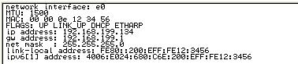
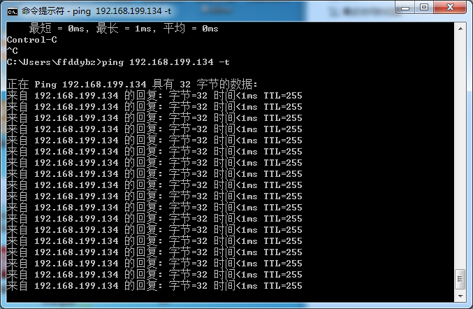
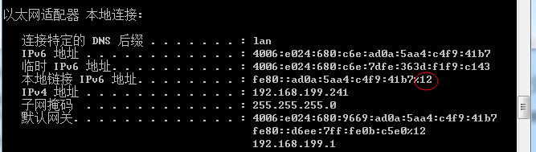
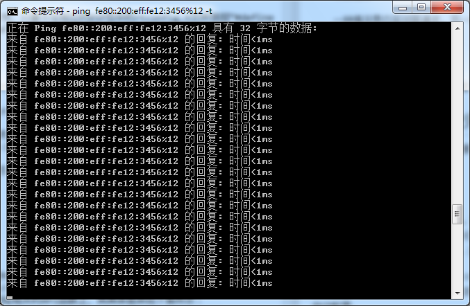
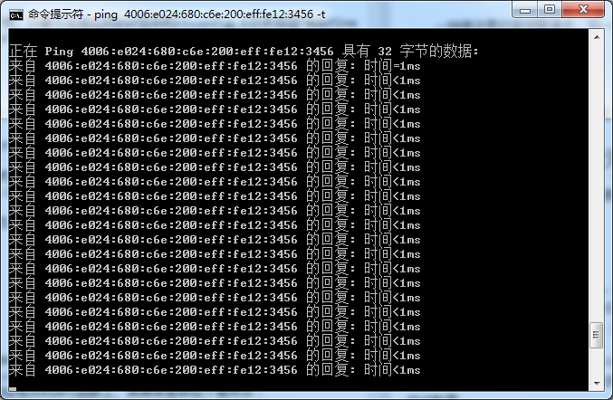

# lwIP-IPv6 支持 #

## lwIP-IPV6 概况 ##

[lwIP的git开发分支](http://git.savannah.gnu.org/cgit/lwip.git) 支持IPv4/v6双栈，并已支持绝大多数的IPv6特性，开发者认为lwIP的实现已基本稳定[(详见邮件)](https://lists.nongnu.org/archive/html/lwip-users/2012-11/msg00045.html)，但是由于部分开发者认为lwIP并未实现6LowPAN和RPL协议，所以近期内并不会发布lwIP 1.5.0-Beta（[原文](http://savannah.nongnu.org/task/?12586)）。lwIP的git开发分支已支持以下功能（[原文](http://lwip.wikia.com/wiki/LwIP_IPv4/IPv6_stacks)）：

1. 	支持IPv6层协议
2. 	在tcp/udp/raw 协议控制块中支持IPv6
3. 	Netconn API支持IPv6
4. 	Socket API支持IPv6
5. 	支持ICMPv6
6. 	支持邻居发现协议(Neighbor Discovery)
7. 	支持组播侦听发现模式(Multicast Listener Discovery)
8. 	支持无状态地址自动配置
9. 	支持IPv6数据包分片与重组
10. 网络接口层支持IPv6

尽管lwIP-head的IPv6支持已基本稳定，但是仍有部分功能待开发：
	
1. 在不同的netif结构体中添加Scope id的支持，在利用link-local地址通信时，Scope id可提供路由信息
2. 在BSD Socket API中有多个函数实现不完善

## IPv6基础知识 ##

互联网通信协议第6版（Internet Protocol version 6，简写：IPv6）是互联网协议的最新版本，用于数据包交换互联网络的网络层协议，旨在解决IPv4地址枯竭的问题，IPv6意图取代IPv4，而IPv4在网络上仍然占据着绝大多数的份额。

### IPv6报文格式

IPv6报文有8个字段，固定大小为40字节，每一个IPv6数据包都必须包含报头，基本报头结构如下图所示：

	 0                   1                   2                   3
     0 1 2 3 4 5 6 7 8 9 0 1 2 3 4 5 6 7 8 9 0 1 2 3 4 5 6 7 8 9 0 1
    +-+-+-+-+-+-+-+-+-+-+-+-+-+-+-+-+-+-+-+-+-+-+-+-+-+-+-+-+-+-+-+-+
    |Version| Traffic Class |              Flow Label               |
    +-+-+-+-+-+-+-+-+-+-+-+-+-+-+-+-+-+-+-+-+-+-+-+-+-+-+-+-+-+-+-+-+
    |      PlayLoad Length          |  Next Header  |   Hop Limit   |
    +-+-+-+-+-+-+-+-+-+-+-+-+-+-+-+-+-+-+-+-+-+-+-+-+-+-+-+-+-+-+-+-+
    |                            Source                             |
    |                            Address                            |
    +-+-+-+-+-+-+-+-+-+-+-+-+-+-+-+-+-+-+-+-+-+-+-+-+-+-+-+-+-+-+-+-+
    |                            Destination                        |
    |                            Address                            |
    +-+-+-+-+-+-+-+-+-+-+-+-+-+-+-+-+-+-+-+-+-+-+-+-+-+-+-+-+-+-+-+-+

- Version：版本号，长度为4bit，对于IPv6，其值为6
- Traffic Class：流类别，长度为8bit，用于表示数据报的优先级，用于QoS
- Flow Label：流标签，长度为20bit，用于区分实时流量，不同的流标签+源地址可以唯一确定一条数据流
- PlayLoad Length：有效载荷长度，长度为16bit，指的是紧跟IPv6报头的数据包的其他部分（扩展报头和上层协议数据单元）。该字段只能表示最大长度为65535字节的有效载荷。如果长度超过这个值，该字段会置0，而有效载荷长度用逐跳选项扩展报头中的超大有效载荷选项来表示
- Next Header：下一个报头，长度为8bit，该字段定义了紧跟在IPv6报头后面的第一个扩展报头的类型，或者上层协议数据单元中的协议类型
- Hop Limit：跳数限制，长度为8bit，该字段类似于IPv4中的TTL字段，定义了IP数据包经过的最大跳数。
- Source Address：源地址，128bit，发送方的地址
- Destination Address：目的地址，128bit，接收方的地址

### IPv6扩展报头

IPv4中，报头包含了可选字段，因而其报头长度是不定长的，在路由转发过程中，处理携带可选字段的IPv4报文会占用很大的资源，因而在IPv6中将扩展报头放在了IPV6报头和上层协议数据单元之间。IPV6可拥有0个、1个或多个的扩展头，扩展报头由前一段的next hdr标识。

IPv6支持的扩展报头有：逐跳选项扩展报头、路由扩展报头、分片扩展报头、目的选项扩展报头、身份验证扩展报头、封装安全有效载荷扩展报头，由于每一个扩展头的内容可以决定是否处理下一个报头，所以扩展报头出现的次序必须遵循一定的原则，一般来说会按照如下的顺序排列：1）IPV6报头 2）逐跳选项扩展报头 3）目的选项扩展报头 4）路由扩展报头 5）分片扩展报头 6）身份认证扩展报头 7）封装安全有效载荷扩展报头 8）目的选项扩展报头 9）上层应用报头，除了目的选项扩展报头外，其他扩展报头只能出现一次，每个扩展头的含义如下：

1. 逐跳选项扩展报头，定义了转发路径中每个节点需要处理的信息
2. 目的选项扩展报头，目的节点需要处理的信息
3. 路由扩展报头，可用于强制数据包经过的特定设备
4. 分片扩展报头，发送大于MTU的包，不同于IPV4，IPV6只在源节点进行数据的分片
5. 身份认证扩展报头，确保数据来源于可信任的源点
6. 封装安全有效载荷扩展报头，可以有效避免在数据传输过程中被窃听、抓取内容等行为

### IPv4与IPv6对比

1.  地址空间，IPv6拥有比IPv4多得多的地址空间，由于IPv6采用了128位的地址，可支持（43亿×43亿×43亿×43亿）个地址，无疑地址空间是IPv6的最大优势。
2.  报文格式，IPv6报头中删除了首部长度、DSCP、标识符、标志、分片偏移、首部检验和的6个域，修改了traffic class（流量分类）、playload length（负载长度）、hop limit（跳数限制）域，对应于IPv4中的协议、全长、存活时间，增加了Flow Label（流标签）域，并且由于IPv6采用了固定长度的报头，IPv6的报文处理效率较IPv4更加高效。
3.  安全性，在IPv4中安全机制往往在应用层实现，而在IPv6中增加了IPsec的加密与认证，可以保证端对端传输的安全。
4.  服务质量的保证，由于IPv6报头中增加了流标签域，可提供QoS的支持，这符合多媒体网络迅速发展的趋势。
5.  移动性的改进，IPv6的地址自动配置协议简化了移动节点的转交地址的分配，从而避免了外地代理的使用，并由于IPv6扩展报头的设计，可解决移动IPv4的三角路由、源地址过滤问题，移动通信处理效率更高。

### IPv6地址

#### IPv6地址格式

IPv6地址包含128比特，以16位为一组，每组以冒号“：”隔开，可分为8组，每组以4位十六进制方式表示，以下为合法的IPv6地址：“2001:0DB8:02de:0000:0000:0000:0000:0e13”,同时IPv6还支持省略规则：

规则1：每项数字前导0可省略，省略后前导数字仍为0的可继续，上述的地址可等效为：“2001:DB8:2de:0:0:0:0:e13”

规则2：可用双冒号“::”来表示一组或多组的0，但只可出现一次，上述的地址可等效为："2001:DB8:2de::e13"


#### IPv6地址分类

IPv6地址可分为三类：

- 单播(unicast)地址
	
	单播地址标示一个网络接口。协议会把送往地址的数据包投送其接口，IPv6的单播地址包括了未指定地址、环回地址、全球单播地址、链路本地地址、唯一本地地址ULA(Unique Local Address)。

- 任播(anycast)地址
	
	任播是IPv6特有的数据发送方式，它拥有一组接收节点的地址栏表，但指定为Anycast的数据包，只会发送给距离最近或者发送成本最低的其中一个接收地址。任播地址设计用来给多个主机或者节点提供相同服务时提供冗余功能和负载分担功能，任播地址与单播地址拥有相同的地址空间，主要用于移动IPv6中。

- 多播(multicast)地址
	
	多播地址也称为组播地址。多播地址被指定为一群不同的接口，发送到多播地址的数据包会被发送到所有的地址。多播地址由皆为1的字节起始，它们的前置为FF00::/8。其中第二个字节的最后四个比特用以表示“范畴”，有node-local(0x1),link-local(0x2),site-local(0x5),organization-local(0x8),global(0xE)。	

### 邻居发现协议

邻居发现协议（Neighbor Discovery Protocol，简写：NDP或ND），是用于替代IPv4中的ARP协议的，用于实现网络层地址与链路层地址之间的映射，NDP实现效率要比ARP高。IPv6邻居发现协议可提供以下功能：1）无服务器的自动配置 2）路由发现 3）地址解析 4）邻居不可达检测 5）链路MTU发现 6）下一跳决定 7）重复地址检测等功能。邻居发现协议定义了5种ICMPv6类型：

- 路由请求：
	
	当节点不愿意等到下一次周期性的路由器宣告时，可发起一次路由器请求的多播包。正在初始化的节点可使用路由器请求，这样即可得到路由相关参数

- 路由通告：
	
	路由器可周期性的发送路由器宣告包，这样链路内的节点就可获得相关的路由配置信息，路由器宣告包的跳数限制为255，这样防止非本链路的路由发送路由器宣告包来干扰本链路的通信

- 邻居请求
	
	用于确定邻居的链路层地址，判断缓存中的链路层地址是否可达，判断链路中是否存在重复的IP地址。这里的跳数限制仍然为255，防止邻居请求包通过路由器

- 邻居通告
	
	一种情况是应答邻居请求，另一种情况是当节点发生改变时发送多播包给本链路中的节点通知链路层地址改变信息。

- 重定向	
 
	由路由器发送，用于把数据包重定向到两路中链路质量更好的节点

## RT-Thread中如何使用IPv6##

要使用IPv6，需使用lwip-head版本的协议栈，需要在相应的BSP包中的rtconfig.h文件中添加“#define RT\_USING\_LWIP\_HEAD”。

### 使用IPv4/v6双栈

要在RT-Thread中使用IPv4/v6双栈，需在相应的BSP包中的rtconfig.h文件添加“#define RT\_LWIP\_IPV6”,这样当网络初始化后就会为网卡创建link-local address，用于局域网内的通信。当然也可以为网卡创建全球单播地址，这里提供了两种方式：

1）无状态地址自动配置，只要在rtconfig.h中添加“#define RT\_LWIP\_IPV6\_AUTOCONFIG”,这样将开发板接入支持IPv6的路由器时（如极路由和其他支持openwrt系统的路由器）即可完成IPv6地址的自动配置。

2）手动配置，在你的应用程序中完成了网络的初始化后，可调用“void set_if6(char* netif\_name, char* ip6\_addr)” 函数设置网络地址，如你想要为网卡“e0”设置“2001::1”的地址，则调用set\_if6("e0", "2001::1")即可。

### 仅使用IPv4

在lwip-head中网络层仅使用IPv4协议栈，只要不在相应的BSP包中的rtconfig.h文件添加“#define RT\_LWIP\_IPV6”即可，RT-Thread不会将IPv6相关的源文件、头文件编译进去。IPv4中仍然支持使用DHCP协议与静态IP地址配置。

### 对开发板进行Ping测试

要了解PC和开发板之间的网络连接状态时，需使用Ping的测试方法。

首先，要在串口调试工具中输入list_if()获取开发板的IPv4/IPv6地址。如下图所示：



IPv4地址为192.168.199.134，IPv6的link-local地址为fe80::200:eff:fe12:3456,IPv6地址为4006:e024:680:c6e:200:eff:fe12:3456。

需注意的是，测试前，要通过使用路由器或者静态IP的方法使得PC与开发板处于同一网段，这里为简单起见使用路由器。

- IPv4 ping测试

	IPv4的ping测试十分简单，只需打开命令提示符输入ping 192.168.199.134 -t即可
	
	

- IPv6 link-local address ping测试
	
	首先需在命令提示符中输入ipconfig，获得以下信息:
	
	

	之后在命令行提示符中输入ping fe80::200:eff:fe12:3456%12 -t

	

- IPv6地址的测试

	在命令提示符中输入ping 4006:e024:680:c6e:200:eff:fe12:3456 -t
	
	

至此你已进入IPv6的世界了。

## IPv6 Socket API实例#

### IPv4/v6 Socket编程异同

在基于Socket API进行开发的应用程序中，IPv4/v6都使用基本相同的编程模型；如connect、accept、listen、send/sendto、recv/recvfrom等Socket API函数在IPv4/v6中用法也基本一致，而IPv4与IPv6间的主要差异体现在了与地址相关的API函数上，其具体差异如下图所示：

----------------------------------------------------------------------------------------------
                                  IPv4                             IPv6
-------------------------------   ------------------------------   ---------------------------
地址族                             AF_INET                          AF_INET6
协议族                             PF_INET                          PF_INET6
数据结构                           in_addr sockaddr_in              in6_addr sockaddr_in6
结构体成员                         结构体长度：sin_len                sin6_len
                                  协议族：sin_family                sin6_family
                                  端口号：sin_port                  sin6_port
                                  地址：sin_addr                    sin6_addr
通配地址                           INADDR_ANY                       IP6_ADDR_ANY
网络地址转换函数                    inet_aton()/inet_addr()          inet_pton()
                                  inet_ntoa()                      inet_ntop()
地址转换函数                       gethostbyname()                  gethostbyname()
----------------------------------------------------------------------------------------------

getaddrinfo()函数在lwIP中实现不完善，这里只介绍inet_pton()函数的用法：

函数原型：inet_pton(int family, const char *strptr, void *addrptr)

返回值：若成功返回1，若输入的不是有效表达式返回0，若出错则返回-1

参数：family：可以是AF_INET,也可以是AF_INET6,如果以不被支持的地址族作为参数，函数将返回错误，并置errno为EAFNOSUPPORT

作用：该函数尝试转换由strptr指向的字符串，并通过addrptr指针存放二进制结果，完成了表达式到IPv6地址的转换。

关于getaddrinfo()、inet_ntop()函数的用法请参见Unix网络编程卷一。

### PC测试程序

往往对IPv4的TCP/UDP的SERVer/Client进行测试时，Windows下有许多网络调试工具，而IPv6的测试主要是在Linux下利用Socket API编写的测试程序，具体请见[GitHub](https://github.com/hduffddybz/IPV6_SOCKET)，请在Linux的命令行下完成测试。

### TCP Server例子

下面是一个在RT-Thread上使用BSD socket接口的TCP服务端例子。当把这个代码加入到RT-Thread时，它会自动向finsh命令行添加一个tcpserver6命令，在finsh上执行tcpserver6()函数即可启动这个TCP服务端，该TCP服务端在端口10001上进行监听。

当有TCP客户向这个服务端进行连接后，只要服务端接收到数据，它就会立即向客户端发送“This is TCP Server from RT-Thread.”的字符串。

如果服务端接收到q或Q字符串时，服务器将主动关闭这个TCP连接。如果服务端接收到exit字符串时，那么将退出服务。

``` c
#include <rtthread.h>
#include <lwip/sockets.h> /* 使用BSD Socket需包含socket.h */

#define SERV_PORT 10001 /* 服务器使用的端口号 */
#define BUF_SIZE  1024 /* 接收缓冲区的长度 */
#define BACKLOG	  5 /* 请求队列的长度 */

static const char send_data[] = "This is TCP Server from RT-Thread.";

void tcpserver6(void)
{
	int sockfd, clientfd;
	struct sockaddr_in6 server_addr6, client_addr6;
	int bytes_received;
	char *recv_data;
	rt_uint32_t sin_size;
	rt_bool_t stop = RT_FALSE;

    /* 分配接收用的数据缓冲 */
	recv_data = rt_malloc(BUF_SIZE);
	if(recv_data == RT_NULL)
	{
	    /* 分配内存失败,返回 */
		rt_kprintf("No memory\n");
		return ;
	}
	
	/* 创建一个socket,family类型为PF_INET6,套接字类型为SOCK_STREAM */
	if((sockfd = socket(PF_INET6, SOCK_STREAM, 0)) == -1)
	{
		rt_kprintf("Socket error\n");
		rt_free(recv_data);
		return ;
	}
	
	/* 初始化服务端地址 */
	server_addr6.sin6_family = AF_INET6;
	memcpy(server_addr6.sin6_addr.s6_addr, IP6_ADDR_ANY, 16);
	server_addr6.sin6_port = htons(SERV_PORT);
    
    /* 绑定Socket到服务端地址 */
	if(bind(sockfd, (struct sockaddr *)&server_addr6, sizeof(struct sockaddr)) == -1)
	{
		rt_kprintf("Bind error\n");
		rt_free(recv_data);
		return ;
	}
	/* 在Socket上进行监听 */
	if(listen(sockfd, BACKLOG) == -1)
	{
		rt_kprintf("Listen error\n");
		rt_free(recv_data);
		return ;
	}

	rt_sprintf(recv_data, "%4d", SERV_PORT);
	rt_kprintf("\nTCPServer Waiting for client on port %s...\n", recv_data);
	
	while(stop != RT_TRUE)
	{ 
		sin_size = sizeof(struct sockaddr_in6);
		/*接收客户端的连接*/
		clientfd = accept(sockfd, (struct sockaddr *)&client_addr6, &sin_size);
		rt_kprintf("I got a connection from (IP:%s, PORT:%d\n)", inet6_ntoa(client_addr6.sin6_addr), ntohs(client_addr6.sin6_port));
		/* 客户端连接的处理 */
		while(1)
		{
		    /* 发送数据到connected socket */
			send(clientfd, send_data, strlen(send_data), 0);

            /* 接收数据,但并不一定能够收到BUF_SIZE大小的数据 */
			bytes_received = recv(clientfd, recv_data, BUF_SIZE, 0);
			if(bytes_received <= 0)
			{
			    /* 接收失败,关闭这个Connected Socket */
				closesocket(clientfd);
				break;
			}
			/* 收到数据,加入字符串结束符*/
			recv_data[bytes_received] = '\0';
			if(strcmp(recv_data, "q") == 0 || strcmp(recv_data, "Q") == 0)
			{
			    /* 关闭连接 */
				closesocket(clientfd);
				break;
			}
			else if(strcmp(recv_data, "exit") == 0)
			{
			    /* 关闭服务端 */
				closesocket(clientfd);
				stop = RT_TRUE;
				break;
			}
			else
			{
			    /* 打印收到的数据 */
				rt_kprintf("RECEIVED DATA = %s\n", recv_data);
			}
		}
	}
	
	closesocket(sockfd);
	rt_free(recv_data);
	
	return ;
}
#ifdef RT_USING_FINSH
#include <finsh.h>
FINSH_FUNCTION_EXPORT(tcpserver6, start tcp server via ipv6 );
#endif

```

### TCP Client例子

下面则是另一个如在RT-Thread上使用BSD socket接口的TCP客户端例子。当把这个代码加入到RT-Thread时，它会自动向finsh 命令行添加一个tcpclient6命令，在finsh上执行tcpclient6()函数即可启动这个TCP服务端。

当TCP客户端连接成功时，它会接收服务端传过来的数据。当有数据接收到时，如果是以q或Q开头，它将主动断开这个连接；否则会把接收的数据在控制终端中打印出来，然后发送“This is TCP Client from RT-Thread.”的字符串。

``` c
#include <rtthread.h>
#include <lwip/netdb.h> /*为解析主机名，需包含netdb.h */
#include <lwip/sockets.h>

#define SERV_PORT 12345 /* 服务器端口号 */
#define SERVADDR "4006:e024:680:c6e:223:8bff:fe59:de90"	/* 由于未实现Scope id，请不要使用link-local Address */
#define BUF_SIZE 1024 /* 缓冲区的长度 */
static const char send_data[] = "This is TCP Client from RT-Thread.";

void tcpclient6(void)
{
	char* recv_data;
	int sockfd, bytes_received;
	struct sockaddr_in6 server_addr6;
	int status = 0;
	
	/* 分配接收用的数据缓冲 */
	recv_data = rt_malloc(BUF_SIZE);
	if(recv_data == RT_NULL)
	{
	    /* 分配内存失败,返回 */
		rt_kprintf("No memory\n");
		return ;
	}
	
	/* 创建一个socket,family类型为PF_INET6,套接字类型为SOCK_STREAM */
	if((sockfd = socket(PF_INET6, SOCK_STREAM, 0)) == -1)
	{
		rt_kprintf("Socket error\n");
		rt_free(recv_data);
		return ;
	}
	
	/* 初始化预连接的服务端地址 */
	memset(&server_addr6, 0, sizeof(server_addr6));
	server_addr6.sin6_family = AF_INET6;
	server_addr6.sin6_port = htons(SERV_PORT);
	/* 将字符串转换为IPv6地址 */
	if(inet_pton(AF_INET6, SERVADDR, &server_addr6.sin6_addr.s6_addr) != 1)
	{
		rt_kprintf("inet_pton() error\n");
		rt_free(recv_data);
		return ;
	}
	
	/* 连接到服务端 */
	status = connect(sockfd, (struct sockaddr *)&server_addr6, sizeof(server_addr6));
	if(status < 0)
	{
	    /* 连接失败 */
		rt_kprintf("Connect error:%d\n", status);
		rt_free(recv_data);
		return ;
	}
	
	while(1)
	{
	    /* 从socket连接中接收最大BUF_SIZE字节数据 */
		bytes_received = recv(sockfd, recv_data, BUF_SIZE -1, 0);
		if(bytes_received <= 0)
		{
		    /* 接收失败，关闭这个连接 */
			closesocket(sockfd);
			rt_free(recv_data);
			break;
		}
		/* 收到数据,加入字符串结束符*/
		recv_data[bytes_received] = '\0';
		if(strcmp(recv_data, "q") == 0 || strcmp(recv_data, "Q") == 0)
		{
		    /* 关闭这个连接 */
			closesocket(sockfd);
			rt_free(recv_data);
			break;
		}
		else
		{
		    /* 打印收到的数据 */
			rt_kprintf("\nReceived data = %s ", recv_data);
		}
		/* 发送数据到服务端 */
		send(sockfd, send_data, strlen(send_data), 0);
	}

	return;		
}

#ifdef RT_USING_FINSH
#include <finsh.h>
FINSH_FUNCTION_EXPORT(tcpclient6, startup tcp client via ipv6);
#endif

``` 

### UDP Server例子

下面是一个在RT-Thread上使用BSD socket接口的UDP服务端例子，当把这个代码加入到RT-Thread操作系统时，它会自动向finsh命令行添加一个udpserver6命令，在finsh上执行udpserver6()函数即可启动这个UDP服务端，该UDP服务端在端口10012上进行监听。

当服务端接收到数据时，它将把数据打印到控制终端中；如果服务端接收到exit字符串时，那么服务端将退出服务。

``` c
#include <rtthread.h>
#include <lwip/sockets.h>

#define SERV_PORT 10012
#define BUF_SIZE  1024

static const char send_data[] = "This is UDP Server from RT-Thread.";

void udpserver6(void)
{
	int sockfd;
	struct sockaddr_in6 server_addr6;
	struct sockaddr_in6 client_addr6;
	int bytes_read;
	char *recv_data;
	rt_uint32_t addr_len;

    /* 分配接收用的数据缓冲 */
	recv_data = rt_malloc(BUF_SIZE);
	if(recv_data == RT_NULL)
	{
	    /* 分配内存失败，返回 */
		rt_kprintf("No memory\n");
		return ;
	}

    /* 创建一个socket,family类型为PF_INET6,套接字类型为SOCK_DGRAM */
	if((sockfd = socket(AF_INET6, SOCK_DGRAM, 0)) == -1)
	{
		rt_kprintf("Socket error\n");
		rt_free(recv_data);
		return ;
	}
	
	/* 初始化服务端地址 */
	server_addr6.sin6_family = AF_INET6;
	server_addr6.sin6_port = htons(SERV_PORT);
	memcpy(server_addr6.sin6_addr.s6_addr, IP6_ADDR_ANY, 16);
	
	/* 绑定Socket到服务端地址 */
	if(bind(sockfd, (struct sockaddr *)&server_addr6, sizeof(struct sockaddr)) == -1)
	{
	    /* 绑定地址失败 */
		rt_kprintf("Bind error\n");
		rt_free(recv_data);
		return ;
	}
	rt_sprintf(recv_data, "%4d", SERV_PORT);
	rt_kprintf("UDPServer Waiting for client on port %s...\n", recv_data);
	
	addr_len = sizeof(struct sockaddr);
	while(1)
	{
	    /* 从socket中收取最大BUF_SIZE字节数据 */
		bytes_read = recvfrom(sockfd, recv_data, BUF_SIZE - 1, 0, (struct sockaddr *)&client_addr6, &addr_len);
		/* 收到数据,加入字符串结束符*/
		recv_data[bytes_read] = '\0';
		/* 输出接收的数据 */
		rt_kprintf("\n(%s, %d) said:", inet6_ntoa(client_addr6.sin6_addr), ntohs(client_addr6.sin6_port));
		rt_kprintf("%s", recv_data);
		
		if(strcmp(recv_data, "exit") == 0)
		{   
		    /* 关闭服务端 */
			closesocket(sockfd);
			rt_free(recv_data);
			break;
		}
	}
	return ;
}

#ifdef RT_USING_FINSH
#include <finsh.h>
FINSH_FUNCTION_EXPORT(udpserver6, startup udp server via ipv6);
#endif
``` 

### UDP Client例子


下面是另一个在RT-Thread上使用BSD socket接口的UDP客户端例子。当把这个代码加入到RT-Thread时，它会自动向finsh命令行添加一个udpclient6命令，在finsh上执行udpclient6()函数即可启动这个UDP客户端。当UDP客户端启动后，它将发送“This is UDP Client from RT-Thread.”的字符串给服务端，然后接收数据并打印数据。

``` c
#include <rtthread.h>
#include <lwip/netdb.h> /*为解析主机名，需包含netdb.h */
#include <lwip/sockets.h>

#define SERV_PORT 22345 /* 服务器端口号 */
#define SERVADDR "4006:e024:680:c6e:223:8bff:fe59:de90" 	/* 由于未实现Scope id，请不要使用link-local Address */
#define BUF_SIZE 1024 /* 缓冲区的长度 */
static const char send_data[] = "This is UDP Client from RT-Thread.";

void udpclient6(void)
{
	char *recv_data;
	int sockfd;
	struct sockaddr_in6 server_addr6, client_addr6;
	socklen_t clientlen;
	
	/* 分配接收用的数据缓冲 */
	recv_data = rt_malloc(BUF_SIZE);
	if(recv_data == RT_NULL)
	{
		rt_kprintf("No memory\n");
		return ;
	}
	
	/* 创建一个socket,family类型为PF_INET6,套接字类型为SOCK_DGRAM */
	if((sockfd = socket(PF_INET6, SOCK_DGRAM, 0)) == -1)
	{
		rt_kprintf("Socket error\n");
		rt_free(recv_data);
		return ;
	}
	
	/* 初始化预连接的服务端地址 */
	memset(&server_addr6, 0, sizeof(server_addr6));
	server_addr6.sin6_family = AF_INET6;
	server_addr6.sin6_port = htons(SERV_PORT);
	/* 将字符串转换为IPv6地址 */
	if(inet_pton(AF_INET6, SERVADDR, &server_addr6.sin6_addr.s6_addr) != 1)
	{
		rt_kprintf("inet_pton() error\n");
		rt_free(recv_data);
		return ;
	}
	
	/* 发送数据到服务端 */
	if(sendto(sockfd, send_data, sizeof(recv_data), 0, (struct sockaddr *)&server_addr6, sizeof(server_addr6)) < 0)
	{
		rt_kprintf("Sendto error\n");
		rt_free(recv_data);
		return ;
	}
	
	rt_kprintf("Waiting for a reply...\n");
	
	clientlen = sizeof(client_addr6);
	/* 接收数据 */
	if(recvfrom(sockfd, recv_data, BUF_SIZE, 0, (struct sockaddr *)&client_addr6, &clientlen) < 0)
	{
	    /* 接收失败 */
		rt_kprintf("Recvfrom error\n");
		rt_free(recv_data);
		return ;
	}
	/* 打印数据 */
	rt_kprintf("got '%s'\n", recv_data);
	closesocket(sockfd);
}
#ifdef RT_USING_FINSH
#include <finsh.h>
FINSH_FUNCTION_EXPORT(udpclient6, start udp server via ipv6);
#endif
``` 


