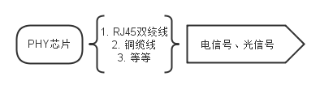
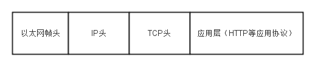
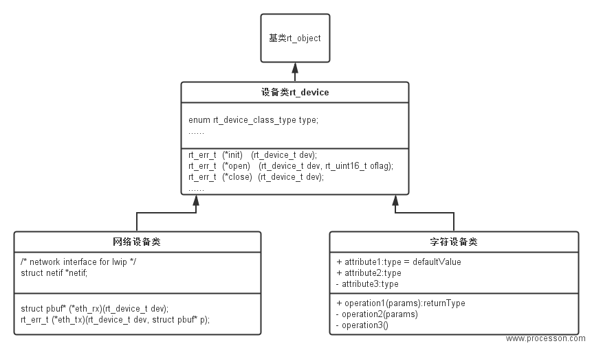
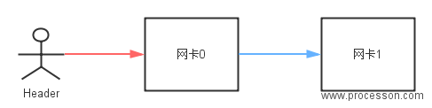
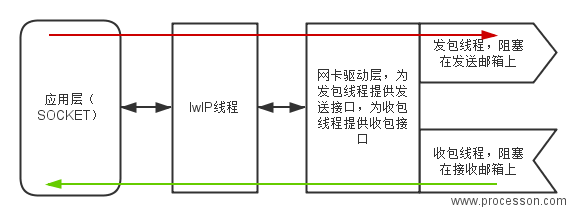

# lwIP - 轻型TCP/IP协议栈 #

## 简介 ##
[lwIP（light-weight IP)](http://savannah.nongnu.org/projects/lwip/)最初由瑞典计算机科学院（Swedish Institute of Computer Science）的Adam Dunkels开发，现在由Kieran Mansley领导的一个全球开发团队开发、维护的一套用于嵌入式系统的开放源代码TCP/IP协议栈，它在包含完整的TCP协议的基础上实现了小型化的资源占用，因此它十分适合于应用到嵌入式设备中，其占用的资源体积RAM大概为几十kB，ROM大概为40KB。

lwIP结构精简，功能完善，因而用户群较为广泛。RT-Thread实时操作系统就采用了lwIP做为默认的TCP/IP协议栈，同时根据小型设备的特点对lwIP进行了再次优化，使其资源占用体积进一步地缩小，RAM 的占用可缩小到5kB附近（未计算上层应用使用TCP/IP协议时的空间占用量）。本章内容将为您讲述lwIP在RT-Thread中的使用方法。

主要特性（摘自lwIP官方网站）：

- 协议：IP，ICMP，UDP，TCP，IGMP，ARP，PPPoS，PPPoE
- DHCP client，DNS client，AutoIP/APIPA(Zeroconf)，SNMP agent(private MIB support)
- APIs：专门针对增强性能实现的API接口，可选的类BSD的Socket API。
- 延伸的特点：多个网络接口的IP转发，TCP拥塞控制，RTT往返时间估算、快速恢复和快速重传

## 协议分层 ##

可能大家对OSI七层模型并不陌生，它将网络协议很细致地从逻辑上分为了7层。但是实际运用中并不是按七层模型，一般大家都只使用5层模型。如下：
 物理层：一般包括物理媒介，电信号，光信号等，主要对应于PHY芯片，PHY芯片将数据传送给物理媒介（RJ45座->双绞线），如图：



- 数据链路层：一般简单称为MAC层，因为MAC芯片处于这层，对应于代码中的网卡驱动层。数据包在这一层一般称之为“以太网帧”。
- 网络层：对应于代码中IP层。
- 传输层：对应于代码中TCP层。
- 应用层：对应于代码中应用层数据，即SOCKET通信,recv()/send()的数据。

对于一个以太网数据包，我们在代码中能真实看到的包括4部分，分别对应链路层、网络层、传输层、应用层，如下图：



注：有几个概念需要解释一下，从网卡收到的数据，此时是一个完整的包含各层头的数据包，此时称之为“以太网帧”；当解开以太网帧头到达IP层，称之为“IP Packet（IP数据包）”；当解开IP头到达TCP层，称之为“TCP Segment（TCP分片）”；当解开TCP头时到达应用层，就是我们socket通信看到的数据了。

这种分层的设计作为一个协议设计与实现的向导，在这种方式下，每个协议可以分离地实现，互不干扰。然而严格的分层设计，各层间的通讯可能会导致总体的性能下降。为了克服这些问题，协议的某些内部细节可以被其他的协议共享，但是必须注意，只有重要的信息才能在各层间共享。

大部分的TCP/IP协议栈实现在应用层到底层之间都遵循严格的分层设计，然而底层或多或少可以有交叉。在大多数操作系统中，所有的底层协议都与操作系统的内核绑定在一起（成为OS内核的一部分），内核提供入口点（API）与应用层的进程通信。此时，应用程序可认为是TCP/IP协议栈的一个抽象，不用关心底层的细节，对于支持SOCKET的系统，直接使用SOCKET进行网络通信即可，这些操作基本和文件IO的操作差别不大。这意味着应用程序对底层一无所知，比如底层使用buffer缓冲数据，而应用层无法对buffer一无所知，如果有应用层有一部分数据频繁使用，而它是无法操作buffer将频繁使用的数据缓冲起来。

在最小系统中，一般不会严格地在内核和应用程序中间加一道保护屏障，如此应用程序可以使用共享内存（底层在内核中，与内核共享内存）的方式更轻松地与底层通信。具体来讲，应用层知道底层使用的缓冲处理机制，因此，应用层可以更高效的重用buffer。既然应用层可以和底层协议使用同一段内存，这样也可以节省拷贝带来的开销。

## lwIP不遵循严格的分层 ##

前面提到过TCP/IP的标准实现一般使用严格的分层，这对lwIP的设计与实现提供了指导意义。每个协议作为一个单独地模块，提供一些API作为协议的入口点。尽管这些协议都单独地实现，但是一些层（协议之间）违背了严格的分层标准，这样做是为了提高处理的速度和内存的占用。比如：在TCP分片的报文中，为了计算TCP校验和，我们需要知道IP协议层的源IP地址和目的IP地址，一般我们会构造一个伪的IP头（包含IP地址信息等），而常规的做法是通过IP协议层提供的API去获得这些IP地址，但是lwIP是拿到数据报文的IP头，从中解析得到IP地址。

## 进程模型（process model）##

以下将process翻译为“进程”只是便于说明问题，在不同的OS中也可能会是线程。

TCP/IP的进程模型可以被设计为以下两种：（当然也可以是其他的模型）
1. 每层的协议都作为一个独立的进程在运行，这种方式的好处在于代码易于理解和调试；同样也有不好之处，每数据报文经过每一层时，都需要进行一次上下文的切换（因为每层协议都在不同的进程中），在操作系统中，上下文的切换耗费资源比较大。
2. lwIP使用单进程模型，所有的协议都运行在一个进程中，并且与操作系统内核是分开的。应用程序可以驻留在lwIP进程中或者运行在一个分离的进程中，当应用程序与lwIP在一个进程中，协议栈和应用层通讯通过函数调用即可。

这两种方法各有优缺点，lwIP之所以运行在一个分离地，单独地进程中，是因为这样易于不同的操作系统移植，为啥？与内核耦合性小。为了更方便移植，lwIP加了一层操作系统模拟层，只要实现这里面的提供的函数移植的基本工作就完成了。下一章将介绍操作系统模拟层。

## 操作系统模拟层（OS emulation layer）##

不同的操作系统，提供不同的通信机制，而且这些通信的方法实现也不同，增加操作系统模拟层，将操作系统相关的功能函数和数据结构放在这一层中（对应于代码sys.c/h），这一层提供诸如创建lwIP进程，延时，互斥锁，信号量，邮箱等相关的函数。如下：

```c
    // Creates a new thread
    sys_thread_t sys_thread_new(const char *name, lwip_thread_fn thread, 
	                                void *arg, int stacksize, int prio);
    /** Create a new mutex
     * @param mutex pointer to the mutex to create
     * @return a new mutex */
    err_t sys_mutex_new(sys_mutex_t *mutex);
    /** Delete a semaphore
     * @param mutex the mutex to delete */
    void sys_mutex_free(sys_mutex_t *mutex); 
    #ifndef sys_msleep
    void sys_msleep(u32_t ms); /* only has a (close to) 1 jiffy resolution. */
    #endif
    /* Mailbox functions. */
    /** Create a new mbox of specified size
     * @param mbox pointer to the mbox to create
     * @param size (miminum) number of messages in this mbox
     * @return ERR_OK if successful, another err_t otherwise */
    err_t sys_mbox_new(sys_mbox_t *mbox, int size);
```

一般说来，移植到其他操作系统上时，实现这些接口即可，但是在实际的移植过程中还需要做一些细节处理。具体的一个移植的实现请看[RT-Thread源码](https://github.com/RT-Thread/rt-thread)对于sys.c/h如何处理的。

## RT-Thread中的lwIP ##

由于原版的lwIP更适合于在无操作系统的情况下运行，所以RT-Thread在移植lwIP的过程中根据RT-Thread的特点进行了适当调整。其结构如下图所示：

RT-Thread操作系统中的lwIP是从lwIP发布原始版本移植过来，然后添加了设备层以替换原来的驱动层。不同于原版，这里RT-Thread对于以太网数据的收发采用了独立的双线程（erx线程与etx线程）结构：

 * erx线程用于以太网报文的接收──当以太网硬件设备收到网络报文产生中断时，中断服务例程将会通过邮箱的形式唤醒erx线程，让erx线程主动进行以太网报文收取过程，当erx线程收到有效网络报文后，它通过邮箱的形式通知给LwIP的主线程（tcp线程）；
 * tcp的发送操作则是通过邮箱的形式唤醒etx线程进行实际的以太网硬件写入。在正常情况下，erx线程和etx线程的优先级是相同的，用户可以根据自身实际要求进行微调以侧重接收或发送。

### lwIP版本 ###

[RT-Thread lwIP](https://github.com/RT-Thread/rt-thread/tree/master/components/net)包含三个版本，分别为：“1.3.2”，“1.4.1”，“2.0.2”，在RT-Thread 3.0版本中默认会选择“2.0.2”版本，lwIP的具体版本号信息可以在src/include/lwip/init.h中查询。如下：
```c
/** X.x.x: Major version of the stack */
#define LWIP_VERSION_MAJOR      1U
/** x.X.x: Minor version of the stack */
#define LWIP_VERSION_MINOR      4U
/** x.x.X: Revision of the stack */
#define LWIP_VERSION_REVISION   1U
```
RT-Thread通过宏去指定使用哪个版本的lwIP，熟悉RT-Thread的朋友都知道一般都是使用[scons工具](http://www.rt-thread.org/dokuwiki/doku.php?id=rt-thread%E4%B8%AD%E7%9A%84scons%E4%BD%BF%E7%94%A8%E8%AF%A6%E8%A7%A3)（类linux下的make工具）生成项目工程文件（MDK工程、IAR工程等）,因此在每个版本的文件夹中包含了一个SConscript文件，该文件中会依赖与相应的宏加入到工程文件中，以lwIP1.4.1中的[SConscript](https://github.com/RT-Thread/rt-thread/blob/master/components/net/lwip-1.4.1/SConscript)为例：

```python
group = DefineGroup('LwIP', src, depend = ['RT_USING_LWIP', 'RT_USING_LWIP141'], CPPPATH = path)
```

大家可以看到加入该版本下的所有文件依赖与（RT_USING_LWIP、RT_USING_LWIP141）两个宏，这两个宏在RT-Thread源码的[rtconfig.h](https://github.com/RT-Thread/rt-thread/tree/master/bsp)中，这个文件与实际的项目（或者说BSP、开发板相关），点开“bsp”目录下任何一个文件夹都可以找到rtconfig.h，也可以由menuconfig配置后生成对应的rtconfig.h头文件。

### RT-Thread 网络设备管理 ###

RT-Thread有一套自己的设备框架，这里只作一个简单的描述，具体请参考《RT-Thread编程指南第六章--I/O设备管理》，可以在[RT-Thread入门帖](http://www.rt-thread.org/node/64)中找到。RT-Thread中包含很多设备，为了更简单的添加或者管理这些设备，使用面向对象的思想将设备抽象成了一个类，基于这个“设备类”，派生出不同类型的设备类，如：网络设备类、字符设备类、块设备类、音频设备类等等，它们的关系图如下：



除基类以外，其他继承自基类的类分别加上了与基类不同的属性和接口，比如设备类中就添加了基类没有的设备初始化，打开，关闭的接口和设备类型的属性。

有了这个概念接着说RT-Thread中设备的管理，RT-Thread中有一个数组，里面为每一种对象（信号、邮箱、设备、定时器）分配了一个链表（用结构体封装了），如下：

```c
struct rt_object_information
{
    enum rt_object_class_type type;	/**< object class type*/
    rt_list_t object_list;	/**< object list */
    rt_size_t object_size;	/**< object size */
};

struct rt_object_information rt_object_container[RT_Object_Class_Unknown] =
{
    /* initialize object container - thread */
    {
        RT_Object_Class_Thread, _OBJ_CONTAINER_LIST_INIT(RT_Object_Class_Thread),
        sizeof(struct rt_thread)
    },
#ifdef RT_USING_SEMAPHORE
    /* initialize object container - semaphore */
    {
        RT_Object_Class_Semaphore,
        _OBJ_CONTAINER_LIST_INIT(RT_Object_Class_Semaphore),
        sizeof(struct rt_semaphore)
    },
#endif
#ifdef RT_USING_MUTEX
    /* initialize object container - mutex */
    {
        RT_Object_Class_Mutex, _OBJ_CONTAINER_LIST_INIT(RT_Object_Class_Mutex),
        sizeof(struct rt_mutex)
    },
#endif
#ifdef RT_USING_EVENT
    /* initialize object container - event */
    {
        RT_Object_Class_Event, _OBJ_CONTAINER_LIST_INIT(RT_Object_Class_Event),
        sizeof(struct rt_event)
    },
#endif
#ifdef RT_USING_MAILBOX
    /* initialize object container - mailbox */
    {
        RT_Object_Class_MailBox, _OBJ_CONTAINER_LIST_INIT(RT_Object_Class_MailBox),
        sizeof(struct rt_mailbox)
    },
#endif
#ifdef RT_USING_MESSAGEQUEUE
    /* initialize object container - message queue */
    {
        RT_Object_Class_MessageQueue,
        _OBJ_CONTAINER_LIST_INIT(RT_Object_Class_MessageQueue),
        sizeof(struct rt_messagequeue)
    },
#endif
#ifdef RT_USING_MEMHEAP
    /* initialize object container - memory heap */
    {
        RT_Object_Class_MemHeap, _OBJ_CONTAINER_LIST_INIT(RT_Object_Class_MemHeap),
        sizeof(struct rt_memheap)
    },
#endif
#ifdef RT_USING_MEMPOOL
    /* initialize object container - memory pool */
    {
        RT_Object_Class_MemPool, _OBJ_CONTAINER_LIST_INIT(RT_Object_Class_MemPool),
        sizeof(struct rt_mempool)
    },
#endif
#ifdef RT_USING_DEVICE
    /* initialize object container - device */
    {
        RT_Object_Class_Device, _OBJ_CONTAINER_LIST_INIT(RT_Object_Class_Device),
        sizeof(struct rt_device)
    },
#endif
    /* initialize object container - timer */
    {
        RT_Object_Class_Timer, _OBJ_CONTAINER_LIST_INIT(RT_Object_Class_Timer),
        sizeof(struct rt_timer)
    },
#ifdef RT_USING_MODULE
    /* initialize object container - module */
    {
        RT_Object_Class_Module, _OBJ_CONTAINER_LIST_INIT(RT_Object_Class_Module),
        sizeof(struct rt_module)
    },
#endif
};
```
具体地讲，RT-Thread中使用一个链表来维护所有的设备，当需要往系统中注册设备时，需要将设备添加到对应的链表中（当然如何添加，RT-Thread提供了相应的接口）。如果对代码不了解，简单点的理解方式请看下图（图中并不对应实际的代码，代码中用的双向链表）：



从图中可知，当系统需要操作网卡时，直接遍历这个链表即可。

### RT-Thread lwIP有哪些变化

- 上面提到过，将sys.c/h中的接口实现基本的移植工作就完成了，细心的读者可能会拿RT-Thread中lwIP这部分源码与lwIP官方的源码做一个对比，然后会发现RT-Thread增加一个“[arch](https://github.com/RT-Thread/rt-thread/tree/master/components/net/lwip-1.4.1/src/arch)”目录，这部分代码主要实现了前面提到的信号量、互斥锁、邮箱等sys.h文件中的接口，另外RT-Thread根据其系统自身增加了lwIP的初始化工作，如下：

```c
/**
 * LwIP system initialization
 */
void lwip_system_init(void)
{
    rt_err_t rc;
    struct rt_semaphore done_sem;

    /* set default netif to NULL */
    netif_default = RT_NULL;

    // 初始化信号量
    rc = rt_sem_init(&done_sem, "done", 0, RT_IPC_FLAG_FIFO);

    if (rc != RT_EOK)
    {
        LWIP_ASSERT("Failed to create semaphore", 0);

        return;
    }

    // 这是关键代码，调用sys_thread_new()创建lwIP线程，并回调tcpip_init_done_callback()初始化网卡设备的IP、子网掩码、网关，并设置系统中默认使用的网卡设备。如果查询到当前系统中没有网卡设备，则返回。（大家可能会有疑问，没有网卡设备怎么办？答：还会有其他的地方以添加网卡设备并初始化）。
    tcpip_init(tcpip_init_done_callback, (void *)&done_sem);

    //等待tcpip_init_done_callback()初始化完成
    /* waiting for initialization done */
    if (rt_sem_take(&done_sem, RT_WAITING_FOREVER) != RT_EOK)
    {
        rt_sem_detach(&done_sem);

        return;
    }
    // 将此信号量从系统的信号量对象链表中删除
    rt_sem_detach(&done_sem);

    /* set default ip address */
#if !LWIP_DHCP  //如果未启用DHCP，即表示使用静态IP，则配置默认网卡的IP、子网掩码、网关
    if (netif_default != RT_NULL)   //上面提到过，如果此时系统还未注册网卡设备，这部分代码也不执行。
    {
        struct ip_addr ipaddr, netmask, gw;

        IP4_ADDR(&ipaddr, RT_LWIP_IPADDR0, RT_LWIP_IPADDR1, RT_LWIP_IPADDR2, 
		           RT_LWIP_IPADDR3);
        IP4_ADDR(&gw, RT_LWIP_GWADDR0, RT_LWIP_GWADDR1, RT_LWIP_GWADDR2, 
		           RT_LWIP_GWADDR3);
        IP4_ADDR(&netmask, RT_LWIP_MSKADDR0, RT_LWIP_MSKADDR1, RT_LWIP_MSKADDR2, 
		           RT_LWIP_MSKADDR3);

        netifapi_netif_set_addr(netif_default, &ipaddr, &netmask, &gw);
    }
#endif
}
```
这段代码的解释通过注释的方式，大家请参照代码旁边的注释。

- 单纯在RT-Thread中完成lwIP初始化和创建lwIP线程的工作还是不够的，因为要让协议栈与外界通信，系统必须可以收发数据，所以还需要硬件驱动的支持，这时牵扯到RT-Thread收发包的设计和网卡驱动。这部分的整体框架如下图：



由此可知，RT-Thread中将lwIP应用起来主要包括三个核心步骤：
1. 创建收发包线程，调用接口eth_system_device_init()。
2. 提供网卡驱动，调用网卡初始化函数，注册网卡设备。（驱动不同相应的接口函数可能不同）
3. 初始化lwIP，创建lwIP线程，调用接口lwip_sys_init()（实际调用的lwip_system_init()）。

至此，三个步骤完成之后，应用层便可以直接与外界通讯。

### RT-Thread lwIP相关代码补充说明

前面已经提及过lwip_system_init()中，当系统中没有网卡设备时，有一部分初始化工作（为网卡初始化IP、子网掩码、网关等）是不会进行的。此时lwIP线程已经创建，如果需要和外界通讯，那么必须为系统添加网卡设备，而在网卡驱动中，网卡设备初始化时，会向系统注册，此时网卡设备就添加到系统中了。以[RT-Thread双网口开发板网卡驱动例程](http://www.rt-thread.com/download/fm3/examples/)为例，参考以下代码：

```c
#ifdef USING_MAC0
    /* set autonegotiation mode */
    fm3_emac_device0.phy_mode = EMAC_PHY_AUTO;
    fm3_emac_device0.FM3_ETHERNET_MAC = FM3_ETHERNET_MAC0;
    fm3_emac_device0.ETHER_MAC_IRQ = ETHER_MAC0_IRQn;

    // OUI 00-00-0E FUJITSU LIMITED
    fm3_emac_device0.dev_addr[0] = 0x00;
    fm3_emac_device0.dev_addr[1] = 0x00;
    fm3_emac_device0.dev_addr[2] = 0x0E;
    /* set mac address: (only for test) */
    fm3_emac_device0.dev_addr[3] = 0x12;
    fm3_emac_device0.dev_addr[4] = 0x34;
    fm3_emac_device0.dev_addr[5] = 0x56;

    fm3_emac_device0.parent.parent.init  = fm3_emac_init;
    fm3_emac_device0.parent.parent.open  = fm3_emac_open;
    fm3_emac_device0.parent.parent.close = fm3_emac_close;
    fm3_emac_device0.parent.parent.read  = fm3_emac_read;
    fm3_emac_device0.parent.parent.write = fm3_emac_write;
    fm3_emac_device0.parent.parent.control   = fm3_emac_control;
    fm3_emac_device0.parent.parent.user_data = RT_NULL;

    fm3_emac_device0.parent.eth_rx = fm3_emac_rx;
    fm3_emac_device0.parent.eth_tx = fm3_emac_tx;

    /* init tx buffer free semaphore */
    rt_sem_init(&fm3_emac_device0.tx_buf_free, "tx_buf0", EMAC_TXBUFNB, 
					RT_IPC_FLAG_FIFO);
    // 关键代码，驱动向系统注册网卡设备
    eth_device_init(&(fm3_emac_device0.parent), "e0");
#endif /* #ifdef USING_MAC0 */
```
eth_device_init()调用eth_device_init_with_flag()接口初始化网卡设备（为网卡添加名称，IP、子网掩码、网关，网卡设备使用的发包和收包接口函数等），并向系统注册网卡设备。到此，解释了一个现象：网卡驱动初始化和lwIP的初始化顺序互换并无影响。

## 网络编程示例 ##
### UDP使用示例 ###

下面是一个在RT-Thread上使用BSD socket接口的UDP服务端例子，当把这个代码加入到RT-Thread操作系统时，它会自动向finsh命令行添加一个udpserv命令，在finsh上执行udpserv()函数即可启动这个UDP服务端，该UDP服务端在端口5000上进行监听。

当服务端接收到数据时，它将把数据打印到控制终端中；如果服务端接收到exit字符串时，那么服务端将退出服务。

```c
/*
 * 代码清单：UDP服务端例子
 */
#include <rtthread.h>
#include <lwip/sockets.h> /* 使用BSD socket，需要包含sockets.h头文件 */

void udpserv(void* paramemter)
{
    int sock;
    int bytes_read;
    char *recv_data;
    rt_uint32_t addr_len;
    struct sockaddr_in server_addr, client_addr;

    /* 分配接收用的数据缓冲 */
    recv_data = rt_malloc(1024);
    if (recv_data == RT_NULL)
    {
        /* 分配内存失败，返回 */
        rt_kprintf("No memory\n");
        return;
    }

    /* 创建一个socket，类型是SOCK_DGRAM，UDP类型 */
    if ((sock = socket(AF_INET, SOCK_DGRAM, 0)) == -1)
    {
        rt_kprintf("Socket error\n");

        /* 释放接收用的数据缓冲 */
        rt_free(recv_data);
        return;
    }

    /* 初始化服务端地址 */
    server_addr.sin_family = AF_INET;
    server_addr.sin_port = htons(5000);
    server_addr.sin_addr.s_addr = INADDR_ANY;
    rt_memset(&(server_addr.sin_zero), 0, sizeof(server_addr.sin_zero));

    /* 绑定socket到服务端地址 */
    if (bind(sock, (struct sockaddr *) &server_addr, sizeof(struct sockaddr))
            == -1)
    {
        /* 绑定地址失败 */
        rt_kprintf("Bind error\n");

        /* 释放接收用的数据缓冲 */
        rt_free(recv_data);
        return;
    }

    addr_len = sizeof(struct sockaddr);
    rt_kprintf("UDPServer Waiting for client on port 5000...\n");

    while (1)
    {
        /* 从sock中收取最大1024字节数据 */
        bytes_read = recvfrom(sock, recv_data, 1024, 0,
                              (struct sockaddr *) &client_addr, &addr_len);
        /* UDP不同于TCP，它基本不会出现收取的数据失败的情况，除非设置了超时等待 */

        recv_data[bytes_read] = '\0'; /* 把末端清零 */

        /* 输出接收的数据 */
        rt_kprintf("\n(%s , %d) said : ", inet_ntoa(client_addr.sin_addr),
                   ntohs(client_addr.sin_port));
        rt_kprintf("%s", recv_data);

        /* 如果接收数据是exit，退出 */
        if (strcmp(recv_data, "exit") == 0)
        {
            lwip_close(sock);

            /* 释放接收用的数据缓冲 */
            rt_free(recv_data);
            break;
        }
    }

    return;
}

#ifdef RT_USING_FINSH
#include <finsh.h>
/* 输出udpserv函数到finsh shell中 */
FINSH_FUNCTION_EXPORT(udpserv, startup udp server);
#endif
```

下面是另一个在RT-Thread上使用BSD socket接口的UDP客户端例子。当把这个代码加入到RT-Thread时，它会自动向finsh命令行添加一个udpclient命令，在finsh上执行udpclient(url,port)函数即可启动这个UDP客户端，url指定了这个客户端连接到的服务端地址或域名，port是相应的端口号。

当UDP客户端启动后，它将连续发送5次“This is UDP Client from RT-Thread.”的字符串给服务端，然后退出。

```c
/*
 * 程序清单：UDP客户端例子
 */
#include <rtthread.h>
#include <lwip/netdb.h>   /* 为了解析主机名，需要包含netdb.h头文件 */
#include <lwip/sockets.h> /* 使用BSD socket，需要包含sockets.h头文件 */

/* 发送用到的数据 */
ALIGN(4)
const char send_data[] = "This is UDP Client from RT-Thread.\n";
void udpclient(const char* url, int port, int count)
{
    int sock;
    struct hostent *host;
    struct sockaddr_in server_addr;

    /* 通过函数入口参数url获得host地址（如果是域名，会做域名解析） */
    host = (struct hostent *) gethostbyname(url);

    /* 创建一个socket，类型是SOCK_DGRAM，UDP类型 */
    if ((sock = socket(AF_INET, SOCK_DGRAM, 0)) == -1)
    {
        rt_kprintf("Socket error\n");
        return;
    }

    /* 初始化预连接的服务端地址 */
    server_addr.sin_family = AF_INET;
    server_addr.sin_port = htons(port);
    server_addr.sin_addr = *((struct in_addr *) host->h_addr);
    rt_memset(&(server_addr.sin_zero), 0, sizeof(server_addr.sin_zero));

    /* 总计发送count次数据 */
    while (count)
    {
        /* 发送数据到服务远端 */
        sendto(sock, send_data, strlen(send_data), 0,
               (struct sockaddr *) &server_addr, sizeof(struct sockaddr));

        /* 线程休眠一段时间 */
        rt_thread_delay(50);

        /* 计数值减一 */
        count--;
    }

    /* 关闭这个socket */
    lwip_close(sock);
}

#ifdef RT_USING_FINSH
#include <finsh.h>
/* 输出udpclient函数到finsh shell中 */
FINSH_FUNCTION_EXPORT(udpclient, startup udp client);
#endif
```

### TCP使用示例 ###

下面是一个在RT-Thread上使用BSD socket接口的TCP服务端例子。当把这个代码加入到RT-Thread时，它会自动向finsh命令行添加一个tcpserv命令，在finsh上执行tcpserv()函数即可启动这个TCP服务端，该TCP服务端在端口5000上进行监听。
当有TCP客户向这个服务端进行连接后，只要服务端接收到数据，它就会立即向客户端发送“This is TCP Server from RT-Thread.”的字符串。

如果服务端接收到q或Q字符串时，服务器将主动关闭这个TCP连接。如果服务端接收到exit字符串时，那么将退出服务。

```c
/*
 * 程序清单：TCP服务端例子
 */
#include <rtthread.h>
#include <lwip/sockets.h> /* 使用BSD Socket接口必须包含sockets.h这个头文件 */

/* 发送用到的数据 */
ALIGN(4)
static const char send_data[] = "This is TCP Server from RT-Thread.";
void tcpserv(void* parameter)
{
    char *recv_data; /* 用于接收的指针，后面会做一次动态分配以请求可用内存 */
    rt_uint32_t sin_size;
    int sock, connected, bytes_received;
    struct sockaddr_in server_addr, client_addr;
    int ret;
    rt_bool_t stop = RT_FALSE; /* 停止标志 */

    recv_data = rt_malloc(1024); /* 分配接收用的数据缓冲 */
    if (recv_data == RT_NULL)
    {
        rt_kprintf("No memory\n");
        return;
    }

    /* 一个socket在使用前，需要预先创建出来，指定SOCK_STREAM为TCP的socket */
    if ((sock = socket(AF_INET, SOCK_STREAM, 0)) == -1)
    {
        /* 创建失败的错误处理 */
        rt_kprintf("Socket error\n");

        /* 释放已分配的接收缓冲 */
        rt_free(recv_data);
        return;
    }

    /* 初始化服务端地址 */
    server_addr.sin_family = AF_INET;
    server_addr.sin_port = htons(5000); /* 服务端工作的端口 */
    server_addr.sin_addr.s_addr = INADDR_ANY;
    rt_memset(&(server_addr.sin_zero), 8, sizeof(server_addr.sin_zero));

    /* 绑定socket到服务端地址 */
    if (bind(sock, (struct sockaddr *) &server_addr, sizeof(struct sockaddr))
            == -1)
    {
        /* 绑定失败 */
        rt_kprintf("Unable to bind\n");

        /* 释放已分配的接收缓冲 */
        rt_free(recv_data);
        return;
    }

    /* 在socket上进行监听 */
    if (listen(sock, 5) == -1)
    {
        rt_kprintf("Listen error\n");

        /* release recv buffer */
        rt_free(recv_data);
        return;
    }

    rt_kprintf("\nTCPServer Waiting for client on port 5000...\n");
    while (stop != RT_TRUE)
    {
        sin_size = sizeof(struct sockaddr_in);

        /* 接受一个客户端连接socket的请求，这个函数调用是阻塞式的 */
        connected = accept(sock, (struct sockaddr *) &client_addr, &sin_size);
        /* 返回的是连接成功的socket */

        /* 接受返回的client_addr指向了客户端的地址信息 */
        rt_kprintf("I got a connection from (%s , %d)\n", inet_ntoa(
                       client_addr.sin_addr), ntohs(client_addr.sin_port));

        /* 客户端连接的处理 */
        while (1)
        {
            /* 发送数据到connected socket */
            ret = send(connected, send_data, strlen(send_data), 0);
            if (ret < 0)
            {
                /* 接收失败，关闭这个连接 */
                lwip_close(sock);
                rt_kprintf("\nsend error,close the socket.\r\n");
                break;
            }
            else if (ret == 0)
            {
                /* 打印send函数返回值为0的警告信息 */
                rt_kprintf("\n Send warning,send function return 0.\r\n");
            }


            /*
             * 从connected socket中接收数据，接收buffer是1024大小，
             * 但并不一定能够收到1024大小的数据
             */
            bytes_received = recv(connected, recv_data, 1024, 0);
            if (bytes_received < 0)
            {
                /* 接收失败，关闭这个connected socket */
                lwip_close(connected);
                break;
            }
            else if (bytes_received == 0)
            {
                /* 打印recv函数返回值为0的警告信息 */
                rt_kprintf("\nReceived warning,recv function return 0.\r\n");
            }

            /* 有接收到数据，把末端清零 */
            recv_data[bytes_received] = '\0';
            if (strcmp(recv_data, "q") == 0 || strcmp(recv_data, "Q") == 0)
            {
                /* 如果是首字母是q或Q，关闭这个连接 */
                lwip_close(connected);
                break;
            }
            else if (strcmp(recv_data, "exit") == 0)
            {
                /* 如果接收的是exit，则关闭整个服务端 */
                lwip_close(connected);
                stop = RT_TRUE;
                break;
            }
            else
            {
                /* 在控制终端显示收到的数据 */
                rt_kprintf("RECIEVED DATA = %s \n", recv_data);
            }
        }
    }

    /* 退出服务 */
    lwip_close(sock);

    /* 释放接收缓冲 */
    rt_free(recv_data);

    return;
}

#ifdef RT_USING_FINSH
#include <finsh.h>
/* 输出tcpserv函数到finsh shell中 */
FINSH_FUNCTION_EXPORT(tcpserv, startup tcp server);
#endif
```

下面则是另一个如在RT-Thread上使用BSD socket接口的TCP客户端例子。当把这个代码加入到RT-Thread时，它会自动向finsh 命令行添加一个tcpclient命令，在finsh上执行tcpclient(url,port)函数即可启动这个TCP服务端，url指定了这个客户端连接到的服务端地址或域名，port是相应的端口号。
当TCP客户端连接成功时，它会接收服务端传过来的数据。当有数据接收到时，如果是以q或Q开头，它将主动断开这个连接；否则会把接收的数据在控制终端中打印出来，然后发送“This is TCP Client from RT-Thread.”的字符串。

```c
/*
 * 程序清单：TCP客户端例子
 */
#include <rtthread.h>
#include <lwip/netdb.h>   /* 为了解析主机名，需要包含netdb.h头文件 */
#include <lwip/sockets.h> /* 使用BSD socket，需要包含sockets.h头文件 */

/* 发送用到的数据 */
ALIGN(4)
static const char send_data[] = "This is TCP Client from RT-Thread.";
void tcpclient(const char* url, int port)
{
    char *recv_data;
    struct hostent *host;
    int sock, bytes_received;
    struct sockaddr_in server_addr;
    int ret;

    /* 通过函数入口参数url获得host地址（如果是域名，会做域名解析） */
    host = gethostbyname(url);

    /* 分配用于存放接收数据的缓冲 */
    recv_data = rt_malloc(1024);
    if (recv_data == RT_NULL)
    {
        rt_kprintf("No memory\n");
        return;
    }

    /* 创建一个socket，类型是SOCKET_STREAM，TCP类型 */
    if ((sock = socket(AF_INET, SOCK_STREAM, 0)) == -1)
    {
        /* 创建socket失败 */
        rt_kprintf("Socket error\n");

        /* 释放接收缓冲 */
        rt_free(recv_data);
        return;
    }

    /* 初始化预连接的服务端地址 */
    server_addr.sin_family = AF_INET;
    server_addr.sin_port = htons(port);
    server_addr.sin_addr = *((struct in_addr *) host->h_addr);
    rt_memset(&(server_addr.sin_zero), 0, sizeof(server_addr.sin_zero));

    /* 连接到服务端 */
    if (connect(sock, (struct sockaddr *) &server_addr,
                sizeof(struct sockaddr)) == -1)
    {
        /* 连接失败 */
        rt_kprintf("Connect error\n");

        /*释放接收缓冲 */
        rt_free(recv_data);
        return;
    }

    while (1)
    {
        /* 从sock连接中接收最大1024字节数据 */
        bytes_received = recv(sock, recv_data, 1024, 0);
        if (bytes_received < 0)
        {
            /* 接收失败，关闭这个连接 */
            lwip_close(sock);

            /* 释放接收缓冲 */
            rt_free(recv_data);
            break;
        }
        else if (bytes_received == 0)
        {
            /* 打印recv函数返回值为0的警告信息 */
            rt_kprintf("\nReceived warning,recv function return 0. \r\n");
        }

        /* 有接收到数据，把末端清零 */
        recv_data[bytes_received] = '\0';

        if (strcmp(recv_data, "q") == 0 || strcmp(recv_data, "Q") == 0)
        {
            /* 如果是首字母是q或Q，关闭这个连接 */
            lwip_close(sock);

            /* 释放接收缓冲 */
            rt_free(recv_data);
            break;
        }
        else
        {
            /* 在控制终端显示收到的数据 */
            rt_kprintf("\nRecieved data = %s ", recv_data);
        }

        /* 发送数据到sock连接 */
        ret = send(sock, send_data, strlen(send_data), 0);
        if (ret < 0)
        {
            /* 接收失败，关闭这个连接 */
            lwip_close(sock);
            rt_kprintf("\nsend error,close the socket.\r\n");
            break;
        }
        else if (ret == 0)
        {
            /* 打印send函数返回值为0的警告信息 */
            rt_kprintf("\n Send warning,send function return 0. \r\n");
        }
    }

    return;
}

#ifdef RT_USING_FINSH
#include <finsh.h>
/* 输出tcpclient函数到finsh shell中 */
FINSH_FUNCTION_EXPORT(tcpclient, startup tcp client);
#endif
```
