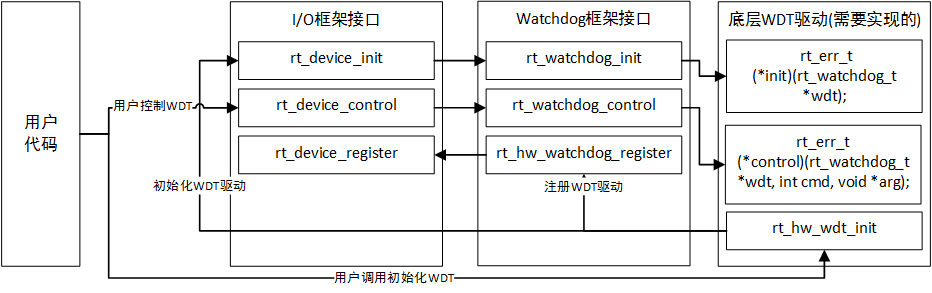

# WDT驱动

## 1.简介
下文介绍的WDT驱动主要是依赖于IO设备框架和watchdog驱动框架。

## 2.介绍watchdog框架
在编写WDT驱动之前，先来讲解一下WDT框架，主要**从数据结构**、**代码框架**和**函数调用关系**三个方面来讲解。

**2.1.数据结构**

在wdt驱动中有两个比较重要的结构体:

**2.1.1 struct rt_watchdog_device**

struct **rt_watchdog_device**结构体是从**rt_device**结构体继承而来。rt_device主要是底层IO设备框架需要的数据结构，这里我们不探究rt_device结构体。具体结构体定义如下：
~~~
struct rt_watchdog_device
{
    struct rt_device parent;		/* 继承rt_device */
    struct rt_watchdog_ops *ops;	/* 看门狗底层操作函数 */
};
typedef struct rt_watchdog_device rt_watchdog_t;
~~~

**2.1.2 struct rt_watchdog_ops**

我们可以看见在rt_watchdog_device数据结构中除了rt_device结构体，还有**struct rt_watchdog_ops**结构体。该结构体主要是用来关联底层wdt驱动操作看门狗外设的接口，具体结构体定义如下：
~~~
struct rt_watchdog_ops
{
    rt_err_t (*init)(rt_watchdog_t *wdt);				/* 初始化看门狗 */
    rt_err_t (*control)(rt_watchdog_t *wdt, int cmd, void *arg);	/* 控制看门狗 */
};
~~~
根据结构体可以知道，编写WDT驱动需要实现初始化看门狗和控制看门狗两个接口。对应控制看门狗接口，需要对以下几个命令进行实现：
~~~
1. RT_DEVICE_CTRL_WDT_GET_TIMEOUT		/* 获取超时时间 */
2. RT_DEVICE_CTRL_WDT_SET_TIMEOUT		/* 设置超时时间 */
3. RT_DEVICE_CTRL_WDT_GET_TIMELEFT		/* 获取超时剩余时间 */
4. RT_DEVICE_CTRL_WDT_KEEPALIVE			/* 喂狗*/
5. RT_DEVICE_CTRL_WDT_START			/* 驱动看门狗 */
6. RT_DEVICE_CTRL_WDT_STOP			/* 停止看门狗 */
~~~

对于以上看门狗控制命令**RT_DEVICE_CTRL_WDT_KEEPALIVE**必须实现，其他命令可以选择实现。

**2.2.代码框架与函数调用关系**

wdt整体框架与函数调用关系如下图：

## 3.编写wdt驱动程序

这里我们用stm32f103的独立看门狗iwdg移植来讲解：

移植平台：stm32f103RE
看门狗外设：iwdg
库版本：HAL v1.0.4

**3.1.声明平台相关数据结构体IWDG_HandleTypeDef hiwdg**
~~~
IWDG_HandleTypeDef hiwdg;	/* HAL库中iwdg操作句柄 */
~~~

**3.2.声明结构体rt_watchdog_t**
~~~
rt_watchdog_t iwdg_device;
~~~

**3.3.声明结构体struct rt_watchdog_op**
~~~
struct rt_watchdog_ops ops = 
{
	stm32_iwdg_init,
	stm32_iwdg_control
};
~~~

**3.4.编写WDT硬件接口函数 - 初始化看门狗**
~~~
static rt_err_t stm32_iwdg_init(rt_watchdog_t *wdt)
{
	HAL_StatusTypeDef status;

	RT_ASSERT(wdt != RT_NULL);
	
	hiwdg.Instance       = IWDG;
	hiwdg.Init.Prescaler = IWDG_PRESCALER_256;
	hiwdg.Init.Reload    = 4000;	/*3~5s*/

	status = HAL_IWDG_Init(&hiwdg);
	if(status)
	{
		rt_kprintf("HAL_IWDG_Init error\n");
		return RT_EIO;
	}

	return RT_EOK;
}
~~~

**3.5.编写WDT硬件接口函数 - 控制看门狗**

这里控制看门狗主要是对获取超时时间/设置超时时间/获取复位剩余时间/喂狗/启动看门狗/关闭看门狗，除了喂狗是必须实现的命令之外，其他命令可以选择实现，这里我们实现了喂狗命令和启动看门狗命令：

~~~
static rt_err_t stm32_iwdg_control(rt_watchdog_t *wdt, int cmd, void *args)
{
	HAL_StatusTypeDef status;
	
	RT_ASSERT(wdt != RT_NULL);

	switch(cmd)
	{
		/* 获取超时时间 */
		case RT_DEVICE_CTRL_WDT_GET_TIMEOUT:	
		{
			rt_kprintf("[ERR] RT_DEVICE_CTRL_WDT_GET_TIMEOUT do not implement\n");
		}
		break;

		/* 设置超时时间 */
		case RT_DEVICE_CTRL_WDT_SET_TIMEOUT:
		{
			rt_kprintf("[ERR] RT_DEVICE_CTRL_WDT_SET_TIMEOUT do not implement\n");
		}
		break;

		/* 获取复位剩余时间 */
		case RT_DEVICE_CTRL_WDT_GET_TIMELEFT:
		{
			rt_kprintf("[ERR] RT_DEVICE_CTRL_WDT_GET_TIMELEFT do not implement\n");
		}
		break;

		/* 喂狗 */
		case RT_DEVICE_CTRL_WDT_KEEPALIVE:
		{
			status = HAL_IWDG_Refresh(&hiwdg);
			if(status)
			{
				rt_kprintf("HAL_IWDG_Refresh error\n");
				return RT_EIO;
			}				
		}
		break;

		/* 启动看门狗 */
		case RT_DEVICE_CTRL_WDT_START:
		{
			status = HAL_IWDG_Start(&hiwdg);
			if(status)
			{
				rt_kprintf("stm32 iwdg start iwdg error\n");
				return RT_EIO;
			}	
		}
		break;

		/* 关闭看门狗 */
		case RT_DEVICE_CTRL_WDT_STOP:
		{
			rt_kprintf("stm32 iwdg no support stop iwdg\n");
			return RT_EIO;
		}
		break;

		default:
		break;
	}

	return RT_EOK;
}
~~~

**3.6.向RTT注册WDT设备，初始化并打开WDT设备**

~~~

/* 向RTT注册WDT设备，初始化并打开WDT设 */
int stm32_hw_iwdg_init(void)
{
	rt_err_t err_code = RT_EOK;
	
	iwdg_device.ops = &ops;
	
	/* 注册看门狗 */
	err_code = rt_hw_watchdog_register(
		&iwdg_device, "iwdg", RT_DEVICE_FLAG_WRONLY, RT_NULL);

	if(err_code != RT_EOK)
	{
		rt_kprintf("register iwdg drv error\n");
		return err_code;
	}

	/* 初始化看门狗 */
	err_code = iwdg_device.parent.init(&iwdg_device);

	if(err_code != RT_EOK)
	{
		rt_kprintf("init iwdg error\n");
		return err_code;
	}

	return err_code;
}
~~~

## 4.注意事项

**注意用户在启动看门狗后，在设计上层应用时，应该合理的设计喂狗的时间，防止系统不必要的复位**

