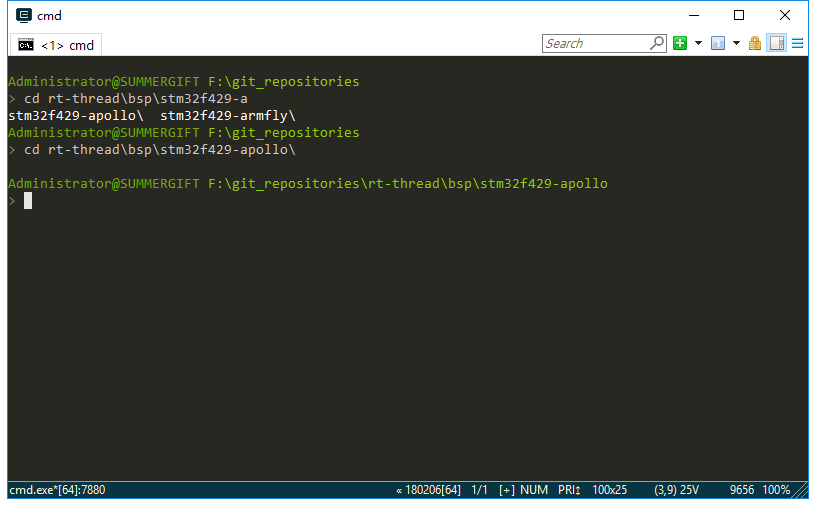
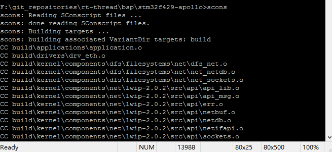
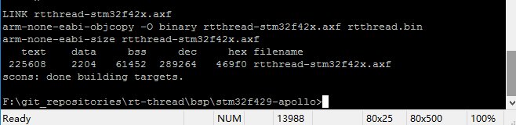
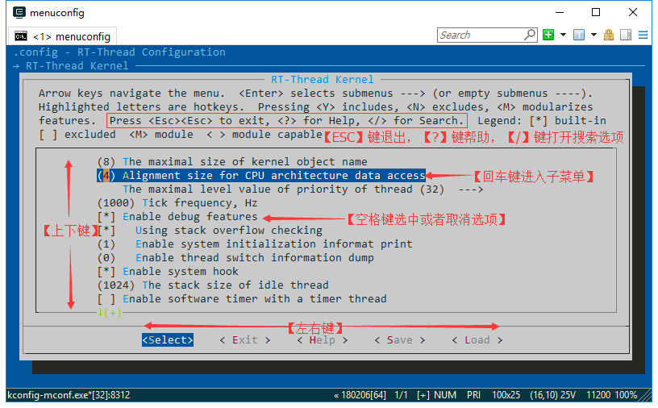
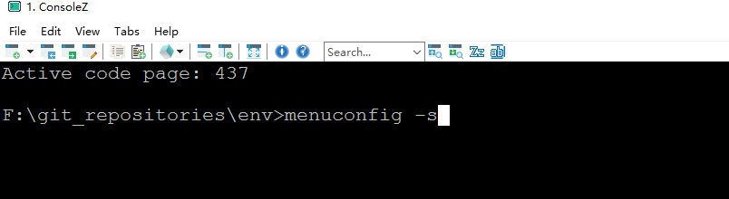

# RT-Thread env 工具用户手册

## 1. 介绍

env 是 RT-Thread 推出的开发辅助工具，针对基于 RT-Thread 操作系统的项目工程，提供编译构建环境、图形化系统配置及软件包管理功能。

其内置的 menuconfig 提供了简单易用的配置剪裁工具，可对内核、组件和软件包进行自由裁剪，使系统以搭积木的方式进行构建。

### 1.1 主要特性

- menuconfig 图形化配置界面，交互性好，操作逻辑强；
- 丰富的文字帮助说明，配置无需查阅文档；
- 使用灵活，自动处理依赖，功能开关彻底；
- 自动生成 rtconfig.h，无需手动修改；
- 使用 scons 工具生成工程，提供编译环境，操作简单；
- 提供多种软件包，模块化软件包耦合关联少，可维护性好；
- 软件包可在线下载，软件包持续集成，包可靠性高；

### 1.2 准备工作

env 工具包含了 RT-Thread 源代码开发编译环境和软件包管理系统。

- 在电脑上装好 git，git 的下载地址为`https://git-scm.com/downloads`，根据向导正确安装 git，并将 git 添加到系统环境变量。软件包管理功能需要 git 的支持。
- 注意在工作环境中，所有的路径都不可以有中文字符或者空格。

## 2. env 的使用方法

### 2.1 打开 env 控制台

RT-Thread 软件包环境主要以命令行控制台为主，同时以字符型界面来进行辅助，使得尽量减少修改配置文件的方式即可搭建好 RT-Thread 开发环境的方式。
打开env控制台有两种方式：

#### 2.1.1 方法一：点击 env 目录下可执行文件

进入 env 目录，可以运行本目录下的`env.exe`，如果打开失败可以尝试使用`env.bat`。

#### 2.1.2 方法二：在文件夹中通过右键菜单打开 env 控制台

env 目录下有一张 `Add_Env_To_Right-click_Menu.png`(添加 env 至右键菜单.png) 的图片，根据图片上的步骤操作，就可以在任意文件夹下通过右键菜单来启动 env 控制台。效果如下：


> 注意事项：因为需要设置 env 进程的环境变量，第一次启动可能会出现杀毒软件误报的情况，如果遇到了 **杀毒软件误报** ，允许 env 相关程序运行，然后将相关程序添加至白名单即可。

### 2.2 编译 bsp

scons 是 RT-Thread 使用的编译构建工具，可以使用 scons 相关命令来编译 RT-Thread 。

#### 第一步：切换到 bsp 根目录

- 打开控制台后，可以在命令行模式下使用 cd 命令切换到你想要配置的 bsp 根目录中。

例如工程目录为: `rt-thread\bsp\stm32f429-apollo` ：



#### 第二步：bsp的编译

- env 中携带了`Python & scons`环境，只需在`rt-thread\bsp\stm32f429-apollo` 目录中运行`scons`命令即可根据`rtconfig.h`中的配置使用默认的 ARM_GCC 工具链编译 bsp。



编译成功：



如果使用 mdk/iar 来进行项目开发，可以直接使用 bsp 中的工程文件或者使用以下命令中的其中一种，重新生成工程，再进行编译下载。 

```
scons --target=iar
scons --target=mdk4
scons --target=mdk5
```

更多 scons 教程，请参考 [在线文档中的 scons 教程](https://www.rt-thread.org/document/site/zh/1chapters/10-chapter_scons/)

### 2.3 bsp 配置：menuconfig

menuconfig 是一种图形化配置工具，RT-Thread 使用其对整个系统进行配置、裁剪。

#### 2.3.1 快捷键介绍

进入 bsp 根目录，输入 `menuconfig` 命令后即可打开其界面。 menuconfig 常用快捷键如图所示：



#### 2.3.2 修改配置

menuconfig 有多种类型的配置项，修改方法也有所不同，常见类型如下：

- 开/关 型：使用空格键来选中或者关闭
- 数值、字符串型：按下回车键后会出现对话框，在对话框中对配置项进行修改

#### 2.3.3 保存配置

选择好配置项之后按 ESC 键退出，选择保存修改即可自动生成 rtconfig.h 文件。此时再次使用 scons 命令就会根据新的 rtconfig.h 文件重新编译工程了。

### 2.4 软件包管理：package

RT-Thread 提供一个软件包管理平台，这里存放了官方提供或开发者提供的软件包。该平台为开发者提供了众多可重用软件包的选择，这也是 RT-Thread 生态的重要组成部分。

[点击这里](https://github.com/RT-Thread-packages) 可以查看到 RT-Thread 官方的提供的软件包，绝大多数软件包都有详细的说明文档及使用示例。

> 截止到 2018-03-13 ，当前软件包数量达到 **40+**

#### 2.4.1 简介

**package** 工具作为 env 的组成部分，为开发者提供了软件包的下载、更新、删除等管理功能。

输入 `pkgs` 可以看到如下命令简介：

```
$ pkgs
usage: env.py package [-h] [--update] [--list] [--wizard] [--upgrade]
                      [--printenv]

optional arguments:
  -h, --help  show this help message and exit
  --update    update packages, install or remove the packages as you set in
              menuconfig
  --list      list target packages
  --wizard    create a package with wizard
  --upgrade   update local packages list from git repo
  --printenv  print environmental variables to check
```

#### 2.4.2 下载、更新、删除软件包

在下载、更新软件包前，需要先在 `menuconfig` 中 **开启** 你想要操作的软件包

这些软件包位于 `RT-Thread online packages` 菜单下，进入该菜单后，则可以看如下软件包分类：


找到你需要的软件包然后选中开启，保存并退出 menuconfig 。此时软件包已被标记选中，但是还没有下载到本地，所以还无法使用。

- **下载** ：如果软件包在本地已被选中，但是未下载，此时输入：`pkgs --update` ，该软件包自动下载；
- **更新** ：如果选中的软件包在服务器端有更新，并且版本号选择的是 **latest** 。此时输入： `pkgs --update` ，该软件包将会在本地进行更新；
- **删除** ：某个软件包如果无需使用，需要先在 menuconfig 中取消其的选中状态，然后再执行： `pkgs --update` 。此时本地已下载但未被选中的软件包将会被删除。

#### 2.4.3 升级本地软件包信息

随着 package 系统的不断壮大，会有越来越多的软件包加入进来，所以本地看到 menuconfig 中的软件包列表可能会与服务器 **不同步** 。使用 `pkgs --upgrade` 命令即可解决该问题，这个命令不仅会对本地的包信息进行更新同步，还会对 env 的功能脚本进行升级，建议定期使用。

### 2.5 env 工具配置

- 新版本的 env 工具中加入了自动更新软件包和自动生成 mdk/iar 工程的选项，默认是不开启的。可以使用 `menuconfig -s/--setting`  命令来进行配置。

* 使用 `menuconfig -s` 命令进入 env 配置界面

   

  

* 如果选中了 auto update pkgs config  那么会在使用menuconfig功能后自动使用`pkgs --update`命令来下载并安装软件包，同时删除旧的软件包。本功能在下载在线软件包时使用。

  

* 如果选中了 auto create a mdk/iar project ，那么在退出 menuconfig 界面之后就会自动生成一个你选中类型的工程。这个功能是为了方便的生成 mdk/iar 工程而使用的，无需多次使用 scons 命令来生成 mdk/iar 工程。

## 3. 应用：在项目中使用 env 

### 3.1 使用 env 的要求

- menuconfig 是 RT-Thread 3.0 以上版本的特性，推荐将 RT-Thread 更新到 3.0 以上版本。
- 目前 RT-Thread 还没有对所有的 bsp 做 menuconfig 的支持，也就是说有些 bsp 暂时还不能使用 menuconfig 来进行配置，但常用的 bsp 都已经支持。

### 3.2 menuconfig 中选项的修改方法

如果想在 menuconfig 的配置项中添加宏定义，则可以修改 bsp 下的 Kconfig 文件，修改方法可以在网络中搜索`Kconfig语法`关键字获得详细的说明文档，也可以参考 RT-Thread 中的 Kconfig 文件或者已经支持过 menuconfig 的 bsp 中的 Kconfig 文件。

### 3.3 新的项目添加 menuconfig 功能

这里的新项目指的是，**还未生成 .config 和 rtconfig.h** 的全新开发的项目。因为这两个文件，只有在 menuconfig 第一次保存时才会创建。具体流程如下：

 1. 将已经支持 menuconfig 功能的 bsp 里面的 kconfig 文件拷贝到新的项目根目录中。
 2. 注意修改 Kconfig 中的 RTT_ROOT 值为 RT-Thread 所在目录，否则可能提示找不到 RTT_ROOT 。
 3. 使用 menuconfig 命令开始配置即可。

### 3.4 旧项目添加 menuconfig 功能

这里的旧项目指的是已经经过一段时间的开发，而且项目中存在已经修改过的 rtconfig.h文件 ，但是没有使用过 menuconfig 来配置的项目。具体流程如下：

 1. 首先备份旧项目内的 rtconfig.h 文件。
 2. 使用 `scons --genconfig` 命令根据已有的 rtconfig.h 生成 .config 文件，这里生成的 .config 文件保存了旧项目中 rtconfig.h 文件对项目的配置参数。
 3. 将已经支持 menuconfig 功能的 bsp 里面的 kconfig 文件拷贝到要修改项目的根目录中。
 4. 注意修改 Kconfig 中的 RTT_ROOT 值为 RT-Thread 所在目录，否则可能提示找不到 RTT_ROOT 。
 5. 使用 menuconfig 命令来配置我们要修改的旧项目。menuconfig 会读取第二步生成的 .config 文件，并根据旧项目的配置参数生成新的 .config 文件和 rtconfig.h 文件 。
 6. 对比检查新旧两份 rtconfig.h 文件，如果有不一致的地方，可以使用 menuconfig 命令对配置项进行调整。

## 4. 常用资料链接

* [论坛持续更新的env常见问题问答帖](https://www.rt-thread.org/qa/thread-5699-1-1.html)
