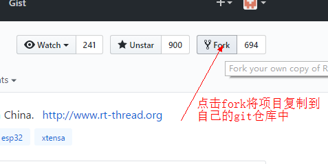
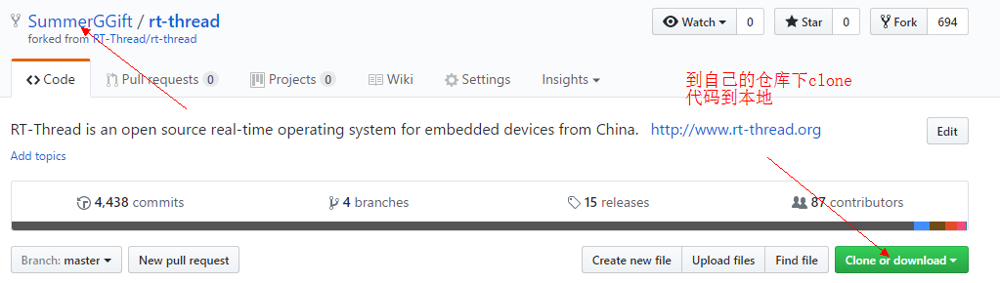
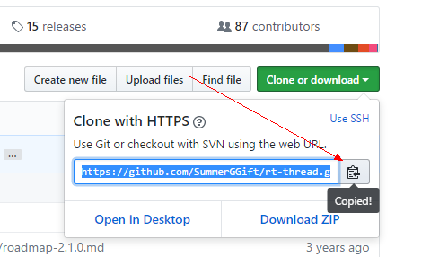
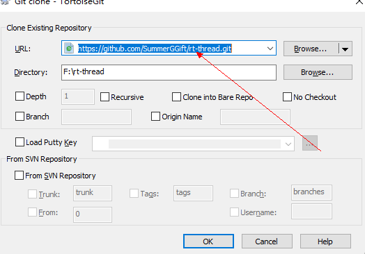
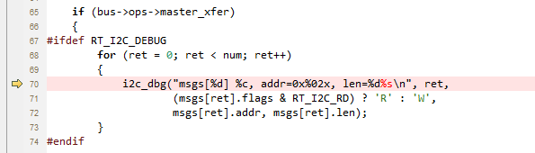
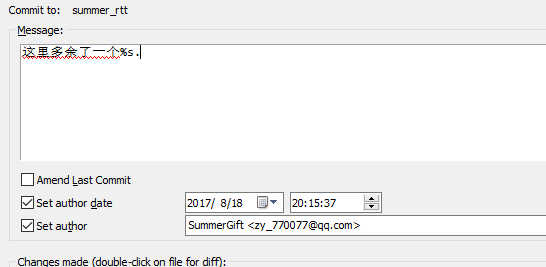
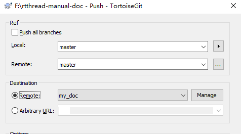
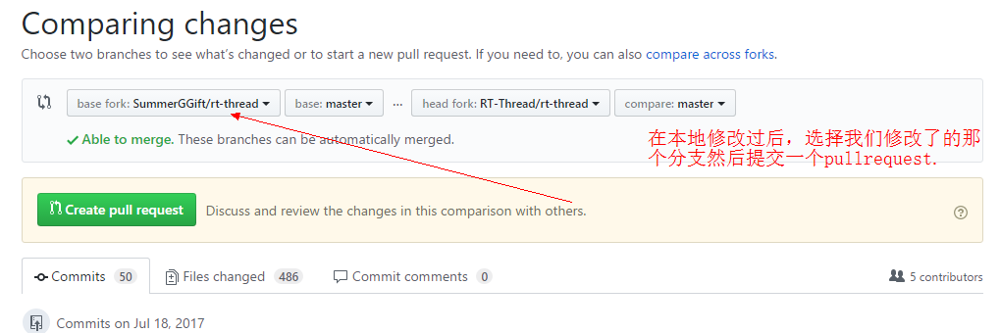
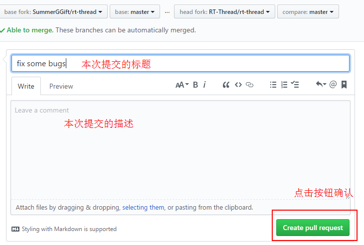

# 在 github 上为 RT-Thread 贡献代码

我们真诚地感谢您的贡献，欢迎通过 GitHub 的 fork 和 pull request 流程来提交代码。
代码要求请参考 rt_thread 项目 documentation 目录下的 coding_style_cn.tx t文件。

## 以下教程将指导您提交代码。
首先解释一下 pull request 这个词，pull request的意思是推送请求，开发者发起 pull request 的目的是请求仓库维护人采用开发者提交的代码。

下面是摘自[知乎](https://www.zhihu.com/question/21682976) 网友的一段解释：

    我尝试用类比的方法来解释一下pull reqeust。想想我们中学考试，老师改卷的场景吧。你做的试卷就像仓库，你的试卷肯定会有很多错误，就相当于程序里的bug。老师把你的试卷拿过来，相当于先fork。在你的卷子上做一些修改批注，相当于git commit。最后把改好的试卷给你，相当于发pull request，你拿到试卷重新改正错误，相当于merge。

    当你想更正别人仓库里的错误时，要按照下面的流程进行：

    1. 先 fork 别人的仓库，相当于拷贝一份别人的资料。因为不能保证你的修改一定是正确的，对项目有利的，所以你不能直接在别人的仓库里修改，而是要先fork到自己的git仓库中。
    2. clone到自己的本地分支，做一些bug fix，然后发起pull request给原仓库，让原仓库的管理者看到你提交的修改。 
    3. 原仓库的管理者review这个bug，如果是正确的话，就会merge到他自己的项目中。merge的意思就是合并，将你修改的这部分代码合并到原来的仓库中添加代码或者替换掉原来的代码。至此，整个 pull request 的过程就结束了。

## 准备工作

* 安装 git
* 安装 TortoiseGit 工具，这个工具是 git 的一种图形化界面
* 注意安装 git 的时候记得勾选将 git 所在目录添加到系统环境变量

现在以rt-thread仓库为例说明贡献代码的流程：

##  1. fork
将 rt-thread 仓库 fork 到自己的 git 仓库中。

##  2. 克隆（clone）
将 rt-thread 仓库 clone 到自己的本地 PC。

##  3. 创建本地分支

如果想要在 rt-thread 项目上做自己的开发，最好创建属于自己的项目分支，如果是直接对 rt-thread 贡献代码，那么可以直接在 master 分支上进行操作。

##  4. 开发
发现了一个小 bug 并进行修改。

##  5. 提交（commit）
向本地仓库提交 bug.

##  6. 保持本地仓库最新
在准备发起 Pull Request 之前，需要同步原仓库最新的代码，记得检查目前的项目是否是最新的版本。
##  7. Push 到远程仓库

push 到开发者自己的远程仓库中。

##  8. 发起并完成 Pull Request
在 git 仓库中选择自己修改了的分支，点击 create pull request 按钮发起 pull request。

##  9. 提交代码的一些约定
发起请求成功后，RT-Thread 维护人就可以看到你提交的代码。pull request如果被同意，你的代码就会被合并到仓库中。这样一次pull request就成功了。

至此，我们就完成了一次代码贡献的过程。
